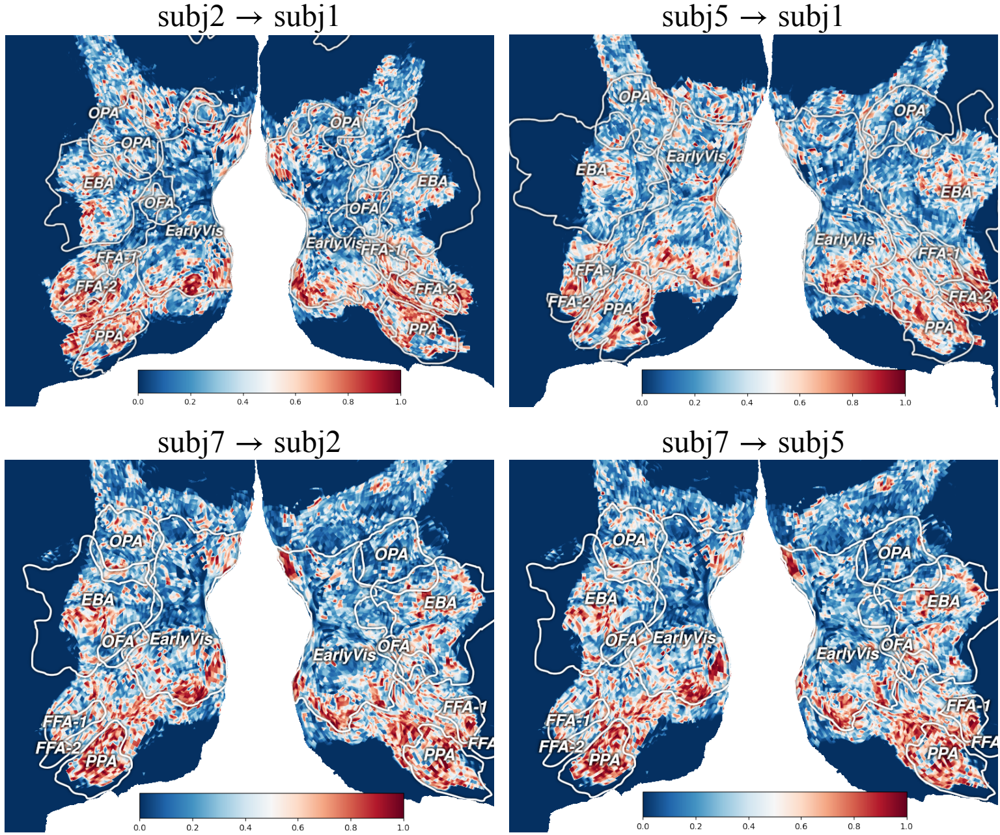
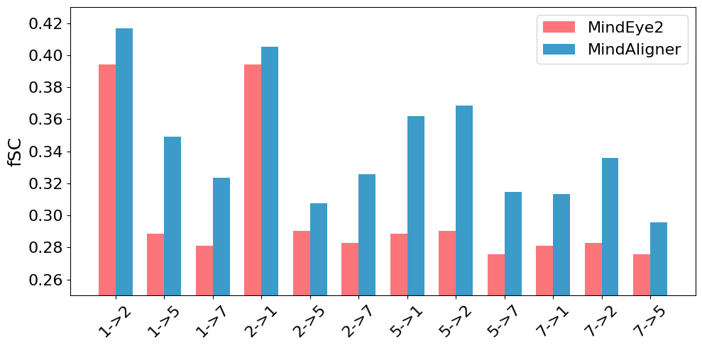

# PaperBank · 论文少走弯路指南

先把贡献讲清楚，再把证据交代全。按主题检查，卡住了再展开例子。

主要面向实证型 CS / AI 论文；按学科、研究类型与投稿要求取舍。论文摘录就近标明出处与版本，中文为本指南翻译；教学改写与假设情境另行标注，不代表原论文结果。

欢迎使用、改写、转载，也欢迎拿去给 Codex 等工具做 skill。原创内容采用 CC BY 4.0，论文摘录与图片保留各自许可。转载原创内容请保留作者 Da1yuqin、[原文链接](https://Da1yuqin.github.io/PaperBank/)和 [CC BY 4.0](https://creativecommons.org/licenses/by/4.0/) 许可，改过请注明。Star 自愿，署名别失联。

## 目录

- [1. 先想清楚，别急着写](#core)
- [2. 开写以后，少走弯路](#workflow)
- [3. 标题和摘要：让人愿意往下读](#abstract)
- [4. 引言：把工作为什么值得做讲明白](#intro)
- [5. 方法：别让读者靠猜](#method)
- [6. 实验：让结论有着落](#experiments)
- [7. 图表：画出来，也要看得懂](#visual)
- [8. 相关工作：把自己的位置放准](#related)
- [9. 附录：让人找得到细节](#appendix)
- [10. 精修：先讲通，再写顺](#revision)
- [11. 用 AI：省力，也别省掉判断](#ai)
- [12. Rebuttal 和交稿：把问题回清楚](#rebuttal)
- [好用工具与开源整理提示词](#tools)

<a id="core"></a>
## 1. 先想清楚，别急着写

先确定研究对象、核心贡献和证据范围，再决定论文的名称与叙述重点。

**贡献定位**

- [ ] **第 1 条：**用一句话交代研究对象、现有困难、你的改动和结果，删去方法名后仍能看出具体贡献。

<a id="tip-01"></a>
<details>
<summary>第 1 条：动笔前，先说清你到底发现了什么 · 说明、例子与参考</summary>

先别急着打开论文模板。找一个不了解项目的同学，试着用几句话说清：你在解决什么问题，做了什么，最后多知道了什么。说不清，往往还没到润色英语的时候。

**做法：**先写一句话，再展开成一小段。把研究对象、现有办法卡在哪里、你的改动和结果放进去。写完看看：去掉方法名和“新颖、有效”这些词，还剩不剩具体内容？

**边界：**有时是表达没理顺，有时是证据还不够。先分清是哪一种，别让流畅的文字替你做判断。

**TCDiff：方法名之外，把动作与代价说清**

**论文原文 · English**

> To address these challenges, we propose a Trajectory-Controllable Diffusion (TCDiff) framework, which leverages non-overlapping trajectories to ensure coherent and aesthetically pleasing dance movements.

**中文翻译 · 本指南翻译**

为解决这些困难，我们提出轨迹可控扩散框架 TCDiff，利用不重叠轨迹来生成协调且具有美感的舞蹈动作。

**逐句拆解**

1. 先读出具体操作：先生成不同舞者的位置轨迹，再据此生成动作。去掉 TCDiff 名字，核心操作仍然成立。
2. collisions / foot sliding 的前文问题对应轨迹与脚步处理；“协调、美观”还要落到群舞、脚滑指标和用户研究，不能拿形容词代替结果。
3. Table1 的群舞真实感 GMR 从 CoDancers 的 26.10 到 13.86（越低越好），但 TCDiff 的个体保真度 FID 为 37.47、CoDancers 为 23.98。因此示范摘要要保留收益与代价。

**教学改写 · English（非论文原文）**

TCDiff generates dancer trajectories before motion. On AIOZ-GDance, it improves group-motion realism relative to CoDancers (GMR: 26.10 to 13.86, lower is better), with a trade-off in individual fidelity (FID: 23.98 to 37.47, lower is better).

**教学改写 · 中文（非论文原文）**

TCDiff 先生成舞者轨迹，再生成动作。在 AIOZ-GDance 上，相比 CoDancers，群舞真实感 GMR 从 26.10 降到 13.86，但个体保真度 FID 从 23.98 升到 37.47；两个指标都越低越好。

**摘录出处：**[Yuqin Dai et al. (AAAI 2025) · Harmonious Music-driven Group Choreography with Trajectory-Controllable Diffusion](https://ojs.aaai.org/index.php/AAAI/article/view/32268)；Abstract, PDF p.1 / proceedings p.2645；方法 §TCDiff；Table1, p.2650；正式发表论文；已发表；作者原文摘录

**原文／图片许可：**Yuqin Dai et al., AAAI 2025, pp.2645–2653. ©2025 AAAI，保留原版权；作者教学短引，不纳入本指南原创内容的 CC BY 许可。中文为本指南翻译。

来源与延伸阅读：[作者提供的写作、绘图与进阶笔记](https://github.com/Da1yuqin/PaperBank/blob/main/SOURCES.md#写作笔记)；[Mensh & Kording (2017) · Ten simple rules for structuring papers](https://doi.org/10.1371/journal.pcbi.1005619)；[NeurIPS · Paper Checklist](https://neurips.cc/public/guides/PaperChecklist)；[Yuqin Dai et al. (AAAI 2025) · Harmonious Music-driven Group Choreography with Trajectory-Controllable Diffusion](https://ojs.aaai.org/index.php/AAAI/article/view/32268)

</details>

- [ ] **第 2 条：**选出读者应记住的主要贡献，说明其他设计如何支持它；独立发现另交代共同研究范围。

<a id="tip-02"></a>
<details>
<summary>第 2 条：给读者一个能带走的重点 · 说明、例子与参考</summary>

读者合上论文后，能记住一个有用的判断，就已经很好。别让五六个模块同时争当主角。

**做法：**先选出最重要的贡献，再把其他设计放回各自的位置：它为什么必需，替主贡献解决了哪一步困难。确实有多个独立发现，也要交代它们为什么值得放在同一篇里。

**边界：**一个中心不等于硬砍到只剩一个发现。能串起来就串，串不起来就重新想论文的范围。

**教学迁移：让矩阵映射成为主线，而不是让模块争主角**

**论文原文 · English**

> We present MindAligner, a functional alignment framework for cross-subject brain visual decoding. Unlike existing methods, it addresses insufficient alignment and lack of interpretability by learning a brain transfer matrix for voxel-level correspondences and proposing a brain functional alignment module for cross-subject mapping.

**中文翻译 · 本指南翻译**

我们提出 MindAligner，一个用于跨被试脑视觉解码的功能对齐框架。与现有方法不同，该方法通过学习用于体素级对应关系的脑迁移矩阵，并提出用于跨被试映射的脑功能对齐模块，处理对齐不足与缺乏可解释性的问题。

**逐句拆解**

1. 第一句先给研究对象与任务，第二句把两项设计连接到具体困难，模块名因而有了各自的位置。
2. 教学迁移强调论证组织，不声称作者采用了某种写作流程，也不把“主要贡献”机械理解成只能有一个模块。

**教学改写 · English（非论文原文）**

The central idea is to map a new subject’s fMRI signals into the signal space of a known subject.
The transfer matrix performs this mapping, while the alignment module supports learning the matrix.
Organize the contribution around this relationship before listing individual losses or components.

**教学改写 · 中文（非论文原文）**

主线是把新被试的 fMRI 信号映射到已知被试的信号空间。
迁移矩阵执行这次映射，对齐模块则支持矩阵的学习。
先按这层关系组织贡献，再列各项损失或组件。

**摘录出处：**[Yuqin Dai et al. (ICML 2025) · MindAligner: Explicit Brain Functional Alignment for Cross-Subject Visual Decoding from Limited fMRI Data](https://proceedings.mlr.press/v267/dai25m.html)；§ 6 Conclusion，第 1–2 句；ICML 2025／PMLR 267 正式论文，已对照作者终稿；已发表论文；下方教学改写或模拟回复不属于论文原文

**原文／图片许可：**Yuqin Dai et al., ICML 2025, PMLR 267:12214–12228. 原文与所选原图采用 CC BY 4.0；中文翻译、拆解与教学改写为本指南新增。

来源与延伸阅读：[作者提供的写作、绘图与进阶笔记](https://github.com/Da1yuqin/PaperBank/blob/main/SOURCES.md#写作笔记)；[Yuqin Dai et al. (ICML 2025) · MindAligner: Explicit Brain Functional Alignment for Cross-Subject Visual Decoding from Limited fMRI Data](https://proceedings.mlr.press/v267/dai25m.html)

</details>

- [ ] **第 4 条：**先说明方法的实际操作，再定名称与比喻；逐项检查名称是否暗示了未经验证的能力。

<a id="tip-04"></a>
<details>
<summary>第 4 条：名字可以好记，事情要说准 · 说明、例子与参考</summary>

一个好比喻能省掉半页解释。前提是，比喻背后真有那回事。给坐标修正程序起个“自主进化”的名字，不会凭空多出自主决策能力。

**做法：**先用普通话说明实际操作，再想一个方便读者记住的名字。想保留类比，就把类比和实现的对应关系写清楚。

**边界：**别拿流行术语凑新意。名字拿掉以后，贡献也应该站得住。

**教学迁移：Filter 是实际操作，不是自动辨真假的保证**

**论文原文 · English**

> WebFilter is implemented as a prompt-based Information Retrieval Agent that proactively conducts web searches and reasons over retrieved results before issuing a final answer.

**中文翻译 · 本指南翻译**

WebFilter 被实现为一个基于提示词的信息检索代理：代理主动进行网页搜索，并在给出最终答案前对检索结果进行推理。

**逐句拆解**

1. 原句用“搜索—分析结果—回答”的动作解释代理，名称没有代替方法说明。
2. 教学改写额外划清名称的边界；“过滤”不能被读成已实现自动事实核验。

**教学改写 · English（非论文原文）**

WebFilter uses source-aware query formulation to guide web retrieval.
The name refers to query restrictions and training signals, not a guarantee that every retrieved page is correct.
Explain the operations before asking readers to remember the name.

**教学改写 · 中文（非论文原文）**

WebFilter 通过关注来源的查询构造来指导网页检索。
这个名称对应查询限制与训练信号，不保证每个返回网页都正确。
先解释实际操作，再让读者记住名称。

**摘录出处：**[Yuqin Dai et al. (AAAI 2026) · Careful Queries, Credible Results: Teaching RAG Models Advanced Web Search Tools with Reinforcement Learning](https://ojs.aaai.org/index.php/AAAI/article/view/40299)；§ Methodology，Learning to Use Advanced Search Tools，第 1 句；AAAI 2026 作者终稿；已发表论文；下方教学改写或模拟回复不属于论文原文

**原文／图片许可：**Yuqin Dai et al., AAAI 2026, pp.30458–30466. ©2026 AAAI，保留原版权；作者教学短引，不随本指南转授再版许可。中文为本指南翻译，拆解与教学改写单独标注。

来源与延伸阅读：[作者提供的写作、绘图与进阶笔记](https://github.com/Da1yuqin/PaperBank/blob/main/SOURCES.md#写作笔记)；[Yuqin Dai et al. (AAAI 2026) · Careful Queries, Credible Results: Teaching RAG Models Advanced Web Search Tools with Reinforcement Learning](https://ojs.aaai.org/index.php/AAAI/article/view/40299)

</details>


**主张与证据**

- [ ] **第 3 条：**给每个主要主张标出对应设计和实验；缺少支持就补证据或收窄主张，机制解释另需对照。

<a id="tip-03"></a>
<details>
<summary>第 3 条：引言里许的愿，实验里要还上 · 说明、例子与参考</summary>

引言说省钱，实验就得算钱；引言说更稳，实验就得看波动。不能前面讲一个优点，后面拿另一个成绩来证明。

**做法：**给每个主张找一个位置：方法哪里实现了它，哪个实验检验了它，结果支持到哪一步。找不到的，补实验或者改主张。用一张小表就够，不必做成大工程。

**边界：**整体分数上涨，只能先说明整体变好了。想说是某个机制起作用，还得有能区分原因的对照。

**TCDiff：引言说要避碰，实验就查碰撞指标**

**论文原文 · English**

> To mitigate collisions, we introduce a Dance-Trajectory Navigator that generates collision-free trajectories for multiple dancers, utilizing a distance-consistency loss to maintain optimal spacing.

**中文翻译 · 本指南翻译**

为减少碰撞，我们引入舞蹈轨迹导航器，为多名舞者生成无碰撞轨迹，并利用距离一致性损失维持合适间距。

**逐句拆解**

1. 原句给出“碰撞→轨迹导航器→距离损失→舞者间距”的链条，所以实验要查碰撞相关的 TIF，不只报动作多样性。
2. 原 Table1 的 TIF 为 TCDiff 0.13、CoDancers 0.10、GCD 0.17，越低越好：比 GCD 降低，但没有在这张表上超过 CoDancers。
3. 因此 collision-free 是原作者的设计措辞，不应转述为测试结果零碰撞或所有指标最优。补实验或缩小主张，都要回到实际证据。

**教学改写 · English（非论文原文）**

The navigator targets collision reduction. Table 1 reports TIF of 0.13 for TCDiff, 0.17 for GCD, and 0.10 for CoDancers; the result supports a reduction against GCD, not universal superiority or zero collisions.

**教学改写 · 中文（非论文原文）**

导航器针对碰撞问题。表 1 中 TCDiff、GCD、CoDancers 的 TIF 分别为 0.13、0.17、0.10；结果支持相对 GCD 的降低，不支持全面最优或零碰撞。

**摘录出处：**[Yuqin Dai et al. (AAAI 2025) · Harmonious Music-driven Group Choreography with Trajectory-Controllable Diffusion](https://ojs.aaai.org/index.php/AAAI/article/view/32268)；Abstract, PDF p.1 / p.2645；Table1, PDF p.6 / p.2650；正式发表论文；已发表；作者原文摘录

**原文／图片许可：**Yuqin Dai et al., AAAI 2025, pp.2645–2653. ©2025 AAAI，保留原版权；作者教学短引，不纳入本指南原创内容的 CC BY 许可。中文为本指南翻译。

来源与延伸阅读：[写作技能与检查方法](https://github.com/Da1yuqin/PaperBank/blob/main/SOURCES.md#写作技能)；[NeurIPS · Paper Checklist](https://neurips.cc/public/guides/PaperChecklist)；[Yuqin Dai et al. (AAAI 2025) · Harmonious Music-driven Group Choreography with Trajectory-Controllable Diffusion](https://ojs.aaai.org/index.php/AAAI/article/view/32268)

</details>

- [ ] **第 5 条：**保存失败实验的配置、输出和原因，区分程序故障与方法失效，并保留影响结论的负结果。

<a id="tip-05"></a>
<details>
<summary>第 5 条：失败的实验别随手扔 · 说明、例子与参考</summary>

以后写分析、补附录、回审稿意见时，最想找回来的，常常就是当初那次没跑好的尝试。先留着，整理比重跑便宜。

**做法：**把配置、输出和失败原因一起保存。写论文时，挑能说明问题的结果：哪种直觉不成立，什么条件会失效，哪个方向不值得继续试。

**边界：**程序出错和方法失效是两回事。负结果也得检查对照，不能把一个故障写成一个发现。

**教学迁移：保留较弱的消融，别把它与程序崩溃混在一起**

**论文原文 · English**

> To evaluate the effectiveness of each model design in MindAligner, we perform an ablation study using Subject 2 as the novel subject and Subject 1 as the known subject. The results exclude the refinement step of MindEye2 for generated images.

**中文翻译 · 本指南翻译**

为了评价 MindAligner 中各项模型设计的效果，我们将被试 2 作为新被试、被试 1 作为已知被试进行消融实验。结果不包含 MindEye2 对生成图像的精修步骤。

**逐句拆解**

1. 原句固定了被试迁移方向并说明排除精修步骤，较弱结果才有明确的比较条件。
2. 表 2 报告只用解码损失的较弱变体；它是有效消融的结果，不等于程序故障，也不能据此断言任何采用该损失的系统都会失败。

**教学改写 · English（非论文原文）**

Ablation results and crashed runs need separate records.
For the decoding-loss-only variant, retain the configuration, generated outputs, and evaluation results so that the weaker reconstruction can be inspected.
Report the weaker variant when it changes the conclusion about the need for alignment losses.

**教学改写 · 中文（非论文原文）**

消融结果与程序崩溃记录需要分开保存。
对于只使用解码损失的变体，应保存配置、生成输出与评价结果，让较弱的重建表现可以回查。
当较弱变体影响对齐损失是否必要的判断时，应报告这个变体。

**摘录出处：**[Yuqin Dai et al. (ICML 2025) · MindAligner: Explicit Brain Functional Alignment for Cross-Subject Visual Decoding from Limited fMRI Data](https://proceedings.mlr.press/v267/dai25m.html)；§ 5.4 fMRI-based Visual Decoding，Ablation Study，第 1–2 句；ICML 2025／PMLR 267 正式论文，已对照作者终稿；已发表论文；下方教学改写或模拟回复不属于论文原文

**原文／图片许可：**Yuqin Dai et al., ICML 2025, PMLR 267:12214–12228. 原文与所选原图采用 CC BY 4.0；中文翻译、拆解与教学改写为本指南新增。

来源与延伸阅读：[作者提供的写作、绘图与进阶笔记](https://github.com/Da1yuqin/PaperBank/blob/main/SOURCES.md#写作笔记)；[Yuqin Dai et al. (ICML 2025) · MindAligner: Explicit Brain Functional Alignment for Cross-Subject Visual Decoding from Limited fMRI Data](https://proceedings.mlr.press/v267/dai25m.html)

</details>


<a id="workflow"></a>
## 2. 开写以后，少走弯路

用贡献句、提纲、草图和结果表推进讨论，并按关键论证分配篇幅。

**起草与结构**

- [ ] **第 6 条：**先完成贡献句、提纲、草图或结果表，依据已有证据逐步写作；主张不成立就及时修改。

<a id="tip-06"></a>
<details>
<summary>第 6 条：别等整篇想好了才开始写 · 说明、例子与参考</summary>

先做出能讨论的小东西：一句贡献、一页提纲、一张草图、一张结果表。拿着这些讨论，比对着空白文档想“完整故事”容易得多。

**做法：**先把已有证据摆出来，再定主线和章节。方法与实验先写清楚，引言跟着调整，摘要最后再压一遍。中途发现主张不成立，就回去改，不用等全篇写完。

**边界：**顺序不是规定。概念图可以先画，结果图得等真实结果出来。

**教学迁移：先写已经清楚的方法，再补齐论证**

**论文原文 · English**

> Notably, the alignment module is utilized only during the training phase to assist BTM learning; during the inference phase, only the lightweight BTM is retained.

**中文翻译 · 本指南翻译**

需要注意，对齐模块只在训练阶段用于辅助 BTM 学习；推理阶段仅保留轻量的 BTM。

**逐句拆解**

1. 原句先把训练与推理职责讲清，是可以先写的方法骨架；不需要等全部英文都想好。
2. 这里给出的是可采用的写作顺序，不是作者真实写作记录；结果尚未取得时不能先填成绩。

**教学改写 · English（非论文原文）**

A working draft can first distinguish how the transfer matrix is learned from how it is used.
Next, place the corresponding reconstruction comparisons beside the claims they evaluate.
Write the abstract after checking which claims the available results actually support.

**教学改写 · 中文（非论文原文）**

工作稿可以先分清迁移矩阵怎样学习、怎样使用。
随后把相应的重建比较放到它们检验的主张旁边。
核对已有结果实际支持哪些主张后，再写摘要。

**摘录出处：**[Yuqin Dai et al. (ICML 2025) · MindAligner: Explicit Brain Functional Alignment for Cross-Subject Visual Decoding from Limited fMRI Data](https://proceedings.mlr.press/v267/dai25m.html)；§ 4.1 Overview，训练与推理的说明句；ICML 2025／PMLR 267 正式论文，已对照作者终稿；已发表论文；下方教学改写或模拟回复不属于论文原文

**原文／图片许可：**Yuqin Dai et al., ICML 2025, PMLR 267:12214–12228. 原文与所选原图采用 CC BY 4.0；中文翻译、拆解与教学改写为本指南新增。

来源与延伸阅读：[作者提供的写作、绘图与进阶笔记](https://github.com/Da1yuqin/PaperBank/blob/main/SOURCES.md#写作笔记)；[Mensh & Kording (2017) · Ten simple rules for structuring papers](https://doi.org/10.1371/journal.pcbi.1005619)；[Yuqin Dai et al. (ICML 2025) · MindAligner: Explicit Brain Functional Alignment for Cross-Subject Visual Decoding from Limited fMRI Data](https://proceedings.mlr.press/v267/dai25m.html)

</details>

- [ ] **第 7 条：**同层标题按统一逻辑组织，方法按步骤、实验按问题划分，并统一标题、模块名与图中名称。

<a id="tip-07"></a>
<details>
<summary>第 7 条：只看目录，也该知道你在干什么 · 说明、例子与参考</summary>

目录像路线图。读完一串“模块一、模块二、模块三”，读者还是不知道接下来要去哪，这个目录就没帮上忙。

**做法：**同一层标题按同一逻辑分：方法按处理步骤，实验按要回答的问题。标题用实际动作或对象，图里的名字也跟着统一。

**边界：**不用死守每节最多几个子节。太碎就合并，确实有不同任务就分开。

**教学迁移：目录要沿实验问题走**

**论文原文 · English**

> In this section, we present the implementation details, followed by fMRI-to-image reconstruction results and brain functional alignment analysis. The Appendix includes additional metrics, qualitative and quantitative results, model efficiency, and further visualizations.

**中文翻译 · 本指南翻译**

本节先介绍实现细节，再给出 fMRI 到图像的重建结果与脑功能对齐分析。附录包含额外指标、定性与定量结果、模型效率以及更多可视化。

**逐句拆解**

1. 第一句告诉读者实验内容怎样分工，第二句交代补充材料承接什么。
2. 教学迁移借用这套对象与问题组织方式，不要求每篇论文采用相同小节数量，也不改原论文目录。

**教学改写 · English（非论文原文）**

Use implementation, visual decoding, and functional alignment as distinct parts of the experiment section.
Within each part, state the question being evaluated rather than using headings such as More Results.
Keep the names of the transfer matrix and alignment module consistent with the method section and framework figure.

**教学改写 · 中文（非论文原文）**

将实现、视觉解码与功能对齐分别作为实验章节中的不同部分。
各部分写明要检验的问题，不用“更多结果”这类标题代替问题。
迁移矩阵与对齐模块的名称应与方法章节及框架图一致。

**摘录出处：**[Yuqin Dai et al. (ICML 2025) · MindAligner: Explicit Brain Functional Alignment for Cross-Subject Visual Decoding from Limited fMRI Data](https://proceedings.mlr.press/v267/dai25m.html)；§ 5 Experiments，开头 2 句；ICML 2025／PMLR 267 正式论文，已对照作者终稿；已发表论文；下方教学改写或模拟回复不属于论文原文

**原文／图片许可：**Yuqin Dai et al., ICML 2025, PMLR 267:12214–12228. 原文与所选原图采用 CC BY 4.0；中文翻译、拆解与教学改写为本指南新增。

来源与延伸阅读：[作者提供的写作、绘图与进阶笔记](https://github.com/Da1yuqin/PaperBank/blob/main/SOURCES.md#写作笔记)；[Yuqin Dai et al. (ICML 2025) · MindAligner: Explicit Brain Functional Alignment for Cross-Subject Visual Decoding from Limited fMRI Data](https://proceedings.mlr.press/v267/dai25m.html)

</details>


**篇幅分配**

- [ ] **第 8 条：**按作者指南给问题、关键设计和主要结果留足篇幅，超页先删重复铺垫，保留结论成立条件。

<a id="tip-08"></a>
<details>
<summary>第 8 条：先给重要的东西留位置 · 说明、例子与参考</summary>

页数就这么多。先留给读者必须看懂的地方：问题、关键设计、主要结果，以及结果成立的条件。别等背景写满了，才发现实验没地方解释。

**做法：**列出每章非讲不可的内容。超页时先删重复铺垫和空话，再挪实现细节。最后打开 PDF，看篇幅是不是真的花在重点上。

**边界：**写满不是目标，每页硬放一个实验也没必要。信息够了就停，格式按投稿要求来。

**教学迁移：省篇幅时保留影响结论的限制**

**论文原文 · English**

> Yet, stronger retrieval alone cannot address challenges in interpreting and reasoning over evidence. Integrating our method with more capable reasoning models and exploring richer web interactions are promising directions for advancing real-world RAG.

**中文翻译 · 本指南翻译**

但更强的检索本身不能解决解释证据与基于证据推理的困难。将本方法与更强的推理模型结合，并探索更丰富的网页交互，是推进现实 RAG 应用的有前景方向。

**逐句拆解**

1. “Yet”把检索改进与尚未解决的推理困难分开；后一项不能因超页被悄悄删掉。
2. 后一原句属于未来方向，不能压缩成已经完成的能力，也不能把一般页数经验替代目标会议规定。

**教学改写 · English（非论文原文）**

Keep the limitation that better retrieval does not by itself solve evidence reasoning.
If space is tight, remove repeated background before shortening this boundary or the main comparison conditions.
Move secondary implementation details only when readers can still find the information needed to judge the central claim.

**教学改写 · 中文（非论文原文）**

保留“更好的检索本身不能解决证据推理”这项限制。
篇幅紧张时，先删重复背景，再考虑缩短这项边界或主要比较条件。
迁移次要实现细节时，仍要让读者找得到判断核心主张所需的信息。

**摘录出处：**[Yuqin Dai et al. (AAAI 2026) · Careful Queries, Credible Results: Teaching RAG Models Advanced Web Search Tools with Reinforcement Learning](https://ojs.aaai.org/index.php/AAAI/article/view/40299)；§ Conclusion，第 2–3 句；AAAI 2026 作者终稿；已发表论文；下方教学改写或模拟回复不属于论文原文

**原文／图片许可：**Yuqin Dai et al., AAAI 2026, pp.30458–30466. ©2026 AAAI，保留原版权；作者教学短引，不随本指南转授再版许可。中文为本指南翻译，拆解与教学改写单独标注。

来源与延伸阅读：[作者提供的写作、绘图与进阶笔记](https://github.com/Da1yuqin/PaperBank/blob/main/SOURCES.md#写作笔记)；[Mensh & Kording (2017) · Ten simple rules for structuring papers](https://doi.org/10.1371/journal.pcbi.1005619)；[NeurIPS · Paper Checklist](https://neurips.cc/public/guides/PaperChecklist)；[Yuqin Dai et al. (AAAI 2026) · Careful Queries, Credible Results: Teaching RAG Models Advanced Web Search Tools with Reinforcement Learning](https://ojs.aaai.org/index.php/AAAI/article/view/40299)

</details>


<a id="abstract"></a>
## 3. 标题和摘要：让人愿意往下读

标题交代研究内容，摘要完整说明问题、方法和结果，定稿时逐句核对正文。

**标题与摘要**

- [ ] **第 9 条：**让标题直接说明研究对象及值得读的内容，少用未解释的缩写，结论型标题限定适用范围。

<a id="tip-09"></a>
<details>
<summary>第 9 条：标题别让人猜谜 · 说明、例子与参考</summary>

好标题让人一眼知道研究什么，最好还能看出哪一点值得读。生僻词、缩写和俏皮话可以加，但别把正文入口堵住。

**做法：**分别写一个问题型、方法型和发现型标题，让不了解项目的人说说各自读出了什么。哪个最贴近你真正想讲的内容，就从哪个改。

**边界：**结论型标题尤其要收住范围。只在几种条件下成立的发现，别写得像普遍规律。

**标题同时交代工具与训练方式**

**论文原文 · English**

> Careful Queries, Credible Results: Teaching RAG Models Advanced Web Search Tools with Reinforcement Learning

**中文翻译 · 本指南翻译**

谨慎查询，可信结果：通过强化学习教会 RAG 模型使用高级网页搜索工具。

**逐句拆解**

1. 前半句给读者一个好记的结果方向；冒号后立即交代研究对象、工具和训练方式。
2. 只留下 Careful Queries, Credible Results 会让人猜主题。完整标题的后半句把主题落到了 RAG、网页搜索工具和强化学习。
3. “可信结果”是标题的主张，仍需正文中的来源质量与回答评价支撑，不能当作已自动证明的属性。

**摘录出处：**[Yuqin Dai et al. (AAAI 2026) · Careful Queries, Credible Results: Teaching RAG Models Advanced Web Search Tools with Reinforcement Learning](https://ojs.aaai.org/index.php/AAAI/article/view/40299)；Title，PDF第1页（刊页30458）；AAAI 2026 camera-ready；2026-03-14正式发表；已发表；作者源稿摘录

**原文／图片许可：**Yuqin Dai et al., AAAI 2026, pp.30458–30466. ©2026 AAAI，保留原版权；作者教学短引，不随本指南转授再版许可。中文为本指南翻译，拆解与教学改写单独标注。

来源与延伸阅读：[作者提供的写作、绘图与进阶笔记](https://github.com/Da1yuqin/PaperBank/blob/main/SOURCES.md#写作笔记)；[Mensh & Kording (2017) · Ten simple rules for structuring papers](https://doi.org/10.1371/journal.pcbi.1005619)；[NeurIPS · Paper Checklist](https://neurips.cc/public/guides/PaperChecklist)；[Yuqin Dai et al. (AAAI 2026) · Careful Queries, Credible Results: Teaching RAG Models Advanced Web Search Tools with Reinforcement Learning](https://ojs.aaai.org/index.php/AAAI/article/view/40299)

</details>

- [ ] **第 10 条：**在摘要中连贯交代具体问题、已有困难、关键方法及主要结果，字数与格式按投稿要求处理。

<a id="tip-10"></a>
<details>
<summary>第 10 条：摘要里，把事情从头到尾说完 · 说明、例子与参考</summary>

只读摘要，读者也应该知道：什么问题，你怎么做，结果怎样，为什么值得关心。不要让摘要成为一串没有前后关系的好消息。

**做法：**先交代具体场景，再讲已有办法的困难，然后介绍关键思路，最后给最重要的结果。每句话都接住前一句，少塞型号和实现细节。

**边界：**摘要字数和格式看投稿要求。别把别人那篇的字数当成自己的标准。

**完整摘要：背景、困难、设计、结果逐句接上**

**论文原文 · English**

> Retrieval-Augmented Generation (RAG) enhances large language models (LLMs) by integrating up-to-date external knowledge, yet real-world web environments present unique challenges. These limitations manifest as two key challenges: pervasive misinformation in the web environment, which introduces unreliable or misleading content that can degrade retrieval accuracy, and the underutilization of web tools, which, if effectively employed, could enhance query precision and help mitigate this noise, ultimately improving the retrieval results in RAG systems. To address these issues, we propose WebFilter, a novel RAG framework that generates source-restricted queries and filters out unreliable content. This approach combines a retrieval filtering mechanism with a behavior- and outcome-driven reward strategy, optimizing both query formulation and retrieval outcomes. Extensive experiments demonstrate that WebFilter improves answer quality and retrieval precision, outperforming existing RAG methods on both in-domain and out-of-domain benchmarks.

**中文翻译 · 本指南翻译**

检索增强生成（RAG）通过引入最新外部知识来增强大语言模型（LLM），但真实网页环境带来了独特的挑战。这些局限表现为两项关键困难：网页环境中普遍存在的错误信息会带来不可靠或误导性的内容，降低检索准确性；网页工具使用不足，而有效利用这些工具，本可提高查询精度并帮助减少此类噪声，最终改善RAG系统的检索结果。为解决这些问题，我们提出WebFilter：一种生成带来源限制的查询、并过滤不可靠内容的新型RAG框架。该方法把检索过滤机制与同时由行为和结果驱动的奖励策略结合起来，优化查询构造和检索结果。广泛的实验表明，WebFilter提高了答案质量与检索精度，在域内和域外基准上优于已有RAG方法。

**逐句拆解**

1. 背景只用一句：RAG引入最新外部知识，随后立即转到真实网页环境；没有继续铺陈整个LLM发展史。
2. 困难明确分两项：错误信息污染检索结果，网页工具使用不足；读者能据此检查后文是否分别处理。
3. 设计接回困难：带来源限制的查询与内容过滤，再加行为和结果两类奖励。方法名之后有具体动作，不靠“新颖”替代机制。
4. 最后一句报告评价范围与结果方向，完成背景→问题→方法→结果。但摘要没有关键数字，outperforming仍要按数据集和指标核表，不能解释为每项指标都优于全部基线。

**摘录出处：**[Yuqin Dai et al. (AAAI 2026) · Careful Queries, Credible Results: Teaching RAG Models Advanced Web Search Tools with Reinforcement Learning](https://ojs.aaai.org/index.php/AAAI/article/view/40299)；Abstract，PDF第1页（刊页30458）；AAAI 2026 camera-ready；2026-03-14正式发表；已发表；作者源稿摘录

**原文／图片许可：**Yuqin Dai et al., AAAI 2026, pp.30458–30466. ©2026 AAAI，保留原版权；作者教学短引，不随本指南转授再版许可。中文为本指南翻译，拆解与教学改写单独标注。

来源与延伸阅读：[写作技能与检查方法](https://github.com/Da1yuqin/PaperBank/blob/main/SOURCES.md#写作技能)；[Mensh & Kording (2017) · Ten simple rules for structuring papers](https://doi.org/10.1371/journal.pcbi.1005619)；[NeurIPS · Paper Checklist](https://neurips.cc/public/guides/PaperChecklist)；[Yuqin Dai et al. (AAAI 2026) · Careful Queries, Credible Results: Teaching RAG Models Advanced Web Search Tools with Reinforcement Learning](https://ojs.aaai.org/index.php/AAAI/article/view/40299)

</details>


**术语与核对**

- [ ] **第 11 条：**首次出现的必要术语立即解释，先说明操作与原因，再介绍名称；影响复现的版本在后文交代。

<a id="tip-11"></a>
<details>
<summary>第 11 条：专业词少一点，解释早一点 · 说明、例子与参考</summary>

读者不认识你的缩写很正常。先告诉他这一步在做什么，再给它起名字，比连续介绍三个新名词省事。

**做法：**摘要和引言先用普通话讲清动作与原因。必须用的术语，在第一次出现时解释；不影响理解的实现型号，放到方法或实验设置里。

**边界：**容易懂不等于随便写。模型是什么、用哪个版本、实验怎么做，后文仍要准确交代。

**给工具一个清楚的输入动作**

**论文原文 · English**

> The agent is explicitly instructed to integrate advanced search operators such as OR, AND, NOT, quotation marks for exact phrases, domain restrictions via site:, and date filters like after:, enabling precise, source-restricted retrieval.

**中文翻译 · 本指南翻译**

系统明确要求智能体使用高级搜索操作符，例如 OR、AND、NOT、精确短语引号、通过 site: 限制域名，以及通过 after: 过滤日期，以实现精确且带来源限制的检索。

**逐句拆解**

1. “高级搜索操作符”后立刻举出 OR、site:、after:，读者不用另查抽象名称。
2. 一类操作给一个能执行的例子即可；缩写和语法都要说明作用对象。
3. 系统允许使用某语法，不等于模型实际正确使用，也不等于结果因此可信。

**摘录出处：**[Yuqin Dai et al. (AAAI 2026) · Careful Queries, Credible Results: Teaching RAG Models Advanced Web Search Tools with Reinforcement Learning](https://ojs.aaai.org/index.php/AAAI/article/view/40299)；Methodology / Learning to Use Advanced Search Tools，PDF第3页（刊页30460）；AAAI 2026 camera-ready；2026-03-14正式发表；已发表；作者源稿摘录

**原文／图片许可：**Yuqin Dai et al., AAAI 2026, pp.30458–30466. ©2026 AAAI，保留原版权；作者教学短引，不随本指南转授再版许可。中文为本指南翻译，拆解与教学改写单独标注。

来源与延伸阅读：[写作技能与检查方法](https://github.com/Da1yuqin/PaperBank/blob/main/SOURCES.md#写作技能)；[Yuqin Dai et al. (AAAI 2026) · Careful Queries, Credible Results: Teaching RAG Models Advanced Web Search Tools with Reinforcement Learning](https://ojs.aaai.org/index.php/AAAI/article/view/40299)

</details>

- [ ] **第 12 条：**将摘要逐句对应到正文证据，核对方法名、对象、数据范围与完成状态，并同步标题和结论。

<a id="tip-12"></a>
<details>
<summary>第 12 条：正文改了，别把摘要落下 · 说明、例子与参考</summary>

正文已经收回的结论，还留在摘要里，是很容易漏掉的事。最后单独对一遍，省得读者从第一段就读到过时版本。

**做法：**拿摘要逐句问：正文哪里支持这句话？方法名、比较对象、数据范围和完成状态还一致吗？结论改了，标题和结尾也顺手看一眼。

**边界：**压缩可以省细节，不能顺便把有限结果写成全面胜出。

**教学迁移：摘要中的“检索精度”要对上真实测量**

**论文原文 · English**

> Extensive experiments demonstrate that WebFilter improves answer quality and retrieval precision, outperforming existing RAG methods on both in-domain and out-of-domain benchmarks.

**中文翻译 · 本指南翻译**

大量实验表明 WebFilter 改善了答案质量与检索精度，并在域内和域外基准上超过现有 RAG 方法。

**逐句拆解**

1. 原句同时声称答案质量与检索精度改善，因此回查正文时需要分别寻找测量依据，不能只找到一个涨分就停止。
2. 教学改写是摘要核对方法；它采用条件句，不替原文编造新的文档标注或独立检索精度实验。

**教学改写 · English（非论文原文）**

Check the abstract’s phrase retrieval precision against the actual metric definitions.
If the reported metrics measure answer correctness, do not present them as a separate evaluation of retrieved-document relevance.
Align the final abstract with the comparisons and evaluation scope actually reported in the body.

**教学改写 · 中文（非论文原文）**

将摘要中的“检索精度”与实际指标定义逐项对应。
如果报告的指标测量答案正确性，就不要将这些指标说成独立的检索文档相关性评价。
最终摘要应与正文实际报告的比较及评价范围一致。

**摘录出处：**[Yuqin Dai et al. (AAAI 2026) · Careful Queries, Credible Results: Teaching RAG Models Advanced Web Search Tools with Reinforcement Learning](https://ojs.aaai.org/index.php/AAAI/article/view/40299)；Abstract，最后一句；AAAI 2026 作者终稿；已发表论文；下方教学改写或模拟回复不属于论文原文

**原文／图片许可：**Yuqin Dai et al., AAAI 2026, pp.30458–30466. ©2026 AAAI，保留原版权；作者教学短引，不随本指南转授再版许可。中文为本指南翻译，拆解与教学改写单独标注。

来源与延伸阅读：[写作技能与检查方法](https://github.com/Da1yuqin/PaperBank/blob/main/SOURCES.md#写作技能)；[Yuqin Dai et al. (AAAI 2026) · Careful Queries, Credible Results: Teaching RAG Models Advanced Web Search Tools with Reinforcement Learning](https://ojs.aaai.org/index.php/AAAI/article/view/40299)

</details>


<a id="intro"></a>
## 4. 引言：把工作为什么值得做讲明白

从具体问题与已有方法的局限出发，解释设计为何需要及贡献由什么证据支持。

**问题与局限**

- [ ] **第 13 条：**只保留理解研究问题所需的背景，交代现有做法后尽快进入具体困难，文献按相关性保留。

<a id="tip-13"></a>
<details>
<summary>第 13 条：背景讲到够用就停 · 说明、例子与参考</summary>

读者来读你的工作，不是来补整个学科的历史。背景负责把他带到问题面前，带到了就进入正题。

**做法：**从应用或研究价值切入，紧接着说明大家现在怎么做。只保留能解释后面困难的知识：后文要谈哪一步的开销，前面就把那一步铺垫清楚。

**边界：**相关的历史工作该留就留，不按年份一刀切，也不为了数量堆文献。

**背景只铺到研究困难**

**论文原文 · English**

> Despite the wide applicability of LLMs, they often struggle with knowledge-intensive queries because their knowledge can be incomplete or outdated, which leads to factual inaccuracies or hallucinations.

**中文翻译 · 本指南翻译**

尽管 LLM 应用广泛，但在知识密集型查询上常常遇到困难，因为模型知识可能不完整或已过时，进而造成事实错误或幻觉。

**逐句拆解**

1. 句子从已有应用直接转到知识密集型查询的困难，没有继续铺陈整个AI的发展史。
2. 原因明确是知识不完整或过时，后面的RAG外部检索因此有了针对性。
3. 背景的量词often和因果解释仍要由所引工作支持；学的是收敛主题的写法，不是无条件复制事实判断。

**摘录出处：**[Yuqin Dai et al. (AAAI 2026) · Careful Queries, Credible Results: Teaching RAG Models Advanced Web Search Tools with Reinforcement Learning](https://ojs.aaai.org/index.php/AAAI/article/view/40299)；Introduction，PDF第1页（刊页30458）；AAAI 2026 camera-ready；2026-03-14正式发表；已发表；作者源稿摘录

**原文／图片许可：**Yuqin Dai et al., AAAI 2026, pp.30458–30466. ©2026 AAAI，保留原版权；作者教学短引，不随本指南转授再版许可。中文为本指南翻译，拆解与教学改写单独标注。

来源与延伸阅读：[作者提供的写作、绘图与进阶笔记](https://github.com/Da1yuqin/PaperBank/blob/main/SOURCES.md#写作笔记)；[Yuqin Dai et al. (AAAI 2026) · Careful Queries, Credible Results: Teaching RAG Models Advanced Web Search Tools with Reinforcement Learning](https://ojs.aaai.org/index.php/AAAI/article/view/40299)

</details>

- [ ] **第 14 条：**指出具体方法在特定条件下的未解问题，用原文或诊断支持；区分未报告、未测试和做不到。

<a id="tip-14"></a>
<details>
<summary>第 14 条：说前人哪里不够，要说具体 · 说明、例子与参考</summary>

“现有方法都不行”听着响，往往经不起追问。说清哪个方法、在什么条件下、哪件事还没解决，反而更有说服力。

**做法：**先说明前人已经做到什么，再指出当前任务多了什么要求。需要用结果说话的地方，找原文或做诊断；别只换个角度就宣布别人遗漏了问题。

**边界：**没报告不等于没能力，没测过不等于做不到。这两个区别要守住。

**相关工作：把局限写成可检查的条件**

**论文原文 · English**

> However, online access introduces efficiency bottlenecks, including API cost, latency, rate limits, and noise, complicating scalable agentic RAG. Moreover, without source-specified retrieval supervision, existing reward designs are limited in handling misinformation and poor usage of advanced search operators.

**中文翻译 · 本指南翻译**

然而，在线接入会带来效率瓶颈，包括API成本、延迟、速率限制和噪声，使智能体RAG的规模化更加复杂。此外，在缺少指定来源的检索监督时，已有奖励设计在处理错误信息和高级搜索操作符使用不佳方面受到限制。

**逐句拆解**

1. 第一句把“效率有问题”拆成API成本、延迟、速率限制和噪声；局限落到实际使用在线工具时能检查的条件。
2. 第二句先加条件“缺少指定来源的检索监督”，再说奖励设计处理什么问题受到限制；不能删掉条件，改成“已有方法都不会搜索”。
3. 这两句解释为什么仅接入在线搜索还不够，不是否认已有方法的检索能力。具体批评须回到原文所引工作核对范围；本文设计与实验再说明如何应对这些局限。

**摘录出处：**[Yuqin Dai et al. (AAAI 2026) · Careful Queries, Credible Results: Teaching RAG Models Advanced Web Search Tools with Reinforcement Learning](https://ojs.aaai.org/index.php/AAAI/article/view/40299)；Related Work / Agentic Retrieval Augmented Generation，PDF第2页（刊页30459）；AAAI 2026 camera-ready；2026-03-14正式发表；已发表；作者源稿摘录

**原文／图片许可：**Yuqin Dai et al., AAAI 2026, pp.30458–30466. ©2026 AAAI，保留原版权；作者教学短引，不随本指南转授再版许可。中文为本指南翻译，拆解与教学改写单独标注。

来源与延伸阅读：[写作技能与检查方法](https://github.com/Da1yuqin/PaperBank/blob/main/SOURCES.md#写作技能)；[NeurIPS · Paper Checklist](https://neurips.cc/public/guides/PaperChecklist)；[Mensh & Kording (2017) · Ten simple rules for structuring papers](https://doi.org/10.1371/journal.pcbi.1005619)；[Yuqin Dai et al. (AAAI 2026) · Careful Queries, Credible Results: Teaching RAG Models Advanced Web Search Tools with Reinforcement Learning](https://ojs.aaai.org/index.php/AAAI/article/view/40299)

</details>


**设计与贡献**

- [ ] **第 15 条：**说明每项设计改变哪一步、为何对应当前困难；缺少对照支持的机制解释标为可能原因。

<a id="tip-15"></a>
<details>
<summary>第 15 条：别只说加了模块，要说为什么有用 · 说明、例子与参考</summary>

“为了解决问题，我们提出一个模块”只交代了名字。读者还想知道：这个模块到底动了哪一步，为什么刚好能帮上忙？

**做法：**按问题逐项解释设计。引言讲核心思路，方法章再展开操作；用一句具体的话替换“增强、优化、赋能”这些大词。

**边界：**解释得通还不等于已经证明。实验没分清的原因，先写成可能解释。

**把笼统工具落到具体操作**

**论文原文 · English**

> These operators, such as source selection and time filtering, enable precise retrieval by filtering out noisy sources and enhancing credibility.

**中文翻译 · 本指南翻译**

这些操作符，例如来源选择和时间过滤，通过过滤噪声来源、提高可信度来实现精确检索。

**逐句拆解**

1. 先给来源选择、时间过滤这两个动作，再解释它们如何过滤噪声来源。
2. 需要让读者知道：模块改了哪个环节，为什么这个环节与问题有关。
3. “提高可信度”是待验证的作用解释；操作符使用率只能证明行为变化，不能替代来源质量或回答正确性的评价。

**摘录出处：**[Yuqin Dai et al. (AAAI 2026) · Careful Queries, Credible Results: Teaching RAG Models Advanced Web Search Tools with Reinforcement Learning](https://ojs.aaai.org/index.php/AAAI/article/view/40299)；Introduction，PDF第2页（刊页30459）；AAAI 2026 camera-ready；2026-03-14正式发表；已发表；作者源稿摘录

**原文／图片许可：**Yuqin Dai et al., AAAI 2026, pp.30458–30466. ©2026 AAAI，保留原版权；作者教学短引，不随本指南转授再版许可。中文为本指南翻译，拆解与教学改写单独标注。

来源与延伸阅读：[作者提供的写作、绘图与进阶笔记](https://github.com/Da1yuqin/PaperBank/blob/main/SOURCES.md#写作笔记)；[Mensh & Kording (2017) · Ten simple rules for structuring papers](https://doi.org/10.1371/journal.pcbi.1005619)；[NeurIPS · Paper Checklist](https://neurips.cc/public/guides/PaperChecklist)；[Yuqin Dai et al. (AAAI 2026) · Careful Queries, Credible Results: Teaching RAG Models Advanced Web Search Tools with Reinforcement Learning](https://ojs.aaai.org/index.php/AAAI/article/view/40299)

</details>

- [ ] **第 16 条：**贡献列表分别说明提出、构建或发现了什么，合并重复项，并给每项对应正文展开和证据。

<a id="tip-16"></a>
<details>
<summary>第 16 条：贡献列表别变成工作日报 · 说明、例子与参考</summary>

读者关心你带来了什么，不关心你一共写了几个脚本、拼了几个模块。贡献列表要把这两件事分开。

**做法：**每条用一个具体动作开头：提出了什么、构建了什么、发现了什么。相近的合并，不同的分开，长度别差太多。最后检查每条能否在正文找到展开和证据。

**边界：**不必凑三条或四条。“做了大量实验”本身没说明多知道了什么。

**贡献写设计和目标**

**论文原文 · English**

> We introduce an information-filtering reward strategy that guides precise, source-restricted retrieval and enables robust misinformation filtering, addressing both pervasive web noise and tool underutilization.

**中文翻译 · 本指南翻译**

我们提出信息过滤奖励策略，引导精确且带来源限制的检索、支持稳健的错误信息过滤，同时应对广泛存在的网络噪声和工具使用不足。

**逐句拆解**

1. 这项贡献按“提出哪项设计→改变什么行为→回应什么问题”组织。
2. 没有把编码、训练、做实验罗列成三项贡献；每个动作都接到研究目的。
3. robust等强词必须有适用范围；贡献列表应与后文实际证据对应。

**摘录出处：**[Yuqin Dai et al. (AAAI 2026) · Careful Queries, Credible Results: Teaching RAG Models Advanced Web Search Tools with Reinforcement Learning](https://ojs.aaai.org/index.php/AAAI/article/view/40299)；Introduction / Contributions，PDF第2页（刊页30459）；AAAI 2026 camera-ready；2026-03-14正式发表；已发表；作者源稿摘录

**原文／图片许可：**Yuqin Dai et al., AAAI 2026, pp.30458–30466. ©2026 AAAI，保留原版权；作者教学短引，不随本指南转授再版许可。中文为本指南翻译，拆解与教学改写单独标注。

来源与延伸阅读：[写作技能与检查方法](https://github.com/Da1yuqin/PaperBank/blob/main/SOURCES.md#写作技能)；[Mensh & Kording (2017) · Ten simple rules for structuring papers](https://doi.org/10.1371/journal.pcbi.1005619)；[NeurIPS · Paper Checklist](https://neurips.cc/public/guides/PaperChecklist)；[Yuqin Dai et al. (AAAI 2026) · Careful Queries, Credible Results: Teaching RAG Models Advanced Web Search Tools with Reinforcement Learning](https://ojs.aaai.org/index.php/AAAI/article/view/40299)

</details>


**进阶论证**

- [ ] **第 54 条：**先给可复核现象，再检查常见解释；诊断实验之后引出方法，分别交代观察、解释与验证。

<a id="tip-54"></a>
<details>
<summary>第 54 条：诊断型论文：先让读者看到值得解释的现象 · 说明、例子与参考</summary>

当工作重点是发现现有系统在哪种条件下失灵，可以用“现象→质疑→诊断→方法→验证”。读者先看到反常处，再知道你为什么改变某一步。

**做法：**先定义现象和测量条件；提出有依据的候选解释，再设计能区分解释的对照。改进方案接在诊断之后，验证要检验目标问题是否缓解。

**边界：**不是找个难看的例子就能宣布整条路线失效。挑选案例需说明规则，总体结论需要相应样本与对照。

**先给可观察现象**

**论文原文 · English**

> Our experiments show that, even with instructions, models rarely proactively use advanced operators.

**中文翻译 · 本指南翻译**

我们的实验表明，即使给出指令，模型也很少主动使用高级搜索操作符。

**逐句拆解**

1. 先呈现“即使给指令仍少用”的现象，读者能理解为什么只有工具接口还不够。
2. 接下来应报告哪一个模型、何种指令、多少查询以及操作符使用率，避免用rarely替代证据。
3. 这种诊断支持研究行为奖励的必要性，但不能单独证明某个奖励一定有效。

**摘录出处：**[Yuqin Dai et al. (AAAI 2026) · Careful Queries, Credible Results: Teaching RAG Models Advanced Web Search Tools with Reinforcement Learning](https://ojs.aaai.org/index.php/AAAI/article/view/40299)；Introduction，PDF第2页（刊页30459）；AAAI 2026 camera-ready；2026-03-14正式发表；已发表；作者源稿摘录

**原文／图片许可：**Yuqin Dai et al., AAAI 2026, pp.30458–30466. ©2026 AAAI，保留原版权；作者教学短引，不随本指南转授再版许可。中文为本指南翻译，拆解与教学改写单独标注。

来源与延伸阅读：[作者提供的写作、绘图与进阶笔记](https://github.com/Da1yuqin/PaperBank/blob/main/SOURCES.md#写作笔记)；[Mensh & Kording (2017) · Ten simple rules for structuring papers](https://doi.org/10.1371/journal.pcbi.1005619)；[Liu et al. (2024) · Lost in the Middle, Figure 1 / §2](https://aclanthology.org/2024.tacl-1.9/)；[Yuqin Dai et al. (AAAI 2026) · Careful Queries, Credible Results: Teaching RAG Models Advanced Web Search Tools with Reinforcement Learning](https://ojs.aaai.org/index.php/AAAI/article/view/40299)

</details>

- [ ] **第 55 条：**每个关键局限接上对应设计、作用位置和验证；没有证据的作用写成动机，不为排比硬凑贡献。

<a id="tip-55"></a>
<details>
<summary>第 55 条：多项局限：把设计逐项接回问题 · 说明、例子与参考</summary>

有几个独立困难时，可以先分类，再逐项解释解决办法。让读者能从“为什么需要”走到“改了什么”，最后找到证据。

**做法：**做一张内部对照表：局限→设计→改变的环节→验证。保留真正影响主结论的几条；多个设计合力解决一个问题，就如实交代共同作用。

**边界：**不要把每个实现模块包装成一个独立科学贡献；也不要因表格好看而声称一项设计解决了未测的问题。

**先区分行为信号与结果信号**

**论文原文 · English**

> The Source-restricting Reward (SR) acts as a behavior-based restriction, promoting the use of advanced search operators for precise, source-restricted queries. In contrast, the Retrieval-precision Reward (RR) serves as an outcome-based signal, leveraging external critique to assess and refine retrieval quality.

**中文翻译 · 本指南翻译**

来源限制奖励 SR 作为基于行为的约束，促进使用高级搜索操作符来构造精确且带来源限制的查询。相比之下，检索精度奖励 RR 是基于结果的信号，利用外部评判来评价并改进检索质量。

**逐句拆解**

1. 两类问题分别接回设计：工具少用对应行为奖励，检索质量对应结果评判。
2. 并列句把SR和RR的名称、信号类型、目标一一对齐，读者能检查有没有问题被遗漏。
3. 问题—设计对应只是论证结构；各模块是否有用，还需实验和消融证明。

**摘录出处：**[Yuqin Dai et al. (AAAI 2026) · Careful Queries, Credible Results: Teaching RAG Models Advanced Web Search Tools with Reinforcement Learning](https://ojs.aaai.org/index.php/AAAI/article/view/40299)；Methodology / Information-Filtering Reward Strategy，PDF第3页（刊页30460）；AAAI 2026 camera-ready；2026-03-14正式发表；已发表；作者源稿摘录

**原文／图片许可：**Yuqin Dai et al., AAAI 2026, pp.30458–30466. ©2026 AAAI，保留原版权；作者教学短引，不随本指南转授再版许可。中文为本指南翻译，拆解与教学改写单独标注。

来源与延伸阅读：[作者提供的写作、绘图与进阶笔记](https://github.com/Da1yuqin/PaperBank/blob/main/SOURCES.md#写作笔记)；[Mensh & Kording (2017) · Ten simple rules for structuring papers](https://doi.org/10.1371/journal.pcbi.1005619)；[Yuqin Dai et al. (AAAI 2026) · Careful Queries, Credible Results: Teaching RAG Models Advanced Web Search Tools with Reinforcement Learning](https://ojs.aaai.org/index.php/AAAI/article/view/40299)

</details>

- [ ] **第 56 条：**比喻后马上给实际定义、操作和对应关系；指出类比的边界，别让一个好名字承担机制证明。

<a id="tip-56"></a>
<details>
<summary>第 56 条：比喻帮助理解，定义负责落地 · 说明、例子与参考</summary>

比喻有用，是因为读者已经熟悉另一件事。把复杂流程说成“先找证据，再交叉核对”容易理解；把普通模块起成认知机制的名字，反而可能增加误会。

**做法：**交代比喻中每个部分在方法里对应什么，接着给可执行定义。若借用其他学科的理论，引用原出处，并说明是组织灵感、形式模型，还是被实际检验的机制。

**边界：**不把“像人的记忆”写成“具有人的记忆机制”；修辞强度不能超过证据强度。选论文也没有适用于所有项目的“37%规则”。

**先落地表示，再使用简称**

**论文原文 · English**

> It converts point data into image data for generation and back into point data for editing.

**中文翻译 · 本指南翻译**

这种表示把点数据转成图像数据用于生成，再把图像数据转回点数据用于编辑。

**逐句拆解**

1. 原文It指前一句定义的CMI-P；译文显式展开对象，帮助读者知道究竟是谁在转换。
2. 比喻可以说“翻译器”，正式定义还要落到点数据→图像→点数据和生成/编辑两个目的。
3. 此处是表示格式转换，不能误写成把任何模态任意转换、或无需数据的通用跨模态模型。

**摘录出处：**[Pengyu Zeng et al. (EMNLP 2025) · CARD: Cross-modal Agent Framework for Generative and Editable Residential Design](https://aclanthology.org/2025.emnlp-main.473/)；§3.2 Initial Generation / CMI-P，PDF第4页（刊页9307）；EMNLP 2025正式发表版；已发表；CC BY 4.0

**原文／图片许可：**Pengyu Zeng et al., EMNLP 2025, pp.9304–9319. 原文采用 CC BY 4.0；中文翻译、拆解为本指南新增。

来源与延伸阅读：[作者提供的写作、绘图与进阶笔记](https://github.com/Da1yuqin/PaperBank/blob/main/SOURCES.md#写作笔记)；[Mensh & Kording (2017) · Ten simple rules for structuring papers](https://doi.org/10.1371/journal.pcbi.1005619)；[Pengyu Zeng et al. (EMNLP 2025) · CARD: Cross-modal Agent Framework for Generative and Editable Residential Design](https://aclanthology.org/2025.emnlp-main.473/)

</details>


<a id="method"></a>
## 5. 方法：别让读者靠猜

按真实流程说明目的、输入、操作和输出，并定义符号及反馈信号的来源。

**流程与模块**

- [ ] **第 17 条：**方法开头概述各步骤的目的、输入和输出，说明先后与并行关系，并使用正文及图中的统一名称。

<a id="tip-17"></a>
<details>
<summary>第 17 条：方法开头先带读者走一遍 · 说明、例子与参考</summary>

别一上来就摆公式。先用一小段话说清整个流程，读者知道自己在哪一步，后面的细节才有地方放。

**做法：**按真实流程介绍各模块的目的、输入和输出，并用正文小节里的名字。最后指向方法图，让读者能在图和文字之间来回对应。

**边界：**别把目录念一遍就算总览。哪些步骤并行，哪些依赖上一步，要讲准。

**方法概览先带读者走一遍**

**论文原文 · English**

> As shown in Fig. 2, we model the retrieval process as a Markov Decision Process, enabling the model to decide when and how to issue search queries and integrate the retrieved information.

**中文翻译 · 本指南翻译**

如框架图所示，我们把检索过程建模为MDP，使模型能够决定何时以及如何发起搜索查询，并整合检索得到的信息。

**逐句拆解**

1. 概览先说主要过程：决定何时搜索、构造查询、整合返回信息，再让后面的模块展开。
2. 读者因此知道自己将沿哪条路径读方法；不必一上来先记所有奖励符号。
3. 这里Fig.ref的正式定位是Figure2；公开摘录只呈现原句意图，不能把引用标签当图号。

**摘录出处：**[Yuqin Dai et al. (AAAI 2026) · Careful Queries, Credible Results: Teaching RAG Models Advanced Web Search Tools with Reinforcement Learning](https://ojs.aaai.org/index.php/AAAI/article/view/40299)；Methodology，PDF第2–3页（刊页30459–30460）；AAAI 2026 camera-ready；2026-03-14正式发表；已发表；作者源稿摘录

**原文／图片许可：**Yuqin Dai et al., AAAI 2026, pp.30458–30466. ©2026 AAAI，保留原版权；作者教学短引，不随本指南转授再版许可。中文为本指南翻译，拆解与教学改写单独标注。

来源与延伸阅读：[写作技能与检查方法](https://github.com/Da1yuqin/PaperBank/blob/main/SOURCES.md#写作技能)；[Mensh & Kording (2017) · Ten simple rules for structuring papers](https://doi.org/10.1371/journal.pcbi.1005619)；[Yuqin Dai et al. (AAAI 2026) · Careful Queries, Credible Results: Teaching RAG Models Advanced Web Search Tools with Reinforcement Learning](https://ojs.aaai.org/index.php/AAAI/article/view/40299)

</details>

- [ ] **第 18 条：**逐模块写清目的、输入、处理规则、输出和去向，说明信息来源与可见范围，注明沿用的组件。

<a id="tip-18"></a>
<details>
<summary>第 18 条：每个模块都回答：进来什么，出去什么 · 说明、例子与参考</summary>

模块名再漂亮，也替代不了操作说明。读者看完这一节，至少应该能说出输入是什么，中间做了什么，输出交给谁。

**做法：**先讲这一步为什么需要，再讲处理规则。会影响结果的条件别省，信息从哪来、谁能看见也写清楚。最后交代它怎么接到下一步。

**边界：**现成组件就说明是现成组件。重新命名，不会把别人的方法变成你的贡献。

**WD-Net的输入和输出一眼可见**

**论文原文 · English**

> Specifically, WD-Net takes the residential layout as input and produces a residential floor plan with doors, windows, and walls.

**中文翻译 · 本指南翻译**

具体而言，WD-Net以住宅布局作为输入，输出包含门、窗和墙的住宅平面图。

**逐句拆解**

1. 输入是住宅布局，输出是补齐门窗墙的平面图；读者能看出模块实际新增了什么。
2. 把它写成“设计优化模块”会丢掉数据形态和操作内容。
3. 这里解释的是原论文模块的任务，不证明每个输出都通过真实建筑安全审查。

**摘录出处：**[Pengyu Zeng et al. (EMNLP 2025) · CARD: Cross-modal Agent Framework for Generative and Editable Residential Design](https://aclanthology.org/2025.emnlp-main.473/)；§3.2 Initial Generation / WD-Net，PDF第4页（刊页9307）；EMNLP 2025正式发表版；已发表；CC BY 4.0

**原文／图片许可：**Pengyu Zeng et al., EMNLP 2025, pp.9304–9319. 原文采用 CC BY 4.0；中文翻译、拆解为本指南新增。

来源与延伸阅读：[写作技能与检查方法](https://github.com/Da1yuqin/PaperBank/blob/main/SOURCES.md#写作技能)；[NeurIPS · Paper Checklist](https://neurips.cc/public/guides/PaperChecklist)；[Mensh & Kording (2017) · Ten simple rules for structuring papers](https://doi.org/10.1371/journal.pcbi.1005619)；[Pengyu Zeng et al. (EMNLP 2025) · CARD: Cross-modal Agent Framework for Generative and Editable Residential Design](https://aclanthology.org/2025.emnlp-main.473/)

</details>


**符号与信号**

- [ ] **第 19 条：**在符号首次出现时解释对象、下标和必要单位，同一对象统一记号，并用文字说明公式的操作。

<a id="tip-19"></a>
<details>
<summary>第 19 条：符号用到哪个，解释哪个 · 说明、例子与参考</summary>

先用文字说明对象，再让符号登场。开头堆一页记号，后面一半都用不上，只会增加读者的记忆负担。

**做法：**首次出现时解释含义、下标和必要单位。同一对象用同一符号，没用到的定义删掉。公式写完，再用一句话说它在做什么。

**边界：**符号多不代表理论强。简单关系能说清楚就够，关键公式则不能缺定义。

**给奖励一个可执行判据**

**论文原文 · English**

> We define the Source-restricting Reward R_src ∈ {0,1} to be 1 if any query in Q contains an advanced search pattern from K, and 0 otherwise.

**中文翻译 · 本指南翻译**

我们把来源限制奖励 R_src 定义为二值量：查询集合 Q 中只要有一个查询包含预定义集合 K 中的高级搜索模式，奖励就取 1，否则取 0。

**逐句拆解**

1. 先给二值范围，再给取1与取0的条件，公式因此可对应实现核验。
2. Q是从模型响应里提取的查询集合，K是预定义搜索模式；在第一次使用时就要解释这两个对象。
3. 任何查询命中模式只证明语法出现，不能把该奖励解释成答案正确或来源可信。

**摘录出处：**[Yuqin Dai et al. (AAAI 2026) · Careful Queries, Credible Results: Teaching RAG Models Advanced Web Search Tools with Reinforcement Learning](https://ojs.aaai.org/index.php/AAAI/article/view/40299)；Methodology / Source-restricting Reward，PDF第3页（刊页30460）；AAAI 2026 camera-ready；2026-03-14正式发表；已发表；作者源稿摘录

**原文／图片许可：**Yuqin Dai et al., AAAI 2026, pp.30458–30466. ©2026 AAAI，保留原版权；作者教学短引，不随本指南转授再版许可。中文为本指南翻译，拆解与教学改写单独标注。

来源与延伸阅读：[写作技能与检查方法](https://github.com/Da1yuqin/PaperBank/blob/main/SOURCES.md#写作技能)；[Yuqin Dai et al. (AAAI 2026) · Careful Queries, Credible Results: Teaching RAG Models Advanced Web Search Tools with Reinforcement Learning](https://ojs.aaai.org/index.php/AAAI/article/view/40299)

</details>

- [ ] **第 20 条：**沿一个样本说明输入、输出、评分者、评分规则与更新对象，分清奖励、优势、损失和梯度。

<a id="tip-20"></a>
<details>
<summary>第 20 条：奖励和反馈，要说清从哪来 · 说明、例子与参考</summary>

“用反馈优化模型”太宽了。谁的反馈，对哪次输出打分，最后更新谁？这几个问题没回答，读者就只能靠猜。

**做法：**把一个样本走完整：输入是什么，模型产出什么，谁按什么规则给分，分数怎样进入更新。涉及奖励、优势、损失和梯度时，别把它们混成同一种东西。

**边界：**整次任务成功，不代表每一步都有贡献。要把最终奖励分到中间动作，得交代分法。

**先区分行为信号与结果信号**

**论文原文 · English**

> The Source-restricting Reward (SR) acts as a behavior-based restriction, promoting the use of advanced search operators for precise, source-restricted queries. In contrast, the Retrieval-precision Reward (RR) serves as an outcome-based signal, leveraging external critique to assess and refine retrieval quality.

**中文翻译 · 本指南翻译**

来源限制奖励 SR 作为基于行为的约束，促进使用高级搜索操作符来构造精确且带来源限制的查询。相比之下，检索精度奖励 RR 是基于结果的信号，利用外部评判来评价并改进检索质量。

**逐句拆解**

1. SR对应操作符使用行为，RR对应外部评判的结果；两种学习信号没有混成一个“反馈”。
2. 写自己的奖励时还要逐一说明哪个模型看哪些输入、给哪个输出评分，结果更新哪个模型。
3. 原论文Implementation Details注明RR评判模型Qwen3-30B-A3B；Metrics中的GPT-4o-mini用于另一种评价，不能混称同一位judge。

**摘录出处：**[Yuqin Dai et al. (AAAI 2026) · Careful Queries, Credible Results: Teaching RAG Models Advanced Web Search Tools with Reinforcement Learning](https://ojs.aaai.org/index.php/AAAI/article/view/40299)；Methodology / Information-Filtering Reward Strategy，PDF第3页（刊页30460）；AAAI 2026 camera-ready；2026-03-14正式发表；已发表；作者源稿摘录

**原文／图片许可：**Yuqin Dai et al., AAAI 2026, pp.30458–30466. ©2026 AAAI，保留原版权；作者教学短引，不随本指南转授再版许可。中文为本指南翻译，拆解与教学改写单独标注。

来源与延伸阅读：[写作技能与检查方法](https://github.com/Da1yuqin/PaperBank/blob/main/SOURCES.md#写作技能)；[NeurIPS · Paper Checklist](https://neurips.cc/public/guides/PaperChecklist)；[Yuqin Dai et al. (AAAI 2026) · Careful Queries, Credible Results: Teaching RAG Models Advanced Web Search Tools with Reinforcement Learning](https://ojs.aaai.org/index.php/AAAI/article/view/40299)

</details>


<a id="experiments"></a>
## 6. 实验：让结论有着落

根据待检验的主张设计公平比较，说明指标、统计方式和结果成立的条件。

**比较设计**

- [ ] **第 21 条：**每个实验先写清待检验主张、固定项、改变项和比较对象，不因容易涨分的设置倒改研究问题。

<a id="tip-21"></a>
<details>
<summary>第 21 条：先问想验证什么，再决定跑什么 · 说明、例子与参考</summary>

实验不是越多越好。先写下你想让读者相信哪句话，再想什么比较能支持它，什么结果会让你收回它。

**做法：**每个实验写一句：固定什么，改变什么，比较什么。照这个句子选数据、对照和指标，跑完再回来看问题有没有被回答。

**边界：**不要因为某个设置容易涨分，就倒过来把它当成论文一直要解决的问题。

**先说实验要考哪种能力**

**论文原文 · English**

> Our experimental setting uses question answering datasets that assess reasoning and retrieval capabilities across diverse scenarios.

**中文翻译 · 本指南翻译**

我们的实验设置使用问答数据集，评价不同场景中的推理能力和检索能力。

**逐句拆解**

1. 先明确评价目标，再选择覆盖目标的数据与对照，不从“手头能跑什么榜单”倒推研究问题。
2. 这句仍偏总括；后文将场景拆成域内与域外，并交代具体数据集。
3. 教学迁移中的RQ由这里的目标提炼，不是论文原文写出的编号RQ。

**教学改写 · English（非论文原文）**

Does the source-restricting reward increase correct operator use, and does the complete reward strategy improve answer scores under the same retrieval setting?

**教学改写 · 中文（非论文原文）**

来源限制奖励是否增加正确的操作符使用？在相同检索设置下，完整奖励策略是否提高答案评分？

**摘录出处：**[Yuqin Dai et al. (AAAI 2026) · Careful Queries, Credible Results: Teaching RAG Models Advanced Web Search Tools with Reinforcement Learning](https://ojs.aaai.org/index.php/AAAI/article/view/40299)；Experiments / Benchmarks，PDF第4页（刊页30461）；AAAI 2026 camera-ready；2026-03-14正式发表；已发表；作者源稿摘录

**原文／图片许可：**Yuqin Dai et al., AAAI 2026, pp.30458–30466. ©2026 AAAI，保留原版权；作者教学短引，不随本指南转授再版许可。中文为本指南翻译，拆解与教学改写单独标注。

来源与延伸阅读：[作者提供的写作、绘图与进阶笔记](https://github.com/Da1yuqin/PaperBank/blob/main/SOURCES.md#写作笔记)；[Yuqin Dai et al. (AAAI 2026) · Careful Queries, Credible Results: Teaching RAG Models Advanced Web Search Tools with Reinforcement Learning](https://ojs.aaai.org/index.php/AAAI/article/view/40299)

</details>

- [ ] **第 22 条：**交代模型、数据、可见信息、调参机会和预算，尽量匹配比较条件；无法匹配的差别明确报告。

<a id="tip-22"></a>
<details>
<summary>第 22 条：比方法之前，先把条件摆平 · 说明、例子与参考</summary>

一个系统多用了几倍资源，另一个系统被卡着预算，只看最终分数很难说明方法谁更好。先把比较条件讲清楚。

**做法：**交代模型、数据、可见信息、调参机会和预算。能匹配的尽量匹配；确实不能匹配，就说清差别，必要时增加同预算比较。

**边界：**公平不等于超参数一模一样。关键是比较符合问题，双方都有合理的发挥机会。

**比较前交代共同训练数据**

**论文原文 · English**

> To ensure fairness, all the trainable models mentioned above are trained and tested on RPLAN.

**中文翻译 · 本指南翻译**

为保证公平，上述所有可训练模型都在RPLAN上训练和测试。

**逐句拆解**

1. 比较条件先落到共同的数据集，读者不会把训练数据差异误当成方法收益。
2. “所有可训练模型”限定了这项安排的对象，不能扩大为所有系统的模型容量、预算和输入都相同。
3. 自己的实验还要交代输入权限、训练规模与预算；同一数据集只是公平比较的一部分。

**摘录出处：**[Pengyu Zeng et al. (EMNLP 2025) · CARD: Cross-modal Agent Framework for Generative and Editable Residential Design](https://aclanthology.org/2025.emnlp-main.473/)；§4.1 Experimental Settings，PDF第6页（刊页9309）；EMNLP 2025正式发表版；已发表；CC BY 4.0

**原文／图片许可：**Pengyu Zeng et al., EMNLP 2025, pp.9304–9319. 原文采用 CC BY 4.0；中文翻译、拆解为本指南新增。

来源与延伸阅读：[写作技能与检查方法](https://github.com/Da1yuqin/PaperBank/blob/main/SOURCES.md#写作技能)；[NeurIPS · Paper Checklist](https://neurips.cc/public/guides/PaperChecklist)；[Pengyu Zeng et al. (EMNLP 2025) · CARD: Cross-modal Agent Framework for Generative and Editable Residential Design](https://aclanthology.org/2025.emnlp-main.473/)

</details>

- [ ] **第 24 条：**按解决的问题给基线分组，说明选择理由、来源及实现改动，不能因难以超过而跳过最相近工作。

<a id="tip-24"></a>
<details>
<summary>第 24 条：介绍基线，按它们解决什么问题来分 · 说明、例子与参考</summary>

一长串方法名很难记。把解决相似问题的放在一起，读者更容易看出你到底在和谁比。

**做法：**每类说清基本思路、为什么选它，再给来源。结果分析沿用这个分组；大家熟悉的方法少铺垫，影响比较的改动要讲清楚。

**边界：**相关不等于一定可比，但最相近的工作不能因为不好超过就跳过去。

**基线按信息来源分组**

**论文原文 · English**

> To evaluate WebFilter's effectiveness, we compare it against several baselines representing different methodologies:

**中文翻译 · 本指南翻译**

为评价 WebFilter 的有效性，我们将其与代表不同方法路线的多种基线进行比较。

**逐句拆解**

1. 后文按Direct Reasoning、Local RAG、Web Search分组，即内部知识、离线检索、在线工具。
2. 分组先解释方法之间的信息条件，读者再理解每个方法名和性能差距。
3. 跨组差距不能全部归到奖励策略；隔离奖励作用还需同一底座和检索设置下的消融。

**摘录出处：**[Yuqin Dai et al. (AAAI 2026) · Careful Queries, Credible Results: Teaching RAG Models Advanced Web Search Tools with Reinforcement Learning](https://ojs.aaai.org/index.php/AAAI/article/view/40299)；Experiments / Baselines，PDF第4页（刊页30461）；AAAI 2026 camera-ready；2026-03-14正式发表；已发表；作者源稿摘录

**原文／图片许可：**Yuqin Dai et al., AAAI 2026, pp.30458–30466. ©2026 AAAI，保留原版权；作者教学短引，不随本指南转授再版许可。中文为本指南翻译，拆解与教学改写单独标注。

来源与延伸阅读：[作者提供的写作、绘图与进阶笔记](https://github.com/Da1yuqin/PaperBank/blob/main/SOURCES.md#写作笔记)；[Yuqin Dai et al. (AAAI 2026) · Careful Queries, Credible Results: Teaching RAG Models Advanced Web Search Tools with Reinforcement Learning](https://ojs.aaai.org/index.php/AAAI/article/view/40299)

</details>

- [ ] **第 26 条：**消融比较组件作用时尽量只改一个因素，参数分析另报合理范围，无法控制的差别照实说明。

<a id="tip-26"></a>
<details>
<summary>第 26 条：消融别一口气改三件事 · 说明、例子与参考</summary>

去掉一个模块，同时换模型、减预算、改提示词，成绩变了也不知道该归功或归咎于谁。一次尽量回答一个问题。

**做法：**比较组件作用时，尽量保持其他部分不变。比较参数影响时，给出合理范围和选择依据。两类实验分开讲，各自回答各自的问题。

**边界：**控制不了的差别照实写。结果解释的底气，来自实验设计，不来自语气。

**消融逐个说明新增内容**

**论文原文 · English**

> SR also encourages the use of advanced operators.

**中文翻译 · 本指南翻译**

SR 也促进了高级搜索操作符的使用。

**逐句拆解**

1. 与该句配套的Table3依次是Base、Base+SR、Base+SR+RR，每一步标明新增了什么。
2. Figure3另报告操作符使用频率，将行为变化与最终成绩分开。
3. 原设置没有Base+RR，不能据此完整区分两个奖励的交互作用；不把顺序添加消融当完整因果分解。

**摘录出处：**[Yuqin Dai et al. (AAAI 2026) · Careful Queries, Credible Results: Teaching RAG Models Advanced Web Search Tools with Reinforcement Learning](https://ojs.aaai.org/index.php/AAAI/article/view/40299)；Experiments / Ablation Study，PDF第6页（刊页30463）；AAAI 2026 camera-ready；2026-03-14正式发表；已发表；作者源稿摘录

**原文／图片许可：**Yuqin Dai et al., AAAI 2026, pp.30458–30466. ©2026 AAAI，保留原版权；作者教学短引，不随本指南转授再版许可。中文为本指南翻译，拆解与教学改写单独标注。

来源与延伸阅读：[写作技能与检查方法](https://github.com/Da1yuqin/PaperBank/blob/main/SOURCES.md#写作技能)；[NeurIPS · Paper Checklist](https://neurips.cc/public/guides/PaperChecklist)；[Yuqin Dai et al. (AAAI 2026) · Careful Queries, Credible Results: Teaching RAG Models Advanced Web Search Tools with Reinforcement Learning](https://ojs.aaai.org/index.php/AAAI/article/view/40299)

</details>


**指标与结果**

- [ ] **第 23 条：**定义指标的测量对象、分母、算法和高低方向，交代平均方式与缺失项，区分百分点和相对增幅。

<a id="tip-23"></a>
<details>
<summary>第 23 条：指标是什么，别让读者自己查 · 说明、例子与参考</summary>

“通过率”这三个字不够。是一条回答通过，还是回答里的一个检查项通过？分母不同，数字就不是同一回事。

**做法：**给指标写清测量对象、计算方法和高低方向。自定义指标单独解释，宏平均、微平均和不适用项的处理也说明白。

**边界：**从 40% 到 50% 是增加 10 个百分点，相对增加 25%。两种说法不要混着用。

**指标先说比较了什么**

**论文原文 · English**

> We evaluate model performance using both rule-based (ACC_R) and LLM-based (ACC_L) metrics. The rule-based metric uses an F1 score to measure overlap between predictions and reference answers, reflecting factual precision.

**中文翻译 · 本指南翻译**

我们采用基于规则的 ACC_R 和基于大语言模型的 ACC_L 两类指标评价性能。规则指标使用 F1 分数衡量预测答案和参考答案之间的重合，反映事实精确程度。

**逐句拆解**

1. 先区分规则指标与模型评判指标，再写清规则指标比较预测答案和参考答案的重合。
2. 定义要回答比较单位、得分规则、聚合方式；不能只在表头放ACC_R。
3. 原句把词语重合解释为事实精确程度；拆解时须保留边界，词语重合不等同完整事实核验。

**摘录出处：**[Yuqin Dai et al. (AAAI 2026) · Careful Queries, Credible Results: Teaching RAG Models Advanced Web Search Tools with Reinforcement Learning](https://ojs.aaai.org/index.php/AAAI/article/view/40299)；Experiments / Metrics，PDF第5页（刊页30462）；AAAI 2026 camera-ready；2026-03-14正式发表；已发表；作者源稿摘录

**原文／图片许可：**Yuqin Dai et al., AAAI 2026, pp.30458–30466. ©2026 AAAI，保留原版权；作者教学短引，不随本指南转授再版许可。中文为本指南翻译，拆解与教学改写单独标注。

来源与延伸阅读：[作者提供的写作、绘图与进阶笔记](https://github.com/Da1yuqin/PaperBank/blob/main/SOURCES.md#写作笔记)；[NeurIPS · Paper Checklist](https://neurips.cc/public/guides/PaperChecklist)；[Yuqin Dai et al. (AAAI 2026) · Careful Queries, Credible Results: Teaching RAG Models Advanced Web Search Tools with Reinforcement Learning](https://ojs.aaai.org/index.php/AAAI/article/view/40299)

</details>

- [ ] **第 25 条：**结果段先写发现，再给对应图表、比较条件和必要差值；没有对照支持的原因只作可能解释。

<a id="tip-25"></a>
<details>
<summary>第 25 条：别替读者把表格念一遍 · 说明、例子与参考</summary>

表里已经有数字，正文再报一遍分数，读者没多得到什么。正文应该解释：差别在哪，这个差别告诉了我们什么。

**做法：**先写主要发现，再指出对应图表和比较条件。需要时保留一个关键差值，把篇幅留给现象、原因和与方法设计的关系。

**边界：**可能原因就说可能。没有对照支持，别把顺耳的解释写成已经证明的机制。

**百分比和百分点要分清**

**论文原文 · English**

> For instance, on Bamboogle, ACC_R improves by 8.5%, from 64.6% to 73.1%, and ACC_L rises from 65.2% to 74.3%.

**中文翻译 · 本指南翻译**

例如，在 Bamboogle 上，ACC_R 提高了 8.5%，从 64.6% 增至 73.1%；ACC_L 从 65.2% 增至 74.3%。

**逐句拆解**

1. 这句只挑Bamboogle的两个指标，没有逐格复述整张表。
2. 数值口径须核对：64.6%到73.1%是提高8.5个百分点；原引文中的8.5%照录，不静默替作者修正。
3. 教学改写单独列出，保留比较起点、终点和指标；不能把结果解释扩大到所有数据集。

**教学改写 · English（非论文原文）**

On Bamboogle, ACC_R increases from 64.6% to 73.1%, a gain of 8.5 percentage points. ACC_L increases from 65.2% to 74.3%.

**教学改写 · 中文（非论文原文）**

在 Bamboogle 上，ACC_R 从64.6%增至73.1%，提高8.5个百分点；ACC_L 从65.2%增至74.3%。

**摘录出处：**[Yuqin Dai et al. (AAAI 2026) · Careful Queries, Credible Results: Teaching RAG Models Advanced Web Search Tools with Reinforcement Learning](https://ojs.aaai.org/index.php/AAAI/article/view/40299)；Experiments / Ablation Study，PDF第6页（刊页30463）；AAAI 2026 camera-ready；2026-03-14正式发表；已发表；作者源稿摘录

**原文／图片许可：**Yuqin Dai et al., AAAI 2026, pp.30458–30466. ©2026 AAAI，保留原版权；作者教学短引，不随本指南转授再版许可。中文为本指南翻译，拆解与教学改写单独标注。

来源与延伸阅读：[写作技能与检查方法](https://github.com/Da1yuqin/PaperBank/blob/main/SOURCES.md#写作技能)；[NeurIPS · Paper Checklist](https://neurips.cc/public/guides/PaperChecklist)；[Mensh & Kording (2017) · Ten simple rules for structuring papers](https://doi.org/10.1371/journal.pcbi.1005619)；[Yuqin Dai et al. (AAAI 2026) · Careful Queries, Credible Results: Teaching RAG Models Advanced Web Search Tools with Reinforcement Learning](https://ojs.aaai.org/index.php/AAAI/article/view/40299)

</details>

- [ ] **第 27 条：**保存全部运行，说明重复次数、变化因素及统计方式，报告适当波动；不把最高分当稳定领先。

<a id="tip-27"></a>
<details>
<summary>第 27 条：别只留最好看的那一次 · 说明、例子与参考</summary>

只看最高分，很容易把运气当进步。原始运行都留下，论文里说明重复了几次、变了哪些因素。

**做法：**根据实验特点报告波动或区间，并解释计算方式。误差条对应随机种子、数据划分还是案例差异，写清楚再画。

**边界：**没运行不是 0，最高分也不等于稳定领先。“显著”不是“看着差得挺多”的同义词。

**平均值之外还要让波动可见**

**论文原文 · English**

> A total of 37 experts and users were invited, and each person conducted 10 tests. The final result is the average value calculated from these tests.

**中文翻译 · 本指南翻译**

共邀请37位专家和用户，每人进行10次测试。最终结果是这些测试所得的平均值。

**逐句拆解**

1. 报告参与者数量、每人测试次数和平均方式，比只挑一次最好看的评分更清楚。
2. 这里重复的是人类评价任务，不能冒充多随机种子的模型训练。
3. 平均值仍不足以显示波动；自己的研究应按适当统计单位补充分布、标准差或区间，并明确独立样本的分母。

**摘录出处：**[Pengyu Zeng et al. (EMNLP 2025) · CARD: Cross-modal Agent Framework for Generative and Editable Residential Design](https://aclanthology.org/2025.emnlp-main.473/)；§4.4 CARD User Study / Consistency and Rationality，PDF第8页（刊页9311）；EMNLP 2025正式发表版；已发表；CC BY 4.0

**原文／图片许可：**Pengyu Zeng et al., EMNLP 2025, pp.9304–9319. 原文采用 CC BY 4.0；中文翻译、拆解为本指南新增。

来源与延伸阅读：[NeurIPS · Paper Checklist](https://neurips.cc/public/guides/PaperChecklist)；[Pengyu Zeng et al. (EMNLP 2025) · CARD: Cross-modal Agent Framework for Generative and Editable Residential Design](https://aclanthology.org/2025.emnlp-main.473/)

</details>


**研究问题**

- [ ] **第 53 条：**先列可回答的研究问题，再对到比较、图表与结论；RQ 编号可选，探索解释和事先假设分开写。

<a id="tip-53"></a>
<details>
<summary>第 53 条：RQ 是要回答的问题，不是实验的装饰 · 说明、例子与参考</summary>

Research Question（RQ）告诉读者这组实验到底要查明什么。它可以组织多组相互关联的比较，也可以用普通小节标题表达；不必每张表前都硬加一个 RQ。

**做法：**问题写清对象、条件与待比较关系。每个问题对应必要实验及回答；如果预先提出假设，说明它对结果作了什么可检验预测。实验后发现的解释照实写成探索结果。

**边界：**问题需说明指标和比较条件；效果阈值可按研究目的预先定义，别根据已看到的涨分倒写问题。RQ 不等于假设，Registered Reports 的规划要求也不能直接套到全部 CS 论文。

**先给可观察现象**

**论文原文 · English**

> Our experiments show that, even with instructions, models rarely proactively use advanced operators.

**中文翻译 · 本指南翻译**

我们的实验表明，即使给出指令，模型也很少主动使用高级搜索操作符。

**逐句拆解**

1. 原句给出可观察现象：有指令时，仍很少主动使用高级操作符。
2. 据此可提炼要回答的RQ，再安排使用率与回答质量两类测量；RQ不是把每张表换个问句。
3. 下面是教学问题，原论文没有把这句话编号成RQ，也不能把拟议的消融冒充作者已经做过。

**教学改写 · English（非论文原文）**

RQ: Under the same model and web-search setting, does a source-restricting reward change operator use, and how does that change relate to answer scores?

**教学改写 · 中文（非论文原文）**

RQ：在相同模型和网页搜索设置下，来源限制奖励是否改变操作符使用？这种行为变化与答案评分有什么关系？

**摘录出处：**[Yuqin Dai et al. (AAAI 2026) · Careful Queries, Credible Results: Teaching RAG Models Advanced Web Search Tools with Reinforcement Learning](https://ojs.aaai.org/index.php/AAAI/article/view/40299)；Introduction，PDF第2页（刊页30459）；AAAI 2026 camera-ready；2026-03-14正式发表；已发表；作者源稿摘录

**原文／图片许可：**Yuqin Dai et al., AAAI 2026, pp.30458–30466. ©2026 AAAI，保留原版权；作者教学短引，不随本指南转授再版许可。中文为本指南翻译，拆解与教学改写单独标注。

来源与延伸阅读：[作者提供的写作、绘图与进阶笔记](https://github.com/Da1yuqin/PaperBank/blob/main/SOURCES.md#写作笔记)；[Henderson & Chambers (2022) · Ten simple rules for writing a Registered Report](https://doi.org/10.1371/journal.pcbi.1010571)；[NeurIPS · Paper Checklist](https://neurips.cc/public/guides/PaperChecklist)；[Yuqin Dai et al. (AAAI 2026) · Careful Queries, Credible Results: Teaching RAG Models Advanced Web Search Tools with Reinforcement Learning](https://ojs.aaai.org/index.php/AAAI/article/view/40299)

</details>


<a id="visual"></a>
## 7. 图表：画出来，也要看得懂

按图表的主要信息选择布局，用真实数据绘制结果，并在最终论文尺寸下检查可读性。

**信息与布局**

- [ ] **第 28 条：**画图前写一句主要信息，据此区分动机图、流程图与结果图，再选择面板、连线和图型；画面不暗示未经验证的优势。

<a id="tip-28"></a>
<details>
<summary>第 28 条：画图之前，先问读者看完要懂什么 · 说明、例子与参考</summary>

一张图想把全部贡献、全部模块、全部实验都装进去，最后常常什么都看不清。先确定它最要紧的一件事。

**做法：**动机图讲问题，方法图讲流程，结果图讲比较。先写一句想传达的意思，再决定放几个面板、哪些箭头、什么图型。

**边界：**左右对照只是选项，不是所有图的标准答案。没有验证的优势，别靠画面暗示出来。

**MindAligner Fig.5：先确定热图要回答什么**

**论文原文 · English**

> We apply the Transfer Quantity (TQ) metric on MindAligner’s brain transfer matrix to assess cross-subject associations and visualize the results through brain heatmaps.

**中文翻译 · 本指南翻译**

我们将迁移量指标 TQ 用于 MindAligner 的脑迁移矩阵，以评价被试间关联，并用脑热图展示结果。

**逐句拆解**

1. 这张图要回答“不同被试之间的映射权重，在哪些脑区更大”，因此用带脑区边界的热图，而非只给平均性能柱。
2. 输入是学到的脑迁移矩阵；TQ 为对应映射权重绝对值之和，图中按脑区位置显示。它不是直接记录的脑活动。
3. 四个面板改变迁移方向，色条帮助比较空间分布；脑区相关解释来自作者分析，单凭颜色不能确认因果机制。



Figure 5. Visualization of transfer quantity in brain heatmaps.
以脑热图可视化迁移量。 点击原图可放大查看。

**摘录出处：**[Yuqin Dai et al. (ICML 2025) · MindAligner: Explicit Brain Functional Alignment for Cross-Subject Visual Decoding from Limited fMRI Data](https://proceedings.mlr.press/v267/dai25m.html)；§5.5 Region-level Functional Mapping, PDF p.8；Fig.5, PDF p.7；TQ 定义 §5.3, p.6；ICML 2025 正式发表论文；英文短引与作者终稿逐句核对；已发表；作者原文摘录

**原文／图片许可：**Yuqin Dai et al., ICML 2025, PMLR 267:12214–12228. 原文与所选原图采用 CC BY 4.0；中文翻译、拆解与教学改写为本指南新增。 作者终稿原生 PDF 图文件整页渲染为 PNG；完整保留四个被试迁移面板、脑区边界、标注与色条，未裁切、未重新绘制图形或更改数值。

来源与延伸阅读：[作者提供的写作、绘图与进阶笔记](https://github.com/Da1yuqin/PaperBank/blob/main/SOURCES.md#写作笔记)；[Rougier et al. (2014) · Ten Simple Rules for Better Figures](https://doi.org/10.1371/journal.pcbi.1003833)；[Yuqin Dai et al. (ICML 2025) · MindAligner: Explicit Brain Functional Alignment for Cross-Subject Visual Decoding from Limited fMRI Data](https://proceedings.mlr.press/v267/dai25m.html)

</details>

- [ ] **第 29 条：**先按论文最终插入宽度排图中文字，再以正常阅读大小检查 PDF；标签难认时重排、精简或拆图，不靠整体缩小硬塞。

<a id="tip-29"></a>
<details>
<summary>第 29 条：图缩进论文以后，还要看得清 · 说明、例子与参考</summary>

单独打开图片很清楚，不代表放进双栏论文也清楚。真正要看的，是读者正常读正文时能不能认出图里的字。

**做法：**先确定插入宽度，再排文字。放不下就删重复说明、重排或者拆图，别把整张图缩到刚好塞得下就结束。

**边界：**字号按模板和最终效果决定，不照搬另一篇论文的画布尺寸。

**MindAligner Fig.6：轴标签和图例也是内容**

**论文原文 · English**

> Comparison of fSC results between MindAligner and the baseline.

**中文翻译 · 本指南翻译**

比较 MindAligner 与基线的 fSC 结果。

**逐句拆解**

1. 在最终网页与窄屏上，检查每个“源被试→目标被试”标签、MindEye2 / MindAligner 图例和 fSC 刻度是否可读；不只检查图片文件本身。
2. 原图蓝柱表示 MindAligner，红柱表示 MindEye2。若缩小后看不清，用可打开的大图与紧邻文字解码，不删掉不利方向、挤压比例或重画柱高。
3. fSC 是对应脑区信号的皮尔逊相关，越高表示线性一致性越强；它不是百分比准确率。



Figure 6. Comparison of fSC results between MindAligner and the baseline.
比较 MindAligner 与基线的 fSC 结果。 点击原图可放大查看。

**摘录出处：**[Yuqin Dai et al. (ICML 2025) · MindAligner: Explicit Brain Functional Alignment for Cross-Subject Visual Decoding from Limited fMRI Data](https://proceedings.mlr.press/v267/dai25m.html)；Fig.6 caption, PDF p.7；fSC 定义 §5.3, p.6；ICML 2025 正式发表论文；英文短引与作者终稿逐句核对；已发表；作者原文摘录

**原文／图片许可：**Yuqin Dai et al., ICML 2025, PMLR 267:12214–12228. 原文与所选原图采用 CC BY 4.0；中文翻译、拆解与教学改写为本指南新增。 直接复制作者终稿 PNG 图文件；完整保留柱形、迁移方向、fSC 轴、截断轴起点与方法图例，未重新绘制或改值。

来源与延伸阅读：[写作技能与检查方法](https://github.com/Da1yuqin/PaperBank/blob/main/SOURCES.md#写作技能)；[Rougier et al. (2014) · Ten Simple Rules for Better Figures](https://doi.org/10.1371/journal.pcbi.1003833)；[Yuqin Dai et al. (ICML 2025) · MindAligner: Explicit Brain Functional Alignment for Cross-Subject Visual Decoding from Limited fMRI Data](https://proceedings.mlr.press/v267/dai25m.html)

</details>

- [ ] **第 30 条：**给颜色明确含义并在全文统一，同类对象保持一致，类别区分同时使用文字、线型或形状，避免只靠红绿传递信息。

<a id="tip-30"></a>
<details>
<summary>第 30 条：颜色少一点，意思明确一点 · 说明、例子与参考</summary>

颜色可以帮读者找重点，也可以把人看晕。先决定每种颜色代表什么，再考虑好不好看。

**做法：**给同类对象用同一种颜色，全文保持一致。需要区分的类别配上文字、线型或形状，已有组件与新增设计可以有轻重。

**边界：**不能只靠红绿表达对错。类别确实多时，以看得清为准，别硬凑三种颜色。

**MindAligner Fig.5：颜色必须对应可解释的量**

**论文原文 · English**

> Visualization of transfer quantity in brain heatmaps.

**中文翻译 · 本指南翻译**

以脑热图可视化迁移量。

**逐句拆解**

1. 蓝到红编码图示迁移量从低到高，白色线划出脑区；颜色有一个一致的数值含义，不用来装饰。
2. 面板标题给出源被试和目标被试，EarlyVis、OPA 等文字帮助定位；解释颜色时也要解释这些对象，否则只剩“红的更明显”。
3. 高迁移量表示矩阵权重派生量更大，不能直接写成实测脑活动更强。保留原色条与映射，不重新挑色让差异显得更大。


Figure 5. Visualization of transfer quantity in brain heatmaps.
以脑热图可视化迁移量。 点击原图可放大查看。

**摘录出处：**[Yuqin Dai et al. (ICML 2025) · MindAligner: Explicit Brain Functional Alignment for Cross-Subject Visual Decoding from Limited fMRI Data](https://proceedings.mlr.press/v267/dai25m.html)；Fig.5 caption, PDF p.7；TQ 定义 §5.3, p.6；ICML 2025 正式发表论文；英文短引与作者终稿逐句核对；已发表；作者原文摘录

**原文／图片许可：**Yuqin Dai et al., ICML 2025, PMLR 267:12214–12228. 原文与所选原图采用 CC BY 4.0；中文翻译、拆解与教学改写为本指南新增。 作者终稿原生 PDF 图文件整页渲染为 PNG；完整保留四个被试迁移面板、脑区边界、标注与色条，未裁切、未重新绘制图形或更改数值。

来源与延伸阅读：[作者提供的写作、绘图与进阶笔记](https://github.com/Da1yuqin/PaperBank/blob/main/SOURCES.md#写作笔记)；[Rougier et al. (2014) · Ten Simple Rules for Better Figures](https://doi.org/10.1371/journal.pcbi.1003833)；[Yuqin Dai et al. (ICML 2025) · MindAligner: Explicit Brain Functional Alignment for Cross-Subject Visual Decoding from Limited fMRI Data](https://proceedings.mlr.press/v267/dai25m.html)

</details>

- [ ] **第 60 条：**比较均值、分布、投影或时间变化时选相应图型，标出变换与不确定性的含义；图型不能替你做结论。

<a id="tip-60"></a>
<details>
<summary>第 60 条：选图型：让比较问题决定画法 · 说明、例子与参考</summary>

点图适合比较估计值和区间，分布图展示样本差异，投影图显示降维后的关系。平滑曲线、渐变区间和雷达图都有用途，也各有容易看错的地方。

**做法：**KDE 写带宽与样本范围，必要时同时看原始点或直方图；PCA 说明输入、标准化和方差解释比例；区间带说明是置信区间、预测区间还是重复运行波动。雷达图注明归一化，各轴量纲不同不直接比较面积。

**边界：**KDE 不是累计分布；PCA 图分得开不等于证明机制或泛化；置信区间不表示某次观测落入范围的概率。不凭图形平滑程度评判方法。

**MindAligner Fig.6：柱图比较方向，轴起点也要读**

**论文原文 · English**

> fSC measures the Pearson correlation between corresponding brain regions of two subjects (i ≠ j), assessing global alignment consistency.

**中文翻译 · 本指南翻译**

fSC 测量两名不同被试对应脑区之间的皮尔逊相关，以评价整体对齐一致性。

**逐句拆解**

1. 每个横轴类别是一种被试迁移方向，两个柱对应两种方法；柱图适合按条件逐项比较相关值。
2. 纵轴从 0.25 开始，因此蓝柱看起来比红柱高一倍，不表示 fSC 大一倍。读者需要比较数值或差值，不能比较截断后的柱长比例。
3. 这里没有 KDE、PCA 或区间带，也没有报告误差条；不为套用图型清单发明分析。想说明总体优势与不确定性，需要另外有真实汇总与重复证据。


Figure 6. Comparison of fSC results between MindAligner and the baseline.
比较 MindAligner 与基线的 fSC 结果。 点击原图可放大查看。

**摘录出处：**[Yuqin Dai et al. (ICML 2025) · MindAligner: Explicit Brain Functional Alignment for Cross-Subject Visual Decoding from Limited fMRI Data](https://proceedings.mlr.press/v267/dai25m.html)；§5.3 Metrics, PDF p.6；Fig.6, p.7；ICML 2025 正式发表论文；英文短引与作者终稿逐句核对；已发表；作者原文摘录

**原文／图片许可：**Yuqin Dai et al., ICML 2025, PMLR 267:12214–12228. 原文与所选原图采用 CC BY 4.0；中文翻译、拆解与教学改写为本指南新增。 直接复制作者终稿 PNG 图文件；完整保留柱形、迁移方向、fSC 轴、截断轴起点与方法图例，未重新绘制或改值。

来源与延伸阅读：[作者提供的写作、绘图与进阶笔记](https://github.com/Da1yuqin/PaperBank/blob/main/SOURCES.md#写作笔记)；[Rougier et al. (2014) · Ten Simple Rules for Better Figures](https://doi.org/10.1371/journal.pcbi.1003833)；[NeurIPS · Paper Checklist](https://neurips.cc/public/guides/PaperChecklist)；[Yuqin Dai et al. (ICML 2025) · MindAligner: Explicit Brain Functional Alignment for Cross-Subject Visual Decoding from Limited fMRI Data](https://proceedings.mlr.press/v267/dai25m.html)

</details>


**真实数据**

- [ ] **第 31 条：**生成工具可辅助构图与示意素材，实验曲线、柱长、表格和误差条由原始数据绘制；组合后同时核对数字、文字与几何关系。

<a id="tip-31"></a>
<details>
<summary>第 31 条：让 AI 帮你想构图，别让它替你画成绩 · 说明、例子与参考</summary>

示意图可以让生成工具帮忙找感觉。实验曲线、柱长和误差条得回到真实数据，不能看着像就往论文里放。

**做法：**先生成布局或图标，再整理可编辑素材。需要结果面板就留位置，用原始数据和绘图代码补上。组合以后，再核对文字、数值和几何关系。

**边界：**图上的数字写对了，柱子的长度也可能错。漂亮和准确要分开检查。

**MindAligner Fig.6：真实柱形直接取原图**

**论文原文 · English**

> Comparison of fSC results between MindAligner and the baseline.

**中文翻译 · 本指南翻译**

比较 MindAligner 与基线的 fSC 结果。

**逐句拆解**

1. 这里展示从作者终稿原生图素材复制的实验图；柱高、迁移方向和图例均保留，不让图像生成模型猜结果。
2. AI 可另想构图或画图标，但不能把“蓝柱整体更高”的文字变成虚构数值；原始结果表与真实图形要共同核对。
3. 此原图没有误差条。不能为了让图看起来完整，补画未报告的标准差或置信区间；也不能按像素估算精确值后当成原始数据。


Figure 6. Comparison of fSC results between MindAligner and the baseline.
比较 MindAligner 与基线的 fSC 结果。 点击原图可放大查看。

**摘录出处：**[Yuqin Dai et al. (ICML 2025) · MindAligner: Explicit Brain Functional Alignment for Cross-Subject Visual Decoding from Limited fMRI Data](https://proceedings.mlr.press/v267/dai25m.html)；Fig.6 caption, PDF p.7；fSC 定义 §5.3, p.6；ICML 2025 正式发表论文；英文短引与作者终稿逐句核对；已发表；作者原文摘录

**原文／图片许可：**Yuqin Dai et al., ICML 2025, PMLR 267:12214–12228. 原文与所选原图采用 CC BY 4.0；中文翻译、拆解与教学改写为本指南新增。 直接复制作者终稿 PNG 图文件；完整保留柱形、迁移方向、fSC 轴、截断轴起点与方法图例，未重新绘制或改值。

来源与延伸阅读：[作者提供的写作、绘图与进阶笔记](https://github.com/Da1yuqin/PaperBank/blob/main/SOURCES.md#写作笔记)；[Rougier et al. (2014) · Ten Simple Rules for Better Figures](https://doi.org/10.1371/journal.pcbi.1003833)；[NeurIPS · Paper Checklist](https://neurips.cc/public/guides/PaperChecklist)；[ACL Rolling Review · Responsible NLP Research](https://aclrollingreview.org/responsibleNLPresearch/)；[Yuqin Dai et al. (ICML 2025) · MindAligner: Explicit Brain Functional Alignment for Cross-Subject Visual Decoding from Limited fMRI Data](https://proceedings.mlr.press/v267/dai25m.html)

</details>

- [ ] **第 59 条：**同图比较性能与成本时写清两个坐标、单位和方向，统一预算条件；相对增幅旁保留绝对值。

<a id="tip-59"></a>
<details>
<summary>第 59 条：多维收益：把省了什么、损失了什么一起画 · 说明、例子与参考</summary>

准确率高一点、调用便宜一点，都是收益，但可能来自不同预算。把每种方法画成一个点，读者能看到取舍；哪些点“更好”取决于坐标方向，不能一律认定第一象限就是好。

**做法：**横轴可放每例 token、耗时或费用，纵轴放预先定义的性能；图例解释模型、预算与设置。比较一组配置时交代选择规则。展示相对改善时同时给原数、分母及百分点差值。

**边界：**测试集不能用来反复挑最漂亮的点；漂亮的散点位置不证明部署净收益，经济结论另需相应成本与场景。

**MindAligner Table3：省参数和省时间分开算**

**论文原文 · English**

> Table 3. Efficiency comparison results. “Tr. Param.” refers to the model’s trainable parameters when adding a new subject.

**中文翻译 · 本指南翻译**

表 3：效率比较结果。“Tr. Param.” 指新增一名被试时模型的可训练参数量。

**逐句拆解**

1. “省了什么”的单位是新增被试的可训练参数：MindEye2 2.21G，MindAligner 139.23M；两者总参数表中同为 2.21G。
2. “花了什么”的单位是每张图像推理时间：5.000 秒对 5.056 秒。因此减少训练参数不等于缩小总模型，也不等于推理加速。
3. 若把这张表转成收益图，可将同协议的训练参数与解码性能配对；时间单独标单位。不能把参数比例、运行时间和准确率混成一个“效率分”。

**教学改写 · English（非论文原文）**

MindAligner uses 139.23M trainable parameters for new-subject adaptation versus 2.21G for MindEye2. Total model size remains 2.21G in both rows, and per-image inference increases from 5.000 to 5.056 seconds.

**教学改写 · 中文（非论文原文）**

新增被试适配时，MindAligner 的可训练参数为 139.23M，MindEye2 为 2.21G；表中两者总模型同为 2.21G，而每张图像推理时间从 5.000 增至 5.056 秒。

**摘录出处：**[Yuqin Dai et al. (ICML 2025) · MindAligner: Explicit Brain Functional Alignment for Cross-Subject Visual Decoding from Limited fMRI Data](https://proceedings.mlr.press/v267/dai25m.html)；Table3 and §5.4 Computational Efficiency, PDF p.8；ICML 2025 正式发表论文；英文短引与作者终稿逐句核对；已发表；作者原文摘录

**原文／图片许可：**Yuqin Dai et al., ICML 2025, PMLR 267:12214–12228. 原文与所选原图采用 CC BY 4.0；中文翻译、拆解与教学改写为本指南新增。

来源与延伸阅读：[作者提供的写作、绘图与进阶笔记](https://github.com/Da1yuqin/PaperBank/blob/main/SOURCES.md#写作笔记)；[NeurIPS · Paper Checklist](https://neurips.cc/public/guides/PaperChecklist)；[Rougier et al. (2014) · Ten Simple Rules for Better Figures](https://doi.org/10.1371/journal.pcbi.1003833)；[Yuqin Dai et al. (ICML 2025) · MindAligner: Explicit Brain Functional Alignment for Cross-Subject Visual Decoding from Limited fMRI Data](https://proceedings.mlr.press/v267/dai25m.html)

</details>


**图注与整页**

- [ ] **第 32 条：**图注交代比较对象、指标、单位、颜色、线型、误差条含义及必要统计方式，与正文统一术语，使读者能独立读懂图。

<a id="tip-32"></a>
<details>
<summary>第 32 条：图注要帮读者把图读完 · 说明、例子与参考</summary>

读者经常先看图，再决定读不读旁边的正文。只写一句“我们的方法更好”，帮不上多少忙。

**做法：**说清图里比较谁、指标是什么、单位是什么，再解释颜色、线型、误差条和必要的统计方式。正文用过的名字，图里别换一套。

**边界：**图注不用复制整段分析。把看懂图所必需的信息留下就行。

**MindAligner Fig.5：短图注还需要解码说明**

**论文原文 · English**

> Visualization of transfer quantity in brain heatmaps.

**中文翻译 · 本指南翻译**

以脑热图可视化迁移量。

**逐句拆解**

1. 原图注很短；独立展示时，读者还不知道量怎么来、面板比什么、颜色表示什么。教学改写把这三件事补齐。
2. 图里没有行为干预；比较是不同被试之间的映射方向。迁移量来自学到的矩阵，不能改写成实测活跃程度。
3. 原文和教学图注分别标注，新的解释不回写到原论文，也不冒充作者已经使用的图注。

**教学改写 · English（非论文原文）**

Transfer-quantity maps derived from the learned brain transfer matrix. Panel labels show source → target subjects; blue-to-red indicates increasing displayed values. White outlines identify cortical regions. Transfer quantity is derived from mapping weights and is not a direct measurement of neural activity.

**教学改写 · 中文（非论文原文）**

由学到的脑迁移矩阵得到的迁移量热图。面板标题表示源被试→目标被试，蓝到红表示图示数值递增，白线标出皮层脑区。迁移量由映射权重计算，不能直接解释为神经活动强弱。


Figure 5. Visualization of transfer quantity in brain heatmaps.
以脑热图可视化迁移量。 点击原图可放大查看。

**摘录出处：**[Yuqin Dai et al. (ICML 2025) · MindAligner: Explicit Brain Functional Alignment for Cross-Subject Visual Decoding from Limited fMRI Data](https://proceedings.mlr.press/v267/dai25m.html)；Fig.5 caption, PDF p.7；§5.3 Metrics, p.6；§5.5, p.8；ICML 2025 正式发表论文；英文短引与作者终稿逐句核对；已发表；作者原文摘录

**原文／图片许可：**Yuqin Dai et al., ICML 2025, PMLR 267:12214–12228. 原文与所选原图采用 CC BY 4.0；中文翻译、拆解与教学改写为本指南新增。 作者终稿原生 PDF 图文件整页渲染为 PNG；完整保留四个被试迁移面板、脑区边界、标注与色条，未裁切、未重新绘制图形或更改数值。

来源与延伸阅读：[写作技能与检查方法](https://github.com/Da1yuqin/PaperBank/blob/main/SOURCES.md#写作技能)；[Rougier et al. (2014) · Ten Simple Rules for Better Figures](https://doi.org/10.1371/journal.pcbi.1003833)；[NeurIPS · Paper Checklist](https://neurips.cc/public/guides/PaperChecklist)；[Yuqin Dai et al. (ICML 2025) · MindAligner: Explicit Brain Functional Alignment for Cross-Subject Visual Decoding from Limited fMRI Data](https://proceedings.mlr.press/v267/dai25m.html)

</details>

- [ ] **第 33 条：**在最终 PDF 中检查图表的引用顺序、图注归属、数值精度、高亮规则及整页布局；图的作用是传达信息，不承诺录用收益。

<a id="tip-33"></a>
<details>
<summary>第 33 条：图画完不算完，要放回整页看 · 说明、例子与参考</summary>

图表的大小、位置和前后文字一起决定阅读体验。单张精修得很好，塞回论文可能还是挤、乱、找不到。

**做法：**检查首次引用顺序、图注归属、表格精度和高亮规则。留白太多先找排版原因，太拥挤先调结构，最后再看整篇是否一致。

**边界：**没有可靠依据能把美观换算成固定录用率。图的任务是帮助理解，不是制造保证。

**教学迁移：推理路径必须在整页图文中读得通**

**论文原文 · English**

> In the inference stage, only the BTM is utilized for functional mapping, enabling cross-subject brain decoding.

**中文翻译 · 本指南翻译**

推理阶段仅使用 BTM 进行功能映射，从而实现跨被试脑解码。

**逐句拆解**

1. 原句中的“only”限定功能映射阶段；如果整页让读者误以为预训练解码器也被删除，图注与流程就不一致。
2. 教学检查针对最终排版与信息关系，不修改原图，也不把图表美观换算成录用收益。

**教学改写 · English（非论文原文）**

Inspect the framework figure at its final size and check that the inference path retains the transfer matrix before the pre-trained decoder.
Make the training-only alignment components distinguishable without relying on color alone.
Check the first text reference, figure caption, and surrounding page together so that the diagram’s scope remains clear.

**教学改写 · 中文（非论文原文）**

按最终尺寸检查框架图，确认推理路径保留迁移矩阵，并接到预训练解码器。
让只在训练阶段使用的对齐组件可以被辨认，不只依赖颜色。
同时检查首次正文引用、图注与整页邻文，让图的范围保持明确。

**摘录出处：**[Yuqin Dai et al. (ICML 2025) · MindAligner: Explicit Brain Functional Alignment for Cross-Subject Visual Decoding from Limited fMRI Data](https://proceedings.mlr.press/v267/dai25m.html)；Figure 2 caption，最后一句；ICML 2025／PMLR 267 正式论文，已对照作者终稿；已发表论文；下方教学改写或模拟回复不属于论文原文

**原文／图片许可：**Yuqin Dai et al., ICML 2025, PMLR 267:12214–12228. 原文与所选原图采用 CC BY 4.0；中文翻译、拆解与教学改写为本指南新增。

来源与延伸阅读：[写作技能与检查方法](https://github.com/Da1yuqin/PaperBank/blob/main/SOURCES.md#写作技能)；[Rougier et al. (2014) · Ten Simple Rules for Better Figures](https://doi.org/10.1371/journal.pcbi.1003833)；[Yuqin Dai et al. (ICML 2025) · MindAligner: Explicit Brain Functional Alignment for Cross-Subject Visual Decoding from Limited fMRI Data](https://proceedings.mlr.press/v267/dai25m.html)

</details>


**框架与案例**

- [ ] **第 57 条：**流程图画清输入、操作、输出与连线，再放一个可追踪案例；用框的排列表达顺序，用图例解释信号。

<a id="tip-57"></a>
<details>
<summary>第 57 条：框架图：让一个案例沿着流程走 · 说明、例子与参考</summary>

只有模块名，读者很难知道数据怎么变化。给流程搭一个短案例：问题进来，证据被选出，冲突被标记，最后生成带出处的回答。案例服务于解释步骤，不替代总体实验。

**做法：**统一布局方向。每个框只留目的与关键输入输出；框旁标一个中间产物。数据流、评分信号与更新路径用不同线型并加图例。商用模型写全名称和版本即可；使用企业标志另检查商标与许可。

**边界：**箭头表示流程或依赖，不自动表示已证明的因果关系；学习信号需指出谁给分、评什么、更新谁。

**MindAligner：同一个新被试贯穿推理流程**

**论文原文 · English**

> In the inference stage, only the BTM is utilized for functional mapping, enabling cross-subject brain decoding.

**中文翻译 · 本指南翻译**

推理阶段只使用脑迁移矩阵进行功能映射，从而实现跨被试脑解码。

**逐句拆解**

1. 让一个新被试的 fMRI 沿主线走：新被试信号→脑迁移矩阵→已知被试信号空间→预训练解码模型→重建图像。每一步都接得上前一步输出。
2. 训练时才使用的跨刺激神经映射器和损失放在训练分支；不要把它们画成推理必经步骤，也不要把 only BTM 误解成整个系统没有解码模型。
3. 原 Fig.2 含 NSD / COCO 示例照片；本例只摘已许可文字并分析真实流程，没有整图复用这些第三方照片。

**教学改写 · English（非论文原文）**

For one novel subject, inference maps recorded fMRI through the brain transfer matrix into a known-subject signal space and feeds it to the pretrained decoder. Training-only alignment components do not remain on this inference path.

**教学改写 · 中文（非论文原文）**

对一个新被试，推理先通过脑迁移矩阵把记录的 fMRI 映射到已知被试的信号空间，再交给预训练解码模型；仅在训练时使用的对齐组件不进入这条推理主线。

**摘录出处：**[Yuqin Dai et al. (ICML 2025) · MindAligner: Explicit Brain Functional Alignment for Cross-Subject Visual Decoding from Limited fMRI Data](https://proceedings.mlr.press/v267/dai25m.html)；Fig.2 caption, PDF p.4；§4.1, p.4；§4.4, p.6；ICML 2025 正式发表论文；英文短引与作者终稿逐句核对；已发表；作者原文摘录

**原文／图片许可：**Yuqin Dai et al., ICML 2025, PMLR 267:12214–12228. 原文与所选原图采用 CC BY 4.0；中文翻译、拆解与教学改写为本指南新增。

来源与延伸阅读：[作者提供的写作、绘图与进阶笔记](https://github.com/Da1yuqin/PaperBank/blob/main/SOURCES.md#写作笔记)；[Rougier et al. (2014) · Ten Simple Rules for Better Figures](https://doi.org/10.1371/journal.pcbi.1003833)；[TCOD (2026 预印本) · Figure 1](https://arxiv.org/pdf/2604.24005v3)；[Reinforcing Real-world Service Agents (2026 预印本) · Figure 1](https://arxiv.org/html/2602.22697v1#S4.F1)；[Yuqin Dai et al. (ICML 2025) · MindAligner: Explicit Brain Functional Alignment for Cross-Subject Visual Decoding from Limited fMRI Data](https://proceedings.mlr.press/v267/dai25m.html)

</details>

- [ ] **第 58 条：**长文本案例用白底、统一层级和少量高亮；颜色说明信息类型，框线说明输入、输出与评价来源。

<a id="tip-58"></a>
<details>
<summary>第 58 条：文字很多的案例图：让颜色帮忙分类 · 说明、例子与参考</summary>

案例图的任务是让人找到差异。全文涂满颜色，读者反而不知道看哪里。先按输入、模型输出、评价分区，再只高亮决定判断的几处。

**做法：**同一行或同一列承担同一层级；相同类型用相同颜色，并用短图例解码。用原创图标辅助定位，不依靠未经授权的企业标志。引用文本保留出处，涉及个人信息时按合法授权与匿名要求处理。

**边界：**展示失败案例时说明筛选规则；一条漂亮的案例不能说明总体成功率。颜色区分的是信息类型，不是显著性。

**MindAligner Fig.4：密集案例让行列各负其责**

**论文原文 · English**

> Visualization results of aligning a new subject with different known subjects.

**中文翻译 · 本指南翻译**

将同一个新被试对齐到不同已知被试时的可视化结果。

**逐句拆解**

1. 原 Fig.4 固定新被试 5，列标题分别为 Stimulus、5→1、5→2、5→7；同一行固定一个刺激案例。这让读者沿行看同一输入，沿列看不同目标被试。
2. 不同图像不靠随意底色决定好坏；行列标签承担实验条件，类别与图例只编码确实需要区分的含义。若做文字案例图，也让问题、证据、答案各占固定位置。
3. 这张图包含 NSD / COCO 外部照片，本页不整图复用，只用短引与结构分析；原图读者可通过论文出处查看。

**教学改写 · English（非论文原文）**

Keep one stimulus case per row and one target-subject condition per column. Label the stimulus and transfer direction explicitly, then inspect whether the outputs change with the known subject.

**教学改写 · 中文（非论文原文）**

每行固定一个刺激案例，每列固定一个目标被试条件。明确标出真实刺激和迁移方向，再看输出是否随已知被试改变。

**摘录出处：**[Yuqin Dai et al. (ICML 2025) · MindAligner: Explicit Brain Functional Alignment for Cross-Subject Visual Decoding from Limited fMRI Data](https://proceedings.mlr.press/v267/dai25m.html)；Fig.4 caption, PDF p.7；§5.4 Impact of Aligning to Different Subjects, pp.7–8；ICML 2025 正式发表论文；英文短引与作者终稿逐句核对；已发表；作者原文摘录

**原文／图片许可：**Yuqin Dai et al., ICML 2025, PMLR 267:12214–12228. 原文与所选原图采用 CC BY 4.0；中文翻译、拆解与教学改写为本指南新增。

来源与延伸阅读：[作者提供的写作、绘图与进阶笔记](https://github.com/Da1yuqin/PaperBank/blob/main/SOURCES.md#写作笔记)；[Rougier et al. (2014) · Ten Simple Rules for Better Figures](https://doi.org/10.1371/journal.pcbi.1003833)；[Yuqin Dai et al. (ICML 2025) · MindAligner: Explicit Brain Functional Alignment for Cross-Subject Visual Decoding from Limited fMRI Data](https://proceedings.mlr.press/v267/dai25m.html)

</details>


<a id="related"></a>
## 8. 相关工作：把自己的位置放准

按问题或技术路线组织文献，准确比较最相近工作，并逐条核对引用依据。

**文献组织**

- [ ] **第 34 条：**按问题或技术路线组织相关工作，先讲共同思路再讲差异，并说明与本研究的关系，不硬凑缺点。

<a id="tip-34"></a>
<details>
<summary>第 34 条：相关工作别写成点名册 · 说明、例子与参考</summary>

谁做了什么可以列很多，但读者更想知道这些工作之间是什么关系，你的位置又在哪。

**做法：**按问题或技术路线组织。每组先解释共同思路，再说差异，末尾把你的研究和这组工作接起来。相关之处承认，确实不同的地方说明白。

**边界：**不用每节硬找一个缺点。没有真实转折，强塞 However 只会显得生硬。

**相关工作按路线和设计差别组织**

**论文原文 · English**

> A growing area of interest is the application of RL to tool-integrated tasks, which involve multi-step interactions and dynamic tool states. The high interactivity with the environment makes them a natural fit for RL.

**中文翻译 · 本指南翻译**

一个日益受到关注的方向是把RL用于工具集成任务；这类任务包含多步交互和动态工具状态。与环境的高度交互，使这类任务自然适合RL。

**逐句拆解**

1. 先说明这一类工作的任务特征，多步交互、动态工具状态，而不是先罗列一串方法名字。
2. 后文再比较结果奖励、工具使用奖励与来源限制监督，分类服务于本文要讨论的缺口。
3. “适合RL”是方法选择理由，不等于RL在所有工具任务里都优于其他训练方式。

**摘录出处：**[Yuqin Dai et al. (AAAI 2026) · Careful Queries, Credible Results: Teaching RAG Models Advanced Web Search Tools with Reinforcement Learning](https://ojs.aaai.org/index.php/AAAI/article/view/40299)；Related Work / Reinforcement Learning for LLMs，PDF第2页（刊页30459）；AAAI 2026 camera-ready；2026-03-14正式发表；已发表；作者源稿摘录

**原文／图片许可：**Yuqin Dai et al., AAAI 2026, pp.30458–30466. ©2026 AAAI，保留原版权；作者教学短引，不随本指南转授再版许可。中文为本指南翻译，拆解与教学改写单独标注。

来源与延伸阅读：[作者提供的写作、绘图与进阶笔记](https://github.com/Da1yuqin/PaperBank/blob/main/SOURCES.md#写作笔记)；[Yuqin Dai et al. (AAAI 2026) · Careful Queries, Credible Results: Teaching RAG Models Advanced Web Search Tools with Reinforcement Learning](https://ojs.aaai.org/index.php/AAAI/article/view/40299)

</details>


**近邻与引用**

- [ ] **第 35 条：**对照最相近工作的任务、输入、方法和设置，说明沿用与改进部分，必要时比较并如实解释复现限制。

<a id="tip-35"></a>
<details>
<summary>第 35 条：越像你的工作，越别绕开 · 说明、例子与参考</summary>

最接近的论文早晚会被读者看到。你先讲清楚两者的关系，比等人指出“这不就是那篇吗”更好。

**做法：**对照任务、输入、方法和实验设置，分别说清沿用了什么、改了什么。需要比较的就认真比较，不能复现的条件如实解释。

**边界：**删掉引用不会删掉先例。贡献需要经得起比较。

**最相近工作先按真实范围介绍**

**论文原文 · English**

> Several methods train models to autonomously issue search queries within local search environments, but such systems often fail to generalize to real-world web settings.

**中文翻译 · 本指南翻译**

已有若干方法在本地搜索环境中训练模型自主发起查询，但这类系统往往难以泛化到真实网页环境。

**逐句拆解**

1. 承认近邻工作已经能自主发起查询，再把讨论的差别限定到本地环境与真实网页环境。
2. 不要为了显得新颖而把近邻工作写成“从未使用搜索工具”。
3. often fail的判断必须回到被引论文的评价范围；写自己的相关工作时，逐篇核查，不能复制这句负面评价。

**摘录出处：**[Yuqin Dai et al. (AAAI 2026) · Careful Queries, Credible Results: Teaching RAG Models Advanced Web Search Tools with Reinforcement Learning](https://ojs.aaai.org/index.php/AAAI/article/view/40299)；Related Work / Agentic Retrieval Augmented Generation，PDF第2页（刊页30459）；AAAI 2026 camera-ready；2026-03-14正式发表；已发表；作者源稿摘录

**原文／图片许可：**Yuqin Dai et al., AAAI 2026, pp.30458–30466. ©2026 AAAI，保留原版权；作者教学短引，不随本指南转授再版许可。中文为本指南翻译，拆解与教学改写单独标注。

来源与延伸阅读：[作者提供的写作、绘图与进阶笔记](https://github.com/Da1yuqin/PaperBank/blob/main/SOURCES.md#写作笔记)；[Mensh & Kording (2017) · Ten simple rules for structuring papers](https://doi.org/10.1371/journal.pcbi.1005619)；[NeurIPS · Paper Checklist](https://neurips.cc/public/guides/PaperChecklist)；[Yuqin Dai et al. (AAAI 2026) · Careful Queries, Credible Results: Teaching RAG Models Advanced Web Search Tools with Reinforcement Learning](https://ojs.aaai.org/index.php/AAAI/article/view/40299)

</details>

- [ ] **第 36 条：**逐条核对引用原文和书目信息，说明它支持哪项表述，按相关性保留文献并准确标注预印本。

<a id="tip-36"></a>
<details>
<summary>第 36 条：引用够不够，看内容，不看页数 · 说明、例子与参考</summary>

参考文献占满两页，不代表综述做得好。该引的近邻漏了，塞再多别的文献也补不上。

**做法：**每条引用都问一句：它支持这里的什么话？核对原文和书目信息，重要的早期研究与近期进展都按相关性保留。

**边界：**预印本就按预印本写。年份、新旧比例和篇数都不能代替相关性。

**引文围绕一句事实服务**

**论文原文 · English**

> To overcome this, recent approaches train with online search engines to expose models to open-domain, dynamic information.

**中文翻译 · 本指南翻译**

为应对这一问题，近期方法使用在线搜索引擎训练，使模型接触开放域、动态变化的信息。

**逐句拆解**

1. 原稿在这一句后放了五个文献标记，共同支撑“训练使用在线搜索”这项具体事实。
2. 数量不是充分条件：每篇都要确实支持训练阶段、在线工具和信息条件，不能用推理时搜索论文凑数。
3. 展示中省去了文献标记；实际引用要回到原论文的reference核对标题和版本，不把当前摘录当新的文献综述。

**摘录出处：**[Yuqin Dai et al. (AAAI 2026) · Careful Queries, Credible Results: Teaching RAG Models Advanced Web Search Tools with Reinforcement Learning](https://ojs.aaai.org/index.php/AAAI/article/view/40299)；Related Work / Agentic Retrieval Augmented Generation，PDF第2页（刊页30459）；AAAI 2026 camera-ready；2026-03-14正式发表；已发表；作者源稿摘录

**原文／图片许可：**Yuqin Dai et al., AAAI 2026, pp.30458–30466. ©2026 AAAI，保留原版权；作者教学短引，不随本指南转授再版许可。中文为本指南翻译，拆解与教学改写单独标注。

来源与延伸阅读：[作者提供的写作、绘图与进阶笔记](https://github.com/Da1yuqin/PaperBank/blob/main/SOURCES.md#写作笔记)；[Yuqin Dai et al. (AAAI 2026) · Careful Queries, Credible Results: Teaching RAG Models Advanced Web Search Tools with Reinforcement Learning](https://ojs.aaai.org/index.php/AAAI/article/view/40299)

</details>


<a id="appendix"></a>
## 9. 附录：让人找得到细节

让补充材料容易定位，并把版本、配置、原始结果和参数选择过程对应起来。

**补充材料**

- [ ] **第 37 条：**按实现、设置、结果和证明组织附录，正文指向具体小节；影响主结论的限制与反例仍在正文交代。

<a id="tip-37"></a>
<details>
<summary>第 37 条：附录要方便查，别只是看着厚 · 说明、例子与参考</summary>

读者点进附录，通常是想找一个具体答案。把东西按问题放好，比攒出几十页更有用。

**做法：**实现细节、实验设置、补充结果和证明分别归类。正文需要时指到具体小节，附录开头说明它补充哪件事。

**边界：**影响主结论的限制和反例，正文也得交代，不能靠放到附录就当不存在。

**教学迁移：附录给出可复核的检索评价操作**

**论文原文 · English**

> We then compute the cosine similarity between this representation and the CLIP-derived image representations of 300 randomly selected images from the test set. Retrieval success is defined as the maximization of cosine similarity between the fMRI embedding and its ground truth CLIP embedding (top-1 retrieval, with random chance at 1/300). To mitigate variability from random batch sampling, the evaluation is repeated 30 times per test sample.

**中文翻译 · 本指南翻译**

随后，我们计算该表示与从测试集随机选出的 300 张图像的 CLIP 图像表示之间的余弦相似度。检索成功定义为 fMRI 嵌入与对应真实图像的 CLIP 嵌入具有最高余弦相似度，即 top-1 检索，随机命中率为 1/300。为减小随机候选批次采样带来的波动，对每个测试样本重复评价 30 次。

**逐句拆解**

1. 三句依次交代比较集合、怎样算成功和怎样处理采样波动，读者可据此理解结果的统计含义。
2. 300 张候选与 30 次重复用途不同；附录整理不能把它们压成含糊的“多次检索”。
3. 当前公开 eval.py 在同一轮抽取 300 个配对索引，图像与脑表示共用这些索引，因此参与该轮的真图包含在 300 张候选中，不是另加一张变成 301。
4. 原文写“每个测试样本重复 30 次”；截至 2026-10-07 的公开实现是 30 轮随机候选批次，不保证每个样本都出现 30 次。应分别核对报告口径与实现版本；此处未验证 2025 年实验使用同一提交。

**教学改写 · English（非论文原文）**

Keep the candidate count, success criterion, and repetition rule together in the metric appendix.
Point the main-text retrieval result to this exact subsection.
Do not move a limitation that changes the main conclusion into the appendix without mentioning it in the body.

**教学改写 · 中文（非论文原文）**

将候选数、成功判据与重复规则集中写在指标附录。
让正文中的检索结果指向这个具体小节。
会改变主要结论的限制移入附录后，正文仍需说明。

**摘录出处：**[Yuqin Dai et al. (ICML 2025) · MindAligner: Explicit Brain Functional Alignment for Cross-Subject Visual Decoding from Limited fMRI Data](https://proceedings.mlr.press/v267/dai25m.html)；Appendix A，Explanation of Metrics，检索评价段；ICML 2025／PMLR 267 正式论文，已对照作者终稿；已发表论文；下方教学改写或模拟回复不属于论文原文

**原文／图片许可：**Yuqin Dai et al., ICML 2025, PMLR 267:12214–12228. 原文与所选原图采用 CC BY 4.0；中文翻译、拆解与教学改写为本指南新增。

来源与延伸阅读：[写作技能与检查方法](https://github.com/Da1yuqin/PaperBank/blob/main/SOURCES.md#写作技能)；[Yuqin Dai et al. (ICML 2025) · MindAligner: Explicit Brain Functional Alignment for Cross-Subject Visual Decoding from Limited fMRI Data](https://proceedings.mlr.press/v267/dai25m.html)；[MindAligner · 公开评估实现 eval.py](https://github.com/Da1yuqin/MindAligner/blob/master/eval.py#L37-L61)

</details>


**复现与调参**

- [ ] **第 38 条：**将版本、输入、配置、输出和统计脚本对应保存，写明运行入口，并区分提供代码与实际复现成功。

<a id="tip-38"></a>
<details>
<summary>第 38 条：给未来的自己留一条回去的路 · 说明、例子与参考</summary>

隔几周再看结果表，你还找得到它是哪份代码、哪个配置跑出来的吗？找不到，补一个小实验都可能得重新摸一遍。

**做法：**把版本、输入、配置、输出和统计脚本对应起来。交材料时，写明从哪里开始、运行什么、会得到什么。

**边界：**有代码和已经复现成功不是一回事。哪些能跑、哪些受资源或数据限制，分别说清楚。

**教学迁移：代码入口与复现成功分开写**

**论文原文 · English**

> For implementation details, please refer to our GitHub repository.

**中文翻译 · 本指南翻译**

实现细节请参阅我们的 GitHub 仓库。

**逐句拆解**

1. 原句用于帮助读者定位实现材料，本身没有说明任何读者已经重现成绩。
2. 教学迁移补充的是交付应有的信息，不替原仓库编造运行入口、版本哈希或成功日志。

**教学改写 · English（非论文原文）**

A repository link identifies a starting point, not evidence of a successful reproduction.
A reproduction note should specify the code version, input data, configuration, execution command, and expected output.
If a full reproduction has not been run, describe the available code without claiming that the published results have been reproduced.

**教学改写 · 中文（非论文原文）**

仓库链接给出起点，不构成复现成功的证据。
复现说明应写明代码版本、输入数据、配置、执行命令与预期输出。
尚未运行完整复现时，说明提供了哪些代码，不宣称已复现发表结果。

**摘录出处：**[Yuqin Dai et al. (AAAI 2026) · Careful Queries, Credible Results: Teaching RAG Models Advanced Web Search Tools with Reinforcement Learning](https://ojs.aaai.org/index.php/AAAI/article/view/40299)；§ Methodology，Learning to Use Advanced Search Tools，最后一句；AAAI 2026 作者终稿；已发表论文；下方教学改写或模拟回复不属于论文原文

**原文／图片许可：**Yuqin Dai et al., AAAI 2026, pp.30458–30466. ©2026 AAAI，保留原版权；作者教学短引，不随本指南转授再版许可。中文为本指南翻译，拆解与教学改写单独标注。

来源与延伸阅读：[NeurIPS · Paper Checklist](https://neurips.cc/public/guides/PaperChecklist)；[Yuqin Dai et al. (AAAI 2026) · Careful Queries, Credible Results: Teaching RAG Models Advanced Web Search Tools with Reinforcement Learning](https://ojs.aaai.org/index.php/AAAI/article/view/40299)

</details>

- [ ] **第 39 条：**说明参数来自先例还是开发集选择，报告搜索范围，关键参数考虑敏感性分析，不用测试集反复调参。

<a id="tip-39"></a>
<details>
<summary>第 39 条：参数别只报一个数 · 说明、例子与参考</summary>

读者看到阈值设成 0.7，会想为什么不是 0.5。能交代选择办法，就别留着让人猜。

**做法：**写清沿用先例还是在开发集上选，试过什么范围。会明显影响质量或成本的参数，考虑做敏感性分析。完整列表可以放附录。

**边界：**把参数写详细，不能替代必要的验证。更不要反复看测试成绩来挑参数。

**教学迁移：区分参数敏感性结果与选择过程**

**论文原文 · English**

> To investigate the potential for further reducing the model size, we adjusted the hidden size and evaluated the model's performance at different values. The experiments showed that when the hidden size is set to 1024, the model delivers comparable performance, while its size is reduced to one-quarter of the original.

**中文翻译 · 本指南翻译**

为研究进一步缩小模型的可能性，我们调整隐藏维度，并在不同取值下评价模型表现。实验表明，隐藏维度设为 1024 时，模型表现相近，而模型规模缩小为原来的四分之一。

**逐句拆解**

1. 第一句说明改变了什么，第二句说明 1024 的质量与规模权衡；参数值有了相应的比较。
2. 原文这两句未交代开发集选择流程，教学改写明确保留这项未知，不替作者补一段不存在的调参记录。

**教学改写 · English（非论文原文）**

Table 6 supports a sensitivity discussion across the reported hidden sizes.
Describe how the final value was selected only when the selection record is available.
Do not infer a development-set search protocol from a sensitivity table, and do not repeatedly tune on the test set.

**教学改写 · 中文（非论文原文）**

表 6 支持围绕已报告隐藏维度进行敏感性讨论。
只有选择记录可查时，才说明最终值如何选出。
不能从敏感性表推断出开发集搜索流程，也不能反复用测试集调参。

**摘录出处：**[Yuqin Dai et al. (ICML 2025) · MindAligner: Explicit Brain Functional Alignment for Cross-Subject Visual Decoding from Limited fMRI Data](https://proceedings.mlr.press/v267/dai25m.html)；Appendix D，Ablation Study on Hidden Size，第 1–2 句；ICML 2025／PMLR 267 正式论文，已对照作者终稿；已发表论文；下方教学改写或模拟回复不属于论文原文

**原文／图片许可：**Yuqin Dai et al., ICML 2025, PMLR 267:12214–12228. 原文与所选原图采用 CC BY 4.0；中文翻译、拆解与教学改写为本指南新增。

来源与延伸阅读：[NeurIPS · Paper Checklist](https://neurips.cc/public/guides/PaperChecklist)；[Yuqin Dai et al. (ICML 2025) · MindAligner: Explicit Brain Functional Alignment for Cross-Subject Visual Decoding from Limited fMRI Data](https://proceedings.mlr.press/v267/dai25m.html)

</details>


<a id="revision"></a>
## 10. 精修：先讲通，再写顺

先核对全文论证，再处理句间关系、指代和篇幅，保留影响结论的条件与证据。

**全文逻辑**

- [ ] **第 40 条：**通读摘要至结论、图注及附录，核对问题、方法和结果是否对应，先修跳步与重复，再改语法。

<a id="tip-40"></a>
<details>
<summary>第 40 条：先修整篇的逻辑，再修一句的英语 · 说明、例子与参考</summary>

一段英语再漂亮，放错位置还是不通。先确认全文讲的是同一件事，再去打磨句子，返工会少一些。

**做法：**从摘要一路读到结论，再看图注和附录。检查问题、方法、结果是否对应，重复的合并，跳步的补上，最后处理语法和长句。

**边界：**只检查摘要和引言，不能叫全文检查。后面的图注和附录也会藏矛盾。

**教学迁移：先核对检索改进与推理限制，再润色英语**

**论文原文 · English**

> WebFilter enhances Retrieval-Augmented Generation by using advanced search operators for more precise, source-aware retrieval and misinformation filtering. Yet, stronger retrieval alone cannot address challenges in interpreting and reasoning over evidence.

**中文翻译 · 本指南翻译**

WebFilter 使用高级搜索操作符，使 RAG 的检索更精确、更关注来源，并过滤错误信息。但更强的检索本身不能解决解释证据与基于证据推理的困难。

**逐句拆解**

1. 两句分别给出工作改善的环节与尚未解决的环节，全文检查要保留这层关系。
2. 这里只给出检查顺序，不宣称本次修改了论文，也不以摘要核对代替全文核对。

**教学改写 · English（非论文原文）**

First check whether the method and experiment sections support the retrieval claims in the conclusion.
Then verify that the abstract, figure captions, and appendices retain the same distinction between retrieval and reasoning.
Polish sentence structure only after correcting unsupported jumps or inconsistent scope.

**教学改写 · 中文（非论文原文）**

先检查方法与实验章节是否支持结论中的检索主张。
再核对摘要、图注与附录是否保持相同的检索与推理区分。
纠正缺少依据的跳步或不一致的范围后，再润色句子结构。

**摘录出处：**[Yuqin Dai et al. (AAAI 2026) · Careful Queries, Credible Results: Teaching RAG Models Advanced Web Search Tools with Reinforcement Learning](https://ojs.aaai.org/index.php/AAAI/article/view/40299)；§ Conclusion，第 1–2 句；AAAI 2026 作者终稿；已发表论文；下方教学改写或模拟回复不属于论文原文

**原文／图片许可：**Yuqin Dai et al., AAAI 2026, pp.30458–30466. ©2026 AAAI，保留原版权；作者教学短引，不随本指南转授再版许可。中文为本指南翻译，拆解与教学改写单独标注。

来源与延伸阅读：[写作技能与检查方法](https://github.com/Da1yuqin/PaperBank/blob/main/SOURCES.md#写作技能)；[Yuqin Dai et al. (AAAI 2026) · Careful Queries, Credible Results: Teaching RAG Models Advanced Web Search Tools with Reinforcement Learning](https://ojs.aaai.org/index.php/AAAI/article/view/40299)

</details>

- [ ] **第 41 条：**逐段检查相邻句的解释、转折和因果关系，先补内容联系，再加连接词，不用“因此”制造因果。

<a id="tip-41"></a>
<details>
<summary>第 41 条：短句也要接得上 · 说明、例子与参考</summary>

一句一句都能看懂，连起来却不知道为什么跳到这里，照样难读。短句不是把文章切成碎片。

**做法：**看相邻两句是在解释、转折、举例还是继续处理同一个对象。关系说不出来，就先改内容；需要时再加 However、Therefore 这些连接词。

**边界：**连接词不能替你造因果。前一句推不出后一句，就别硬写“因此”。

**教学迁移：设计理由不是实验因果证明**

**论文原文 · English**

> However, due to the absence of brain prior knowledge, directly generating fMRI signals is still challenging.

**中文翻译 · 本指南翻译**

然而，由于缺少脑先验知识，直接生成 fMRI 信号仍然很困难。

**逐句拆解**

1. “However”承接前文的跨刺激转换需求，困难与随后采用条件映射的设计由内容联系起来。
2. 不能仅凭“因此”或“由于”就把设计动机升级为已经验证的机制因果；教学迁移把两者分开。

**教学改写 · English（非论文原文）**

Start with the difficulty of generating fMRI signals directly.
Then explain that the mapper is conditioned on differences between the two visual stimuli.
This connection states a design rationale; a causal claim about improved reconstruction still needs a controlled comparison.

**教学改写 · 中文（非论文原文）**

先说明直接生成 fMRI 信号的困难。
再解释映射器以两个视觉刺激的差异作为条件。
这层联系交代设计理由；若要声称它导致重建改善，仍需要受控比较。

**摘录出处：**[Yuqin Dai et al. (ICML 2025) · MindAligner: Explicit Brain Functional Alignment for Cross-Subject Visual Decoding from Limited fMRI Data](https://proceedings.mlr.press/v267/dai25m.html)；§ 4.3 Brain Functional Alignment Module，Cross-stimulus Neural Mapper 段；ICML 2025／PMLR 267 正式论文，已对照作者终稿；已发表论文；下方教学改写或模拟回复不属于论文原文

**原文／图片许可：**Yuqin Dai et al., ICML 2025, PMLR 267:12214–12228. 原文与所选原图采用 CC BY 4.0；中文翻译、拆解与教学改写为本指南新增。

来源与延伸阅读：[写作技能与检查方法](https://github.com/Da1yuqin/PaperBank/blob/main/SOURCES.md#写作技能)；[Mensh & Kording (2017) · Ten simple rules for structuring papers](https://doi.org/10.1371/journal.pcbi.1005619)；[NeurIPS · Paper Checklist](https://neurips.cc/public/guides/PaperChecklist)；[Yuqin Dai et al. (ICML 2025) · MindAligner: Explicit Brain Functional Alignment for Cross-Subject Visual Decoding from Limited fMRI Data](https://proceedings.mlr.press/v267/dai25m.html)

</details>


**用词与压缩**

- [ ] **第 42 条：**将有歧义的代词换成简短对象名，统一同一对象的称呼，必要时拆句；指向清楚的代词保留。

<a id="tip-42"></a>
<details>
<summary>第 42 条：“它”指谁，让读者少猜一点 · 说明、例子与参考</summary>

一句话里有模型、检索器和评价器，再来几个“它”，作者自己看懂不难，第一次读的人就容易迷路。

**做法：**有歧义就换成简短对象名。同一个东西不要一会儿叫模块、一会儿叫系统、一会儿又换个新缩写。必要时拆句，让动作归到明确的对象上。

**边界：**指向清楚的代词可以留。目标是自然准确，不是把每句话写成重复全称。

**教学迁移：明确谁创建空间，谁执行映射**

**论文原文 · English**

> The matrix decomposition creates a shared latent space between two subjects for subsequent alignment.

**中文翻译 · 本指南翻译**

矩阵分解为两个被试创建了一个共享潜在空间，用于随后的对齐。

**逐句拆解**

1. 原句直接以“The matrix decomposition”作主语，让空间由什么操作创建不需要读者猜。
2. 教学改写进一步给三个动作各自确定对象，同时保留训练空间与推理信号映射的区别。

**教学改写 · English（非论文原文）**

The matrix decomposition creates the latent space used during alignment training.
The learned transfer matrix maps the new subject’s fMRI signals to the known subject’s signal space.
The pre-trained decoder receives the mapped signals; these distinct objects should not all be called it.

**教学改写 · 中文（非论文原文）**

矩阵分解创建对齐训练所用的潜在空间。
学得的迁移矩阵将新被试的 fMRI 信号映射到已知被试的信号空间。
预训练解码器接收映射后的信号；这些不同对象不应全部用“它”指代。

**摘录出处：**[Yuqin Dai et al. (ICML 2025) · MindAligner: Explicit Brain Functional Alignment for Cross-Subject Visual Decoding from Limited fMRI Data](https://proceedings.mlr.press/v267/dai25m.html)；§ 4.2 Brain Transfer Matrix，矩阵分解后的说明句；ICML 2025／PMLR 267 正式论文，已对照作者终稿；已发表论文；下方教学改写或模拟回复不属于论文原文

**原文／图片许可：**Yuqin Dai et al., ICML 2025, PMLR 267:12214–12228. 原文与所选原图采用 CC BY 4.0；中文翻译、拆解与教学改写为本指南新增。

来源与延伸阅读：[写作技能与检查方法](https://github.com/Da1yuqin/PaperBank/blob/main/SOURCES.md#写作技能)；[Yuqin Dai et al. (ICML 2025) · MindAligner: Explicit Brain Functional Alignment for Cross-Subject Visual Decoding from Limited fMRI Data](https://proceedings.mlr.press/v267/dai25m.html)

</details>

- [ ] **第 43 条：**超页先删无新增信息的句子，合并重复定义、迁移次要细节，再核对关键比较、条件和结论完整性。

<a id="tip-43"></a>
<details>
<summary>第 43 条：超页先删废话，别先砍结论 · 说明、例子与参考</summary>

最容易删的往往是重复背景和空泛总结，不是解释结果的那几句。别把读者最需要的分析先拿掉。

**做法：**先删掉没有新增信息的句子，再合并重复定义，长列表和次要细节移到附录。删完检查关键对照、条件和结论是否还完整。

**边界：**没有“永远先删 Related Work”的规定。哪一段重复就处理哪一段。

**教学迁移：删重复模块介绍，保留训练与推理的区别**

**论文原文 · English**

> MindAligner comprises the Brain Transfer Matrix (BTM), Functional Embedder (FE), and Cross-Stimulus Neural Mapper (CNM).

**中文翻译 · 本指南翻译**

MindAligner 包含脑迁移矩阵（BTM）、功能嵌入器（FE）和跨刺激神经映射器（CNM）。

**逐句拆解**

1. 原句给出组件集合，附录 B 承接参数计数；简化时可以合并重复介绍。
2. 训练参数、推理保留组件与整个解码器的参数不是一回事；压缩篇幅不能删掉这项区别。

**教学改写 · English（非论文原文）**

Define the three components once and refer to their established names later.
Keep the statement that the alignment helpers are used for training while the transfer matrix is retained for inference.
Move secondary parameter breakdowns to a precise appendix reference instead of deleting the execution boundary.

**教学改写 · 中文（非论文原文）**

一次定义三个组件，后文使用已经确定的名称。
保留“对齐辅助组件用于训练，迁移矩阵保留到推理”的说明。
将次要参数分解指向具体附录，而不是删除执行阶段的边界。

**摘录出处：**[Yuqin Dai et al. (ICML 2025) · MindAligner: Explicit Brain Functional Alignment for Cross-Subject Visual Decoding from Limited fMRI Data](https://proceedings.mlr.press/v267/dai25m.html)；Appendix B，Details on Model Parameters，组件说明句；ICML 2025／PMLR 267 正式论文，已对照作者终稿；已发表论文；下方教学改写或模拟回复不属于论文原文

**原文／图片许可：**Yuqin Dai et al., ICML 2025, PMLR 267:12214–12228. 原文与所选原图采用 CC BY 4.0；中文翻译、拆解与教学改写为本指南新增。

来源与延伸阅读：[作者提供的写作、绘图与进阶笔记](https://github.com/Da1yuqin/PaperBank/blob/main/SOURCES.md#写作笔记)；[Yuqin Dai et al. (ICML 2025) · MindAligner: Explicit Brain Functional Alignment for Cross-Subject Visual Decoding from Limited fMRI Data](https://proceedings.mlr.press/v267/dai25m.html)

</details>


<a id="ai"></a>
## 11. 用 AI：省力，也别省掉判断

给 AI 准确材料和明确任务，保留人工核对，并遵守素材授权与投稿披露要求。

**起草与精修**

- [ ] **第 44 条：**给 AI 研究问题、真实方法、核验结果、术语和引用，明确区分已完成、推测与计划后再指定章节。

<a id="tip-44"></a>
<details>
<summary>第 44 条：想让 AI 写得准，先把材料给准 · 说明、例子与参考</summary>

只给一个题目，再让模型“写得像顶会”，很容易得到一篇什么都像、唯独不像你实际工作的文章。

**做法：**先给研究问题、方法、真实结果、术语和可用引用。分清做过的、猜测的和打算做的，再让模型起草一个指定章节。

**边界：**材料还不够就先补材料。顺口的段落不能当作实验记录。

**教学迁移：给 AI 一份具体设置，不让它补调参故事**

**论文原文 · English**

> Each iteration processes 256 samples, generating 16 rollouts per sample. Additionally, we apply a sampling temperature of 1.0 and limit the maximum retrieval count to 10. We apply loss masking to update only model-generated tokens.

**中文翻译 · 本指南翻译**

每次迭代处理 256 个样本，每个样本生成 16 条轨迹。此外，我们使用 1.0 的采样温度，并将最大检索次数限制为 10。我们应用损失掩码，只更新模型生成的 token。

**逐句拆解**

1. 三句分别说明采样单位、生成控制与更新范围，材料具体，AI 才知道哪些事实需要保护。
2. 原句没有说明参数怎样选出，教学迁移保留该未知；“16 条轨迹”不能被改成重复运行 16 次完整实验。

**教学改写 · English（非论文原文）**

Give the drafting model the reported settings: 256 samples per iteration, 16 rollouts per sample, temperature 1.0, at most 10 retrievals, and masking for model-generated tokens.
Mark the hyperparameter-selection history as unavailable if no selection record is supplied.
The model may organize these facts into prose, but it must not change values or invent tuning trials.

**教学改写 · 中文（非论文原文）**

向起草模型提供已报告设置：每次迭代 256 个样本、每个样本 16 条轨迹、温度 1.0、最多 10 次检索，以及模型生成 token 的损失掩码。
未提供选择记录时，说明超参数选择历史不可用。
模型可以将这些事实组织成正文，但不能改数值或编造调参试验。

**摘录出处：**[Yuqin Dai et al. (AAAI 2026) · Careful Queries, Credible Results: Teaching RAG Models Advanced Web Search Tools with Reinforcement Learning](https://ojs.aaai.org/index.php/AAAI/article/view/40299)；§ Experiments，Implementation Details，采样与更新设置；AAAI 2026 作者终稿；已发表论文；下方教学改写或模拟回复不属于论文原文

**原文／图片许可：**Yuqin Dai et al., AAAI 2026, pp.30458–30466. ©2026 AAAI，保留原版权；作者教学短引，不随本指南转授再版许可。中文为本指南翻译，拆解与教学改写单独标注。

来源与延伸阅读：[作者提供的写作、绘图与进阶笔记](https://github.com/Da1yuqin/PaperBank/blob/main/SOURCES.md#写作笔记)；[Yuqin Dai et al. (AAAI 2026) · Careful Queries, Credible Results: Teaching RAG Models Advanced Web Search Tools with Reinforcement Learning](https://ojs.aaai.org/index.php/AAAI/article/view/40299)

</details>

- [ ] **第 45 条：**逐节提供任务、材料和篇幅，先核对主张与证据再生成正文；缺失依据单列讨论，不编造细节。

<a id="tip-45"></a>
<details>
<summary>第 45 条：写初稿，一次先写好一节 · 说明、例子与参考</summary>

一口气生成整篇，容易前后叫法不一，还夹进一些你根本没做的事。先选一节，核对完再往下走。

**做法：**给出本节负责回答的问题、需要使用的材料和允许的篇幅。先让模型列主张与依据，再写正文；缺的内容单独讨论。

**边界：**模板里写得再严格，作者还是要核对事实和引用。

**教学迁移：方法节先回答这一节负责的问题**

**论文原文 · English**

> In this section, we introduce the WebFilter training framework, designed to enhance Retrieval-Augmented Generation (RAG) by improving query formulation and filtering unreliable web content.

**中文翻译 · 本指南翻译**

本节介绍 WebFilter 训练框架，框架通过改善查询构造与过滤不可靠网页内容来增强 RAG。

**逐句拆解**

1. 原句先限定本节介绍训练框架，读者知道后文应解释设计与操作，而不是突然跳到成绩。
2. 教学迁移给 AI 的材料和章节职责都有边界；缺少依据的实现细节不能靠模板补齐。

**教学改写 · English（非论文原文）**

For a method-section draft, ask how retrieval actions and reward signals are organized.
Supply the Markov decision process definition and the source-restricting and retrieval-precision reward descriptions as evidence.
Request one focused subsection without adding benchmark scores or unreported implementation details.

**教学改写 · 中文（非论文原文）**

起草方法节时，指定要回答检索动作与奖励信号如何组织。
提供马尔可夫决策过程定义，以及来源限制奖励、检索精度奖励的说明作为依据。
要求先写好一个聚焦的小节，不加入基准成绩或未报告的实现细节。

**摘录出处：**[Yuqin Dai et al. (AAAI 2026) · Careful Queries, Credible Results: Teaching RAG Models Advanced Web Search Tools with Reinforcement Learning](https://ojs.aaai.org/index.php/AAAI/article/view/40299)；§ Methodology，开头第 1 句；AAAI 2026 作者终稿；已发表论文；下方教学改写或模拟回复不属于论文原文

**原文／图片许可：**Yuqin Dai et al., AAAI 2026, pp.30458–30466. ©2026 AAAI，保留原版权；作者教学短引，不随本指南转授再版许可。中文为本指南翻译，拆解与教学改写单独标注。

```text
请根据以下材料撰写【章节名称】，面向【领域与读者】。
材料：【研究问题、真实方法、已核验结果、引用来源】。
先列出本节主张与证据的对应关系，缺少依据的内容单独列出，不写入正文。随后给出正文：先交代目的，再解释具体对象、机制及证据。术语与【术语表】一致，符号首次出现时定义。每段围绕一个主要判断，相邻句有真实衔接。
保留实验范围、数值和不确定性；不要编造引文、补做实验、夸大新颖性或把计划写成结果。输出正文与简短核对清单。
```

来源与延伸阅读：[作者提供的写作、绘图与进阶笔记](https://github.com/Da1yuqin/PaperBank/blob/main/SOURCES.md#写作笔记)；[Yuqin Dai et al. (AAAI 2026) · Careful Queries, Credible Results: Teaching RAG Models Advanced Web Search Tools with Reinforcement Learning](https://ojs.aaai.org/index.php/AAAI/article/view/40299)

</details>

- [ ] **第 47 条：**限定 AI 修改范围，保护数据、公式、引用及原始提示词，检查修改差异并核对结论边界是否变化。

<a id="tip-47"></a>
<details>
<summary>第 47 条：让 AI 润色，别顺手把研究改了 · 说明、例子与参考</summary>

本来只想改一句话，模型却把“可能”改成“证明”，或者把原始提示词也润色了，这种改动看着小，意思差得很远。

**做法：**写明只改哪里，哪些事实和原始材料不能动。先检查结构和指代，再改句子；会影响含义的修改，让模型单独指出。

**边界：**原始输出、实验提示词和代码字段，不按普通正文处理。

**教学润色指令：保护“一次采集、一小时数据”的范围**

**论文原文 · English**

> In line with MindEye2's data-limited setting, our approach uses only a single session of neural recordings, corresponding to one hour of data.

**中文翻译 · 本指南翻译**

按照 MindEye2 的数据受限设置，我们的方法只使用一次神经记录采集，对应一小时数据。

**逐句拆解**

1. 原句明确数据受限条件与对应数据量；这些是研究条件，不是可以为了顺口而省略的修饰语。
2. 这条是教学润色指令，不表示本次已改论文；原始提示词、输出与实验记录也不能当普通正文重写。

**教学改写 · English（非论文原文）**

Polish only the grammar of the dataset description.
Preserve the single-session and one-hour limits, and do not replace them with full-dataset training or a broader clinical claim.
Return the changed sentence beside the original so that the factual scope can be checked.

**教学改写 · 中文（非论文原文）**

只润色数据集说明的语法。
保留一次采集与一小时的限制，不改成完整数据集训练，也不扩大为临床能力主张。
将修改句与原句并列返回，以便核对事实范围。

**摘录出处：**[Yuqin Dai et al. (ICML 2025) · MindAligner: Explicit Brain Functional Alignment for Cross-Subject Visual Decoding from Limited fMRI Data](https://proceedings.mlr.press/v267/dai25m.html)；§ 5.2 Dataset，最后一句；ICML 2025／PMLR 267 正式论文，已对照作者终稿；已发表论文；下方教学改写或模拟回复不属于论文原文

**原文／图片许可：**Yuqin Dai et al., ICML 2025, PMLR 267:12214–12228. 原文与所选原图采用 CC BY 4.0；中文翻译、拆解与教学改写为本指南新增。

```text
请精修【指定范围】，保持数据、公式含义、引文、模型设定和结论边界不变。
先检查论证顺序，再修改句子。每段一个主要判断；解释必要术语；消除歧义指代；只有真实转折或因果关系才使用相应连接词。正文、图注和附录沿用同一术语。
不要增加未经证实的机制、新颖性或显著性。保护原始提示词、模型原话和代码字段。输出修订稿及会改变理解的主要修改；材料不足的问题单列说明。
```

来源与延伸阅读：[写作技能与检查方法](https://github.com/Da1yuqin/PaperBank/blob/main/SOURCES.md#写作技能)；[NeurIPS · Paper Checklist](https://neurips.cc/public/guides/PaperChecklist)；[ACL Rolling Review · Responsible NLP Research](https://aclrollingreview.org/responsibleNLPresearch/)；[Yuqin Dai et al. (ICML 2025) · MindAligner: Explicit Brain Functional Alignment for Cross-Subject Visual Decoding from Limited fMRI Data](https://proceedings.mlr.press/v267/dai25m.html)

</details>


**绘图辅助**

- [ ] **第 46 条：**先说明图的主要信息及真实输入、模块、输出和依赖，使用自己制作或许可允许的参考素材；先核对布局关系，再调配色，不复制受保护的具体表达。

<a id="tip-46"></a>
<details>
<summary>第 46 条：让 AI 画图，先把关系讲明白 · 说明、例子与参考</summary>

只说“画得高级一点”，往往得到更多装饰。先讲清输入、模块、输出和真实连线，工具才知道该画什么。

**做法：**告诉模型读者看完要懂哪件事，再给实际内容和风格参照。参考素材用自己制作、已获授权或许可允许使用的版本，避免照搬受保护的具体表达。先看布局是否说对了，随后再调颜色、图标和留白。

**边界：**结果面板留给真实数据。工具不能替你生成实验成绩。

**教学绘图任务：先让训练关系正确，再谈配色**

**论文原文 · English**

> We formulate retrieval as a Markov Decision Process, where the model interacts with web search tools through step-by-step actions, including query generation and evidence selection.

**中文翻译 · 本指南翻译**

我们将检索表述为马尔可夫决策过程，模型通过逐步动作与网页搜索工具交互，动作包括查询生成与证据选择。

**逐句拆解**

1. 原句给出交互对象与动作，原图注其余部分再交代指令示范与奖励训练，先能核对流程关系。
2. 教学任务不要求临摹原图的受保护具体表达；参考素材仍需有相应使用权限，结果面板只能使用真实数据。

**教学改写 · English（非论文原文）**

Draw three parts: retrieval interactions, tool-use instructions, and reward-guided training.
Label the query, search result, and model response where these objects actually enter the process.
Show the training feedback path, and do not add performance bars without measured data.

**教学改写 · 中文（非论文原文）**

画出检索交互、工具使用指令和奖励引导训练三部分。
在查询、搜索结果与模型回复实际进入流程的位置标出这些对象。
画清训练反馈路径，没有实测数据就不添加成绩柱状图。

**摘录出处：**[Yuqin Dai et al. (AAAI 2026) · Careful Queries, Credible Results: Teaching RAG Models Advanced Web Search Tools with Reinforcement Learning](https://ojs.aaai.org/index.php/AAAI/article/view/40299)；Figure 2／framework caption，Upper 的说明句；AAAI 2026 作者终稿；已发表论文；下方教学改写或模拟回复不属于论文原文

**原文／图片许可：**Yuqin Dai et al., AAAI 2026, pp.30458–30466. ©2026 AAAI，保留原版权；作者教学短引，不随本指南转授再版许可。中文为本指南翻译，拆解与教学改写单独标注。

```text
为【研究问题】设计一张【方法图或动机图】的概念草图。读者看完应理解【唯一主要信息】。
真实内容：【输入、模块、输出、依赖关系】。模块和术语严格沿用正文，不添加不存在的步骤、结果或能力。并行与先后关系必须准确。
参考【自己制作、已获授权或许可允许使用的风格图】的留白、层级与少量协调色，保留清晰标签位置，避免复制受保护的具体表达。不要生成曲线、柱状图、表格数值、性能对比或误差条；需要结果面板时只预留位置，由真实数据另行绘制。
先给布局说明和信息检查清单，再给绘图提示词。
```

来源与延伸阅读：[作者提供的写作、绘图与进阶笔记](https://github.com/Da1yuqin/PaperBank/blob/main/SOURCES.md#写作笔记)；[Yuqin Dai et al. (AAAI 2026) · Careful Queries, Credible Results: Teaching RAG Models Advanced Web Search Tools with Reinforcement Learning](https://ojs.aaai.org/index.php/AAAI/article/view/40299)

</details>


**核对与责任**

- [ ] **第 48 条：**人工回查关键来源和原始结果，按投稿当年的 AI 规则披露使用情况，不上传未授权交给外部服务的材料。

<a id="tip-48"></a>
<details>
<summary>第 48 条：AI 能帮忙写，不能替你负责 · 说明、例子与参考</summary>

引用存在不存在，数字算得对不对，图是不是实际结果，最后都得有人核对。模型说“已确认”不算确认。

**做法：**打开关键来源，回到原始结果，检查模型改过的地方。投稿前再看目标会议当年的 AI 使用和披露要求，按实际使用情况处理。

**边界：**不要上传没有授权交给外部服务的材料。参考论文可以学写法，不能拼成自己的正文。

**教学迁移：数据公开不等于所有材料都能交给 AI**

**论文原文 · English**

> The datasets used are publicly available, ensuring transparency and participant privacy.

**中文翻译 · 本指南翻译**

所用数据集可公开获取，保障了透明性与参与者隐私。

**逐句拆解**

1. 原句是论文对所用数据集的说明，不是向所有外部服务分享任意材料的授权。
2. 教学迁移将数据可获取性、材料使用权限与作者核对责任分开；这里不推断该论文实际使用过 AI 写作。
3. 公开可获取本身不能证明隐私已经得到保障；这项原文表述仍需数据处理与隐私保护措施支持，不能只由公开状态推出。

**教学改写 · English（非论文原文）**

Public dataset availability does not authorize uploading private peer-review discussions or restricted materials to an external tool.
Check the target venue’s current AI and confidentiality rules before using such materials.
Verify the source and the actual edits yourself, and disclose assistance according to the applicable policy.

**教学改写 · 中文（非论文原文）**

数据集公开获取不等于可以将私有审稿讨论或受限材料上传外部工具。
使用这些材料前，应核对目标会议当前的 AI 与保密规则。
自行核对来源和实际修改，并按适用政策披露辅助使用。

**摘录出处：**[Yuqin Dai et al. (ICML 2025) · MindAligner: Explicit Brain Functional Alignment for Cross-Subject Visual Decoding from Limited fMRI Data](https://proceedings.mlr.press/v267/dai25m.html)；Impact Statement，最后一句；ICML 2025／PMLR 267 正式论文，已对照作者终稿；已发表论文；下方教学改写或模拟回复不属于论文原文

**原文／图片许可：**Yuqin Dai et al., ICML 2025, PMLR 267:12214–12228. 原文与所选原图采用 CC BY 4.0；中文翻译、拆解与教学改写为本指南新增。

来源与延伸阅读：[ACL Rolling Review · Responsible NLP Research](https://aclrollingreview.org/responsibleNLPresearch/)；[NeurIPS · Paper Checklist](https://neurips.cc/public/guides/PaperChecklist)；[Yuqin Dai et al. (ICML 2025) · MindAligner: Explicit Brain Functional Alignment for Cross-Subject Visual Decoding from Limited fMRI Data](https://proceedings.mlr.press/v267/dai25m.html)

</details>


<a id="rebuttal"></a>
## 12. Rebuttal 和交稿：把问题回清楚

按原文拆题、按证据安排回复；补实验、澄清与不同意分别处理，未完成的检验和影响结论的负结果如实交代。

**读准意见**

- [ ] **第 49 条：**把审稿意见拆成具体问题，先正面回答，再给证据与修改位置，避免用笼统感谢或“已修改”替代回答。

<a id="tip-49"></a>
<details>
<summary>第 49 条：回意见，先回答人家问的事 · 说明、例子与参考</summary>

审稿人问预算，你回模型很强，双方都会累。先用一句话正面回答，再给证据和修改位置。

**做法：**通读 summary、strengths、weaknesses 和 questions，再对照原稿。先复述原文实际质疑的主张与理由，再回答；一条意见有几层，就拆几层。缺比较、定义不清和机制未证实，需要的证据不同。

**边界：**问题标题保留真实关切，不通过改名、删条件或改成 Yes/No 来弱化质疑。引用原话就保持准确；转述就标明是转述。

**模拟回复：检索更强就等于证据推理更可靠吗？**

**论文原文 · English**

> Yet, stronger retrieval alone cannot address challenges in interpreting and reasoning over evidence.

**中文翻译 · 本指南翻译**

但更强的检索本身不能解决解释证据与基于证据推理的困难。

**逐句拆解**

1. 第一句直接回应模拟的二选一问题，后两句分别给出处与结论边界。
2. 这是依据公开结论写的模拟回复，不是实际审稿记录，也不声称已经完成新的推理实验或改稿。

**教学改写 · English（非论文原文）**

No: improved retrieval does not by itself establish reliable reasoning over evidence.
The conclusion explicitly separates these two capabilities.
The retrieval results should therefore be discussed within their measured scope rather than presented as proof that the reasoning problem is solved.

**教学改写 · 中文（非论文原文）**

不能：检索改善本身不证明证据推理可靠。
结论明确区分了这两项能力。
因此应按已测量范围讨论检索结果，不能将这些结果说成推理问题已经解决的证明。

**摘录出处：**[Yuqin Dai et al. (AAAI 2026) · Careful Queries, Credible Results: Teaching RAG Models Advanced Web Search Tools with Reinforcement Learning](https://ojs.aaai.org/index.php/AAAI/article/view/40299)；§ Conclusion，第 2 句；AAAI 2026 作者终稿；已发表论文；下方教学改写或模拟回复不属于论文原文

**原文／图片许可：**Yuqin Dai et al., AAAI 2026, pp.30458–30466. ©2026 AAAI，保留原版权；作者教学短引，不随本指南转授再版许可。中文为本指南翻译，拆解与教学改写单独标注。

来源与延伸阅读：[作者提供的写作、绘图与进阶笔记](https://github.com/Da1yuqin/PaperBank/blob/main/SOURCES.md#写作笔记)；[NeurIPS 2026 · Main Track Handbook V2026.3，Author Responses](https://neurips.cc/Conferences/2026/MainTrackHandbook)；[写作技能与检查方法](https://github.com/Da1yuqin/PaperBank/blob/main/SOURCES.md#写作技能)；[Yuqin Dai et al. (AAAI 2026) · Careful Queries, Credible Results: Teaching RAG Models Advanced Web Search Tools with Reinforcement Learning](https://ojs.aaai.org/index.php/AAAI/article/view/40299)

</details>

- [ ] **第 61 条：**按原文顺序给问题编号，一句话有多个关切就拆开；先处理影响结论的问题，保留完整问题清单。

<a id="tip-61"></a>
<details>
<summary>第 61 条：别替审稿人发明问题 · 说明、例子与参考</summary>

先问自己：这段回复回答的是原文，还是自己更容易回答的问题？问题清单齐了，再安排时间与篇幅。

**做法：**保留原文短引句和对应位置，用 Q1.1、Q1.1a 等编号拆题。给每题标注事实澄清、缺少对照、机制解释、复现或表达问题；优先处理核心正确性和关键证据，简单勘误简短说明。

**边界：**优先级改变工作顺序，不改变问题含义，也不意味着可以遗漏难题。不要根据低分、高 confidence 或未回复推断审稿人水平。

**模拟拆题：工具使用和答案可靠性分别回答**

**论文原文 · English**

> WebFilter enhances Retrieval-Augmented Generation by using advanced search operators for more precise, source-aware retrieval and misinformation filtering.

**中文翻译 · 本指南翻译**

WebFilter 使用高级搜索操作符，使 RAG 的检索更精确、更关注来源，并过滤错误信息。

**逐句拆解**

1. 原句包含操作、检索目标与错误信息处理三个层次；模拟拆题不能把可靠性质疑缩成“是否使用操作符”。
2. 这是假设的问题拆分，不是真实审稿意见；工作顺序可以调整，困难问题的含义和条件不能删掉。

**教学改写 · English（非论文原文）**

For the tool-use concern, the paper describes domain and date restrictions in query construction.
For the reliability concern, operator use alone does not certify the truth of a returned page.
These are separate questions and should receive separate evidence.

**教学改写 · 中文（非论文原文）**

对于工具使用问题，论文说明了查询构造中的域名限制与日期限制。
对于可靠性问题，使用操作符本身不保证返回网页的内容真实。
这是两个不同问题，应分别提供证据。

**摘录出处：**[Yuqin Dai et al. (AAAI 2026) · Careful Queries, Credible Results: Teaching RAG Models Advanced Web Search Tools with Reinforcement Learning](https://ojs.aaai.org/index.php/AAAI/article/view/40299)；§ Conclusion，第 1 句；AAAI 2026 作者终稿；已发表论文；下方教学改写或模拟回复不属于论文原文

**原文／图片许可：**Yuqin Dai et al., AAAI 2026, pp.30458–30466. ©2026 AAAI，保留原版权；作者教学短引，不随本指南转授再版许可。中文为本指南翻译，拆解与教学改写单独标注。

来源与延伸阅读：[作者提供的写作、绘图与进阶笔记](https://github.com/Da1yuqin/PaperBank/blob/main/SOURCES.md#写作笔记)；[写作技能与检查方法](https://github.com/Da1yuqin/PaperBank/blob/main/SOURCES.md#写作技能)；[NeurIPS 2026 · Main Track Handbook V2026.3，Author Responses](https://neurips.cc/Conferences/2026/MainTrackHandbook)；[Yuqin Dai et al. (AAAI 2026) · Careful Queries, Credible Results: Teaching RAG Models Advanced Web Search Tools with Reinforcement Learning](https://ojs.aaai.org/index.php/AAAI/article/view/40299)

</details>

- [ ] **第 63 条：**第一句给实际答案，再交代依据和修改位置；感谢具体而简短，只在问题本来是二选一时用 Yes/No。

<a id="tip-63"></a>
<details>
<summary>第 63 条：感谢一句够了，答案别躲在后面 · 说明、例子与参考</summary>

让人愿意读，靠的是回答好找、依据清楚。感谢指出一个真实问题就够，不需要夸到对方不好意思。

**做法：**参数问题直接给值；定义问题直接给定义；合理批评说明承认哪一点；有条件的问题保留条件。随后给最必要的证据，修订真的完成且流程允许时再写完成位置。

**边界：**不把开放问题硬改成 Yes/No，不用礼貌措辞掩盖没有答案。接受、澄清和合理不同意都可以自然表达。

**模拟回复：最大检索次数是多少？**

**论文原文 · English**

> Additionally, we apply a sampling temperature of 1.0 and limit the maximum retrieval count to 10.

**中文翻译 · 本指南翻译**

此外，我们使用 1.0 的采样温度，并将最大检索次数限制为 10。

**逐句拆解**

1. 第一句直接给参数值，第二句补相邻设置，答案没有被长篇感谢挡住。
2. 原文没有在这一句交代最优性与选择流程，模拟回复保留未知，不把参数问题硬改成 Yes／No。

**教学改写 · English（非论文原文）**

The maximum retrieval count is 10.
The implementation details also specify a sampling temperature of 1.0.
These are reported settings; their presence does not establish that the values were optimal or selected by a particular tuning procedure.

**教学改写 · 中文（非论文原文）**

最大检索次数是 10。
实现细节同时指定采样温度为 1.0。
这些是已报告设置；报告这些值不证明它们最优，也不证明采用了某种特定调参流程。

**摘录出处：**[Yuqin Dai et al. (AAAI 2026) · Careful Queries, Credible Results: Teaching RAG Models Advanced Web Search Tools with Reinforcement Learning](https://ojs.aaai.org/index.php/AAAI/article/view/40299)；§ Experiments，Implementation Details，检索上限说明句；AAAI 2026 作者终稿；已发表论文；下方教学改写或模拟回复不属于论文原文

**原文／图片许可：**Yuqin Dai et al., AAAI 2026, pp.30458–30466. ©2026 AAAI，保留原版权；作者教学短引，不随本指南转授再版许可。中文为本指南翻译，拆解与教学改写单独标注。

来源与延伸阅读：[作者提供的写作、绘图与进阶笔记](https://github.com/Da1yuqin/PaperBank/blob/main/SOURCES.md#写作笔记)；[写作技能与检查方法](https://github.com/Da1yuqin/PaperBank/blob/main/SOURCES.md#写作技能)；[ICLR 2026 · Author Guide，Discussion Stages](https://iclr.cc/Conferences/2026/AuthorGuide)；[Yuqin Dai et al. (AAAI 2026) · Careful Queries, Credible Results: Teaching RAG Models Advanced Web Search Tools with Reinforcement Learning](https://ojs.aaai.org/index.php/AAAI/article/view/40299)

</details>


**证据与实验**

- [ ] **第 50 条：**区分原有结果、新分析与新实验，补充必要设置，无法回答就说明限制，并按流程要求收窄主张。

<a id="tip-50"></a>
<details>
<summary>第 50 条：补了什么，没补什么，分开说 · 说明、例子与参考</summary>

原稿里已有的结果、新加的分析和新跑的实验，读者需要分得清。做不到的也直接说明，别用未来承诺冒充现在的证据。

**做法：**每条证据标明是原稿结果、新增分析、新实验还是未完成的计划，并附范围与位置。先核对当轮规则再补材料：NeurIPS 2026 主会允许回复新结果，但不允许修订稿件、附件或新增上传文件；ICLR 2026 讨论期允许修订，需清楚告知变更。

**边界：**上面的流程只对应列出的版本。外链、字符数、附件和修订权限按当年赛道与系统通知重新核对；不能把一个会议的习惯套到所有会议。

**模拟回复：已有表格与新增证据怎样区分？**

**论文原文 · English**

> MindAligner surpasses the baseline in almost all metrics, even when applying the same novel subject to different known subjects.

**中文翻译 · 本指南翻译**

即使将同一新被试分别对齐到不同已知被试，MindAligner 也在几乎所有指标上超过基线。

**逐句拆解**

1. “almost all”保留例外，表 7 是已有公开证据，不能把同一张表换个标题就称为补了实验。
2. 这段模拟回复没有新增测量或改稿声明；允许补哪些材料仍需按当轮流程核对。

**教学改写 · English（非论文原文）**

The cross-subject comparisons in Appendix Table 7 are existing paper results.
Reorganizing these comparisons would be a new analysis, not a new experiment.
Any new measurement or manuscript change would require its own evidence and an accurate completion status.

**教学改写 · 中文（非论文原文）**

附录表 7 的跨被试比较属于论文已有结果。
重新组织这些比较属于新的分析，不是新的实验。
任何新测量或稿件修改都需要各自的证据和准确完成状态。

**摘录出处：**[Yuqin Dai et al. (ICML 2025) · MindAligner: Explicit Brain Functional Alignment for Cross-Subject Visual Decoding from Limited fMRI Data](https://proceedings.mlr.press/v267/dai25m.html)；Appendix E，More Detialed MindAligner Reconstruction Performance，第 2 句；ICML 2025／PMLR 267 正式论文，已对照作者终稿；已发表论文；下方教学改写或模拟回复不属于论文原文

**原文／图片许可：**Yuqin Dai et al., ICML 2025, PMLR 267:12214–12228. 原文与所选原图采用 CC BY 4.0；中文翻译、拆解与教学改写为本指南新增。

来源与延伸阅读：[作者提供的写作、绘图与进阶笔记](https://github.com/Da1yuqin/PaperBank/blob/main/SOURCES.md#写作笔记)；[NeurIPS 2026 · Main Track Handbook V2026.3，Author Responses](https://neurips.cc/Conferences/2026/MainTrackHandbook)；[ICLR 2026 · Author Guide，Discussion Stages](https://iclr.cc/Conferences/2026/AuthorGuide)；[ACL Rolling Review · Authors Guidelines，Author response](https://aclrollingreview.org/authors#author-response)；[Yuqin Dai et al. (ICML 2025) · MindAligner: Explicit Brain Functional Alignment for Cross-Subject Visual Decoding from Limited fMRI Data](https://proceedings.mlr.press/v267/dai25m.html)

</details>

- [ ] **第 62 条：**给每个回复主张登记证据、设置、位置和完成状态，核对原始结果；没有证据就保留未解决。

<a id="tip-62"></a>
<details>
<summary>第 62 条：每句话背后，要有能找到的证据 · 说明、例子与参考</summary>

写回复前做一张小账本：问题、结论、证据、状态、位置。它用来防止自己把计划写成事实，不一定放进最终回复。

**做法：**已有图表登记提交版本与行列；新增结果登记代码配置、样本单位、指标、比较条件与原始输出；文献给出支持的具体主张。引用论文里的汇总数前，回查分母和异常样本处理。

**边界：**设计动机、开源承诺、投入了多少卡或 API，都不能代替效果证据。文献支持一般原理，也不能冒充本方法已经通过的实验。

**模拟回复：汇总行到底平均了什么？**

**论文原文 · English**

> “(subj1) Ours” refers to the average result obtained by aligning the novel subject (subj 1) to every subject in the known subject list (subj 2, 5, 7).

**中文翻译 · 本指南翻译**

“(subj1) Ours”指将新被试（被试 1）分别对齐到已知被试列表中的每个被试（被试 2、5、7）后取得的平均结果。

**逐句拆解**

1. 原句定义了平均的单位是迁移结果，不是把“被试 1”当成一个测试图像；统计口径因此可以定位。
2. 模拟回复给出证据回查路径，没有声称已经取得原始运行记录或完成重算。

**教学改写 · English（非论文原文）**

The subj1 summary averages transfers from the same new subject to known subjects 2, 5, and 7.
To support a numerical reply, identify this row and the individual transfer rows in Appendix Table 7, then check the underlying aggregation and outputs.
The published summary alone should not be described as a fresh verification of the raw runs.

**教学改写 · 中文（非论文原文）**

subj1 汇总项平均的是同一个新被试向已知被试 2、5、7 的迁移结果。
回复数值时，应定位这一行和附录表 7 的各迁移行，再核对底层汇总与输出。
仅有发表的汇总项，不应被说成刚完成了对原始运行的重新核验。

**摘录出处：**[Yuqin Dai et al. (ICML 2025) · MindAligner: Explicit Brain Functional Alignment for Cross-Subject Visual Decoding from Limited fMRI Data](https://proceedings.mlr.press/v267/dai25m.html)；§ 5.4 Quantitative Comparison，“(subj1) Ours”行的定义；ICML 2025／PMLR 267 正式论文，已对照作者终稿；已发表论文；下方教学改写或模拟回复不属于论文原文

**原文／图片许可：**Yuqin Dai et al., ICML 2025, PMLR 267:12214–12228. 原文与所选原图采用 CC BY 4.0；中文翻译、拆解与教学改写为本指南新增。

来源与延伸阅读：[作者提供的写作、绘图与进阶笔记](https://github.com/Da1yuqin/PaperBank/blob/main/SOURCES.md#写作笔记)；[NeurIPS · Paper Checklist](https://neurips.cc/public/guides/PaperChecklist)；[写作技能与检查方法](https://github.com/Da1yuqin/PaperBank/blob/main/SOURCES.md#写作技能)；[Yuqin Dai et al. (ICML 2025) · MindAligner: Explicit Brain Functional Alignment for Cross-Subject Visual Decoding from Limited fMRI Data](https://proceedings.mlr.press/v267/dai25m.html)

</details>

- [ ] **第 64 条：**补实验前写清待区分的解释、固定条件、改变因素与指标；报告完整比较及不确定性，再决定结论。

<a id="tip-64"></a>
<details>
<summary>第 64 条：补实验，先看它能不能分清原因 · 说明、例子与参考</summary>

审稿人问“是不是多检索一次就够了”，再跑一张总分表通常不够。先让两种解释在实验里有不同预期。

**做法：**写出备选解释；匹配模型、题目、文档池和允许预算，只改变需要检验的因素。预先确定指标、纳入范围和重复方式；相关数据集都报告，比较条件不同就分开展示。先检查当轮允许补哪些结果。

**边界：**一个消融的相关变化不自动证明机制；样本、资源与信息范围不一致的公开论文数字不能当作受控比较。补多少实验不等于态度分。

**模拟补实验方案：只改变待检验的对齐组件**

**论文原文 · English**

> To evaluate the effectiveness of each model design in MindAligner, we perform an ablation study using Subject 2 as the novel subject and Subject 1 as the known subject. The results exclude the refinement step of MindEye2 for generated images.

**中文翻译 · 本指南翻译**

为了评价 MindAligner 中各项模型设计的效果，我们将被试 2 作为新被试、被试 1 作为已知被试进行消融实验。结果不包含 MindEye2 对生成图像的精修步骤。

**逐句拆解**

1. 原句明示迁移方向与是否精修，能帮助识别哪些条件需要匹配。
2. 教学方案另要求预先确定测量与重复方式，不声称原文已做额外比较；消融相关变化也不自动证明所有机制解释。

**教学改写 · English（非论文原文）**

To test an additional alignment explanation, fix the subject-2-to-subject-1 transfer, data budget, decoder, and image-refinement setting.
Change only the component or loss relevant to that explanation and predefine the reconstruction metrics and repetition rule.
This is an experimental proposal, not a completed result, and the conclusion would depend on the full comparison.

**教学改写 · 中文（非论文原文）**

检验额外的对齐解释时，应固定被试 2 到被试 1 的迁移、数据预算、解码器与图像精修设置。
只改变与该解释相关的组件或损失，并预先确定重建指标与重复规则。
这是实验方案，不是完成的结果；结论取决于完整比较。

**摘录出处：**[Yuqin Dai et al. (ICML 2025) · MindAligner: Explicit Brain Functional Alignment for Cross-Subject Visual Decoding from Limited fMRI Data](https://proceedings.mlr.press/v267/dai25m.html)；§ 5.4 fMRI-based Visual Decoding，Ablation Study，第 1–2 句；ICML 2025／PMLR 267 正式论文，已对照作者终稿；已发表论文；下方教学改写或模拟回复不属于论文原文

**原文／图片许可：**Yuqin Dai et al., ICML 2025, PMLR 267:12214–12228. 原文与所选原图采用 CC BY 4.0；中文翻译、拆解与教学改写为本指南新增。

来源与延伸阅读：[作者提供的写作、绘图与进阶笔记](https://github.com/Da1yuqin/PaperBank/blob/main/SOURCES.md#写作笔记)；[NeurIPS · Paper Checklist](https://neurips.cc/public/guides/PaperChecklist)；[NeurIPS 2026 · Main Track Handbook V2026.3，Author Responses](https://neurips.cc/Conferences/2026/MainTrackHandbook)；[Yuqin Dai et al. (ICML 2025) · MindAligner: Explicit Brain Functional Alignment for Cross-Subject Visual Decoding from Limited fMRI Data](https://proceedings.mlr.press/v267/dai25m.html)

</details>

- [ ] **第 67 条：**如实说明未完成检验和影响结论的负结果，保留分组与分母；证据不支持原主张，就收窄或撤回。

<a id="tip-67"></a>
<details>
<summary>第 67 条：没做完就说没做完，不好看的结果也要留 · 说明、例子与参考</summary>

回复的任务是让评审正确判断论文。一个平均数把失败组盖住，或者一句“最终版会补”把缺口盖住，都没有回答问题。

**做法：**完成结果给实际范围；阶段性结果标明覆盖与选择规则；未完成说明具体缺口及结论影响。表格只保留相关行，但不能删除会改变判断的行；异常现象需要核对，不能先编一个有利解释。

**边界：**计划不是证据，负结果不等于工作毫无价值。若重要主张被否定，应纠正主张，而不是更换指标、样本或措辞把它重新说成成立。

**模拟回复：SSIM 没提高，就别写成所有指标胜出**

**论文原文 · English**

> MindAligner surpasses the baseline in almost all metrics, even when applying the same novel subject to different known subjects.

**中文翻译 · 本指南翻译**

即使将同一新被试分别对齐到不同已知被试，MindAligner 也在几乎所有指标上超过基线。

**逐句拆解**

1. 原句中的“almost”不能删；表 1 的 SSIM 提供需要保留的具体例外，高值为优时 0.414 低于 0.419。
2. 模拟回复使用原表数值而不编造新实验，并区分有效负结果与程序故障；不能删掉这一行重新包装全面胜出。

**教学改写 · English（非论文原文）**

Not every metric improves: the one-hour summary in Table 1 reports SSIM of 0.414 for MindAligner and 0.419 for MindEye2.
These are existing reported results, not a newly failed or newly completed run.
Retain this comparison and avoid a claim that the method wins on every metric.

**教学改写 · 中文（非论文原文）**

并非每项指标都提高：表 1 的一小时汇总项报告 MindAligner 的 SSIM 为 0.414，MindEye2 为 0.419。
这些是已有报告结果，不是新失败或新完成的运行。
应保留这项比较，避免声称方法在所有指标上胜出。

**摘录出处：**[Yuqin Dai et al. (ICML 2025) · MindAligner: Explicit Brain Functional Alignment for Cross-Subject Visual Decoding from Limited fMRI Data](https://proceedings.mlr.press/v267/dai25m.html)；Appendix E，More Detialed MindAligner Reconstruction Performance，第 2 句；Table 1 的 1h 汇总行；ICML 2025／PMLR 267 正式论文，已对照作者终稿；已发表论文；下方教学改写或模拟回复不属于论文原文

**原文／图片许可：**Yuqin Dai et al., ICML 2025, PMLR 267:12214–12228. 原文与所选原图采用 CC BY 4.0；中文翻译、拆解与教学改写为本指南新增。

来源与延伸阅读：[作者提供的写作、绘图与进阶笔记](https://github.com/Da1yuqin/PaperBank/blob/main/SOURCES.md#写作笔记)；[NeurIPS · Paper Checklist](https://neurips.cc/public/guides/PaperChecklist)；[写作技能与检查方法](https://github.com/Da1yuqin/PaperBank/blob/main/SOURCES.md#写作技能)；[Yuqin Dai et al. (ICML 2025) · MindAligner: Explicit Brain Functional Alignment for Cross-Subject Visual Decoding from Limited fMRI Data](https://proceedings.mlr.press/v267/dai25m.html)

</details>


**澄清与分歧**

- [ ] **第 51 条：**不同意意见时承认其中成立的部分，用任务定义、比较条件和证据解释分歧，不猜测审稿人动机。

<a id="tip-51"></a>
<details>
<summary>第 51 条：不同意也可以，好好讲道理 · 说明、例子与参考</summary>

尊重审稿人，不等于每条意见都得照单全收。你可以不同意，但要让对方看见理由，而不是情绪。

**做法：**判断批评是否成立，成立就承认并改；不成立就给定义、条件与证据。涉及理论问题给推导与假设，涉及实现问题给实际流程，涉及效果问题给对应比较。事实差异影响结论时必须澄清。

**边界：**礼貌不等于照单全收，也不保证改分或录用。按意见内容选择论证，不推测审稿人的身份、能力、情绪或动机。

**模拟回复：推理时是否运行全部对齐辅助模块？**

**论文原文 · English**

> Notably, the alignment module is utilized only during the training phase to assist BTM learning; during the inference phase, only the lightweight BTM is retained.

**中文翻译 · 本指南翻译**

需要注意，对齐模块只在训练阶段用于辅助 BTM 学习；推理阶段仅保留轻量的 BTM。

**逐句拆解**

1. 模拟回复以训练／推理职责解释不同意的事实依据，没有评价提问者的能力或动机。
2. 第二句保留解码器，避免把“推理只保留 BTM”误读成完整系统只运行矩阵；效果质疑仍需对应实验。

**教学改写 · English（非论文原文）**

No: the alignment helpers assist matrix learning during training, while the retained transfer matrix performs functional mapping during inference.
The pre-trained decoder still runs after this mapping, so only the BTM refers to the alignment component.
This clarifies the execution path but does not by itself establish an accuracy advantage.

**教学改写 · 中文（非论文原文）**

不是：对齐辅助组件在训练时帮助学习矩阵，保留的迁移矩阵在推理时执行功能映射。
映射之后仍运行预训练解码器，所以“仅有 BTM”限定的是对齐组件。
这澄清了执行路径，但本身不证明准确率优势。

**摘录出处：**[Yuqin Dai et al. (ICML 2025) · MindAligner: Explicit Brain Functional Alignment for Cross-Subject Visual Decoding from Limited fMRI Data](https://proceedings.mlr.press/v267/dai25m.html)；§ 4.1 Overview，训练与推理的说明句；ICML 2025／PMLR 267 正式论文，已对照作者终稿；已发表论文；下方教学改写或模拟回复不属于论文原文

**原文／图片许可：**Yuqin Dai et al., ICML 2025, PMLR 267:12214–12228. 原文与所选原图采用 CC BY 4.0；中文翻译、拆解与教学改写为本指南新增。

来源与延伸阅读：[作者提供的写作、绘图与进阶笔记](https://github.com/Da1yuqin/PaperBank/blob/main/SOURCES.md#写作笔记)；[写作技能与检查方法](https://github.com/Da1yuqin/PaperBank/blob/main/SOURCES.md#写作技能)；[NeurIPS 2026 · Main Track Handbook V2026.3，Author Responses](https://neurips.cc/Conferences/2026/MainTrackHandbook)；[Yuqin Dai et al. (ICML 2025) · MindAligner: Explicit Brain Functional Alignment for Cross-Subject Visual Decoding from Limited fMRI Data](https://proceedings.mlr.press/v267/dai25m.html)

</details>

- [ ] **第 65 条：**事实澄清给出准确版本、定义和原稿位置，必要时用一个案例解释；不指责审稿人没读懂或没认真看。

<a id="tip-65"></a>
<details>
<summary>第 65 条：澄清事实，把定义与出处放在眼前 · 说明、例子与参考</summary>

真正影响判断的事实要说清：推理看到什么、训练用什么、评价是谁做的。先校对自己的稿件与代码，别只凭记忆反驳。

**做法：**核对被质疑的对象与版本，用简短原文位置和具体操作澄清。若文字确实容易混淆，承认表达问题；有权限修改且已完成时指出修改处，尚未修改就直接给出当前解释。

**边界：**不要为了避冲突保留错误描述，也不要纠缠不影响核心关切的措辞。澄清一个事实不自动解决相邻的效果质疑。

**模拟澄清：SR 的触发条件不是事实核验**

**论文原文 · English**

> The Source-restricting Reward (SR) acts as a behavior-based restriction, promoting the use of advanced search operators for precise, source-restricted queries.

**中文翻译 · 本指南翻译**

来源限制奖励（SR）作为一种基于行为的约束，鼓励使用高级搜索操作符来构造精确、限制来源的查询。

**逐句拆解**

1. 原句把 SR 定位为行为约束；对应公式进一步给出正则匹配条件，定义可以就近回查。
2. 模拟澄清不指责读者，也不把行为触发条件误写成“所有检索文档可信”；效果仍需要独立证据。

**教学改写 · English（非论文原文）**

The source-restricting reward is triggered when an extracted query matches a predefined advanced-search pattern.
This is a rule about query behavior, not a certificate that the retrieved source is correct.
The distinction follows the SR definition in the method section, while response evaluation is described separately under RR.

**教学改写 · 中文（非论文原文）**

来源限制奖励在提取出的查询匹配预定义高级搜索模式时触发。
这是一条关于查询行为的规则，不是检索来源正确的凭证。
这项区别来自方法章节的 SR 定义，而回复评价另在 RR 部分说明。

**摘录出处：**[Yuqin Dai et al. (AAAI 2026) · Careful Queries, Credible Results: Teaching RAG Models Advanced Web Search Tools with Reinforcement Learning](https://ojs.aaai.org/index.php/AAAI/article/view/40299)；§ Information-Filtering Reward Strategy，SR／RR 的职责说明；AAAI 2026 作者终稿；已发表论文；下方教学改写或模拟回复不属于论文原文

**原文／图片许可：**Yuqin Dai et al., AAAI 2026, pp.30458–30466. ©2026 AAAI，保留原版权；作者教学短引，不随本指南转授再版许可。中文为本指南翻译，拆解与教学改写单独标注。

来源与延伸阅读：[作者提供的写作、绘图与进阶笔记](https://github.com/Da1yuqin/PaperBank/blob/main/SOURCES.md#写作笔记)；[写作技能与检查方法](https://github.com/Da1yuqin/PaperBank/blob/main/SOURCES.md#写作技能)；[NeurIPS · Paper Checklist](https://neurips.cc/public/guides/PaperChecklist)；[Yuqin Dai et al. (AAAI 2026) · Careful Queries, Credible Results: Teaching RAG Models Advanced Web Search Tools with Reinforcement Learning](https://ojs.aaai.org/index.php/AAAI/article/view/40299)

</details>

- [ ] **第 66 条：**不同意补充请求时说明目标、适用条件与限制，给出能回答原关切的替代；保留实际设置差异。

<a id="tip-66"></a>
<details>
<summary>第 66 条：不同意请求，给理由和可比的替代 · 说明、例子与参考</summary>

不必每条建议都照单全收。拒绝请求需要让人看懂：这项比较回答什么，为什么当前条件回答不了，以及还能提供什么。

**做法：**区分核心正确性检验与研究范围扩展。请求适用就完成；不适用就说明任务定义、数据权限、模型可见信息或预算的实际差异。能提供诊断或参照时说明其用途，不能比较就诚实保留边界。

**边界：**不把“结果较差”当作设置不合理的证据；商业模型、私有数据或大预算也不天然无效。比较受限时收窄结论，不暗示自己或对方的机构身份。

**模拟回复：零样本比较可以有，但要标明条件差异**

**论文原文 · English**

> The acquisition of fMRI data is both time-intensive and costly, leading to brain decoding scenarios frequently constrained by limited data. Therefore, this study focuses on investigating cross-subject brain decoding in a data-limited setting.

**中文翻译 · 本指南翻译**

fMRI 数据采集既耗时又昂贵，使脑解码场景经常受到数据量限制。因此，本研究关注数据受限条件下的跨被试脑解码。

**逐句拆解**

1. 原句先说明研究为什么关注数据受限适配，完整 Problem Definition 随后给出一次采集与一小时数据条件。
2. 不同意用零样本条件替代匹配比较，不等于否定零样本研究；模拟回复提供条件明确的替代，并保留未完成状态。

**教学改写 · English（非论文原文）**

A zero-shot comparison addresses a different adaptation condition from the reported one-hour setting.
It can be informative, but it should not replace a comparison in which methods receive the same new-subject data.
If both conditions are evaluated, report them separately; this simulated reply claims no new zero-shot result.

**教学改写 · 中文（非论文原文）**

零样本比较与论文报告的一小时数据设置涉及不同的适配条件。
零样本比较可以有参考价值，但不能替代各方法获得相同新被试数据的比较。
若评价两种条件，应分别报告；这段模拟回复不声称有新的零样本结果。

**摘录出处：**[Yuqin Dai et al. (ICML 2025) · MindAligner: Explicit Brain Functional Alignment for Cross-Subject Visual Decoding from Limited fMRI Data](https://proceedings.mlr.press/v267/dai25m.html)；§ 3 Preliminary，Problem Definition，开头 2 句；ICML 2025／PMLR 267 正式论文，已对照作者终稿；已发表论文；下方教学改写或模拟回复不属于论文原文

**原文／图片许可：**Yuqin Dai et al., ICML 2025, PMLR 267:12214–12228. 原文与所选原图采用 CC BY 4.0；中文翻译、拆解与教学改写为本指南新增。

来源与延伸阅读：[作者提供的写作、绘图与进阶笔记](https://github.com/Da1yuqin/PaperBank/blob/main/SOURCES.md#写作笔记)；[写作技能与检查方法](https://github.com/Da1yuqin/PaperBank/blob/main/SOURCES.md#写作技能)；[NeurIPS 2026 · Main Track Handbook V2026.3，Author Responses](https://neurips.cc/Conferences/2026/MainTrackHandbook)；[Yuqin Dai et al. (ICML 2025) · MindAligner: Explicit Brain Functional Alignment for Cross-Subject Visual Decoding from Limited fMRI Data](https://proceedings.mlr.press/v267/dai25m.html)

</details>

- [ ] **第 69 条：**允许给 AC 摘要时列出关键关切、证据位置和仍未解决的限制；准确引用反馈，不要求按分数或身份选边。

<a id="tip-69"></a>
<details>
<summary>第 69 条：给 AC 的摘要：帮忙定位，别帮忙选边 · 说明、例子与参考</summary>

AC 是负责汇总与判断的领域主席。摘要的用处，是把几条分散讨论接起来，让重要证据和剩余分歧容易核查。

**做法：**按问题整理成短摘要：质疑是什么，回复提供什么，证据支持到哪一步，哪里仍未解决。引用正面或负面反馈都保留原意，分清作者判断与评审确认；流程问题走官方渠道并给可核查事实。

**边界：**不存在适用于所有会议的审稿分数与 AC 摘要权重公式。摘要长度与私密读者权限按当轮规则；不隐去关键负结果，不猜测低分或未回复的原因，也不奉承 AC。

**模拟 AC 摘要：定位证据与未解决的限制**

**论文原文 · English**

> WebFilter enhances Retrieval-Augmented Generation by using advanced search operators for more precise, source-aware retrieval and misinformation filtering. Yet, stronger retrieval alone cannot address challenges in interpreting and reasoning over evidence.

**中文翻译 · 本指南翻译**

WebFilter 使用高级搜索操作符，使 RAG 的检索更精确、更关注来源，并过滤错误信息。但更强的检索本身不能解决解释证据与基于证据推理的困难。

**逐句拆解**

1. 两句把主张与限制同时放进摘要，读者可以沿实验小节和结论找到对应位置。
2. 没有真实审稿反馈可引用时不编造“评审已认可”；模拟摘要只帮忙定位，不揣测分数、身份或 AC 偏好。

**教学改写 · English（非论文原文）**

The original evaluation uses in-domain and out-of-domain question-answering benchmarks; Experimental Results and Ablation Study contain the relevant comparisons.
The conclusion retains interpreting and reasoning over evidence as a limitation, so answer scores and operator-use frequency should not be presented as independent verification of source truth.
This simulated summary reports no new reasoning experiment and no reviewer agreement.

**教学改写 · 中文（非论文原文）**

原有评价使用域内与域外问答基准；Experimental Results 和 Ablation Study 给出相关比较。
结论保留了解释证据与基于证据推理的限制，因此答案评分和操作符使用频率不能被说成独立的来源真伪核验。
这份模拟摘要不报告新的推理实验，也不声称审稿人已认可。

**摘录出处：**[Yuqin Dai et al. (AAAI 2026) · Careful Queries, Credible Results: Teaching RAG Models Advanced Web Search Tools with Reinforcement Learning](https://ojs.aaai.org/index.php/AAAI/article/view/40299)；Conclusion，第 1–2 句；证据定位至 Experiments / Experimental Results 与 Ablation Study；AAAI 2026 作者终稿；已发表论文；下方教学改写或模拟回复不属于论文原文

**原文／图片许可：**Yuqin Dai et al., AAAI 2026, pp.30458–30466. ©2026 AAAI，保留原版权；作者教学短引，不随本指南转授再版许可。中文为本指南翻译，拆解与教学改写单独标注。

来源与延伸阅读：[作者提供的写作、绘图与进阶笔记](https://github.com/Da1yuqin/PaperBank/blob/main/SOURCES.md#写作笔记)；[NeurIPS 2026 · Main Track Handbook V2026.3，Author Responses](https://neurips.cc/Conferences/2026/MainTrackHandbook)；[ICLR 2026 · Author Guide，Discussion Stages](https://iclr.cc/Conferences/2026/AuthorGuide)；[ACL Rolling Review · Authors Guidelines，Author response](https://aclrollingreview.org/authors#author-response)；[Yuqin Dai et al. (AAAI 2026) · Careful Queries, Credible Results: Teaching RAG Models Advanced Web Search Tools with Reinforcement Learning](https://ojs.aaai.org/index.php/AAAI/article/view/40299)

</details>


**提交与复核**

- [ ] **第 52 条：**按当轮指南核对篇幅、匿名、读者权限和附件，回读系统中的实际文件与评论，确认版本和新增位置。

<a id="tip-52"></a>
<details>
<summary>第 52 条：最后看的是交出去的那一份 · 说明、例子与参考</summary>

本地有一份正确的 PDF，不代表投稿系统里传的就是它。最后一步很普通，也很值得认真做。

**做法：**对照当年赛道指南核对回复篇幅、匿名、读者权限、附件与截止时间。允许修订时列清新增位置；不允许修订时不要写“已加入正文”。提交后重新打开系统中的文件和评论，确认内容与版本。

**边界：**ICLR 2026 指南说明可多次修订，但审稿人和 AC 不必阅读每版；关键回答应在回复里可直接找到。把日志和内部备注留在提交包外，保留必要限制。

**教学提交检查：代码链接能打开，仍要检查系统里的文件**

**论文原文 · English**

> For implementation details, please refer to our GitHub repository.

**中文翻译 · 本指南翻译**

实现细节请参阅我们的 GitHub 仓库。

**逐句拆解**

1. 原句提供实现入口，但链接本身不能证明匿名权限、文件版本或提交内容已经核对。
2. 教学检查采用“应”与条件句，不编造系统上传或已修改状态，也不将某篇论文的代码公开方式当作所有会议规则。

**教学改写 · English（非论文原文）**

When a venue permits a repository link, verify reviewer access to the exact code snapshot referenced in the submission.
Upload only the manuscript and additional materials allowed by that round’s rules.
Reopen the actual system files and comments before claiming that a change has been submitted.

**教学改写 · 中文（非论文原文）**

会议允许仓库链接时，应核对审稿人能否访问提交材料引用的准确代码快照。
仅上传当轮规则允许的稿件与补充材料。
声称修改已提交前，重新打开系统中的实际文件与评论核对。

**摘录出处：**[Yuqin Dai et al. (AAAI 2026) · Careful Queries, Credible Results: Teaching RAG Models Advanced Web Search Tools with Reinforcement Learning](https://ojs.aaai.org/index.php/AAAI/article/view/40299)；§ Methodology，Learning to Use Advanced Search Tools，最后一句；AAAI 2026 作者终稿；已发表论文；下方教学改写或模拟回复不属于论文原文

**原文／图片许可：**Yuqin Dai et al., AAAI 2026, pp.30458–30466. ©2026 AAAI，保留原版权；作者教学短引，不随本指南转授再版许可。中文为本指南翻译，拆解与教学改写单独标注。

来源与延伸阅读：[写作技能与检查方法](https://github.com/Da1yuqin/PaperBank/blob/main/SOURCES.md#写作技能)；[NeurIPS 2026 · Main Track Handbook V2026.3，Author Responses](https://neurips.cc/Conferences/2026/MainTrackHandbook)；[ICLR 2026 · Author Guide，Discussion Stages](https://iclr.cc/Conferences/2026/AuthorGuide)；[Yuqin Dai et al. (AAAI 2026) · Careful Queries, Credible Results: Teaching RAG Models Advanced Web Search Tools with Reinforcement Learning](https://ojs.aaai.org/index.php/AAAI/article/view/40299)

</details>

- [ ] **第 68 条：**统一各回复、修订稿和表格的版本、数值与主张；交叉引用先给一句直接答案，未回复不视为认可。

<a id="tip-68"></a>
<details>
<summary>第 68 条：不同回复，可以复用证据，不能换一套事实 · 说明、例子与参考</summary>

不同审稿人可能问到同一处。共享证据能省篇幅，但审稿人读自己那条回复时，也应该知道答案是什么。

**做法：**维护一份共同事实表：方法定义、模型与数据版本、样本单位、统计口径、结果位置和未解决问题。交叉引用给标题或编号与短结论；新增结果后更新所有受影响的回复，避免各说各话。

**边界：**未留言不代表接受解释；只有明确回复才能称为已确认。不要用其他审稿人的高分或赞许代替当前问题的证据。

**模拟事实统一：训练奖励 Judge 与评价 Judge 分别是什么？**

**论文原文 · English**

> We thus propose an LLM-based, outcome-oriented Retrieval-precision Reward (RR) that evaluates responses and provides feedback on operator correctness and quality.

**中文翻译 · 本指南翻译**

因此，我们提出基于 LLM、面向结果的检索精度奖励（RR），用于评价回复，并反馈操作符使用的正确性与质量。

**逐句拆解**

1. 原句定义奖励信号的用途；具体型号需要同时回查实现与评价小节，而不是看见“Judge”就合并对象。
2. 模拟回复复用共同事实，不声称评审已经认可解释，也不把无回复理解为确认。

**教学改写 · English（非论文原文）**

The training RR judge and the answer-evaluation judge have different roles.
Implementation Details names Qwen3-30B-A3B for the retrieval reward, while Metrics names GPT-4o-mini for the LLM-based answer metric.
Keep these roles and model names consistent across replies, and do not describe one judge as if it served both stages.

**教学改写 · 中文（非论文原文）**

训练时的 RR 评判模型与答案评价评判模型承担不同职责。
Implementation Details 将检索奖励模型写为 Qwen3-30B-A3B，Metrics 将基于 LLM 的答案指标评判模型写为 GPT-4o-mini。
各条回复应统一这些职责与型号，不将一个评判模型说成同时承担两个阶段。

**摘录出处：**[Yuqin Dai et al. (AAAI 2026) · Careful Queries, Credible Results: Teaching RAG Models Advanced Web Search Tools with Reinforcement Learning](https://ojs.aaai.org/index.php/AAAI/article/view/40299)；§ Information-Filtering Reward Strategy，RR 定义；§ Metrics 与 Implementation Details；AAAI 2026 作者终稿；已发表论文；下方教学改写或模拟回复不属于论文原文

**原文／图片许可：**Yuqin Dai et al., AAAI 2026, pp.30458–30466. ©2026 AAAI，保留原版权；作者教学短引，不随本指南转授再版许可。中文为本指南翻译，拆解与教学改写单独标注。

来源与延伸阅读：[作者提供的写作、绘图与进阶笔记](https://github.com/Da1yuqin/PaperBank/blob/main/SOURCES.md#写作笔记)；[ICLR 2026 · Author Guide，Discussion Stages](https://iclr.cc/Conferences/2026/AuthorGuide)；[NeurIPS 2026 · Main Track Handbook V2026.3，Author Responses](https://neurips.cc/Conferences/2026/MainTrackHandbook)；[Yuqin Dai et al. (AAAI 2026) · Careful Queries, Credible Results: Teaching RAG Models Advanced Web Search Tools with Reinforcement Learning](https://ojs.aaai.org/index.php/AAAI/article/view/40299)

</details>

- [ ] **第 70 条：**让同事或获准工具按原文检查漏答、证据、语气与版本；模拟输出只作修改建议，不当真实评分预测。

<a id="tip-70"></a>
<details>
<summary>第 70 条：模拟审核：查回复，别算审稿人的心情 · 说明、例子与参考</summary>

模拟最有用的部分，是替你找一句看似回答了、其实没有依据的话。它读不到审稿人的心理，也不能保证对方会涨分。

**做法：**提供允许使用的意见与论文片段，让检查者逐题标注：原文关切是否保留，首句是否回答，证据是否支持，完成状态是否准确，结论是否过大。再人工回查；使用 AI 前核对会议保密与工具政策。

**边界：**未经许可的审稿材料、真实匿名 ID、内部讨论和身份线索不发布到公共仓库。按意见类型检查，不生成身份画像、情绪推测或录用概率。

**教学模拟审核：检查主张范围，不预测审稿心情**

**论文原文 · English**

> This allows us to directly assess the contribution of the linear design in each module and evaluate the impact of introducing nonlinearity on model performance and generalization.

**中文翻译 · 本指南翻译**

这让我们能够直接评价各模块中线性设计的贡献，并评价引入非线性对模型表现与泛化的影响。

**逐句拆解**

1. “This”在原段指将 FE、神经映射器替换为 Transformer 的消融，实验范围是 subj2 到 subj1；审核要先补回这个明确对象。
2. 教学模拟检查证据与范围，不声称用工具审核过真实审稿材料，也不把该组比较扩成所有被试与所有非线性结构的定律。

**教学改写 · English（非论文原文）**

Ask a colleague or permitted tool whether the subject-2-to-subject-1 comparison supports the scope of a claim about nonlinear replacements.
Require a pointer to Appendix F and Table 8 for each claim about that comparison.
Treat the output as an editing checklist, not a prediction of reviewer scores, identities, or acceptance.

**教学改写 · 中文（非论文原文）**

请同事或获准工具检查，被试 2 到被试 1 的比较是否支持有关非线性替换主张的范围。
每个有关该比较的主张都应指向附录 F 与表 8。
将输出作为修改清单，不当作审稿分数、身份或录用结果的预测。

**摘录出处：**[Yuqin Dai et al. (ICML 2025) · MindAligner: Explicit Brain Functional Alignment for Cross-Subject Visual Decoding from Limited fMRI Data](https://proceedings.mlr.press/v267/dai25m.html)；Appendix F，The Linear Hypothesis Underlying MindAligner，非线性替换实验后的说明句；ICML 2025／PMLR 267 正式论文，已对照作者终稿；已发表论文；下方教学改写或模拟回复不属于论文原文

**原文／图片许可：**Yuqin Dai et al., ICML 2025, PMLR 267:12214–12228. 原文与所选原图采用 CC BY 4.0；中文翻译、拆解与教学改写为本指南新增。

```text
请只根据我提供且允许用于此工具的材料，检查 rebuttal。按每条原始意见保留顺序，列出：实际关切、当前答案、证据位置、完成状态、遗漏或不一致、最小修改建议。不要虚构实验、引用或已完成修改；不要从评分、匿名编号、语气或未回复推断审稿人身份、能力与心理；不要预测涨分或录用。区分事实澄清、合理不同意、缺少证据与已完成修改。检查是否遗漏会改变结论的负结果，是否违反当轮匿名、保密、篇幅、外链或附件规则；未提供规则时只指出需核验的项目。最后逐句核对回复主张是否由给出的证据支持。
```

来源与延伸阅读：[作者提供的写作、绘图与进阶笔记](https://github.com/Da1yuqin/PaperBank/blob/main/SOURCES.md#写作笔记)；[写作技能与检查方法](https://github.com/Da1yuqin/PaperBank/blob/main/SOURCES.md#写作技能)；[NeurIPS 2026 · Main Track Handbook V2026.3，Author Responses](https://neurips.cc/Conferences/2026/MainTrackHandbook)；[Yuqin Dai et al. (ICML 2025) · MindAligner: Explicit Brain Functional Alignment for Cross-Subject Visual Decoding from Limited fMRI Data](https://proceedings.mlr.press/v267/dai25m.html)

</details>


<a id="tools"></a>
## 好用工具：省点手工，判断还得自己来

按用途选一个先试。下面核对了公开页面或项目说明，未安装评测；“待探索”保留待试用状态。例子是使用情境，不代表实测效果。外部项目按自己的许可使用，链接收录不代表推荐它们的全部做法。

核对日期：2026-10-07。

### 任务助手

- **[OpenClaw](https://docs.openclaw.ai/start/getting-started)：**把任务交给可调用工具的助手，在聊天或浏览器控制台中协作。

  <details><summary>中英例子与使用边界</summary>

  **例子：**先让助手只读整理三篇公开论文的题名、方法和出处；确认后再安排后续任务。

  **Example:** Start with a read-only task: list the titles, methods, and sources of three public papers, then decide what to do next.

  **注意：**工具权限与任务范围先配清楚；“只读”提示还应配合实际权限限制。不要把密钥贴进公开对话。

  [官方安全说明](https://docs.openclaw.ai/gateway/security)

  </details>


### 找文献与读原文

- **[AI-Powered Literature Review Skills](https://github.com/stephenlzc/AI-Powered-Literature-Review-Skills)：**按检索、去重、逐篇分析和综合写作组织文献回顾。

  <details><summary>中英例子与使用边界</summary>

  **例子：**限定研究问题、年份和纳入标准，先导出候选文献清单，再人工核对纳入与排除理由。

  **Example:** Specify the research question, date range, and inclusion criteria; export candidate papers and manually check inclusion and exclusion decisions.

  **注意：**README 的验证阶段包含基础元数据检查，不能替代全文核验；检索还取决于数据库访问权限和浏览器环境。

  </details>

- **[沉浸式翻译](https://immersivetranslate.com/zh-Hans/)：**给英文网页和 PDF 加双语对照，保留原文方便逐句核查。

  <details><summary>中英例子与使用边界</summary>

  **例子：**读英文工具文档时打开双语；复制代码和引用时仍使用原始内容。

  **Example:** Use bilingual views to read English documentation; copy code and quotations from the original.

  **注意：**术语、否定和统计结论可能误译，关键内容回原文核对。安装和账户要求看官方文档。

  [官方文档](https://immersivetranslate.com/docs/)

  </details>

- **[Zotero 中文社区插件目录](https://zotero-chinese.com/plugins/)：**按任务找插件，核对 Zotero 版本、更新记录和插件作者。

  <details><summary>中英例子与使用边界</summary>

  **例子：**只想把批注汇成笔记，先挑笔记插件；需要双语 PDF，再看翻译插件。

  **Example:** Choose a note plugin for annotation summaries, and a translation plugin for bilingual PDFs.

  **注意：**社区目录与 Zotero 官方无从属关系；排行榜不是兼容性或安全审计。

  [插件排行榜](https://zotero-chinese.com/plugins/charts)

  </details>

- **[Better Notes](https://github.com/windingwind/zotero-better-notes)：**把 Zotero 批注组织成笔记，连接相关笔记，导出 Markdown 等格式。

  <details><summary>中英例子与使用边界</summary>

  **例子：**建一页“跨被试迁移”笔记，把三篇论文的方法、数据和局限分别链接进去。

  **Example:** Create a cross-subject transfer note and link the methods, data, and limitations of three papers.

  **注意：**Markdown 自动同步是双向的；启用前确认需要同步的文件，保留原始批注。

  </details>

- **[Zotero PDF2zh](https://github.com/guaguastandup/zotero-pdf2zh)：**在 Zotero 内翻译 PDF，查看原文与译文，尽量保留公式和排版。

  <details><summary>中英例子与使用边界</summary>

  **例子：**先译方法节帮助定位，再对照英文核对变量定义、否定句和实验条件。

  **Example:** Translate the method section for navigation, then check definitions, negation, and experimental conditions against the original.

  **注意：**需要插件与翻译服务配合；译文只辅助阅读，关键结论仍回原文核对。

  </details>

- **[Zotero MCP](https://github.com/cookjohn/zotero-mcp)：**让支持 MCP 的 AI 客户端搜索 Zotero 文献、全文、批注和笔记。

  <details><summary>中英例子与使用边界</summary>

  **例子：**提示词：“只读检索我的跨被试论文，列出题名、年份和带出处的关键批注；不要改文献库。”

  **Example:** Read-only: search my cross-subject papers and list titles, years, and key annotations with sources. Do not modify the library.

  **注意：**插件也有写入笔记、标签和元数据的功能；需要只读时明确限制操作。连接云端 AI 后，读取内容可能发给模型服务商。

  </details>


### 写作、排版与汇报

- **[ChineseResearchLaTeX](https://github.com/huangwb8/ChineseResearchLaTeX)：**找中文科研 LaTeX 模板，覆盖标书、论文、学位论文和简历。

  <details><summary>中英例子与使用边界</summary>

  **例子：**选与你的文档类型相符的模板，先用示例内容编译，再迁移自己的正文。

  **Example:** Choose a template for your document type, compile the sample first, then migrate your own text.

  **注意：**模板先与当年的学校、基金或期刊官方要求对照；项目说明要求使用 XeLaTeX。

  </details>

- **[THU-PPT-Theme](https://github.com/atomiechen/THU-PPT-Theme)：**下载简洁的 PPTX 模板，用幻灯片母版统一答辩或组会排版。

  <details><summary>中英例子与使用边界</summary>

  **例子：**选 16:9 白底模板，先统一标题和图注，再放一页问题、一页方法、一页主结果。

  **Example:** Start with a 16:9 white template, then align headings and captions across the problem, method, and main-result slides.

  **注意：**采用 CC BY-NC-SA 4.0，保留署名、遵守非商业与相同方式共享条件；校徽等标识另按其规则使用。

  </details>


### 统计图与框架图

- **[Paper Plot Skills](https://github.com/Trae1ounG/paper-plot-skills)：**用自己的数据生成论文统计图，或把参考图的布局转成 matplotlib 脚本。

  <details><summary>中英例子与使用边界</summary>

  **例子：**给出方法名和准确率，用分组柱状图比较方法；保留数据来源和真实数值。

  **Example:** Provide method names and accuracy values, then compare them in a grouped bar chart with the original data preserved.

  **注意：**参考图用于借鉴表达；不要把复现图当成自己的实验结果。仓库首页未明确展示许可证，复制代码或原图前另查授权。

  </details>

- **[Paper Framework Figure Studio Pro](https://github.com/c-narcissus/paper-framework-figure-studio-pro)：**先核对方法的模块、箭头和变量，再分轮生成框架图候选。

  <details><summary>中英例子与使用边界</summary>

  **例子：**给出方法段落，先列出输入、三个模块和输出，确认数据流后再画图。

  **Example:** Provide the method section, verify its inputs, three modules, and outputs, then draw the confirmed data flow.

  **注意：**当前主线主要面向 ChatGPT 网页端；默认交付候选参考图，可编辑 SVG 或 PPT 通常还需另行重绘。

  </details>

- **[Lieflat Charts](https://github.com/larashero3-dotcom/lieflat-charts)：**把数据做成可交互 HTML 图表，也可生成一页报告。

  <details><summary>中英例子与使用边界</summary>

  **例子：**用公开实验汇总表生成按方法排序的交互柱状图，旁边写清指标、单位和数据出处。

  **Example:** Turn a public experiment table into an interactive bar chart sorted by method, with the metric, unit, and source stated alongside it.

  **注意：**项目采用非商业许可；商业使用需另行取得许可。图表工具不会替你验证输入数据。

  [项目 LICENSE](https://github.com/larashero3-dotcom/lieflat-charts/blob/main/LICENSE)

  </details>


### 引用存在吗，支持这句话吗

- **[Scholar Ref Cleaner](https://github.com/libo-huang/scholar-ref-cleaner)：**将 BibTeX、Word 或文本中的引用与学术数据库元数据比对，生成核验结果。

  <details><summary>中英例子与使用边界</summary>

  **例子：**对公开论文的 refs.bib 做首轮检查，再逐条复核题名、作者、年份、DOI 和出版社页面。

  **Example:** Screen refs.bib from a public paper, then verify titles, authors, years, DOIs, and publisher pages manually.

  **注意：**查无结果可能来自数据库覆盖或网络问题，不能直接判为伪造；元数据匹配也不证明引用支持正文论断。

  </details>

- **[TrueCite](https://www.wispaper.ai/agents/true-cite)：**上传 BibTeX 文件，与学术数据库比对，筛出需要复核的引用。

  <details><summary>中英例子与使用边界</summary>

  **例子：**先拿公开论文的小份 .bib 试用，检查每条异常的数据库来源和原始出版页面。

  **Example:** Try a small .bib from a public paper and inspect the database evidence and publication page for each flagged entry.

  **注意：**页面当前说明只支持 .bib，最大 1 MB；自动标记不是学术不端判定，核查正文论断仍需读原文。

  </details>

- **[ValiRef](https://github.com/Gianthard-cyh/ValiRef)：**从论文 PDF 提取引用，检索多个来源，并借助 LLM 给出核验报告。

  <details><summary>中英例子与使用边界</summary>

  **例子：**用公开 PDF 生成报告，把“论文是否存在”和“是否支持正文这句话”分开复核。

  **Example:** Generate a report for a public PDF, then separately verify paper existence and whether it supports the cited claim.

  **注意：**ruanyf/weekly 的链接是开发者自荐，不是独立评测；LLM 报告可能误判，项目的准确率主张未在这里复测。

  [开发者自荐讨论](https://github.com/ruanyf/weekly/issues/9505)

  </details>

- **[DrClaw · Check Review Alignment](https://github.com/InternScience/DrClaw/blob/main/drclaw/agent_hub/templates/proposal-writing/skills/check-review-alignment/SKILL.md)：**核对综述句子是否真的得到所引论文支持，并记录原句、证据和定位。

  <details><summary>中英例子与使用边界</summary>

  **例子：**正文写“方法 A 在低资源任务更好”，逐条找原文的任务、比较方法和结果；证据不足就记为待人工核验。

  **Example:** For a claim that method A performs better in low-resource tasks, locate the original task, comparison, and result; flag insufficient evidence for manual review.

  **注意：**核对已有引用与正文论断的对应关系；不能保证自动核验无误。排版导出另依赖项目里的综述 skill。

  </details>


### 读代码

- **[DeepWiki](https://deepwiki.com/)：**读公开 GitHub 仓库的架构说明，问具体函数和数据流，再沿源代码链接核对。

  <details><summary>中英例子与使用边界</summary>

  **例子：**提示词：“reward 在哪个函数定义？输入是什么？哪些调用会使用它？给出源文件位置。”

  **Example:** Where is the reward defined, what are its inputs, and which calls use it? Include source-file locations.

  **注意：**先核对索引版本与正在阅读的代码版本；生成文档不能替代源代码或运行结果。未索引的公开仓库可提交仓库 URL。

  [官方说明](https://docs.devin.ai/work-with-devin/deepwiki)

  </details>


### 论文公开与维护

- **[Hugging Face Daily Papers 投稿](https://huggingface.co/papers/submit)：**把已公开的 arXiv 论文提交到 Daily Papers，关联代码、模型、数据集或演示。

  <details><summary>中英例子与使用边界</summary>

  **例子：**准备 arXiv ID、公开项目页和 GitHub 仓库，再按投稿页面当前资格要求提交。

  **Example:** Prepare the arXiv ID, public project page, and GitHub repository, then follow the current submission requirements.

  **注意：**论文被索引、作者认领、进入 Daily Papers 是不同状态；当前资格与时间窗口以投稿页面为准。

  [官方 Paper Pages 说明](https://huggingface.co/docs/hub/paper-pages) · [官方 papers skill](https://github.com/huggingface/skills/blob/main/skills/huggingface-papers/SKILL.md)

  </details>

- **[Hugging Face 作者认领](https://huggingface.co/docs/hub/paper-pages#claiming-authorship-to-a-paper)：**打开自己的 Paper Page，点击自己的作者姓名，再选择 claim authorship 并等待验证。

  <details><summary>中英例子与使用边界</summary>

  **例子：**认领通过后，在 Papers 设置里选择是否展示在个人主页；公开链接只放论文页。

  **Example:** After verification, choose whether to show the paper on your profile; share the public paper page.

  **注意：**只认领自己署名的论文；把公开论文页用于分享，个人认领流程留在账号内。

  [Papers 设置](https://huggingface.co/settings/papers)

  </details>

- **[Hugging Face Daily Papers 历史页面](https://huggingface.co/papers)：**按日期浏览社区论文，检查自己的公开 Paper Page 和关联项目入口。

  <details><summary>中英例子与使用边界</summary>

  **例子：**打开指定日期页查论文是否出现，再进入论文页核对作者、摘要和项目链接。

  **Example:** Open a dated feed to check whether a paper appears, then verify its authors, abstract, and project links.

  **注意：**出现在日期页不代表会议接收、同行评审或结果复现；该链接是历史示例。

  [2026-02-06 示例页面](https://huggingface.co/papers/date/2026-02-06)

  </details>


### 待探索与社区补充

- **[Edit Banana](https://github.com/BIT-DataLab/Edit-Banana)：**把静态示意图转换成可编辑的 DrawIO 元素。

  <details><summary>中英例子与使用边界</summary>

  **例子：**用自己有权处理的流程图测试转换，逐一核对箭头、文字和公式，再调整布局。

  **Example:** Test a flowchart you are authorized to process, check each arrow, label, and formula, then adjust the layout.

  **注意：**项目说明线上服务与仓库功能可能不同。README 写 Apache 2.0，LICENSE 文件实际为 AGPL-3.0；复用或部署前先确认许可。

  [项目 LICENSE](https://github.com/BIT-DataLab/Edit-Banana/blob/main/LICENSE)

  </details>

- **[PDF Cut White](https://github.com/FFengIll/pdf-cut-white)：**裁剪 PDF 图表周围的白边，输出新的 PDF。

  <details><summary>中英例子与使用边界</summary>

  **例子：**把单页图表 input.pdf 裁成 output.pdf，随后检查轴标签、图例和误差线是否完整。

  **Example:** Crop a single-page figure from input.pdf into output.pdf, then check that axis labels, legends, and error bars remain intact.

  **注意：**README 说明默认只处理 PDF 第一页；保留原件，并为输出使用不同文件或目录。仓库首页未明确展示许可证，复制代码前另查授权。

  </details>

- **[科研 Skills 社区介绍 · 卡尔的AI沃茨](https://zhuanlan.zhihu.com/p/2063654777473569661)：**看看九类科研 skill 的使用介绍，用来找候选，再回项目原文核对。

  <details><summary>中英例子与使用边界</summary>

  **例子：**先按“读文献”或“画图”选候选，再用一篇公开论文或一份样例数据试用。

  **Example:** Choose a candidate for reading or plotting, then try it with a public paper or sample dataset.

  **注意：**作者的体验与排名是社区观点，不是统一条件下的基准测试，也不替项目做许可或安全保证。

  </details>


<a id="code-release-prompt"></a>
### 开源整理：翻译注释，清掉私货，保留行为

先写清允许处理的文件。中文界面、接口字符串、业务路径也可能影响运行，不能一键全换。

**中文提示词**

```text
只处理我指定的文件：<文件或目录>。
把中文注释、文档字符串和使用说明译成英文，保留解释代码所需的注释，删除版本更改流水账。把注释和文档中的个人信息、内部地址、机器绝对路径改成通用说明、相对路径和可运行的例子。保留必要的作者署名、引用与许可证信息。
保持算法、控制流程、变量名、接口、参数和数据不变。不要自行翻译程序输出、异常消息、协议字段或其他可执行字符串；若文档字符串被程序读取，也先报告影响。
疑似密钥、私有数据或运行时配置不要贴出原值。列出文件位置和处理建议；若替换会影响行为，先停在该处，说明需要什么决定。去秘检查也覆盖计划发布的样例、配置、日志和压缩包；若还发布 Git 历史，另查历史内容。
示例：文档中的机器路径改为 data/example.json，并说明从项目入口定位；只改说明，不改程序的路径解析逻辑。密钥示例使用 YOUR_API_KEY，不写真实值。
交付修改差异、处理过的内容类型、未解决项和实际验证结果。没有跑过的检查不要说通过；发现真实秘密时不要发布，先报告位置和处置需求。
```

**English prompt**

```text
Work only on the files I specify: <files or directory>.
Translate Chinese comments, docstrings, and usage documentation into English. Keep comments needed to understand the code and remove version-change notes. Replace personal information, internal addresses, and machine-specific absolute paths in comments and documentation with general instructions, relative paths, and runnable examples. Preserve required attribution, citations, and license notices.
Preserve algorithms, control flow, variable names, interfaces, parameters, and data. Do not automatically translate program output, error messages, protocol fields, or other executable strings. Report the impact first if a docstring is read by the program.
Do not quote the original values of suspected credentials, private data, or runtime configuration. Report their file locations and proposed treatment. If substitution would affect behavior, stop at that location and explain the decision needed. Check examples, configurations, logs, and archives intended for release; check Git history separately if it will also be published.
Example: replace a machine-specific path in documentation with data/example.json and explain that it is resolved from the project entry point. Change the explanation, not the program's path-resolution logic. Use YOUR_API_KEY in credential examples, never a real value.
Deliver the diff, the types of content handled, unresolved items, and the checks actually performed. Do not claim an unperformed check passed. If real secrets are found, do not publish them; report their locations and the required treatment.
```

## 参考阅读

- [Mensh & Kording (2017) · Ten simple rules for structuring papers](https://doi.org/10.1371/journal.pcbi.1005619)：中心贡献、读者视角与文章/段落结构；写法需要按研究取舍。
- [Rougier et al. (2014) · Ten Simple Rules for Better Figures](https://doi.org/10.1371/journal.pcbi.1003833)：根据读者与主要信息选择图型，检查布局、颜色及说明。
- [Henderson & Chambers (2022) · Ten simple rules for writing a Registered Report](https://doi.org/10.1371/journal.pcbi.1010571)：研究问题、适用时的假设与预先规划；不要求所有论文写 RQ1/H1。
- [NeurIPS · Paper Checklist](https://neurips.cc/public/guides/PaperChecklist)：主张、限制、设置、统计不确定性与复现；提交时以当年指南为准。
- [ACL Rolling Review · Responsible NLP Research](https://aclrollingreview.org/responsibleNLPresearch/)：NLP 研究责任与披露要求；其他领域检查自己的投稿政策。
- [Liu et al. (2024) · Lost in the Middle, Figure 1 / §2](https://aclanthology.org/2024.tacl-1.9/)：证据位置与问答表现的控制实验，适合学习“现象—诊断”的论证。
- [TCOD (2026 预印本) · Figure 1](https://arxiv.org/pdf/2604.24005v3)：多轮监督案例与课程设计并排呈现；概念图本身不证明效果。
- [Reinforcing Real-world Service Agents (2026 预印本) · Figure 1](https://arxiv.org/html/2602.22697v1#S4.F1)：交互环境、轨迹、学习信号与更新对象的框架图；模拟表现不等于真实部署收益。
- [NeurIPS 2026 · Main Track Handbook V2026.3，Author Responses](https://neurips.cc/Conferences/2026/MainTrackHandbook)：2026 主会回复流程、匿名、篇幅与新结果要求；其他年份和赛道另查指南。核查日期：2026-10-07。
- [ICLR 2026 · Author Guide，Discussion Stages](https://iclr.cc/Conferences/2026/AuthorGuide)：2026 讨论期修订与变更说明；审稿人和 AC 不必阅读每一版。实际投稿遵循当轮最新通知。核查日期：2026-10-07。
- [ACL Rolling Review · Authors Guidelines，Author response](https://aclrollingreview.org/authors#author-response)：截至 2026-10-07 可见的作者回复指南；页面注明此版适用至 2026 年 8 月轮次，后续轮次需重查。用于了解 ARR 与直接投会议的区别，不作后续轮次规则保证。
- [Yuqin Dai et al. (AAAI 2025) · Harmonious Music-driven Group Choreography with Trajectory-Controllable Diffusion](https://ojs.aaai.org/index.php/AAAI/article/view/32268)：论文作者在本指南中用少量原文短引讲解贡献、动机、方法与实验，逐项标明节名、页码和中文翻译；英文引句保持原貌，教学改写单独标注。TCDiff 的数据、性能与结论仅限论文报告的任务与比较条件。
- [Yuqin Dai et al. (ICML 2025) · MindAligner: Explicit Brain Functional Alignment for Cross-Subject Visual Decoding from Limited fMRI Data](https://proceedings.mlr.press/v267/dai25m.html)：采用作者终稿及正式发表论文中的短句、段落和 Fig.5/Fig.6，讲解引言、问题、模块输入输出、指标、消融、效率与图表表达。英文原文、中文翻译和教学分析分别标注；结论仅限原论文的数据与迁移设置。
- [Yuqin Dai et al. (AAAI 2026) · Careful Queries, Credible Results: Teaching RAG Models Advanced Web Search Tools with Reinforcement Learning](https://ojs.aaai.org/index.php/AAAI/article/view/40299)：AAAI 2026 正式发表；作者终稿短引，讲解问题、搜索操作、奖励、指标与消融。保留 AAAI 原版权。
- [Pengyu Zeng et al. (EMNLP 2025) · CARD: Cross-modal Agent Framework for Generative and Editable Residential Design](https://aclanthology.org/2025.emnlp-main.473/)：EMNLP 2025 正式发表；模块输入输出、公平比较、人评重复与表示转换。原文 CC BY 4.0，中文为本指南翻译。
- [MindAligner · 公开评估实现 eval.py](https://github.com/Da1yuqin/MindAligner/blob/master/eval.py#L37-L61)：2026-10-07 查阅 calculate_retrival_percent_correct：300 个配对候选、30 轮随机批次。当前代码与论文报告分别核对，不据此断言 2025 实验使用同一提交。
