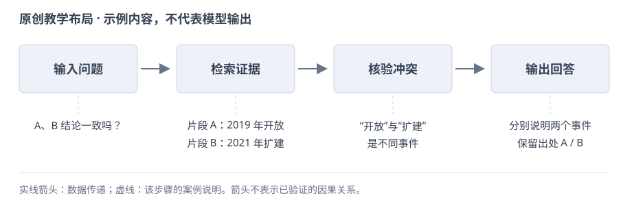

# PaperBank · 论文少走弯路指南

先把贡献讲清楚，再把证据交代全。按主题检查，卡住了再展开例子。

主要面向实证型 CS / AI 论文；按学科、研究类型与投稿要求取舍。下文“写法示例”均为原创教学情境，假设数字不代表实验结果。

欢迎使用、改写、转载，也欢迎拿去给 Codex 等工具做 skill。转载请保留作者 Da1yuqin、[原文链接](https://Da1yuqin.github.io/PaperBank/)和 [CC BY 4.0](https://creativecommons.org/licenses/by/4.0/) 许可，改过请注明。Star 自愿，署名别失联。

## 目录

- [1. 先想清楚，别急着写](#core)
- [2. 开写以后，少走弯路](#workflow)
- [3. 标题和摘要：让人愿意往下读](#abstract)
- [4. 引言：把工作为什么值得做讲明白](#intro)
- [5. 方法：别让读者靠猜](#method)
- [6. 实验：让结论有着落](#experiments)
- [7. 图表：画出来，也要看得懂](#visual)
- [8. 相关工作：把自己的位置放准](#related)
- [9. 附录：让人找得到细节](#appendix)
- [10. 精修：先讲通，再写顺](#revision)
- [11. 用 AI：省力，也别省掉判断](#ai)
- [12. 回意见和交稿：别在最后掉链子](#rebuttal)

<a id="core"></a>
## 1. 先想清楚，别急着写

先确定研究对象、核心贡献和证据范围，再决定论文的名称与叙述重点。

**贡献定位**

- [ ] **第 1 条：**用一句话交代研究对象、现有困难、你的改动和结果，删去方法名后仍能看出具体贡献。

<a id="tip-01"></a>
<details>
<summary>第 1 条：动笔前，先说清你到底发现了什么 · 说明、例子与参考</summary>

先别急着打开论文模板。找一个不了解项目的同学，试着用几句话说清：你在解决什么问题，做了什么，最后多知道了什么。说不清，往往还没到润色英语的时候。

**做法：**先写一句话，再展开成一小段。把研究对象、现有办法卡在哪里、你的改动和结果放进去。写完看看：去掉方法名和“新颖、有效”这些词，还剩不剩具体内容？

**边界：**有时是表达没理顺，有时是证据还不够。先分清是哪一种，别让流畅的文字替你做判断。

**把方法名换成研究内容**

**改前：**教学示例：我们提出了一个新颖的多智能体问答框架，包含多个有效模块。

**改后：**假设研究：多文档问答需要同时找到不同文档中的证据，固定次数的检索可能漏掉关键条件，也可能重复调用。我们研究能否根据已有证据决定继续检索或开始回答，并在相同模型和信息范围下比较回答质量与调用成本。贡献的范围由这些比较决定。

**说明：**改写给出了对象、困难、操作和验证方式，读者不用先记住方法名，也不会把研究目标误当成已经取得的结果。

来源与延伸阅读：[作者提供的写作、绘图与进阶笔记](https://github.com/Da1yuqin/PaperBank/blob/main/SOURCES.md#写作笔记)；[Mensh & Kording (2017) · Ten simple rules for structuring papers](https://doi.org/10.1371/journal.pcbi.1005619)；[NeurIPS · Paper Checklist](https://neurips.cc/public/guides/PaperChecklist)

</details>

- [ ] **第 2 条：**选出读者应记住的主要贡献，说明其他设计如何支持它；独立发现另交代共同研究范围。

<a id="tip-02"></a>
<details>
<summary>第 2 条：给读者一个能带走的重点 · 说明、例子与参考</summary>

读者合上论文后，能记住一个有用的判断，就已经很好。别让五六个模块同时争当主角。

**做法：**先选出最重要的贡献，再把其他设计放回各自的位置：它为什么必需，替主贡献解决了哪一步困难。确实有多个独立发现，也要交代它们为什么值得放在同一篇里。

**边界：**一个中心不等于硬砍到只剩一个发现。能串起来就串，串不起来就重新想论文的范围。

来源与延伸阅读：[作者提供的写作、绘图与进阶笔记](https://github.com/Da1yuqin/PaperBank/blob/main/SOURCES.md#写作笔记)

</details>

- [ ] **第 4 条：**先说明方法的实际操作，再定名称与比喻；逐项检查名称是否暗示了未经验证的能力。

<a id="tip-04"></a>
<details>
<summary>第 4 条：名字可以好记，事情要说准 · 说明、例子与参考</summary>

一个好比喻能省掉半页解释。前提是，比喻背后真有那回事。给坐标修正程序起个“自主进化”的名字，不会凭空多出自主决策能力。

**做法：**先用普通话说明实际操作，再想一个方便读者记住的名字。想保留类比，就把类比和实现的对应关系写清楚。

**边界：**别拿流行术语凑新意。名字拿掉以后，贡献也应该站得住。

来源与延伸阅读：[作者提供的写作、绘图与进阶笔记](https://github.com/Da1yuqin/PaperBank/blob/main/SOURCES.md#写作笔记)

</details>


**主张与证据**

- [ ] **第 3 条：**给每个主要主张标出对应设计和实验；缺少支持就补证据或收窄主张，机制解释另需对照。

<a id="tip-03"></a>
<details>
<summary>第 3 条：引言里许的愿，实验里要还上 · 说明、例子与参考</summary>

引言说省钱，实验就得算钱；引言说更稳，实验就得看波动。不能前面讲一个优点，后面拿另一个成绩来证明。

**做法：**给每个主张找一个位置：方法哪里实现了它，哪个实验检验了它，结果支持到哪一步。找不到的，补实验或者改主张。用一张小表就够，不必做成大工程。

**边界：**整体分数上涨，只能先说明整体变好了。想说是某个机制起作用，还得有能区分原因的对照。

**给每项主张配一份证据**

**改前：**教学示例：引言说系统更便宜、更可靠，实验只报告一次回答正确率。

**改后：**假设修订：若主张降低调用成本，就记录每题模型调用次数、输入输出量及统一价格下的费用；若主张回答更可靠，就报告正确率、证据支持率和多次运行的波动。没有成本记录时先删除省钱结论，只有整体涨分时不宣称证据筛选机制已获证明。

**说明：**两种主张需要不同测量，整体分数不能同时证明成本下降和可靠性提高，删除缺证据的结论比换个形容词有效。

来源与延伸阅读：[写作技能与检查方法](https://github.com/Da1yuqin/PaperBank/blob/main/SOURCES.md#写作技能)；[NeurIPS · Paper Checklist](https://neurips.cc/public/guides/PaperChecklist)

</details>

- [ ] **第 5 条：**保存失败实验的配置、输出和原因，区分程序故障与方法失效，并保留影响结论的负结果。

<a id="tip-05"></a>
<details>
<summary>第 5 条：失败的实验别随手扔 · 说明、例子与参考</summary>

以后写分析、补附录、回审稿意见时，最想找回来的，常常就是当初那次没跑好的尝试。先留着，整理比重跑便宜。

**做法：**把配置、输出和失败原因一起保存。写论文时，挑能说明问题的结果：哪种直觉不成立，什么条件会失效，哪个方向不值得继续试。

**边界：**程序出错和方法失效是两回事。负结果也得检查对照，不能把一个故障写成一个发现。

来源与延伸阅读：[作者提供的写作、绘图与进阶笔记](https://github.com/Da1yuqin/PaperBank/blob/main/SOURCES.md#写作笔记)

</details>


<a id="workflow"></a>
## 2. 开写以后，少走弯路

用贡献句、提纲、草图和结果表推进讨论，并按关键论证分配篇幅。

**起草与结构**

- [ ] **第 6 条：**先完成贡献句、提纲、草图或结果表，依据已有证据逐步写作；主张不成立就及时修改。

<a id="tip-06"></a>
<details>
<summary>第 6 条：别等整篇想好了才开始写 · 说明、例子与参考</summary>

先做出能讨论的小东西：一句贡献、一页提纲、一张草图、一张结果表。拿着这些讨论，比对着空白文档想“完整故事”容易得多。

**做法：**先把已有证据摆出来，再定主线和章节。方法与实验先写清楚，引言跟着调整，摘要最后再压一遍。中途发现主张不成立，就回去改，不用等全篇写完。

**边界：**顺序不是规定。概念图可以先画，结果图得等真实结果出来。

**用可讨论的小材料开始写**

**改前：**教学示例：等所有实验做完、故事完全想好后，再一次性写整篇论文。

**改后：**假设起草安排：先写研究问题和一句贡献，再列出检索、证据筛选、回答三个步骤，画出输入与输出；把已有结果放进一张注明设置的表。合作者先讨论这些材料能支持哪项结论，方法与实验据此展开，摘要等主张稳定后再写，缺证据的位置暂不填结论。

**说明：**小材料能暴露流程、设置和证据缺口，让讨论有明确对象；先占住结果位置不等于提前编好结果。

来源与延伸阅读：[作者提供的写作、绘图与进阶笔记](https://github.com/Da1yuqin/PaperBank/blob/main/SOURCES.md#写作笔记)；[Mensh & Kording (2017) · Ten simple rules for structuring papers](https://doi.org/10.1371/journal.pcbi.1005619)

</details>

- [ ] **第 7 条：**同层标题按统一逻辑组织，方法按步骤、实验按问题划分，并统一标题、模块名与图中名称。

<a id="tip-07"></a>
<details>
<summary>第 7 条：只看目录，也该知道你在干什么 · 说明、例子与参考</summary>

目录像路线图。读完一串“模块一、模块二、模块三”，读者还是不知道接下来要去哪，这个目录就没帮上忙。

**做法：**同一层标题按同一逻辑分：方法按处理步骤，实验按要回答的问题。标题用实际动作或对象，图里的名字也跟着统一。

**边界：**不用死守每节最多几个子节。太碎就合并，确实有不同任务就分开。

来源与延伸阅读：[作者提供的写作、绘图与进阶笔记](https://github.com/Da1yuqin/PaperBank/blob/main/SOURCES.md#写作笔记)

</details>


**篇幅分配**

- [ ] **第 8 条：**按作者指南给问题、关键设计和主要结果留足篇幅，超页先删重复铺垫，保留结论成立条件。

<a id="tip-08"></a>
<details>
<summary>第 8 条：先给重要的东西留位置 · 说明、例子与参考</summary>

页数就这么多。先留给读者必须看懂的地方：问题、关键设计、主要结果，以及结果成立的条件。别等背景写满了，才发现实验没地方解释。

**做法：**列出每章非讲不可的内容。超页时先删重复铺垫和空话，再挪实现细节。最后打开 PDF，看篇幅是不是真的花在重点上。

**边界：**写满不是目标，每页硬放一个实验也没必要。信息够了就停，格式按投稿要求来。

**超页时先删重复背景**

**改前：**教学示例：背景用了三页，实验只剩一页，于是缩小表格字体并删掉限制。

**改后：**假设修订安排：合并两段重复介绍检索增强问答的背景，保留理解跨文档证据所需的定义；给关键比较和结果解释留出正文位置，把完整参数表移到附录并准确引用。最后按作者指南检查篇幅和字号，保留影响主结论的条件、限制及必要对照。

**说明：**篇幅先按论证需要分配，背景压缩可以减少重复，但不能用超页作为隐藏限制或违反模板的理由。

来源与延伸阅读：[作者提供的写作、绘图与进阶笔记](https://github.com/Da1yuqin/PaperBank/blob/main/SOURCES.md#写作笔记)；[Mensh & Kording (2017) · Ten simple rules for structuring papers](https://doi.org/10.1371/journal.pcbi.1005619)；[NeurIPS · Paper Checklist](https://neurips.cc/public/guides/PaperChecklist)

</details>


<a id="abstract"></a>
## 3. 标题和摘要：让人愿意往下读

标题交代研究内容，摘要完整说明问题、方法和结果，定稿时逐句核对正文。

**标题与摘要**

- [ ] **第 9 条：**让标题直接说明研究对象及值得读的内容，少用未解释的缩写，结论型标题限定适用范围。

<a id="tip-09"></a>
<details>
<summary>第 9 条：标题别让人猜谜 · 说明、例子与参考</summary>

好标题让人一眼知道研究什么，最好还能看出哪一点值得读。生僻词、缩写和俏皮话可以加，但别把正文入口堵住。

**做法：**分别写一个问题型、方法型和发现型标题，让不了解项目的人说说各自读出了什么。哪个最贴近你真正想讲的内容，就从哪个改。

**边界：**结论型标题尤其要收住范围。只在几种条件下成立的发现，别写得像普遍规律。

**标题说明研究对象和边界**

**改前：**教学示例：OmniMind：通向通用智能的自主进化问答革命。

**改后：**假设标题修改为《根据证据覆盖决定检索次数：多文档问答中的质量与成本比较》。标题交代了实际操作、应用对象和比较维度。若只评测多文档问答，就保留这一范围；尚未证明质量与成本同时改善时，不在标题中写全面优于现有方法或通用智能。

**说明：**标题可以有辨识度，但研究对象和可验证的动作更方便读者判断相关性，也能避免名字暗示未经研究的能力。

来源与延伸阅读：[作者提供的写作、绘图与进阶笔记](https://github.com/Da1yuqin/PaperBank/blob/main/SOURCES.md#写作笔记)；[Mensh & Kording (2017) · Ten simple rules for structuring papers](https://doi.org/10.1371/journal.pcbi.1005619)；[NeurIPS · Paper Checklist](https://neurips.cc/public/guides/PaperChecklist)

</details>

- [ ] **第 10 条：**在摘要中连贯交代具体问题、已有困难、关键方法及主要结果，字数与格式按投稿要求处理。

<a id="tip-10"></a>
<details>
<summary>第 10 条：摘要里，把事情从头到尾说完 · 说明、例子与参考</summary>

只读摘要，读者也应该知道：什么问题，你怎么做，结果怎样，为什么值得关心。不要让摘要成为一串没有前后关系的好消息。

**做法：**先交代具体场景，再讲已有办法的困难，然后介绍关键思路，最后给最重要的结果。每句话都接住前一句，少塞型号和实现细节。

**边界：**摘要字数和格式看投稿要求。别把别人那篇的字数当成自己的标准。

**写一段范围明确的摘要**

**改前：**教学示例：本文提出高效强大的框架，大量实验显示全面领先，具有广阔应用前景。

**改后：**假设摘要示例：多文档问答中的固定检索次数难以适应不同问题的证据需求。我们用证据覆盖判断是否继续检索，并在相同模型、数据和预算条件下评测。假设结果为平均调用次数下降，但困难问题的正确率未提高；这些结果说明该策略能节省部分调用，其质量优势仍受问题类型限制。

**说明：**摘要把问题、动作、比较与有限结果连起来；假设数字或结果不能脱离教学标签，转写成真实实验成绩。

来源与延伸阅读：[写作技能与检查方法](https://github.com/Da1yuqin/PaperBank/blob/main/SOURCES.md#写作技能)；[Mensh & Kording (2017) · Ten simple rules for structuring papers](https://doi.org/10.1371/journal.pcbi.1005619)；[NeurIPS · Paper Checklist](https://neurips.cc/public/guides/PaperChecklist)

</details>


**术语与核对**

- [ ] **第 11 条：**首次出现的必要术语立即解释，先说明操作与原因，再介绍名称；影响复现的版本在后文交代。

<a id="tip-11"></a>
<details>
<summary>第 11 条：专业词少一点，解释早一点 · 说明、例子与参考</summary>

读者不认识你的缩写很正常。先告诉他这一步在做什么，再给它起名字，比连续介绍三个新名词省事。

**做法：**摘要和引言先用普通话讲清动作与原因。必须用的术语，在第一次出现时解释；不影响理解的实现型号，放到方法或实验设置里。

**边界：**容易懂不等于随便写。模型是什么、用哪个版本、实验怎么做，后文仍要准确交代。

来源与延伸阅读：[写作技能与检查方法](https://github.com/Da1yuqin/PaperBank/blob/main/SOURCES.md#写作技能)

</details>

- [ ] **第 12 条：**将摘要逐句对应到正文证据，核对方法名、对象、数据范围与完成状态，并同步标题和结论。

<a id="tip-12"></a>
<details>
<summary>第 12 条：正文改了，别把摘要落下 · 说明、例子与参考</summary>

正文已经收回的结论，还留在摘要里，是很容易漏掉的事。最后单独对一遍，省得读者从第一段就读到过时版本。

**做法：**拿摘要逐句问：正文哪里支持这句话？方法名、比较对象、数据范围和完成状态还一致吗？结论改了，标题和结尾也顺手看一眼。

**边界：**压缩可以省细节，不能顺便把有限结果写成全面胜出。

来源与延伸阅读：[写作技能与检查方法](https://github.com/Da1yuqin/PaperBank/blob/main/SOURCES.md#写作技能)

</details>


<a id="intro"></a>
## 4. 引言：把工作为什么值得做讲明白

从具体问题与已有方法的局限出发，解释设计为何需要及贡献由什么证据支持。

**问题与局限**

- [ ] **第 13 条：**只保留理解研究问题所需的背景，交代现有做法后尽快进入具体困难，文献按相关性保留。

<a id="tip-13"></a>
<details>
<summary>第 13 条：背景讲到够用就停 · 说明、例子与参考</summary>

读者来读你的工作，不是来补整个学科的历史。背景负责把他带到问题面前，带到了就进入正题。

**做法：**从应用或研究价值切入，紧接着说明大家现在怎么做。只保留能解释后面困难的知识：后文要谈哪一步的开销，前面就把那一步铺垫清楚。

**边界：**相关的历史工作该留就留，不按年份一刀切，也不为了数量堆文献。

来源与延伸阅读：[作者提供的写作、绘图与进阶笔记](https://github.com/Da1yuqin/PaperBank/blob/main/SOURCES.md#写作笔记)

</details>

- [ ] **第 14 条：**指出具体方法在特定条件下的未解问题，用原文或诊断支持；区分未报告、未测试和做不到。

<a id="tip-14"></a>
<details>
<summary>第 14 条：说前人哪里不够，要说具体 · 说明、例子与参考</summary>

“现有方法都不行”听着响，往往经不起追问。说清哪个方法、在什么条件下、哪件事还没解决，反而更有说服力。

**做法：**先说明前人已经做到什么，再指出当前任务多了什么要求。需要用结果说话的地方，找原文或做诊断；别只换个角度就宣布别人遗漏了问题。

**边界：**没报告不等于没能力，没测过不等于做不到。这两个区别要守住。

**把前人不够好写成可核验的差别**

**改前：**教学示例：现有问答方法都无法处理复杂问题，也没有考虑推理成本。

**改后：**假设近邻方法 A 固定检索两轮，论文只报告回答正确率。可以写：A 在该任务上取得了已有结果，但固定轮次未直接按每题证据需求调整；其文中也未报告逐题调用成本。我们因此比较按证据调整轮次与固定轮次的质量和开销。未报告成本，不等于 A 不具备节省成本的能力。

**说明：**虚构方法 A 只是教学对象；改写区分实际设计、报告范围和能力判断，避免把原文没有测的事写成已知缺陷。

来源与延伸阅读：[写作技能与检查方法](https://github.com/Da1yuqin/PaperBank/blob/main/SOURCES.md#写作技能)；[NeurIPS · Paper Checklist](https://neurips.cc/public/guides/PaperChecklist)；[Mensh & Kording (2017) · Ten simple rules for structuring papers](https://doi.org/10.1371/journal.pcbi.1005619)

</details>


**设计与贡献**

- [ ] **第 15 条：**说明每项设计改变哪一步、为何对应当前困难；缺少对照支持的机制解释标为可能原因。

<a id="tip-15"></a>
<details>
<summary>第 15 条：别只说加了模块，要说为什么有用 · 说明、例子与参考</summary>

“为了解决问题，我们提出一个模块”只交代了名字。读者还想知道：这个模块到底动了哪一步，为什么刚好能帮上忙？

**做法：**按问题逐项解释设计。引言讲核心思路，方法章再展开操作；用一句具体的话替换“增强、优化、赋能”这些大词。

**边界：**解释得通还不等于已经证明。实验没分清的原因，先写成可能解释。

**解释模块怎样对应困难**

**改前：**教学示例：为了解决上述问题，我们提出一个证据增强模块来提升问答能力。

**改后：**假设设计说明：候选段落可能各自相关，却没有共同覆盖问题要求的条件。证据筛选模块把问题拆成待回答条件，再检查已取段落覆盖了哪些条件；仍有缺口就继续检索，覆盖后才开始回答。这样做可能减少无用调用，但是否有效要由覆盖判断的准确性和固定预算对照共同检验。

**说明：**改写说清对象、操作和后续去向，机制解释有了实际内容，同时把合理直觉与实验已经证明的作用分开。

来源与延伸阅读：[作者提供的写作、绘图与进阶笔记](https://github.com/Da1yuqin/PaperBank/blob/main/SOURCES.md#写作笔记)；[Mensh & Kording (2017) · Ten simple rules for structuring papers](https://doi.org/10.1371/journal.pcbi.1005619)；[NeurIPS · Paper Checklist](https://neurips.cc/public/guides/PaperChecklist)

</details>

- [ ] **第 16 条：**贡献列表分别说明提出、构建或发现了什么，合并重复项，并给每项对应正文展开和证据。

<a id="tip-16"></a>
<details>
<summary>第 16 条：贡献列表别变成工作日报 · 说明、例子与参考</summary>

读者关心你带来了什么，不关心你一共写了几个脚本、拼了几个模块。贡献列表要把这两件事分开。

**做法：**每条用一个具体动作开头：提出了什么、构建了什么、发现了什么。相近的合并，不同的分开，长度别差太多。最后检查每条能否在正文找到展开和证据。

**边界：**不必凑三条或四条。“做了大量实验”本身没说明多知道了什么。

**贡献列发现，不列工作量**

**改前：**教学示例：我们写了大量代码，设计了三个模块，完成了很多实验。

**改后：**假设下列材料均已完成并可核验，贡献可以写：提出按证据覆盖选择检索轮次的策略，说明其输入与停止条件；建立相同模型和信息边界下的比较，分别测量质量与调用成本；分析策略在证据冲突和跨文档条件组合题中的适用范围。具体发现仍以实际结果为准。

**说明：**每条说明读者得到什么及正文如何展开；实验数量和脚本数量本身不构成发现，未完成材料也不能列作已完成贡献。

来源与延伸阅读：[写作技能与检查方法](https://github.com/Da1yuqin/PaperBank/blob/main/SOURCES.md#写作技能)；[Mensh & Kording (2017) · Ten simple rules for structuring papers](https://doi.org/10.1371/journal.pcbi.1005619)；[NeurIPS · Paper Checklist](https://neurips.cc/public/guides/PaperChecklist)

</details>


**进阶论证**

- [ ] **第 54 条：**先给可复核现象，再检查常见解释；诊断实验之后引出方法，分别交代观察、解释与验证。

<a id="tip-54"></a>
<details>
<summary>第 54 条：诊断型论文：先让读者看到值得解释的现象 · 说明、例子与参考</summary>

当工作重点是发现现有系统在哪种条件下失灵，可以用“现象→质疑→诊断→方法→验证”。读者先看到反常处，再知道你为什么改变某一步。

**做法：**先定义现象和测量条件；提出有依据的候选解释，再设计能区分解释的对照。改进方案接在诊断之后，验证要检验目标问题是否缓解。

**边界：**不是找个难看的例子就能宣布整条路线失效。挑选案例需说明规则，总体结论需要相应样本与对照。

**真实论文怎么读：Lost in the Middle**

**改前：**模型上下文很长，所以一定能充分使用其中的信息。

**改后：**Liu 等（TACL 2024）Figure 1 把含答案文档的位置放在横轴，问答准确率放在纵轴。§2 中移动证据文档以改变位置、增减干扰文档以改变长度；两种操作要分别理解。多条模型曲线呈现中间位置较弱的表现，由此提出长上下文信息利用的具体问题。

**说明：**这个例子支持受测模型与这组任务中的位置敏感性，不能推到所有模型，也不能只凭一条曲线认定内部机制。

来源与延伸阅读：[作者提供的写作、绘图与进阶笔记](https://github.com/Da1yuqin/PaperBank/blob/main/SOURCES.md#写作笔记)；[Mensh & Kording (2017) · Ten simple rules for structuring papers](https://doi.org/10.1371/journal.pcbi.1005619)；[Liu et al. (2024) · Lost in the Middle, Figure 1 / §2](https://aclanthology.org/2024.tacl-1.9/)

</details>

- [ ] **第 55 条：**每个关键局限接上对应设计、作用位置和验证；没有证据的作用写成动机，不为排比硬凑贡献。

<a id="tip-55"></a>
<details>
<summary>第 55 条：多项局限：把设计逐项接回问题 · 说明、例子与参考</summary>

有几个独立困难时，可以先分类，再逐项解释解决办法。让读者能从“为什么需要”走到“改了什么”，最后找到证据。

**做法：**做一张内部对照表：局限→设计→改变的环节→验证。保留真正影响主结论的几条；多个设计合力解决一个问题，就如实交代共同作用。

**边界：**不要把每个实现模块包装成一个独立科学贡献；也不要因表格好看而声称一项设计解决了未测的问题。

**一条局限怎么接到证据：原创教学示例**

**改前：**现有工作有三个问题，因此提出三个模块。

**改后：**假设系统常把相互矛盾的检索片段一起送入生成器。局限是“证据冲突未被区分”，设计是在生成前标注冲突对并保留出处，作用位置是证据筛选。验证比较有冲突与无冲突的样本，再用删除标注的消融检查这一步；额外调用预算需同时报告。

**说明：**先解释具体问题，再描述操作和比较。设计“想要缓解什么”与实验“已表明什么”分别写。

来源与延伸阅读：[作者提供的写作、绘图与进阶笔记](https://github.com/Da1yuqin/PaperBank/blob/main/SOURCES.md#写作笔记)；[Mensh & Kording (2017) · Ten simple rules for structuring papers](https://doi.org/10.1371/journal.pcbi.1005619)

</details>

- [ ] **第 56 条：**比喻后马上给实际定义、操作和对应关系；指出类比的边界，别让一个好名字承担机制证明。

<a id="tip-56"></a>
<details>
<summary>第 56 条：比喻帮助理解，定义负责落地 · 说明、例子与参考</summary>

比喻有用，是因为读者已经熟悉另一件事。把复杂流程说成“先找证据，再交叉核对”容易理解；把普通模块起成认知机制的名字，反而可能增加误会。

**做法：**交代比喻中每个部分在方法里对应什么，接着给可执行定义。若借用其他学科的理论，引用原出处，并说明是组织灵感、形式模型，还是被实际检验的机制。

**边界：**不把“像人的记忆”写成“具有人的记忆机制”；修辞强度不能超过证据强度。选论文也没有适用于所有项目的“37%规则”。

**把“审稿人”这个比喻落到操作：原创教学示例**

**改前：**我们引入一位审稿人，使代理获得反思能力。

**改后：**假设系统中“审稿人”是第二次模型调用：输入候选答案及检索片段，输出答案中缺少证据的句子和对应片段编号。这个名称便于理解检查作用；它不拥有投稿审稿人的资格，也不能据此声称系统形成了人类反思机制。

**说明：**比喻说明用途，输入输出说明方法。能力是否改善，需要实际对照与错误分析。

来源与延伸阅读：[作者提供的写作、绘图与进阶笔记](https://github.com/Da1yuqin/PaperBank/blob/main/SOURCES.md#写作笔记)；[Mensh & Kording (2017) · Ten simple rules for structuring papers](https://doi.org/10.1371/journal.pcbi.1005619)

</details>


<a id="method"></a>
## 5. 方法：别让读者靠猜

按真实流程说明目的、输入、操作和输出，并定义符号及反馈信号的来源。

**流程与模块**

- [ ] **第 17 条：**方法开头概述各步骤的目的、输入和输出，说明先后与并行关系，并使用正文及图中的统一名称。

<a id="tip-17"></a>
<details>
<summary>第 17 条：方法开头先带读者走一遍 · 说明、例子与参考</summary>

别一上来就摆公式。先用一小段话说清整个流程，读者知道自己在哪一步，后面的细节才有地方放。

**做法：**按真实流程介绍各模块的目的、输入和输出，并用正文小节里的名字。最后指向方法图，让读者能在图和文字之间来回对应。

**边界：**别把目录念一遍就算总览。哪些步骤并行，哪些依赖上一步，要讲准。

**方法总览对应真实流程**

**改前：**教学示例：系统包括语义模块、智能模块和认知模块，下文分别介绍。

**改后：**假设方法总览：输入是一个问题和可检索文档。检索器先取候选段落，证据筛选器标记各段落对应的问题条件；覆盖不足时返回检索器补充材料，覆盖满足或达到预算上限后，将已选段落交给回答模型。检索与筛选形成循环，回答发生在循环结束后，三个名字与图中标签一致。

**说明：**总览说明信息从哪里来、在哪一步回流及何时进入回答，读者知道各小节的位置，而不是只得到一串模块名称。

来源与延伸阅读：[写作技能与检查方法](https://github.com/Da1yuqin/PaperBank/blob/main/SOURCES.md#写作技能)；[Mensh & Kording (2017) · Ten simple rules for structuring papers](https://doi.org/10.1371/journal.pcbi.1005619)

</details>

- [ ] **第 18 条：**逐模块写清目的、输入、处理规则、输出和去向，说明信息来源与可见范围，注明沿用的组件。

<a id="tip-18"></a>
<details>
<summary>第 18 条：每个模块都回答：进来什么，出去什么 · 说明、例子与参考</summary>

模块名再漂亮，也替代不了操作说明。读者看完这一节，至少应该能说出输入是什么，中间做了什么，输出交给谁。

**做法：**先讲这一步为什么需要，再讲处理规则。会影响结果的条件别省，信息从哪来、谁能看见也写清楚。最后交代它怎么接到下一步。

**边界：**现成组件就说明是现成组件。重新命名，不会把别人的方法变成你的贡献。

**把一个模块写到能够实现**

**改前：**教学示例：证据筛选器接收语义信息并输出增强表示，提升系统表现。

**改后：**假设模块说明：证据筛选器接收问题、候选段落及各段落的文档编号，输出保留段落和未覆盖的条件列表。判断只使用这些输入，不能访问标准答案；未覆盖条件交给下一轮检索，保留段落交给回答模型。若筛选器调用现成语言模型，另注明模型版本、提示词与输入长度限制。

**说明：**输入、输出、规则和可见信息决定方法能否复现；把现成模型重新命名为模块，不会自动形成新的模型贡献。

来源与延伸阅读：[写作技能与检查方法](https://github.com/Da1yuqin/PaperBank/blob/main/SOURCES.md#写作技能)；[NeurIPS · Paper Checklist](https://neurips.cc/public/guides/PaperChecklist)；[Mensh & Kording (2017) · Ten simple rules for structuring papers](https://doi.org/10.1371/journal.pcbi.1005619)

</details>


**符号与信号**

- [ ] **第 19 条：**在符号首次出现时解释对象、下标和必要单位，同一对象统一记号，并用文字说明公式的操作。

<a id="tip-19"></a>
<details>
<summary>第 19 条：符号用到哪个，解释哪个 · 说明、例子与参考</summary>

先用文字说明对象，再让符号登场。开头堆一页记号，后面一半都用不上，只会增加读者的记忆负担。

**做法：**首次出现时解释含义、下标和必要单位。同一对象用同一符号，没用到的定义删掉。公式写完，再用一句话说它在做什么。

**边界：**符号多不代表理论强。简单关系能说清楚就够，关键公式则不能缺定义。

来源与延伸阅读：[写作技能与检查方法](https://github.com/Da1yuqin/PaperBank/blob/main/SOURCES.md#写作技能)

</details>

- [ ] **第 20 条：**沿一个样本说明输入、输出、评分者、评分规则与更新对象，分清奖励、优势、损失和梯度。

<a id="tip-20"></a>
<details>
<summary>第 20 条：奖励和反馈，要说清从哪来 · 说明、例子与参考</summary>

“用反馈优化模型”太宽了。谁的反馈，对哪次输出打分，最后更新谁？这几个问题没回答，读者就只能靠猜。

**做法：**把一个样本走完整：输入是什么，模型产出什么，谁按什么规则给分，分数怎样进入更新。涉及奖励、优势、损失和梯度时，别把它们混成同一种东西。

**边界：**整次任务成功，不代表每一步都有贡献。要把最终奖励分到中间动作，得交代分法。

**说明奖励如何进入更新**

**改前：**教学示例：我们使用高质量反馈优化系统，让每个智能体都变得更好。

**改后：**假设训练变体：证据选择器对同一训练问题生成多份段落选择，回答模型分别作答，按人工标注的答案规则核验得到任务奖励。将每份奖励减去该问题各份奖励的平均值，作为相对优势，再据此更新选择器的选择策略；回答模型保持固定。标准答案仅用于训练和离线评测，部署时不可见。

**说明：**例子逐步交代评分规则、相对优势与更新对象；整次回答得到的奖励不能未经说明就称为每个动作的独立贡献。

来源与延伸阅读：[写作技能与检查方法](https://github.com/Da1yuqin/PaperBank/blob/main/SOURCES.md#写作技能)；[NeurIPS · Paper Checklist](https://neurips.cc/public/guides/PaperChecklist)

</details>


<a id="experiments"></a>
## 6. 实验：让结论有着落

根据待检验的主张设计公平比较，说明指标、统计方式和结果成立的条件。

**比较设计**

- [ ] **第 21 条：**每个实验先写清待检验主张、固定项、改变项和比较对象，不因容易涨分的设置倒改研究问题。

<a id="tip-21"></a>
<details>
<summary>第 21 条：先问想验证什么，再决定跑什么 · 说明、例子与参考</summary>

实验不是越多越好。先写下你想让读者相信哪句话，再想什么比较能支持它，什么结果会让你收回它。

**做法：**每个实验写一句：固定什么，改变什么，比较什么。照这个句子选数据、对照和指标，跑完再回来看问题有没有被回答。

**边界：**不要因为某个设置容易涨分，就倒过来把它当成论文一直要解决的问题。

来源与延伸阅读：[作者提供的写作、绘图与进阶笔记](https://github.com/Da1yuqin/PaperBank/blob/main/SOURCES.md#写作笔记)

</details>

- [ ] **第 22 条：**交代模型、数据、可见信息、调参机会和预算，尽量匹配比较条件；无法匹配的差别明确报告。

<a id="tip-22"></a>
<details>
<summary>第 22 条：比方法之前，先把条件摆平 · 说明、例子与参考</summary>

一个系统多用了几倍资源，另一个系统被卡着预算，只看最终分数很难说明方法谁更好。先把比较条件讲清楚。

**做法：**交代模型、数据、可见信息、调参机会和预算。能匹配的尽量匹配；确实不能匹配，就说清差别，必要时增加同预算比较。

**边界：**公平不等于超参数一模一样。关键是比较符合问题，双方都有合理的发挥机会。

**把信息和预算放在分数旁边**

**改前：**教学示例：我们比基线高两分；基线用小模型和一轮检索，我们用大模型和五轮检索。

**改后：**假设公平比较：两种策略使用同一回答模型、同一文档集合、相同问题和相同最大检索预算，分别记录实际调用次数与输入输出量。若原版基线需要另一模型，另列原版结果与这些差异，并补充在相同模型下的策略比较。分数优势先按对应条件解释，不把资源差异归功于策略。

**说明：**原版系统比较和控制条件后的策略比较回答不同问题，把两者分开报告，才能判断优势是否来自额外资源。

来源与延伸阅读：[写作技能与检查方法](https://github.com/Da1yuqin/PaperBank/blob/main/SOURCES.md#写作技能)；[NeurIPS · Paper Checklist](https://neurips.cc/public/guides/PaperChecklist)

</details>

- [ ] **第 24 条：**按解决的问题给基线分组，说明选择理由、来源及实现改动，不能因难以超过而跳过最相近工作。

<a id="tip-24"></a>
<details>
<summary>第 24 条：介绍基线，按它们解决什么问题来分 · 说明、例子与参考</summary>

一长串方法名很难记。把解决相似问题的放在一起，读者更容易看出你到底在和谁比。

**做法：**每类说清基本思路、为什么选它，再给来源。结果分析沿用这个分组；大家熟悉的方法少铺垫，影响比较的改动要讲清楚。

**边界：**相关不等于一定可比，但最相近的工作不能因为不好超过就跳过去。

来源与延伸阅读：[作者提供的写作、绘图与进阶笔记](https://github.com/Da1yuqin/PaperBank/blob/main/SOURCES.md#写作笔记)

</details>

- [ ] **第 26 条：**消融比较组件作用时尽量只改一个因素，参数分析另报合理范围，无法控制的差别照实说明。

<a id="tip-26"></a>
<details>
<summary>第 26 条：消融别一口气改三件事 · 说明、例子与参考</summary>

去掉一个模块，同时换模型、减预算、改提示词，成绩变了也不知道该归功或归咎于谁。一次尽量回答一个问题。

**做法：**比较组件作用时，尽量保持其他部分不变。比较参数影响时，给出合理范围和选择依据。两类实验分开讲，各自回答各自的问题。

**边界：**控制不了的差别照实写。结果解释的底气，来自实验设计，不来自语气。

**让消融只回答一个变化**

**改前：**教学示例：删掉证据筛选，同时换模型、减预算、改提示词，得分下降说明筛选很有效。

**改后：**假设消融设计：先固定回答模型、候选段落、检索次数与回答提示词，只比较有无证据筛选，以检验筛选对回答质量的影响。另做允许动态停止的比较，记录其质量和实际开销。前者研究筛选，后者研究整套策略；如果两个设置一起变，就不把差异全部归因于一个组件。

**说明：**控制条件后的消融与完整系统比较有不同用途，先区分检验对象，能够减少把多个改动的结果误算为一个机制的效果。

来源与延伸阅读：[写作技能与检查方法](https://github.com/Da1yuqin/PaperBank/blob/main/SOURCES.md#写作技能)；[NeurIPS · Paper Checklist](https://neurips.cc/public/guides/PaperChecklist)

</details>


**指标与结果**

- [ ] **第 23 条：**定义指标的测量对象、分母、算法和高低方向，交代平均方式与缺失项，区分百分点和相对增幅。

<a id="tip-23"></a>
<details>
<summary>第 23 条：指标是什么，别让读者自己查 · 说明、例子与参考</summary>

“通过率”这三个字不够。是一条回答通过，还是回答里的一个检查项通过？分母不同，数字就不是同一回事。

**做法：**给指标写清测量对象、计算方法和高低方向。自定义指标单独解释，宏平均、微平均和不适用项的处理也说明白。

**边界：**从 40% 到 50% 是增加 10 个百分点，相对增加 25%。两种说法不要混着用。

**分清百分比与百分点**

**改前：**教学示例：正确率从百分之四十变为百分之五十，因此提升了百分之十。

**改后：**假设共有二百道测试题，基线答对八十道，新方法答对一百道；两者正确率分别为百分之四十与百分之五十，即增加十个百分点，相对增幅为百分之二十五。分母包括全部二百道题，拒答按预先规定计为未答对；不能先删除拒答，再与使用全部题目的基线比较。

**说明：**同一差值的绝对变化与相对变化不同，分母处理也会改变指标；先定义计算方式，读者才知道数字能否直接比较。

来源与延伸阅读：[作者提供的写作、绘图与进阶笔记](https://github.com/Da1yuqin/PaperBank/blob/main/SOURCES.md#写作笔记)；[NeurIPS · Paper Checklist](https://neurips.cc/public/guides/PaperChecklist)

</details>

- [ ] **第 25 条：**结果段先写发现，再给对应图表、比较条件和必要差值；没有对照支持的原因只作可能解释。

<a id="tip-25"></a>
<details>
<summary>第 25 条：别替读者把表格念一遍 · 说明、例子与参考</summary>

表里已经有数字，正文再报一遍分数，读者没多得到什么。正文应该解释：差别在哪，这个差别告诉了我们什么。

**做法：**先写主要发现，再指出对应图表和比较条件。需要时保留一个关键差值，把篇幅留给现象、原因和与方法设计的关系。

**边界：**可能原因就说可能。没有对照支持，别把顺耳的解释写成已经证明的机制。

**分析结果，不重新念表格**

**改前：**教学示例：新方法是五十分，基线是四十八分，因此证据筛选解决了跨文档推理问题。

**改后：**假设结果分析：在相同模型与预算下，新方法的正确率略高，调用次数较少；收益主要出现在证据已较齐全的题目，证据冲突题没有同样变化。这些现象与减少重复检索的设计目标一致，但目前只能作为解释线索；要把提升归因于筛选机制，还需控制其他因素的消融比较。

**说明：**正文补充条件、差异分布和解释边界，表格已有的数字不必全部重复；观察到涨分还不足以确定机制因果。

来源与延伸阅读：[写作技能与检查方法](https://github.com/Da1yuqin/PaperBank/blob/main/SOURCES.md#写作技能)；[NeurIPS · Paper Checklist](https://neurips.cc/public/guides/PaperChecklist)；[Mensh & Kording (2017) · Ten simple rules for structuring papers](https://doi.org/10.1371/journal.pcbi.1005619)

</details>

- [ ] **第 27 条：**保存全部运行，说明重复次数、变化因素及统计方式，报告适当波动；不把最高分当稳定领先。

<a id="tip-27"></a>
<details>
<summary>第 27 条：别只留最好看的那一次 · 说明、例子与参考</summary>

只看最高分，很容易把运气当进步。原始运行都留下，论文里说明重复了几次、变了哪些因素。

**做法：**根据实验特点报告波动或区间，并解释计算方式。误差条对应随机种子、数据划分还是案例差异，写清楚再画。

**边界：**没运行不是 0，最高分也不等于稳定领先。“显著”不是“看着差得挺多”的同义词。

**最高分不代表稳定领先**

**改前：**教学示例：运行五次，只把最高一次写进表格，结论说方法稳定优于所有基线。

**改后：**假设重复运行方案：对同一测试集独立运行五次，保留每次配置和结果，表中报告均值及标准差，并注明误差条来自运行随机性。若还评估抽题差异，则另说明重采样方法与区间含义。没有统计检验时写观察到的差值，不因均值较高就使用显著或稳定领先的结论。

**说明：**运行波动与测试样本不确定性是不同来源，误差条需要明确含义；选择最好一次会遮住波动，也不能证明显著性。

来源与延伸阅读：[NeurIPS · Paper Checklist](https://neurips.cc/public/guides/PaperChecklist)

</details>


**研究问题**

- [ ] **第 53 条：**先列可回答的研究问题，再对到比较、图表与结论；RQ 编号可选，探索解释和事先假设分开写。

<a id="tip-53"></a>
<details>
<summary>第 53 条：RQ 是要回答的问题，不是实验的装饰 · 说明、例子与参考</summary>

Research Question（RQ）告诉读者这组实验到底要查明什么。它可以组织多组相互关联的比较，也可以用普通小节标题表达；不必每张表前都硬加一个 RQ。

**做法：**问题写清对象、条件与待比较关系。每个问题对应必要实验及回答；如果预先提出假设，说明它对结果作了什么可检验预测。实验后发现的解释照实写成探索结果。

**边界：**问题需说明指标和比较条件；效果阈值可按研究目的预先定义，别根据已看到的涨分倒写问题。RQ 不等于假设，Registered Reports 的规划要求也不能直接套到全部 CS 论文。

**问题—设计—回答：原创教学示例**

**改前：**RQ1: Is our method effective? RQ2: Is each module effective?

**改后：**假设研究多文档问答。RQ1：相同检索库与 token 预算下，证据核验是否改善答案正确率？比较基础系统与核验系统。RQ2：改善来自核验还是额外调用？加入同预算的追加检索对照。RQ3：证据缺失或互相矛盾时，收益与拒答率怎样变化？分条件报告。

**说明：**三个问题分别检查总体差异、替代解释与适用边界；回答必须跟实际实验走，未做的比较不能写成已有发现。

**RQ 和 hypothesis 怎么分**

**改前：**RQ：我们的方法会比基线好。

**改后：**RQ 是问题：“固定预算时，核验步骤怎样影响答案正确率？”若研究前有依据，可提出假设：“核验会减少与证据冲突的答案。”再明确冲突的判定与统计方式。若看完结果才想到这个解释，就写探索性分析，而不是补写成预先假设。

**说明：**编号有助组织，不会自动让研究更严谨。关键是时间顺序、可观察量和证据对应。

来源与延伸阅读：[作者提供的写作、绘图与进阶笔记](https://github.com/Da1yuqin/PaperBank/blob/main/SOURCES.md#写作笔记)；[Henderson & Chambers (2022) · Ten simple rules for writing a Registered Report](https://doi.org/10.1371/journal.pcbi.1010571)；[NeurIPS · Paper Checklist](https://neurips.cc/public/guides/PaperChecklist)

</details>


<a id="visual"></a>
## 7. 图表：画出来，也要看得懂

按图表的主要信息选择布局，用真实数据绘制结果，并在最终论文尺寸下检查可读性。

**信息与布局**

- [ ] **第 28 条：**画图前写一句主要信息，据此区分动机图、流程图与结果图，再选择面板、连线和图型；画面不暗示未经验证的优势。

<a id="tip-28"></a>
<details>
<summary>第 28 条：画图之前，先问读者看完要懂什么 · 说明、例子与参考</summary>

一张图想把全部贡献、全部模块、全部实验都装进去，最后常常什么都看不清。先确定它最要紧的一件事。

**做法：**动机图讲问题，方法图讲流程，结果图讲比较。先写一句想传达的意思，再决定放几个面板、哪些箭头、什么图型。

**边界：**左右对照只是选项，不是所有图的标准答案。没有验证的优势，别靠画面暗示出来。

**先确定一张方法图的任务**

**改前：**教学示例：同一张图塞进全部背景、模块、贡献、结果曲线和应用场景。

**改后：**假设这张图只解释何时继续检索。左侧放问题与候选段落，中间放条件覆盖判断，缺失条件沿回路返回检索器，满足条件或预算耗尽后进入回答。用一条主路径和一条回路表达控制关系，性能结果另放独立图表；图中的每条箭头均对应实际传递的对象。

**说明：**图型与布局由要解释的信息决定，分离流程和结果后，读者能沿路径追踪操作，也不会从装饰推断未经验证的优势。

来源与延伸阅读：[作者提供的写作、绘图与进阶笔记](https://github.com/Da1yuqin/PaperBank/blob/main/SOURCES.md#写作笔记)；[Rougier et al. (2014) · Ten Simple Rules for Better Figures](https://doi.org/10.1371/journal.pcbi.1003833)

</details>

- [ ] **第 29 条：**先按论文最终插入宽度排图中文字，再以正常阅读大小检查 PDF；标签难认时重排、精简或拆图，不靠整体缩小硬塞。

<a id="tip-29"></a>
<details>
<summary>第 29 条：图缩进论文以后，还要看得清 · 说明、例子与参考</summary>

单独打开图片很清楚，不代表放进双栏论文也清楚。真正要看的，是读者正常读正文时能不能认出图里的字。

**做法：**先确定插入宽度，再排文字。放不下就删重复说明、重排或者拆图，别把整张图缩到刚好塞得下就结束。

**边界：**字号按模板和最终效果决定，不照搬另一篇论文的画布尺寸。

**在最终尺寸下重排图**

**改前：**教学示例：宽屏画布上的图很好看，缩进双栏论文后标签已经读不清。

**改后：**假设图最终放在单栏宽度。先按这一宽度排布问题、检索、筛选和回答四个标签，删去各模块内与图注重复的长句；循环关系仍拥挤时，将辅助例子移到第二面板。把图放回最终 PDF，以正常阅读大小检查文字、线条与图注，再决定是否需要跨栏。

**说明：**可读性取决于最终展示尺寸，缩小整幅图会同时缩小文字和间距，重新组织信息比继续缩放更容易保住关键关系。

来源与延伸阅读：[写作技能与检查方法](https://github.com/Da1yuqin/PaperBank/blob/main/SOURCES.md#写作技能)；[Rougier et al. (2014) · Ten Simple Rules for Better Figures](https://doi.org/10.1371/journal.pcbi.1003833)

</details>

- [ ] **第 30 条：**给颜色明确含义并在全文统一，同类对象保持一致，类别区分同时使用文字、线型或形状，避免只靠红绿传递信息。

<a id="tip-30"></a>
<details>
<summary>第 30 条：颜色少一点，意思明确一点 · 说明、例子与参考</summary>

颜色可以帮读者找重点，也可以把人看晕。先决定每种颜色代表什么，再考虑好不好看。

**做法：**给同类对象用同一种颜色，全文保持一致。需要区分的类别配上文字、线型或形状，已有组件与新增设计可以有轻重。

**边界：**不能只靠红绿表达对错。类别确实多时，以看得清为准，别硬凑三种颜色。

来源与延伸阅读：[作者提供的写作、绘图与进阶笔记](https://github.com/Da1yuqin/PaperBank/blob/main/SOURCES.md#写作笔记)；[Rougier et al. (2014) · Ten Simple Rules for Better Figures](https://doi.org/10.1371/journal.pcbi.1003833)

</details>

- [ ] **第 60 条：**比较均值、分布、投影或时间变化时选相应图型，标出变换与不确定性的含义；图型不能替你做结论。

<a id="tip-60"></a>
<details>
<summary>第 60 条：选图型：让比较问题决定画法 · 说明、例子与参考</summary>

点图适合比较估计值和区间，分布图展示样本差异，投影图显示降维后的关系。平滑曲线、渐变区间和雷达图都有用途，也各有容易看错的地方。

**做法：**KDE 写带宽与样本范围，必要时同时看原始点或直方图；PCA 说明输入、标准化和方差解释比例；区间带说明是置信区间、预测区间还是重复运行波动。雷达图注明归一化，各轴量纲不同不直接比较面积。

**边界：**KDE 不是累计分布；PCA 图分得开不等于证明机制或泛化；置信区间不表示某次观测落入范围的概率。不凭图形平滑程度评判方法。

**误差条先定义：原创教学示例**

**改前：**曲线带阴影，说明方法稳定。

**改后：**假设阴影来自 5 次不同随机种子的运行，图注应写均值、重复次数及阴影是标准差。若展示平均值的 95% 置信区间，另交代计算方式；若只是样本分位数，就写对应分位范围。这些区间回答的问题不同。

**说明：**误差条必须由数据和明确统计方法计算；单次运行的样本区间与多次运行波动分开说明，不能凭绘图工具编造。区间重叠与否也不能替代合适的统计检验。

来源与延伸阅读：[作者提供的写作、绘图与进阶笔记](https://github.com/Da1yuqin/PaperBank/blob/main/SOURCES.md#写作笔记)；[Rougier et al. (2014) · Ten Simple Rules for Better Figures](https://doi.org/10.1371/journal.pcbi.1003833)；[NeurIPS · Paper Checklist](https://neurips.cc/public/guides/PaperChecklist)

</details>


**真实数据**

- [ ] **第 31 条：**生成工具可辅助构图与示意素材，实验曲线、柱长、表格和误差条由原始数据绘制；组合后同时核对数字、文字与几何关系。

<a id="tip-31"></a>
<details>
<summary>第 31 条：让 AI 帮你想构图，别让它替你画成绩 · 说明、例子与参考</summary>

示意图可以让生成工具帮忙找感觉。实验曲线、柱长和误差条得回到真实数据，不能看着像就往论文里放。

**做法：**先生成布局或图标，再整理可编辑素材。需要结果面板就留位置，用原始数据和绘图代码补上。组合以后，再核对文字、数值和几何关系。

**边界：**图上的数字写对了，柱子的长度也可能错。漂亮和准确要分开检查。

**示意素材和实验曲线分开制作**

**改前：**教学示例：让图像模型生成一张新方法明显领先的曲线，再把坐标数字改成实验值。

**改后：**假设制作流程：生成工具只提供问题、文档和模块布局的示意草图，结果面板先留空。实验脚本读取每次运行的原始指标，再生成曲线、点位和误差条；组合后逐项核对数据、坐标尺度、线条位置与图例。若使用生成素材，还检查目标投稿政策，并保留许可和使用说明。

**说明：**曲线的几何位置本身就是结果，后改数字不能修复虚构走势；构图辅助可以省时，数据表达仍需要可追溯的绘图过程。

来源与延伸阅读：[作者提供的写作、绘图与进阶笔记](https://github.com/Da1yuqin/PaperBank/blob/main/SOURCES.md#写作笔记)；[Rougier et al. (2014) · Ten Simple Rules for Better Figures](https://doi.org/10.1371/journal.pcbi.1003833)；[NeurIPS · Paper Checklist](https://neurips.cc/public/guides/PaperChecklist)；[ACL Rolling Review · Responsible NLP Research](https://aclrollingreview.org/responsibleNLPresearch/)

</details>

- [ ] **第 59 条：**同图比较性能与成本时写清两个坐标、单位和方向，统一预算条件；相对增幅旁保留绝对值。

<a id="tip-59"></a>
<details>
<summary>第 59 条：多维收益：把省了什么、损失了什么一起画 · 说明、例子与参考</summary>

准确率高一点、调用便宜一点，都是收益，但可能来自不同预算。把每种方法画成一个点，读者能看到取舍；哪些点“更好”取决于坐标方向，不能一律认定第一象限就是好。

**做法：**横轴可放每例 token、耗时或费用，纵轴放预先定义的性能；图例解释模型、预算与设置。比较一组配置时交代选择规则。展示相对改善时同时给原数、分母及百分点差值。

**边界：**测试集不能用来反复挑最漂亮的点；漂亮的散点位置不证明部署净收益，经济结论另需相应成本与场景。

**百分比和百分点：原创教学示例**

**改前：**从 40% 到 50%，性能提升 10%。

**改后：**若准确率从 40% 变成 50%，差值是 10 个百分点，相对增幅是 (50−40)/40=25%。两种说法均须写清分母；若 token 成本同时翻倍，就把成本一并报告，不能只用“提高 25%”概括取舍。

**说明：**数值为假设示例。先给绝对值再给相对量，读者才能判断差异大小。

来源与延伸阅读：[作者提供的写作、绘图与进阶笔记](https://github.com/Da1yuqin/PaperBank/blob/main/SOURCES.md#写作笔记)；[NeurIPS · Paper Checklist](https://neurips.cc/public/guides/PaperChecklist)；[Rougier et al. (2014) · Ten Simple Rules for Better Figures](https://doi.org/10.1371/journal.pcbi.1003833)

</details>


**图注与整页**

- [ ] **第 32 条：**图注交代比较对象、指标、单位、颜色、线型、误差条含义及必要统计方式，与正文统一术语，使读者能独立读懂图。

<a id="tip-32"></a>
<details>
<summary>第 32 条：图注要帮读者把图读完 · 说明、例子与参考</summary>

读者经常先看图，再决定读不读旁边的正文。只写一句“我们的方法更好”，帮不上多少忙。

**做法：**说清图里比较谁、指标是什么、单位是什么，再解释颜色、线型、误差条和必要的统计方式。正文用过的名字，图里别换一套。

**边界：**图注不用复制整段分析。把看懂图所必需的信息留下就行。

**让图注解释比较和误差条**

**改前：**教学示例：图二：我们的方法效果更好。

**改后：**假设图注：固定轮次与按证据停止策略在同一多文档问答测试集上的比较，两者使用相同回答模型和最大检索预算。横轴为平均模型调用次数，纵轴为回答正确率；圆点表示五次独立运行的均值，竖线表示运行间标准差。假设配置不同的点使用形状区分，颜色只帮助辨认策略。

**说明：**图注交代对象、条件、坐标与标记的含义，读者能够独立读图；标准差不能被误称为均值的置信区间。

来源与延伸阅读：[写作技能与检查方法](https://github.com/Da1yuqin/PaperBank/blob/main/SOURCES.md#写作技能)；[Rougier et al. (2014) · Ten Simple Rules for Better Figures](https://doi.org/10.1371/journal.pcbi.1003833)；[NeurIPS · Paper Checklist](https://neurips.cc/public/guides/PaperChecklist)

</details>

- [ ] **第 33 条：**在最终 PDF 中检查图表的引用顺序、图注归属、数值精度、高亮规则及整页布局；图的作用是传达信息，不承诺录用收益。

<a id="tip-33"></a>
<details>
<summary>第 33 条：图画完不算完，要放回整页看 · 说明、例子与参考</summary>

图表的大小、位置和前后文字一起决定阅读体验。单张精修得很好，塞回论文可能还是挤、乱、找不到。

**做法：**检查首次引用顺序、图注归属、表格精度和高亮规则。留白太多先找排版原因，太拥挤先调结构，最后再看整篇是否一致。

**边界：**没有可靠依据能把美观换算成固定录用率。图的任务是帮助理解，不是制造保证。

来源与延伸阅读：[写作技能与检查方法](https://github.com/Da1yuqin/PaperBank/blob/main/SOURCES.md#写作技能)；[Rougier et al. (2014) · Ten Simple Rules for Better Figures](https://doi.org/10.1371/journal.pcbi.1003833)

</details>


**框架与案例**

- [ ] **第 57 条：**流程图画清输入、操作、输出与连线，再放一个可追踪案例；用框的排列表达顺序，用图例解释信号。

<a id="tip-57"></a>
<details>
<summary>第 57 条：框架图：让一个案例沿着流程走 · 说明、例子与参考</summary>

只有模块名，读者很难知道数据怎么变化。给流程搭一个短案例：问题进来，证据被选出，冲突被标记，最后生成带出处的回答。案例服务于解释步骤，不替代总体实验。

**做法：**统一布局方向。每个框只留目的与关键输入输出；框旁标一个中间产物。数据流、评分信号与更新路径用不同线型并加图例。商用模型写全名称和版本即可；使用企业标志另检查商标与许可。

**边界：**箭头表示流程或依赖，不自动表示已证明的因果关系；学习信号需指出谁给分、评什么、更新谁。

**原创布局示例：一个案例贯穿流程**

**改前：**四个模块各有名字，却看不出它们传递什么。

**改后：**示例问题是“报告 A 与报告 B 的结论是否一致？”沿流程保留问题、两份证据编号、冲突标签与最终出处。上排看系统步骤，下排看同一个案例的中间产物；读者无需在四张不相干的例子间切换。

**说明：**下面仅示意信息组织，不展示实际模型输出或实验效果。真实论文替换成可核查案例。



**真实论文怎么读：TCOD，Figure 1**

**改后：**TCOD（2026 预印本）左侧用早轮、晚轮的文本片段及教师词元概率串起多轮监督的困难；右侧对照全轨迹 OPD 与前向扩展 F2B、后向扩展 B2F 两种课程策略。先读旧做法卡在哪里，再读新做法改变了哪段训练。

**说明：**图是机制说明与设计概览，不能单凭它证明效果或因果机制；性能证据需读实验。

**真实论文怎么读：服务代理训练，Figure 1**

**改后：**Reinforcing Real-world Service Agents（2026 预印本）将交互环境与训练放在同一图中：用户画像与角色扮演产生轨迹，终局满意度、每轮规范评分与成本惩罚构成学习信号，更新服务代理。沿箭头可追踪数据与信号。

**说明：**它展示模拟训练框架，不能直接推出真实用户满意度提升或全局最优的成本权衡。

来源与延伸阅读：[作者提供的写作、绘图与进阶笔记](https://github.com/Da1yuqin/PaperBank/blob/main/SOURCES.md#写作笔记)；[Rougier et al. (2014) · Ten Simple Rules for Better Figures](https://doi.org/10.1371/journal.pcbi.1003833)；[TCOD (2026 预印本) · Figure 1](https://arxiv.org/pdf/2604.24005v3)；[Reinforcing Real-world Service Agents (2026 预印本) · Figure 1](https://arxiv.org/html/2602.22697v1#S4.F1)

</details>

- [ ] **第 58 条：**长文本案例用白底、统一层级和少量高亮；颜色说明信息类型，框线说明输入、输出与评价来源。

<a id="tip-58"></a>
<details>
<summary>第 58 条：文字很多的案例图：让颜色帮忙分类 · 说明、例子与参考</summary>

案例图的任务是让人找到差异。全文涂满颜色，读者反而不知道看哪里。先按输入、模型输出、评价分区，再只高亮决定判断的几处。

**做法：**同一行或同一列承担同一层级；相同类型用相同颜色，并用短图例解码。用原创图标辅助定位，不依靠未经授权的企业标志。引用文本保留出处，涉及个人信息时按合法授权与匿名要求处理。

**边界：**展示失败案例时说明筛选规则；一条漂亮的案例不能说明总体成功率。颜色区分的是信息类型，不是显著性。

**原创布局示例：输入、输出、核对分开**

**改前：**整段输入和答案都装进深色大框，读者要自己找矛盾。

**改后：**假设证据 A 写“2019 年开放”，证据 B 写“2021 年扩建”。分别呈现输入证据、系统回答与人工核对，只高亮时间与动作，显示答案是否混淆“开放”和“扩建”。出处 A/B 与高亮含义放在旁边。

**说明：**图中内容是教学假设。布局表达信息来源，不给案例伪造评审得分。


来源与延伸阅读：[作者提供的写作、绘图与进阶笔记](https://github.com/Da1yuqin/PaperBank/blob/main/SOURCES.md#写作笔记)；[Rougier et al. (2014) · Ten Simple Rules for Better Figures](https://doi.org/10.1371/journal.pcbi.1003833)

</details>


<a id="related"></a>
## 8. 相关工作：把自己的位置放准

按问题或技术路线组织文献，准确比较最相近工作，并逐条核对引用依据。

**文献组织**

- [ ] **第 34 条：**按问题或技术路线组织相关工作，先讲共同思路再讲差异，并说明与本研究的关系，不硬凑缺点。

<a id="tip-34"></a>
<details>
<summary>第 34 条：相关工作别写成点名册 · 说明、例子与参考</summary>

谁做了什么可以列很多，但读者更想知道这些工作之间是什么关系，你的位置又在哪。

**做法：**按问题或技术路线组织。每组先解释共同思路，再说差异，末尾把你的研究和这组工作接起来。相关之处承认，确实不同的地方说明白。

**边界：**不用每节硬找一个缺点。没有真实转折，强塞 However 只会显得生硬。

来源与延伸阅读：[作者提供的写作、绘图与进阶笔记](https://github.com/Da1yuqin/PaperBank/blob/main/SOURCES.md#写作笔记)

</details>


**近邻与引用**

- [ ] **第 35 条：**对照最相近工作的任务、输入、方法和设置，说明沿用与改进部分，必要时比较并如实解释复现限制。

<a id="tip-35"></a>
<details>
<summary>第 35 条：越像你的工作，越别绕开 · 说明、例子与参考</summary>

最接近的论文早晚会被读者看到。你先讲清楚两者的关系，比等人指出“这不就是那篇吗”更好。

**做法：**对照任务、输入、方法和实验设置，分别说清沿用了什么、改了什么。需要比较的就认真比较，不能复现的条件如实解释。

**边界：**删掉引用不会删掉先例。贡献需要经得起比较。

**主动交代最相近工作的关系**

**改前：**教学示例：方法 A 太接近我们的思路，相关工作里不写它，避免削弱新颖性。

**改后：**假设方法 A 已按检索分数决定是否追加检索，我们的方法改为按问题条件的覆盖状态判断。相关工作应承认共同使用动态轮次，再说明判断信号和输入信息的差别；实验优先比较 A。若暂时没有可复现实现，写清检索范围和实现限制，也不把动态检索本身宣称为首次提出。

**说明：**承认共同基础后，真实改进更容易看见；不引用近邻不会消除先例，不能复现也需要具体说明而不是直接跳过。

来源与延伸阅读：[作者提供的写作、绘图与进阶笔记](https://github.com/Da1yuqin/PaperBank/blob/main/SOURCES.md#写作笔记)；[Mensh & Kording (2017) · Ten simple rules for structuring papers](https://doi.org/10.1371/journal.pcbi.1005619)；[NeurIPS · Paper Checklist](https://neurips.cc/public/guides/PaperChecklist)

</details>

- [ ] **第 36 条：**逐条核对引用原文和书目信息，说明它支持哪项表述，按相关性保留文献并准确标注预印本。

<a id="tip-36"></a>
<details>
<summary>第 36 条：引用够不够，看内容，不看页数 · 说明、例子与参考</summary>

参考文献占满两页，不代表综述做得好。该引的近邻漏了，塞再多别的文献也补不上。

**做法：**每条引用都问一句：它支持这里的什么话？核对原文和书目信息，重要的早期研究与近期进展都按相关性保留。

**边界：**预印本就按预印本写。年份、新旧比例和篇数都不能代替相关性。

来源与延伸阅读：[作者提供的写作、绘图与进阶笔记](https://github.com/Da1yuqin/PaperBank/blob/main/SOURCES.md#写作笔记)

</details>


<a id="appendix"></a>
## 9. 附录：让人找得到细节

让补充材料容易定位，并把版本、配置、原始结果和参数选择过程对应起来。

**补充材料**

- [ ] **第 37 条：**按实现、设置、结果和证明组织附录，正文指向具体小节；影响主结论的限制与反例仍在正文交代。

<a id="tip-37"></a>
<details>
<summary>第 37 条：附录要方便查，别只是看着厚 · 说明、例子与参考</summary>

读者点进附录，通常是想找一个具体答案。把东西按问题放好，比攒出几十页更有用。

**做法：**实现细节、实验设置、补充结果和证明分别归类。正文需要时指到具体小节，附录开头说明它补充哪件事。

**边界：**影响主结论的限制和反例，正文也得交代，不能靠放到附录就当不存在。

来源与延伸阅读：[写作技能与检查方法](https://github.com/Da1yuqin/PaperBank/blob/main/SOURCES.md#写作技能)

</details>


**复现与调参**

- [ ] **第 38 条：**将版本、输入、配置、输出和统计脚本对应保存，写明运行入口，并区分提供代码与实际复现成功。

<a id="tip-38"></a>
<details>
<summary>第 38 条：给未来的自己留一条回去的路 · 说明、例子与参考</summary>

隔几周再看结果表，你还找得到它是哪份代码、哪个配置跑出来的吗？找不到，补一个小实验都可能得重新摸一遍。

**做法：**把版本、输入、配置、输出和统计脚本对应起来。交材料时，写明从哪里开始、运行什么、会得到什么。

**边界：**有代码和已经复现成功不是一回事。哪些能跑、哪些受资源或数据限制，分别说清楚。

**从结果表找到原始运行**

**改前：**教学示例：表格数字存在一个手工文件里，只留了一份能运行的代码。

**改后：**假设交付记录：每个结果表单元标注运行编号，编号对应代码版本、问题集合、模型版本、检索配置与原始输出；统计脚本从这些文件重新计算表格。说明运行命令、必要资源及受限数据的合法获取方式。若只验证过部分配置，就明确列出范围，不把提供代码写成全部结果已复现。

**说明：**保存代码与复核结果之间还需要配置、输入和统计链路，运行编号让读者可以追到数值来源，复现状态也更明确。

来源与延伸阅读：[NeurIPS · Paper Checklist](https://neurips.cc/public/guides/PaperChecklist)

</details>

- [ ] **第 39 条：**说明参数来自先例还是开发集选择，报告搜索范围，关键参数考虑敏感性分析，不用测试集反复调参。

<a id="tip-39"></a>
<details>
<summary>第 39 条：参数别只报一个数 · 说明、例子与参考</summary>

读者看到阈值设成 0.7，会想为什么不是 0.5。能交代选择办法，就别留着让人猜。

**做法：**写清沿用先例还是在开发集上选，试过什么范围。会明显影响质量或成本的参数，考虑做敏感性分析。完整列表可以放附录。

**边界：**把参数写详细，不能替代必要的验证。更不要反复看测试成绩来挑参数。

**交代阈值为什么这样选**

**改前：**教学示例：覆盖阈值设为零点七，挑选依据是这个值在测试集上最高。

**改后：**假设参数说明：先在开发集上比较预先确定的覆盖阈值范围，以回答质量达到约定水平后的调用成本选择配置；随后固定阈值，在独立测试集上评测。报告搜索范围、选择准则和开发集大小，并把主要阈值的质量与成本变化放入附录。测试结果仅用于最终评测，不循环指导阈值选择。

**说明：**参数选择规则和所用数据决定评测是否独立，报出一个看似精确的值不能代替选择依据，也不能掩盖测试集调参。

来源与延伸阅读：[NeurIPS · Paper Checklist](https://neurips.cc/public/guides/PaperChecklist)

</details>


<a id="revision"></a>
## 10. 精修：先讲通，再写顺

先核对全文论证，再处理句间关系、指代和篇幅，保留影响结论的条件与证据。

**全文逻辑**

- [ ] **第 40 条：**通读摘要至结论、图注及附录，核对问题、方法和结果是否对应，先修跳步与重复，再改语法。

<a id="tip-40"></a>
<details>
<summary>第 40 条：先修整篇的逻辑，再修一句的英语 · 说明、例子与参考</summary>

一段英语再漂亮，放错位置还是不通。先确认全文讲的是同一件事，再去打磨句子，返工会少一些。

**做法：**从摘要一路读到结论，再看图注和附录。检查问题、方法、结果是否对应，重复的合并，跳步的补上，最后处理语法和长句。

**边界：**只检查摘要和引言，不能叫全文检查。后面的图注和附录也会藏矛盾。

来源与延伸阅读：[写作技能与检查方法](https://github.com/Da1yuqin/PaperBank/blob/main/SOURCES.md#写作技能)

</details>

- [ ] **第 41 条：**逐段检查相邻句的解释、转折和因果关系，先补内容联系，再加连接词，不用“因此”制造因果。

<a id="tip-41"></a>
<details>
<summary>第 41 条：短句也要接得上 · 说明、例子与参考</summary>

一句一句都能看懂，连起来却不知道为什么跳到这里，照样难读。短句不是把文章切成碎片。

**做法：**看相邻两句是在解释、转折、举例还是继续处理同一个对象。关系说不出来，就先改内容；需要时再加 However、Therefore 这些连接词。

**边界：**连接词不能替你造因果。前一句推不出后一句，就别硬写“因此”。

**先补逻辑，再加连接词**

**改前：**教学示例：系统能够判断证据覆盖。因此，我们使用了一个更大的语言模型。

**改后：**假设修订：证据覆盖判断需要识别多个段落是否共同回答问题条件。我们选择一个能够处理这些段落的模型作为筛选器，并报告其版本和输入限制；模型大小本身不构成选择依据。若没有比较不同模型的筛选准确性，就只描述当前实现，不写成更大模型因此带来更强覆盖判断。

**说明：**原来的因果并不存在，补充实际任务和选择依据后句子才衔接；连接词不能把实现选择包装成经验证的能力提升。

来源与延伸阅读：[写作技能与检查方法](https://github.com/Da1yuqin/PaperBank/blob/main/SOURCES.md#写作技能)；[Mensh & Kording (2017) · Ten simple rules for structuring papers](https://doi.org/10.1371/journal.pcbi.1005619)；[NeurIPS · Paper Checklist](https://neurips.cc/public/guides/PaperChecklist)

</details>


**用词与压缩**

- [ ] **第 42 条：**将有歧义的代词换成简短对象名，统一同一对象的称呼，必要时拆句；指向清楚的代词保留。

<a id="tip-42"></a>
<details>
<summary>第 42 条：“它”指谁，让读者少猜一点 · 说明、例子与参考</summary>

一句话里有模型、检索器和评价器，再来几个“它”，作者自己看懂不难，第一次读的人就容易迷路。

**做法：**有歧义就换成简短对象名。同一个东西不要一会儿叫模块、一会儿叫系统、一会儿又换个新缩写。必要时拆句，让动作归到明确的对象上。

**边界：**指向清楚的代词可以留。目标是自然准确，不是把每句话写成重复全称。

来源与延伸阅读：[写作技能与检查方法](https://github.com/Da1yuqin/PaperBank/blob/main/SOURCES.md#写作技能)

</details>

- [ ] **第 43 条：**超页先删无新增信息的句子，合并重复定义、迁移次要细节，再核对关键比较、条件和结论完整性。

<a id="tip-43"></a>
<details>
<summary>第 43 条：超页先删废话，别先砍结论 · 说明、例子与参考</summary>

最容易删的往往是重复背景和空泛总结，不是解释结果的那几句。别把读者最需要的分析先拿掉。

**做法：**先删掉没有新增信息的句子，再合并重复定义，长列表和次要细节移到附录。删完检查关键对照、条件和结论是否还完整。

**边界：**没有“永远先删 Related Work”的规定。哪一段重复就处理哪一段。

来源与延伸阅读：[作者提供的写作、绘图与进阶笔记](https://github.com/Da1yuqin/PaperBank/blob/main/SOURCES.md#写作笔记)

</details>


<a id="ai"></a>
## 11. 用 AI：省力，也别省掉判断

给 AI 准确材料和明确任务，保留人工核对，并遵守素材授权与投稿披露要求。

**起草与精修**

- [ ] **第 44 条：**给 AI 研究问题、真实方法、核验结果、术语和引用，明确区分已完成、推测与计划后再指定章节。

<a id="tip-44"></a>
<details>
<summary>第 44 条：想让 AI 写得准，先把材料给准 · 说明、例子与参考</summary>

只给一个题目，再让模型“写得像顶会”，很容易得到一篇什么都像、唯独不像你实际工作的文章。

**做法：**先给研究问题、方法、真实结果、术语和可用引用。分清做过的、猜测的和打算做的，再让模型起草一个指定章节。

**边界：**材料还不够就先补材料。顺口的段落不能当作实验记录。

来源与延伸阅读：[作者提供的写作、绘图与进阶笔记](https://github.com/Da1yuqin/PaperBank/blob/main/SOURCES.md#写作笔记)

</details>

- [ ] **第 45 条：**逐节提供任务、材料和篇幅，先核对主张与证据再生成正文；缺失依据单列讨论，不编造细节。

<a id="tip-45"></a>
<details>
<summary>第 45 条：写初稿，一次先写好一节 · 说明、例子与参考</summary>

一口气生成整篇，容易前后叫法不一，还夹进一些你根本没做的事。先选一节，核对完再往下走。

**做法：**给出本节负责回答的问题、需要使用的材料和允许的篇幅。先让模型列主张与依据，再写正文；缺的内容单独讨论。

**边界：**模板里写得再严格，作者还是要核对事实和引用。

```text
请根据以下材料撰写【章节名称】，面向【领域与读者】。
材料：【研究问题、真实方法、已核验结果、引用来源】。
先列出本节主张与证据的对应关系，缺少依据的内容单独列出，不写入正文。随后给出正文：先交代目的，再解释具体对象、机制及证据。术语与【术语表】一致，符号首次出现时定义。每段围绕一个主要判断，相邻句有真实衔接。
保留实验范围、数值和不确定性；不要编造引文、补做实验、夸大新颖性或把计划写成结果。输出正文与简短核对清单。
```

来源与延伸阅读：[作者提供的写作、绘图与进阶笔记](https://github.com/Da1yuqin/PaperBank/blob/main/SOURCES.md#写作笔记)

</details>

- [ ] **第 47 条：**限定 AI 修改范围，保护数据、公式、引用及原始提示词，检查修改差异并核对结论边界是否变化。

<a id="tip-47"></a>
<details>
<summary>第 47 条：让 AI 润色，别顺手把研究改了 · 说明、例子与参考</summary>

本来只想改一句话，模型却把“可能”改成“证明”，或者把原始提示词也润色了，这种改动看着小，意思差得很远。

**做法：**写明只改哪里，哪些事实和原始材料不能动。先检查结构和指代，再改句子；会影响含义的修改，让模型单独指出。

**边界：**原始输出、实验提示词和代码字段，不按普通正文处理。

**润色不能改变证据强度**

**改前：**教学示例：原句是筛选可能减少重复检索，AI 改成筛选证明了系统的最优性。

**改后：**假设修订指令：只改这一段的结构、语法与指代，保留可能、当前测试集和已有对照这些限制；数据、公式、引文及原始实验提示词不变。修订后可以写：当前测试集上观察到的调用下降，与减少重复检索的设计目标一致，但尚不能排除其他因素。另列可能改变含义的修改供人工核对。

**说明：**把可能解释改成证明最优会改变研究结论；明确保护事实和证据强度，再看修改差异，能发现这种看似流畅的越界。

```text
请精修【指定范围】，保持数据、公式含义、引文、模型设定和结论边界不变。
先检查论证顺序，再修改句子。每段一个主要判断；解释必要术语；消除歧义指代；只有真实转折或因果关系才使用相应连接词。正文、图注和附录沿用同一术语。
不要增加未经证实的机制、新颖性或显著性。保护原始提示词、模型原话和代码字段。输出修订稿及会改变理解的主要修改；材料不足的问题单列说明。
```

来源与延伸阅读：[写作技能与检查方法](https://github.com/Da1yuqin/PaperBank/blob/main/SOURCES.md#写作技能)；[NeurIPS · Paper Checklist](https://neurips.cc/public/guides/PaperChecklist)；[ACL Rolling Review · Responsible NLP Research](https://aclrollingreview.org/responsibleNLPresearch/)

</details>


**绘图辅助**

- [ ] **第 46 条：**先说明图的主要信息及真实输入、模块、输出和依赖，使用自己制作或许可允许的参考素材；先核对布局关系，再调配色，不复制受保护的具体表达。

<a id="tip-46"></a>
<details>
<summary>第 46 条：让 AI 画图，先把关系讲明白 · 说明、例子与参考</summary>

只说“画得高级一点”，往往得到更多装饰。先讲清输入、模块、输出和真实连线，工具才知道该画什么。

**做法：**告诉模型读者看完要懂哪件事，再给实际内容和风格参照。参考素材用自己制作、已获授权或许可允许使用的版本，避免照搬受保护的具体表达。先看布局是否说对了，随后再调颜色、图标和留白。

**边界：**结果面板留给真实数据。工具不能替你生成实验成绩。

```text
为【研究问题】设计一张【方法图或动机图】的概念草图。读者看完应理解【唯一主要信息】。
真实内容：【输入、模块、输出、依赖关系】。模块和术语严格沿用正文，不添加不存在的步骤、结果或能力。并行与先后关系必须准确。
参考【自己制作、已获授权或许可允许使用的风格图】的留白、层级与少量协调色，保留清晰标签位置，避免复制受保护的具体表达。不要生成曲线、柱状图、表格数值、性能对比或误差条；需要结果面板时只预留位置，由真实数据另行绘制。
先给布局说明和信息检查清单，再给绘图提示词。
```

来源与延伸阅读：[作者提供的写作、绘图与进阶笔记](https://github.com/Da1yuqin/PaperBank/blob/main/SOURCES.md#写作笔记)

</details>


**核对与责任**

- [ ] **第 48 条：**人工回查关键来源和原始结果，按投稿当年的 AI 规则披露使用情况，不上传未授权交给外部服务的材料。

<a id="tip-48"></a>
<details>
<summary>第 48 条：AI 能帮忙写，不能替你负责 · 说明、例子与参考</summary>

引用存在不存在，数字算得对不对，图是不是实际结果，最后都得有人核对。模型说“已确认”不算确认。

**做法：**打开关键来源，回到原始结果，检查模型改过的地方。投稿前再看目标会议当年的 AI 使用和披露要求，按实际使用情况处理。

**边界：**不要上传没有授权交给外部服务的材料。参考论文可以学写法，不能拼成自己的正文。

**按实际使用情况核对和披露**

**改前：**教学示例：模型说参考文献都查过了，于是不打开原文，也没有记录 AI 用途。

**改后：**假设投稿前核对：人工打开关键引文原文，确认它支持相邻表述；回到原始运行重新核对模型改写过的数值和结论。记录 AI 用于哪些章节或图形构思，再按目标会议当年的政策判断披露内容和位置。交给外部服务的材料需有相应授权，审稿保密材料不能因想润色就直接上传。

**说明：**工具声称已核验不是来源证据，披露也必须对应实际使用和具体投稿政策；材料能否外传要单独检查授权。

来源与延伸阅读：[ACL Rolling Review · Responsible NLP Research](https://aclrollingreview.org/responsibleNLPresearch/)；[NeurIPS · Paper Checklist](https://neurips.cc/public/guides/PaperChecklist)

</details>


<a id="rebuttal"></a>
## 12. 回意见和交稿：别在最后掉链子

逐条回应问题、区分新增证据与原有结果，并核对最终提交文件及流程要求。

**问题与证据**

- [ ] **第 49 条：**把审稿意见拆成具体问题，先正面回答，再给证据与修改位置，避免用笼统感谢或“已修改”替代回答。

<a id="tip-49"></a>
<details>
<summary>第 49 条：回意见，先回答人家问的事 · 说明、例子与参考</summary>

审稿人问预算，你回模型很强，双方都会累。先用一句话正面回答，再给证据和修改位置。

**做法：**把意见分成几个具体问题：哪里读错了，哪里没写清，哪里缺比较，哪里确实有限制。每个问题分别处理，少用一大段感谢把答案藏起来。

**边界：**别只说“已修改”。改了什么、在哪里、依据是什么，说明白。

来源与延伸阅读：[作者提供的写作、绘图与进阶笔记](https://github.com/Da1yuqin/PaperBank/blob/main/SOURCES.md#写作笔记)

</details>

- [ ] **第 50 条：**区分原有结果、新分析与新实验，补充必要设置，无法回答就说明限制，并按流程要求收窄主张。

<a id="tip-50"></a>
<details>
<summary>第 50 条：补了什么，没补什么，分开说 · 说明、例子与参考</summary>

原稿里已有的结果、新加的分析和新跑的实验，读者需要分得清。做不到的也直接说明，别用未来承诺冒充现在的证据。

**做法：**回应时交代证据来自哪里。新增结果带上必要设置；没法回答的部分，解释限制并考虑收窄原稿主张。

**边界：**能不能加实验、放外链、承诺修改，看当前审稿流程的具体规则。

**回复区分已有结果与新实验**

**改前：**教学示例：审稿人问困难题的成本，我们说已经全面验证，但实际上只计划补跑。

**改后：**假设回复：原稿已报告全测试集的平均调用量，未单独分析困难题。若流程允许且已经完成新增分析，说明困难题定义、样本量、设置和新增结果的位置；尚未运行时明确写当前证据不足，并收窄相应主张。不要把计划补做、正在运行或未来上传写成现在已完成的验证。

**说明：**回复需要让读者知道证据何时取得、覆盖什么范围，清楚承认缺口比用未来承诺冒充当前结果更能解决问题。

来源与延伸阅读：[作者提供的写作、绘图与进阶笔记](https://github.com/Da1yuqin/PaperBank/blob/main/SOURCES.md#写作笔记)；[NeurIPS · Paper Checklist](https://neurips.cc/public/guides/PaperChecklist)

</details>


**分歧与交付**

- [ ] **第 51 条：**不同意意见时承认其中成立的部分，用任务定义、比较条件和证据解释分歧，不猜测审稿人动机。

<a id="tip-51"></a>
<details>
<summary>第 51 条：不同意也可以，好好讲道理 · 说明、例子与参考</summary>

尊重审稿人，不等于每条意见都得照单全收。你可以不同意，但要让对方看见理由，而不是情绪。

**做法：**先承认意见里成立的部分，再说明任务定义、比较条件或证据为何支持另一种判断。讨论论文，不猜测对方是不是认真看了。

**边界：**语气好不能代替结果，更不能保证改分或录用。

来源与延伸阅读：[作者提供的写作、绘图与进阶笔记](https://github.com/Da1yuqin/PaperBank/blob/main/SOURCES.md#写作笔记)

</details>

- [ ] **第 52 条：**按当年指南核对页数、匿名和附件，打开最终提交文件检查图文与链接，移除内部备注和无关备份。

<a id="tip-52"></a>
<details>
<summary>第 52 条：最后看的是交出去的那一份 · 说明、例子与参考</summary>

本地有一份正确的 PDF，不代表投稿系统里传的就是它。最后一步很普通，也很值得认真做。

**做法：**对照当年作者指南检查篇幅、匿名和附件。打开最终文件，从第一页翻到附录，试一下代码和数据链接，再确认提交版本。

**边界：**把日志、内部备注和无关备份留在提交包外。需要披露的限制和研究事实仍然保留。

来源与延伸阅读：[写作技能与检查方法](https://github.com/Da1yuqin/PaperBank/blob/main/SOURCES.md#写作技能)

</details>


## 参考阅读

- [Mensh & Kording (2017) · Ten simple rules for structuring papers](https://doi.org/10.1371/journal.pcbi.1005619)：中心贡献、读者视角与文章/段落结构；写法需要按研究取舍。
- [Rougier et al. (2014) · Ten Simple Rules for Better Figures](https://doi.org/10.1371/journal.pcbi.1003833)：根据读者与主要信息选择图型，检查布局、颜色及说明。
- [Henderson & Chambers (2022) · Ten simple rules for writing a Registered Report](https://doi.org/10.1371/journal.pcbi.1010571)：研究问题、适用时的假设与预先规划；不要求所有论文写 RQ1/H1。
- [NeurIPS · Paper Checklist](https://neurips.cc/public/guides/PaperChecklist)：主张、限制、设置、统计不确定性与复现；提交时以当年指南为准。
- [ACL Rolling Review · Responsible NLP Research](https://aclrollingreview.org/responsibleNLPresearch/)：NLP 研究责任与披露要求；其他领域检查自己的投稿政策。
- [Liu et al. (2024) · Lost in the Middle, Figure 1 / §2](https://aclanthology.org/2024.tacl-1.9/)：证据位置与问答表现的控制实验，适合学习“现象—诊断”的论证。
- [TCOD (2026 预印本) · Figure 1](https://arxiv.org/pdf/2604.24005v3)：多轮监督案例与课程设计并排呈现；概念图本身不证明效果。
- [Reinforcing Real-world Service Agents (2026 预印本) · Figure 1](https://arxiv.org/html/2602.22697v1#S4.F1)：交互环境、轨迹、学习信号与更新对象的框架图；模拟表现不等于真实部署收益。
