# PaperBank: 存入你的时间（Star🌟），取出你的 Accept


## 写在前头

此文用于学术讨论。本人并非领域权威，只是一个本着为爱发电、为大家提供便利的善心，做了此教程网页的普通博士牲 ORZ。

内容可能有误，水平也有限，因此网页开源，也支持批注。欢迎纠错、探讨，我看到一定会改，不误人子弟。

*（小声嘀咕：为了减少各种麻烦，大部分网页的例子都来自鄙人或鄙人参与的论文，或熟人的论文，少数挑选了看了令人眼前一亮的有名的论文。（大家觉得论文不错可以多多 citation，万分感谢！））*

另附本人个人网页，欢迎来玩（随机挂掉。毕竟我很内向，不想挂个人信息到网上，除非在求职）：[【我的个人网页】](https://da1yuqin.github.io/)


先用 Codex 拉草稿和图，再由你审逻辑、逐章精修。第四章写 Rebuttal，第五章收好用的工具。

主要面向方法与实证研究；按学科、研究类型和投稿要求调整。模拟段落明确标注，真实论文摘录另给出处与版本。

欢迎使用、改写、转载，也欢迎拿去给 Codex 做 skill。原创内容采用 CC BY 4.0，论文摘录与图片保留各自许可。转载原创内容请保留作者 Da1yuqin、[原文链接](https://Da1yuqin.github.io/PaperBank/)和 [CC BY 4.0](https://creativecommons.org/licenses/by/4.0/) 许可，改过请注明。Star 自愿，署名别失联。

<a id="quick-start"></a>
## 1. 一天拉完草稿：Codex 快速成型

先填问题、设计和真实结果，让 Codex 拉粗稿。先定图和故事，再由人逐节审逻辑、精挑语言。第一天先有一篇能讨论的论文。

本章中英句子均为教学示例，不是论文原句或实测结论；两张论文图另附原文与许可。

### 1.1 填材料，准备模板和本地项目

“一个亮点（标题，摘要，关键词），附赠一堆为了实现亮点而产生的贡献。” 先填最重要的价值或发现，再填为它服务的设计与证据；不要只给模型一串模块名。

#### 材料先给齐

- **贡献：**写清具体问题、对应设计、已有发现。方法名先放一边，先说你到底解决了什么。

中：针对条件冲突时的约束遗漏，我们在生成计划前核查证据。

EN: To address omitted constraints under conflicting conditions, we check the evidence before generating a plan.

- **方法：**给任务定义、输入、每步操作、输出和实现依据。上一阶段产物交给谁，也写上。

中：输入是任务和可用证据；核查器输出已支持的约束；规划器据此生成计划。

EN: The inputs are a task and available evidence. The checker returns supported constraints, which the planner uses to generate a plan.

- **实验：**附原始结果、指标定义、基线配置、数据划分和重复次数。参考文献附可核对的原文，图附来源。

中：附 results.csv；说明每行对应哪个方法、测试集和运行，以及成功率的分母。

EN: Attach results.csv and identify the method, test set, and run for each row, including the denominator of the success rate.

- **模板与同步：**下载当年的官方模板，查页数，先编译。Overleaf 有 Git 权限就从 Integrations → Git 拉到本地；没有就下载源文件 ZIP。写明允许改哪些文件，同步前先合入合作者的更新。

中：只改 main.tex、sections/ 和 figures/；保留官方模板。先拉最新版本，检查差异再同步。

EN: Edit only main.tex, sections/, and figures/. Preserve the official template, pull the latest version, and inspect the changes before syncing.

教学例：我们研究带约束的规划。已有方法能生成计划，但在条件冲突时容易遗漏约束；我们先核查证据，再生成计划。是否有效，交给同题对照和组件消融检验。

Teaching example: We study planning under constraints. Existing methods generate plans but may omit constraints when conditions conflict. We check the evidence before generating a plan, and test the design with matched comparisons and component ablations.

Fill in the prompt before asking Codex to draft. A venue name alone does not supply a contribution, a method, or evidence.

**复制这个提示词，填空就能用**

```text
请使用 paperbank-writing skill，按下面的材料先拉一稿，再由我审核中文逻辑。

会议／官方模板／页数：【】
具体问题与原文依据：【】
一句话贡献：【针对什么，用什么设计，已有发现是什么】
方法：【任务、输入、每步操作、输出及真实依赖】
实验：【数据与划分、指标定义、基线与预算、真实结果、消融】
参考段落／图片及出处：【】
本地项目／允许改的文件：【】

顺序：核对模板并同步最新项目；先定 mainfig、framework 和关键结果图；列全部章节标题、职责、图表和篇幅；整理实验设置、主结果、消融和必要分析；最后理顺 Intro，填正文。
图中输入、输出、评价规则分清；白底、低饱和、统一颜色；按论文实际宽度排字，图字与正文同大或最多小 2 pt。结果图只读真实数据，表格按本页模板整理。
Intro 按背景与已有能力、具体问题、对应设计、主要发现、贡献列表展开。每次给我一节中文，确认后再整理英文。缺证据单列问题，不编结果和引用。保留模板，超页先删重复。
所有章节围着核心贡献写：已有方法卡在哪里，我们改什么，为什么这样改，实验支持什么。Method 不只列流程，结果分析不逐行念表格。
```

**English prompt**

```text
Use the paperbank-writing skill to draft from the following material and let me review the reasoning in Chinese.

Venue / official template / page limit: [ ]
Concrete problem and original evidence: [ ]
Contribution: [Problem, design, and available finding]
Method: [Task, inputs, operations, outputs, and actual dependencies]
Experiments: [Data and splits, metric definitions, baselines and budgets, actual results, ablations]
Reference passages / figures with sources: [ ]
Local project / files you may edit: [ ]

Check the template and sync the latest project. Settle the main figure, framework, and key result plots. List all section titles, purposes, figures, tables, and space allocations. Organize the experimental setup, main results, ablations, and necessary analyses. Then build the Introduction and fill the body.
Separate inputs, outputs, and evaluation criteria in figures. Use white backgrounds, muted colors, and consistent encodings. Lay out text at the final paper width, using the body font size or at most 2 pt smaller. Plot actual data and follow the table template on this page.
Organize the Introduction as background and existing capabilities, specific problems, matched designs, main findings, and contributions. Show one section in Chinese for review before writing the English. List evidence gaps without inventing results or citations. Preserve the official template and remove repetition before reducing content. Use independent Nature writing skills for Nature-family journals.
Organize the manuscript around the core contribution, its motivating limitation, the reason for each design, and supporting evidence. Explain why the method addresses the problem and interpret results rather than reciting tables.
```

（Git 同步需要项目 owner 有会员或相应权限。没有就下载源文件 ZIP，在本地编译 LaTeX，或直接 skip 同步这步。可以及时求助有会员的老师或高产师兄师姐，请他们帮忙当 owner。）

[Overleaf: Git integration](https://docs.overleaf.com/integrations-and-add-ons/git-integration-and-github-synchronization/git-integration) · [Overleaf: Downloading a project](https://docs.overleaf.com/managing-projects-and-files/downloading-a-project)

### 1.2 先定图：mainfig、framework 和结果图

[先下载绘图 skill ZIP](../assets/paperbank-figures-skill.zip) · [查看 SKILL.md](../skills/paperbank-figures/SKILL.md) · [绘图铁律](#figure-rules)

“先看框架图和实验，理解贡献和方法” 图先给合作者看。先确认为什么值得做、关键差别和实验发现，再逐句磨正文。

#### mainfig：读者先看懂为什么做

- **信息：**用一个具体问题串起现有做法、失败点和本文改动。保留读懂案例所需的输入与输出，通常不超过 5 个环节。

中：任务要求同时满足 A、B；旧计划遗漏 B；本文在生成前核查 B。

EN: The task requires both A and B. The existing plan omits B; our design checks B before generation.

- **取舍：**突出最关键的差别，少放模块、logo 和工程细节。示意趋势标明示意，实测结果给出对应来源。

中：只画“遗漏约束”和“核查后保留约束”的对照，不把所有训练参数塞进首图。

EN: Contrast an omitted constraint with its retention after checking; leave training parameters out of the main figure.

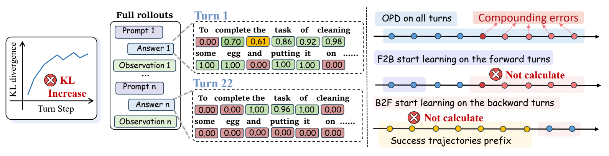

左侧先提出多轮误差问题，中间放大回复细节，右侧对齐训练范围。读序是“哪里出问题 → 改哪一段”，不是先背模块名。左侧曲线是示意；细节数值与颜色含义要结合原图注读。这里学习信息组织，不照搬原图的字号和配色。

Read from the multi-turn error problem to response details and the compared training ranges. The left curve is schematic; consult the original caption for the numeric blocks and color meanings. This example illustrates information order, not a universal font or palette.

Jiaqi Wang et al., TCOD, arXiv:2604.24005v3, Fig. 1. CC BY 4.0. 从原页裁切；图形与数据未改。 [原论文](https://arxiv.org/abs/2604.24005v3) · [许可](https://creativecommons.org/licenses/by/4.0/)

#### framework：读者看懂怎么做

- **真实流程：**画清每步的输入、操作、输出，箭头连到实际接收者。并行就并行，反馈就反馈；模块名与正文一致。

中：任务与证据进入核查器；核查结果进入规划器；生成的计划再交给评价器。

EN: The task and evidence enter the checker. The checked constraints enter the planner, and the generated plan goes to the evaluator.

- **信息边界：**输入、输出、评价规则分组并区分边框。仅供评价的 rubric 不画进被测模型。用必要案例解释关键操作；同一案例只在论文里完整展示一次。

中：蓝色虚线框是模型可见输入，灰绿实线框是输出；评价器另收冻结的评分规则。

EN: Blue dashed boxes denote model-visible inputs and green-gray solid boxes denote outputs. The evaluator separately receives the frozen scoring criteria.

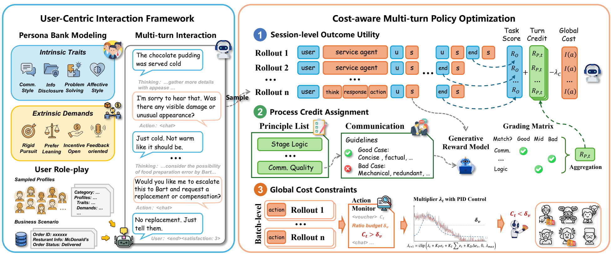

这张图先分交互生成和策略优化两块：左侧用对话走流程，右侧分结果效用、过程信用和成本信号。大框讲职责，箭头讲数据去向，编号讲步骤。自己的图先写清每个框收到什么、交出什么，再加图标。

The figure separates interaction generation from policy optimization. A dialogue traces the left side; outcome utility, process credit, and cost signals organize the right. Groups explain responsibilities, arrows show information flow, and numbers order the steps.

Ning Gao et al., Reinforcing Real-world Service Agents, arXiv:2602.22697v1, Fig. 1. CC BY 4.0. 从原页裁切；图形与数据未改。 [原论文](https://arxiv.org/abs/2602.22697v1) · [许可](https://creativecommons.org/licenses/by/4.0/)

#### 绘图铁律：这些错别犯

- **配色：**白底，面板接近白色，文字和刻度保持深色。同对象全篇同色，再配点形、线型或纹理；低饱和不是糊一层灰。

中：基线用灰色圆点，本文方法用灰蓝菱形；颜色变淡，文字不跟着变淡。

EN: Use gray circles for the baseline and muted blue diamonds for the proposed method. Keep the text dark on pale backgrounds.

- **字号与字体：**按最终栏宽起稿，图内所有字同字号、同字体家族；范围为正文减 2 pt 至正文，标题、轴、图例、注释都算。以论文 PDF 的实测字号为准，放不下先重排，不缩字硬塞。

中：正文实际为 10 pt，图内字用 8–10 pt；在论文整页大小下读，不只看放大的 PNG。

EN: With 10 pt body text, use 8–10 pt figure text and inspect it at its final size in the paper, not only in a magnified PNG.

- **布局：**一个主读序，同层成组并命名；并行先汇合，反馈另走清楚的路径。通栏约 16:9、单栏约 4:3 起排，附录可纵排。连图注一起查占高，不拉扁图、不改论文模板。

中：两个并行输入先汇合再进入模型；长解释移到图注，关键输入保留在图里。

EN: Merge parallel inputs before the model. Move long explanations to the caption while retaining the essential inputs in the figure.

- **结果图：**从真实数据绘制。轴写变量和单位，图例解释颜色与线型，误差条写 SD、SE 或 CI 及计算单位；同类图共用尺度。

中：纵轴写成功率（%）；误差条若是跨运行标准差，就别写成 95% 置信区间。

EN: Label the y-axis as success rate (%). If error bars show standard deviations across runs, do not label them as 95% confidence intervals.

- **图注：**短句说明图在回答什么、怎么读、结果支持什么。简称给全称；必要的分母、范围、误差含义保留。方法图讲机制，结果图才讲实测发现。

中：该图比较同一测试集上的成功率与推理成本；点表示方法配置。

EN: The figure compares success rate and inference cost on the same test set; each point represents a method configuration.

- **箭头与信息边界：**每条箭头都对应真实产物和接收者，别穿字、交叉或乱连。输入、输出、评价规则用三种边框；只供评价的 rubric 不接到模型。

中：核查结果交给规划器；评分规则只交给评价器。

EN: Checked constraints go to the planner; scoring criteria go only to the evaluator.

- **标签与图标：**缩写、符号、颜色、边框和图标就近解释。图标旁写对象名；别让读者猜这个机器人到底是谁。

中：机器人标为 Planner；虚线箭头注明 Feedback。

EN: Label the robot as Planner and dashed arrows as Feedback.

- **案例：**保留必要背景、关键请求、证据和输出，注明实测或作者示例。同一来源的案例只完整展示一次，改名、翻译或裁剪也算同一个。

中：图 1 展示案例，第 4 节回引图 1。

EN: Present the case in Figure 1 and refer back to it in Section 4.

- **PDF 导出：**统计图导出矢量 PDF；生成底图的标签另排原生、可见、可选文字。截图装进 PDF 仍是位图，隐藏 OCR 层也不算排好字。

中：实际选中图内标签，核对字体和缩放后的字号。

EN: Select the labels in the manuscript PDF and verify their font and final size.

- **改图范围：**只改颜色就保留文字、布局、照片、公式、字号和连线。原始数据、实验和合作者的图别顺手改。

中：只换底色，保留坐标与箭头端点。

EN: Change only the fills; retain all coordinates and arrow endpoints.

- **最终验收：**编译后在正常阅读大小查字号、碰撞、裁切、图注和首次引用顺序。CS 默认 [!t]；源码顺序对了，还要看实际 PDF。

中：图 1 先引用，就检查它是否真的先出现在 PDF。

EN: If Figure 1 is cited first, verify that it actually appears first in the PDF.

**给 Codex 的绘图说明单**

```text
先读 paperbank-figures/SKILL.md，再填：
图的用途：【mainfig／framework／结果图】
要讲清的贡献或问题：【】
输入、操作、输出及真实依赖：【】
案例来源／原始数据／比较条件：【】
必须保留的文字、变量、单位和图例：【】
论文插入宽度／正文实际字号／已确认色板：【】
先给布局，再出图；按最终 PDF 大小检查文字、连线与图注。结果图只从所附数据绘制。
```

教学例：mainfig 用一个约束冲突说明动机；framework 用另一个案例走完证据核查与计划生成；结果图比较同一批任务的成功率和成本。

Teaching example: The main figure motivates the work with a constraint conflict. The framework traces evidence checking and plan generation on a different case. Result plots compare success and cost on the same tasks.

Review the figures with coauthors before polishing the body. They should explain the motivation, the method, and the findings. Styling cannot repair an unclear workflow.

### 1.3 整理章节、实验和表格

“要做到光看章节名称能看懂你的论文” 同一级的信息放一起，下一节接上一节的产物。标题不是代码目录。

#### 章节顺序与承接

- **先列职责：**列全部 section 标题、每节目的、所需图表和预计篇幅。Related Work 按主题归类；Method 按真实处理依赖；Experiments 按要检验的问题。

中：Related Work 的“约束规划”小节归纳已有能力，再落到 Intro 中的约束遗漏。

EN: A Related Work subsection on constrained planning summarizes existing capabilities, then returns to the omission problem stated in the Introduction.

- **Method overview：**开头承接 Intro 的困难，串起输入、操作、输出和对应小节；最后引用 framework。章节名是阅读位置，别把章节标题写成执行模块。

中：为减少约束遗漏，我们先检索证据（证据检索节），再用检索结果核查约束（约束核查节），最后据此生成计划（计划生成节）。

EN: To reduce omitted constraints, we first retrieve evidence (Evidence Retrieval), use it to check constraints (Constraint Checking), and generate a plan from the checked constraints (Plan Generation).

- **篇幅：**按页数和贡献分配正文。同级小节任务量相近，篇幅也应接近；明显长的一节先查职责混杂和重复。复现细节放附录，关键比较条件留正文。超页先删重复文献配文和常规实现，别先砍最有说服力的实验分析。

中：Method 某节讲了核查、训练和评估三件事，先拆职责，不靠缩字号解决。

EN: If a Method subsection mixes checking, training, and evaluation, separate its responsibilities instead of shrinking the font.

**正文骨架与 overview 句式**

```latex
\section{Introduction}
\section{Related Work}
\subsection{[Theme linked to challenge A]}
\subsection{[Theme linked to challenge B]}
\section{Method}
To address [the specific challenge], we [operation] in
[First Section] (\S\ref{sec:first}), producing [output].
Using [that output], we [next operation] in
[Second Section] (\S\ref{sec:second}), producing [next output].
Figure~\ref{fig:framework} summarizes the workflow.
\subsection{[First Section]}\label{sec:first}
\subsection{[Second Section]}\label{sec:second}
\section{Experiments}
\subsection{Experimental Setup}
\subsection{Main Results}
\subsection{Ablation Studies}
\subsection{[Analysis of the remaining research question]}
\section{Conclusion}
```

这是起排骨架，按实际工作增删小节。方括号全部换成真实内容；framework 标签须对应实际图片。

#### 实验先整理成论证

- **问题与证据：**每项主张对应一个要检验的问题，再选对照、数据和图表。RQ 可以写，但不是给所有标题加一句问号。

中：主张“核查减少遗漏”，就比较同题、有核查与无核查的遗漏率，保持其他设置一致。

EN: To test whether checking reduces omissions, compare omission rates with and without checking on the same tasks under otherwise matched settings.

- **实验设置：**先说明数据与划分，再分别写 Metrics、Baselines 和 Implementation Details。指标给定义、方向和分母；基线给来源与配置；训练、推理预算和重复次数讲清。

中：成功率是满足全部任务约束的计划比例；基线与本文方法用同一测试集，分别说明推理预算。

EN: Success rate is the fraction of plans satisfying all task constraints. Evaluate the baseline and proposed method on the same test set and report their inference budgets.

- **实验顺序：**主结果回答整体是否有效；消融回答哪项设计有用；再按贡献安排成本、稳健性、迁移或失败分析。没有对应主张的实验，不必为了凑齐套餐硬加。

中：若声称更省计算，就同时报告成功率和成本；若只验证同域效果，就不写跨域泛化。

EN: A computational-efficiency claim requires both success and cost measurements. In-domain evidence alone does not establish cross-domain generalization.

- **结果段：**一句结论开头，接关键对照，再解释含义和范围。不要把表格逐行朗读一遍；均值更高也不自动等于显著提升。

中：核查后的提升主要出现在冲突条件下。接着引用该分组的对照，解释它怎样回应 Intro 的遗漏问题。

EN: The gains after checking are concentrated in conflicting conditions. Cite the subgroup comparison, then explain how it addresses the omission problem in the Introduction.

**给 Codex 的实验整理提示词**

```text
读取我的真实结果和 Intro 主张，按“研究问题 → 比较对象与固定条件 → 指标 → 图表 → 可支持的结论”整理。
先写 Experimental Setup，再排 Main Results、Ablation Studies 和必要分析。设置按 Metrics、Baselines、Implementation Details 分段。
每个结果段先给一句有证据的结论，再解释关键对照与范围。缺对照就说明还需什么，不补造结果，不用一个个案代替整体结论。
```

#### 表格：先让人看清比较

- **结构：**表承载实测结果和数据。模型按实际类型分组；列写指标、单位与好坏方向。三线表，少网格，同一指标保持精度一致。

中：方法名一列，成功率（%）一列，延迟（ms）一列；不同测试集分组，不混算平均。

EN: Use columns for method, success rate (%), and latency (ms). Separate test sets into groups rather than averaging incompatible results.

- **标记：**可比组内逐列判断：最优加粗，次优加下划线；需要时用很浅的底色。性能和成本方向不同，并列共享标记。颜色不能替你证明显著性。

中：成功率越高越好，延迟越低越好；两列分别找最优，不把本文整行全部涂红。

EN: Higher success and lower latency are better. Mark each column independently rather than highlighting the entire proposed-method row.

- **统计与排版：**均值与不确定性放同一行，表注写清重复次数及 SD、SE 或 CI。缺失用破折号并解释；长表先拆列或跨栏，不整表 resizebox。

中：70.0 上标 ±2.0 表示均值及标准差；“—”表示未测，不是 0。

EN: A mean of 70.0 with superscript ±2.0 denotes a mean and standard deviation. A dash denotes an unmeasured value, not zero.

排版示例：以下数值均为假设，不是论文结果。上标演示均值旁的标准差；浅红为最优，浅蓝为次优。

| Method | Success (%) ↑ | Latency (ms) ↓ |
| --- | --- | --- |
| Baseline A | 70.0 ±2.0 | 120 ±4 |
| Baseline B | 73.0 ±1.0 | 130 ±4 |
| Proposed method | 76.0 ±1.0 | 125 ±3 |

**可复制的 LaTeX 表格模板**

```latex
% Add these packages to the preamble if the venue permits them.
\usepackage{booktabs}
\usepackage[table]{xcolor}
\definecolor{bestcell}{HTML}{F2EBEA}
\definecolor{secondcell}{HTML}{EDF0F4}

% Insert this environment in the body.
\begin{table}[!t]
\centering
\caption{Illustrative values only. Success rate is in percent;
latency is in milliseconds. Superscripts illustrate standard deviations.
Best values are bold; second-best values are underlined.}
\label{tab:main-results}
\begin{tabular}{lcc}
\toprule
Method & Success ($\uparrow$) & Latency ($\downarrow$) \\
\midrule
Baseline A & 70.0\textsuperscript{\(\pm2.0\)}
 & \cellcolor{bestcell}\textbf{120}\textsuperscript{\(\pm4\)} \\
Baseline B & \cellcolor{secondcell}\underline{73.0}\textsuperscript{\(\pm1.0\)}
 & 130\textsuperscript{\(\pm4\)} \\
Proposed method & \cellcolor{bestcell}\textbf{76.0}\textsuperscript{\(\pm1.0\)}
 & \cellcolor{secondcell}\underline{125}\textsuperscript{\(\pm3\)} \\
\bottomrule
\end{tabular}
\end{table}
```

包声明放导言区，table 环境放正文；先确认会议模板允许这些包。正式表替换真实数据，并在表注写清统计单位、重复次数、实际可比范围及主要发现。跨栏时用 table*，不改模板栏宽。

教学例：Intro 提出约束遗漏；Method 解释核查器如何保留约束；主实验比成功率，消融检验核查器，失败分析说明哪些约束仍会漏。

Teaching example: The Introduction identifies omitted constraints. The Method explains how the checker retains them. Main results compare success, ablations test the checker, and failure analysis identifies remaining omissions.

Once the figures are settled, define the body outline. Each section has a purpose: motivation, prior work, the method, or evidence. Organize the argument before filling paragraphs.

### 1.4 理顺 Intro，中文审核后填正文

“针对这些问题，本方法做出了哪些改进，为什么这些改进能解决这些问题” 先把这条线用中文讲通，再整理英文；漂亮句子留到逻辑过关以后。

#### Intro 先按这条线排

- **第一段：背景与已有能力：**第一句进入研究方向，紧接实际价值，再概括现有路线及已做到的事。别从宇宙大爆炸写到你的模型。

中：约束规划将任务要求转成可执行计划。现有方法能生成候选方案，并通过搜索或反馈改进。

EN: Constrained planning turns task requirements into executable plans. Existing methods generate candidates and refine them through search or feedback.

- **第二段：具体问题：**说在哪种条件下、哪个对象出了什么问题，为什么已有做法还不够。用文献或动机实验支撑，别把前人写成什么都没做。

中：然而，在要求彼此冲突时，计划仍可能遗漏关键约束，使后续步骤不可执行。

EN: However, under conflicting requirements, plans may still omit critical constraints, leaving later steps infeasible.

- **第三段：对应设计：**逐个回应上一段的问题。用“为解决 X，我们做 Y，因此得到 Z”串起来；关键术语就近解释，别只报模块名。

中：为减少遗漏，我们在规划前核查每项约束的证据，并把已核实的约束交给规划器。

EN: To reduce omissions, we check the evidence for each constraint before planning and pass the verified constraints to the planner.

- **接着：主要发现：**设计后紧接关键实验发现：和谁比、在什么条件下、支持哪项贡献。只写真实结果，别把“我们做了大量实验”当发现。

中：若实际结果支持：在相同测试任务下，核查减少了约束遗漏；消融说明这项收益来自核查环节。

EN: If supported by the actual results: On the same test tasks, checking reduces constraint omissions; the ablation attributes this gain to the checking step.

- **最后：贡献列表：**“一般第一句话是宏观贡献（解决了什么核心问题）” 随后写关键设计和亮眼发现。一条一个贡献，别把自己的流程复制三遍。 按真实贡献增删，长度接近。

中：我们设计一个规划前证据核查步骤，在生成前识别缺少支持的约束。

EN: We design a pre-planning evidence check that identifies unsupported constraints before generation.

**Intro 中文提纲提示词**

```text
根据我的真实材料，先只写中文 Introduction 提纲。
第一段：研究方向、实际价值、现有路线与能力。
第二段：具体条件下的不足及依据。每个问题都必须有后文设计回应。
第三段：对应设计；解释输入、操作、产物及为什么能回应问题。
接着：实际主要发现和比较范围；没有结果就不要写结果句。
最后：贡献列表，平行、简短，不把普通工程步骤包装成创新。
逐句检查前一句是否为后一句提供了对象或前提；把问题、设计与实验逐项对应。先让我看中文，再写英文。
```

#### 人工审核，再填全文

- **审顺序：**每次给你一节中文，先查问题有没有回答、操作能不能复现、证据够不够。定下全部 section 标题后，再组织英文写回去。

中：先看 Method 的中文流程；确认核查输出确实进入规划器，再润色英语。

EN: Review the Method workflow in Chinese first. Confirm that the checked constraints actually enter the planner before polishing the English.

- **审一致：**Intro 的问题、Related Work 的不足、Method 的设计、实验的结论用同一套对象和名称。摘要随后压缩这条线，别另讲一个故事。

中：全文都说“约束遗漏”；不要到实验突然换成“综合智能不足”。

EN: Use “constraint omission” consistently instead of switching to an unrelated “lack of general intelligence” claim in the experiments.

- **审篇幅与图表：**编译看真实页数、图字、表格溢出和首次引用顺序。超页先删重复和无关细节，保留比较条件；逐句精修再去第三章。

中：结果段重复了整张成绩表，就删逐行报分，保留关键差异及其含义。

EN: If the result paragraph repeats the entire score table, remove the row-by-row narration and retain the key difference and its meaning.

教学例：计划要同时满足多个条件；已有方法能生成计划，但冲突条件下会遗漏约束；因此先核查证据，再规划；随后用主结果与消融检验这项设计。

Teaching example: Plans must satisfy multiple conditions. Existing methods generate plans but can omit constraints when conditions conflict. We therefore check evidence before planning, and test this design with main comparisons and ablations.

The Introduction compresses the argument of the paper. Make the problem, design, and evidence clear in Chinese before drafting the English.

<a id="writing-skill"></a>
### PaperBank 写作 skill

下载 skill，交给 Codex 读取；按当前任务选规则。

[下载 ZIP](../assets/paperbank-writing-skill.zip) · [查看 SKILL.md](../skills/paperbank-writing/SKILL.md) · [写作铁律](#general-rules)

下载、解压，保留整个 paperbank-writing/ 文件夹，把它交给 Codex 读取；补上文件、任务和允许修改的范围。

**中文使用提示词**

```text
读取 paperbank-writing/SKILL.md，按本次任务选规则。材料：【稿件、结果、参考原文】。任务：【写哪节／检查什么】。允许修改：【文件和范围】。先列主要问题、依据和改法，再修改。保留数据与实验设置；引用和结果回查原文，缺证据直接指出。只读任务不改文件。
```

**English usage prompt**

```text
Read the supplied paperbank-writing/SKILL.md and select the rules in references/checklist.md that apply to this task. Check the current manuscript's research questions, contributions, and evidence first. Distinguish facts, hypotheses, and unfinished work; then check terminology, inputs and outputs, figures, and reviewer responses when relevant. Preserve the original data, experimental settings, and records. Work only within the files and scope I specify. For a reading-only task, provide advice and excerpts without editing files. Identify missing evidence rather than inventing citations, results, or completion status. Explain the main issues, supporting evidence, and minimal fixes, then make authorized changes.
```

<a id="figures"></a>
## 2. 光速出美图

“Less is more. 一个图画太久了一定是过于复杂了，先花时间简化” 先定这张图要突出哪项贡献，再画。

以下是 PaperBank 面向 CS 论文的默认约定，会议硬性要求和当前稿件已确认的配置优先。参考图用来学信息组织，不照搬它的字号、色板或数据。

<a id="figure-skill"></a>
### 先给 Codex 绘图 skill

[下载绘图 skill ZIP](../assets/paperbank-figures-skill.zip) · [查看 SKILL.md](../skills/paperbank-figures/SKILL.md) · [绘图铁律](#figure-rules)

解压后把整个 paperbank-figures/ 文件夹交给 Codex，再附稿件、原始数据、参考图和允许修改的文件。先给材料，再给它发挥；空手也画不出你的实验。

**复制给 Codex：开始画图**

```text
读取 paperbank-figures/SKILL.md。图的用途：【mainfig／framework／结果图／案例图】；材料：【稿件、原始数据、参考图】；允许修改：【文件】；最终插入宽度：【mm】；正文实测字号：【pt】；已确认色板：【】。先写图要回答的问题，列清输入、操作、输出和每条箭头的真实依赖，再给布局。统计图只从所附数据绘制；概念图按环境使用 imagegen。按绘图铁律检查字号、配色、图例、图注和最终 PDF，修好再交图。
```

**Figure prompt · English**

```text
Read paperbank-figures/SKILL.md. Figure type: 【main figure / framework / quantitative chart / case】. Materials: 【manuscript, original data, references】. Editable files: 【】. Final width: 【mm】. Measured body font size: 【pt】. Approved palette: 【】. State the question first, then specify inputs, operations, outputs, and the real dependency behind every edge. Propose the layout before rendering. Plot quantitative results only from the supplied data. Check labels, fonts, colors, the caption, and the final manuscript PDF against the figure rules.
```

<a id="figure-rules"></a>
### 绘图铁律：这些错别犯

- **别让一张图讲所有事：**“motivation + observation” mainfig 先让人看见问题与发现，framework 解释设计如何对应问题，结果图给证据。一张图一个主任务。

Show where the existing pipeline fails and which step our method changes.

画清旧流程在哪一步出问题，我们改了哪一步。


[原图与拆解](#visual-tcod-fig-1)

- **别等正文定稿才画图：**“这两个部分先写/润色，缺的话就补” 先让框架图和实验能被合作者审，再精修正文。看不出贡献，先改内容，别急着换色。

Panel (a) shows the observed gap; panel (b) tests the proposed repair.

(a) 展示实际缺口；(b) 检验我们的修补。

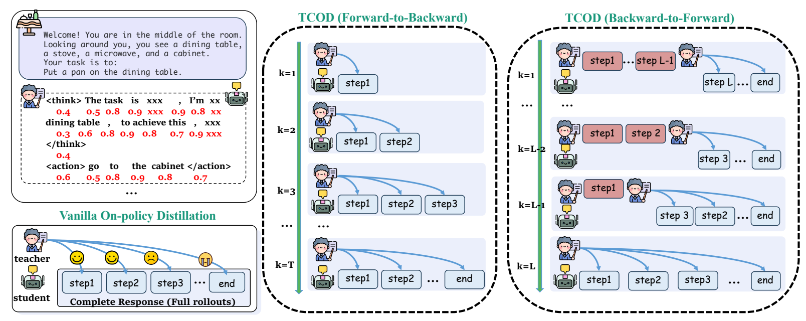
[原图与拆解](#visual-tcod-fig-3)

- **别让 AI 编实验曲线：**统计图用 Python 从真实数据绘制；imagegen 用于动机、框架和案例图。缺数据就停，不补点、不编误差、不为平滑改曲线。

Draw the recorded success rates with Python. Generate only the workflow illustration with imagegen.

成功率用 Python 按记录画；imagegen 只生成流程示意。


[原图与拆解](#visual-interactcs-fig-1)

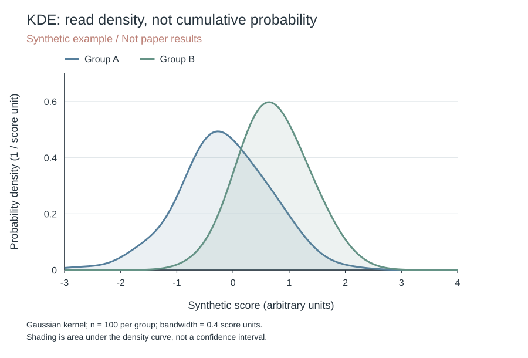
[原图与拆解](#teaching-kde)

- **别看放大 PNG 判断字号：**按最终栏宽排字，字体与正文一致；所有图内字同一字号，介于正文与正文减 2 pt 之间，标题也不能更大。放不下先重排，不把字缩成蚂蚁。

Use the paper’s column width and body font; remove repeated labels rather than shrinking text.

用论文栏宽和正文字体；删重复标签，不把字缩成蚂蚁。


[原图与拆解](#visual-tcod-fig-3)

- **别用箭头改写真实流程：**同层成组并命名；先后、并行、汇合、反馈按真实依赖画。每条箭头说清传什么，起止明确，不穿字、不绕远路。

Retrieved passages enter the generator; the evaluator receives the generated answer.

检索段落送给生成器；生成的回答交给评价器。


[原图与拆解](#visual-interactcs-fig-1)

- **别把评分规则画成模型输入：**输入、输出、评价规则用三种边框区分，并给图例。只供评价的 rubric 不连到被测模型；不同模型收到不同材料，也要标清。

Dashed boxes contain model inputs; solid boxes contain responses; dotted boxes contain evaluator-only criteria.

虚线框是模型输入，实线框是回复，点线框是只供评价的判据。


[原图与拆解](#visual-interactcs-fig-1)

- **别把低饱和画成一层灰雾：**“自己的创新点要用彩色/亮眼的颜色突出，让人能一眼注意到。” 常规模块可用中性灰，关键改动用统一强调色；低饱和不等于满图灰雾。

Blue circles denote the baseline; orange triangles denote our method in every panel.

每个面板都用蓝圆点表示基线，橙三角表示我们的方法。

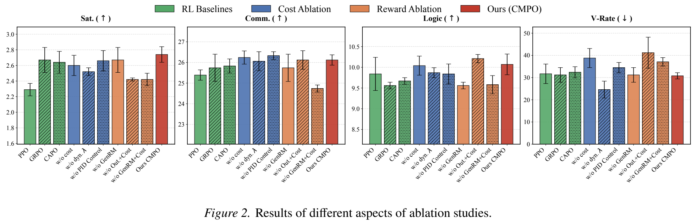
[原图与拆解](#visual-interactcs-fig-2)

- **别扔一整块对话让人读：**一轮一框，注明角色；同一轮长回复按语义分段，不伪装成多轮。高亮只标关键约束、证据或错误，颜色含义要能读懂。

The left column contains evidence; the right column shows the model response and its evaluation.

左栏放证据；右栏放模型回复和评价。

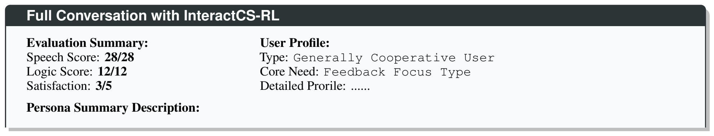
[原图与拆解](#fig-interactcs-case)

- **别把同一案例复制三遍：**同一来源的案例在全文只完整呈现一次，其他位置交叉引用。改名、翻译、裁剪也算同一个；必要对照集中展示，别靠一个 case 证明总体效果。

Figure 1 presents the case; Section 4 refers back to Figure 1 without repeating the dialogue.

案例放图 1；第 4 节回引图 1，不再抄一遍对话。


[原图与拆解](#fig-interactcs-case)

- **别每个子图换一套尺度：**围绕一个问题排现象、诊断、对照和稳健性；同条件同顺序、同配色，同类轴和色标保持可比。

The first panel identifies the gap, the second locates it, and the third tests whether it persists.

第一图找差距，第二图找发生位置，第三图检验差距是否仍在。

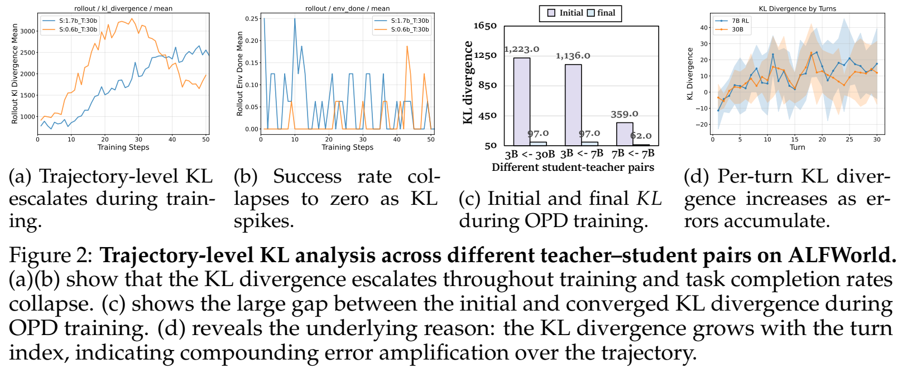
[原图与拆解](#visual-tcod-fig-2)

- **别靠断轴制造胜利：**查单位、分母、方向、坐标起点和误差类型；截断坐标要明确标出。相对增益同时给绝对值，柱长和数值必须对应。

Accuracy rises from 60% to 66%: 6 percentage points, or a 10% relative increase.

准确率从 60% 到 66%：增加 6 个百分点，相对提高 10%。

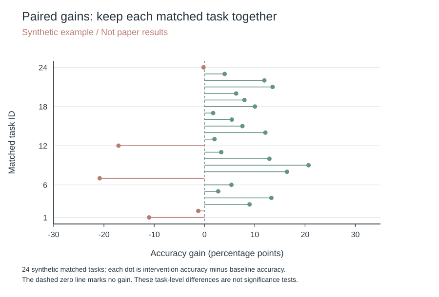
[原图与拆解](#teaching-paired-gain)

- **别把图注写成画法说明：**图注先说读法和发现，再点出与贡献的关系；图中的简称在 Caption 给全称。“让人留下印象” 靠有依据的结论，不靠“效果显著”四个字。

Error bars show 95% question-level bootstrap intervals; the horizontal line marks zero gain.

误差条表示按题目重采样的 95% 区间；水平线表示零增益。

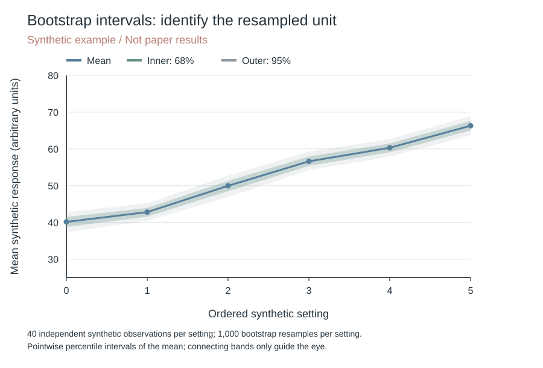
[原图与拆解](#teaching-confidence)

- **别把编译通过当作图没问题：**放回论文检查实际字号、字体嵌入、可选文字、裁切、碰撞、图注总高度和首次引用顺序。源码字号正确，不代表插入后仍正确。

Place the figure after its first mention and check all labels at normal reading size.

按首次引用顺序排图，以正常阅读大小检查全部文字。


[原图与拆解](#visual-tcod-fig-1)

- **别省输入和输出：**每个关键模块写清收到什么、做什么、交出什么，以及交给谁。模块名与 Method 一致，别让图成为缩写接龙。

The checker receives evidence and returns supported constraints to the planner.

核查器接收证据，把已支持的约束交给规划器。


[原图与拆解](#visual-interactcs-fig-1)

- **别只留图标、缩写和颜色：**图标旁写对象名；新缩写、符号、边框、线型和数字就近解释。读者只看图与图注，应知道每个标记指什么。

Label the robot as the planner and define dashed edges as feedback.

机器人标为规划器，虚线箭头定义为反馈。


[原图与拆解](#visual-interactcs-fig-1)

- **别让 framework 变成模块名单：**“结合 case 去绘制你的流程” 展示一个真实输入怎样变成中间产物和输出，旁边点出设计解决的困难。节点多不等于贡献多。

Trace one task from the evidence input through checking to the final plan.

用同一个任务走完证据输入、核查和最终计划。


[原图与拆解](#fig-interactcs-case)


[原图与拆解](#visual-interactcs-fig-1)

- **别把示意画成实测：**估计、作者示例和实测输出分清；可选路径不能画成必经步骤。框的面积、线宽和箭头不能暗示没有证据的比例或因果，别指望图注替错误图形擦屁股。

Keep illustrative module boxes equally sized; plot measured latency on a labeled axis.

示意模块框不靠大小表示耗时；实测延迟另用带坐标的图展示。

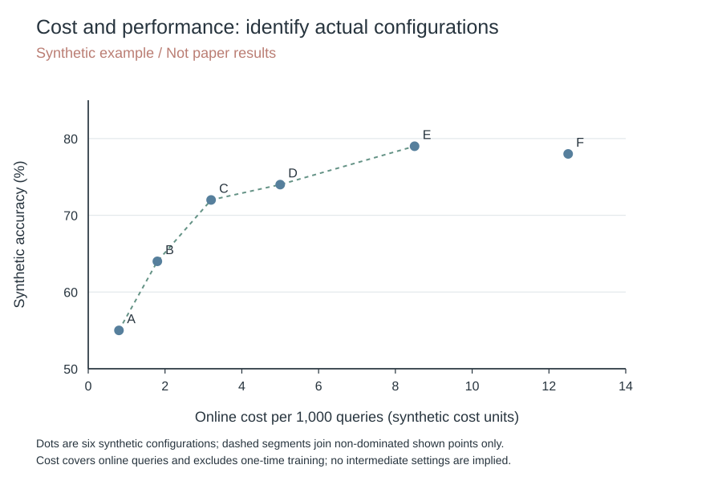
[原图与拆解](#teaching-cost)

- **别拿截图 PDF 冒充矢量：**统计图导出矢量 PDF 并嵌入字体。生成底图上的标签另排原生、可见、可选的 PDF 文字；不留重叠字形，不加隐藏 OCR 层。混合 PDF 仍含位图。

Export the plot as vector PDF and verify that its axis labels can be selected.

统计图导出矢量 PDF，再实际选中坐标轴文字检查。


[原图与拆解](#visual-tcod-fig-3)

- **别说只改色，顺手把内容改了：**只改配色就保留布局、文字、换行、字号、公式、照片和连线；重排须在约定范围内。数据、实验和合作者的图也别顺手动。

Change panel fills while retaining every label, coordinate, and arrow endpoint.

只换面板底色，保留所有标签、坐标和箭头端点。


[原图与拆解](#visual-interactcs-fig-2)

- **别改论文模板给图腾地方：**按实际栏宽起稿，不改页边距、正文字号或页面方向。正文通栏约 16:9、单栏约 4:3 是起点，附录可纵排；不拉扁图。CS 默认用 [!t]，再按正文首次引用检查实际落点。

Rearrange parallel branches within the column width; keep the paper template unchanged.

在栏宽内重排并行分支，保留论文模板。


[原图与拆解](#visual-tcod-fig-1)

- **别把说明文字塞进表格：**PaperBank 默认表格只放真实结果或数据。术语、方法、实验计划和案例点评写正文，不截成图片绕过去；统计数字也不能把说明表变成实验结果。

Put success rates in a table and explain the checking procedure in the text.

成功率放表格，核查流程写正文。


[原图与拆解](#visual-interactcs-fig-2)

- **别拿白块盖住重叠：**图例、标题、刻度和注释不能挡数据、箭头或边框。给文字留空间，重排碰撞处；不是盖住就算修好了。

Move the legend outside the plotted curves while preserving the data and axes.

把图例移出曲线区，保留数据和坐标轴。


[原图与拆解](#teaching-kde)

### 按图的任务选模板

- **摘要图：**问题在哪、为什么现有解法不够、我们动哪一步。通常最多 5 个环节，必要对照并排。

Show the problem, the existing limitation, and the changed step.

展示问题、已有解法的缺口和我们改动的步骤。


[原图与拆解](#visual-tcod-fig-1)

- **框架图：**输入是什么，经过哪几个模块，每步产物交给谁，输出是什么。旁边走一个可追踪例子。

Given a query, retrieve passages, rank evidence, and generate an answer with cited support.

输入问题，检索段落，筛选证据，再生成带来源的回答。


[原图与拆解](#visual-interactcs-fig-1)

- **案例图：**“不同highlight颜色表示不同类型的信息” 白底保留必要背景、需求、证据、动作与结果；输入、模型输出、judge 用可解释边框，位置表示真实层级。

Separate the request, evidence, response, and evaluation.

把请求、证据、回复和评价分开。


[原图与拆解](#fig-interactcs-case)

- **主结果与消融：**少量方法用点图或柱图；完整方法与删组件版本同顺序、同配色。说明误差的统计单位和计算方法。

Compare the complete model with variants that remove one component.

完整方法与只删除一个组件的变体对照。


[原图与拆解](#visual-interactcs-fig-2)

- **配对增益：**同一样本的干预与对照，画差值和零线；写清收益方向与尺度。

Each point shows the intervention-minus-control accuracy on matched questions.

每个点表示同一批题目上干预相对对照的准确率差。


[原图与拆解](#teaching-paired-gain)

- **训练或轮次动态：**折线只连有序变量；横轴写训练步数或轮次，不把无序方法连成趋势。

Track success rate and penalty magnitude against the same training steps.

用相同训练步数同时追踪成功率和惩罚强度。

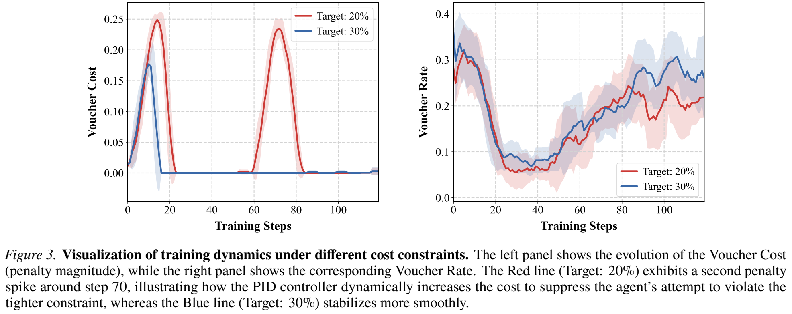
[原图与拆解](#visual-interactcs-fig-3)

- **KDE：看分布形状：**横轴是变量，纵轴是密度；颜色跟组走，均值线补位置，交代样本量和带宽。峰高不是人数，也不是累计比例。

Compare density shapes with a shared bandwidth; mark sample counts and mean values.

统一带宽比较密度形状，并标样本量与均值。


[原图与拆解](#teaching-kde)

- **ECDF：看阈值以下有多少：**横轴取阈值，纵轴直接读累计比例；同一坐标比两组，阶梯从 0 到 1。想读“多少样本低于 10”，别去量 KDE 的峰。

At a threshold of 10, the ECDF gives the fraction of observations at or below 10.

阈值取 10 时，ECDF 直接给出不超过 10 的样本比例。

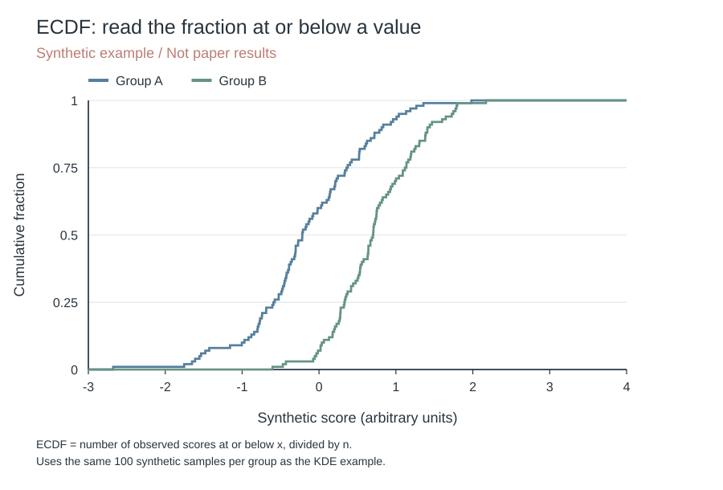
[原图与拆解](#teaching-ecdf)

- **热图：**条件乘方法，统一色标；正负增益以零为中点，缺测留空并说明。

Use one shared color scale for all conditions and mark missing cells.

全部条件使用统一色标，缺测单元明确标记。

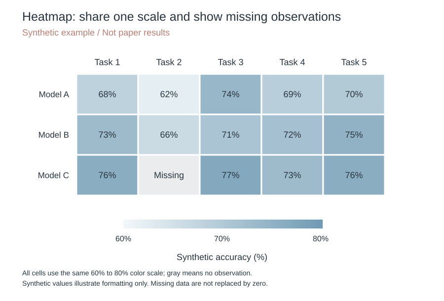
[原图与拆解](#teaching-heatmap)

- **PCA：把高维关系投到二维：**“利用空间位置关系绑定数据，更换不同的颜色呈现不同属性” 同时交代特征、标准化与解释方差。分得开不等于泛化好；PaCMAP、t-SNE 不叫 PCA。

Project standardized features onto two principal components and report the variance explained by each axis.

把标准化特征投到两个主成分，并报告每根轴的解释方差。

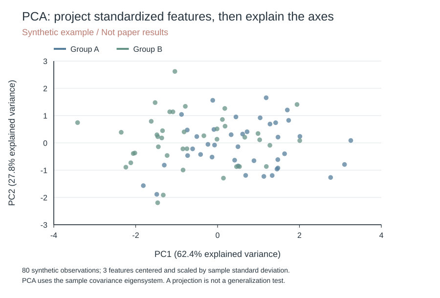
[原图与拆解](#teaching-pca)

- **雷达图：多指标逐轴读：**每轴一个指标，写尺度、归一化和好坏方向；颜色再配点形。量纲不同别比面积，轴换个顺序，面积也会换。

Compare normalized metrics spoke by spoke; polygon area is not an overall score.

沿每根轴比较归一化指标；多边形面积不是综合分数。

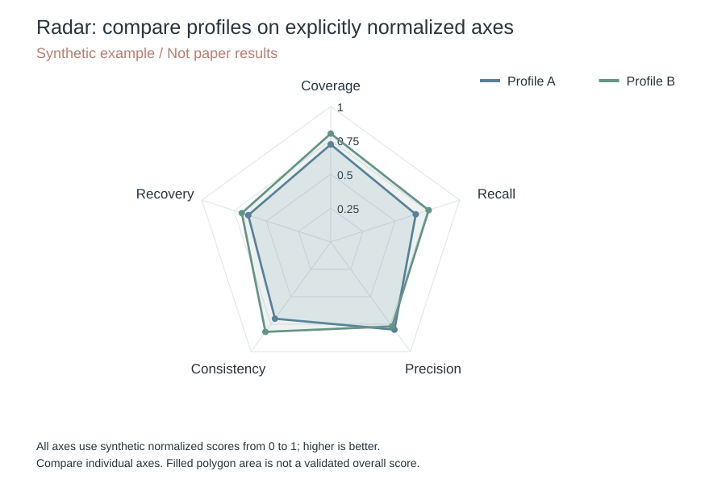
[原图与拆解](#teaching-radar)

- **成本性能图：**每点是一个实际配置；在线与离线成本分开，写单位和好坏方向。连接前沿不意味着有中间配置。

Plot measured accuracy against online cost; report one-time training cost separately.

实测准确率对照在线成本；一次性训练成本另报。


[原图与拆解](#teaching-cost)

- **数据集分布：**统计单位、样本量、类别和分母先写清；同一图别混案例数、回复数和判据数。重点是覆盖了什么，不是圆画得多圆。

Count unique cases by domain; report response counts separately.

按领域统计独立案例数；回复数量另报。

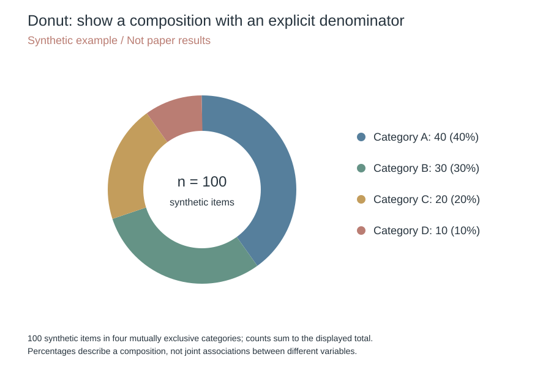
[原图与拆解](#teaching-donut)

- **置信带：**按实际重采样或模型计算区间，写清区间类型和置信水平。同一估计的嵌套区间才可比较覆盖范围；不同样本量、方差也会改变带宽。

Nested bands show the estimated 68% and 95% intervals under the stated procedure.

嵌套色带表示按所述方法估计的 68% 和 95% 区间。


[原图与拆解](#teaching-confidence)

- **饼图、环图与圆环排名：**饼图只画互斥且组成整体的比例；圆环柱图可画排名，极值相邻只是环形排序，不是变量关系。要读精确差值，横向条图更方便。

Use slices for a composition and ordered bars for a ranking.

组成比例用扇区；排名用有顺序的柱条。


[原图与拆解](#teaching-donut)

- **二维增益与九宫格：**“可以用这种九宫格来分类，好处是可以看出两个渐进的变化” 两轴写指标、单位和好坏方向；差值图以零线分区，别为了九格补数据。

With both gains defined as higher is better, the upper-right quadrant shows improvements on both metrics.

两个增益都定义为越高越好时，右上象限表示两项指标都改善。

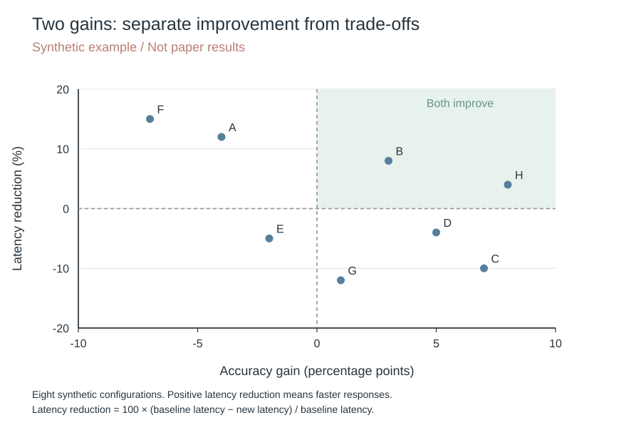
[原图与拆解](#teaching-two-gain)

### 图例库：原图与逐图拆解


<details><summary>动机与框架 · 3 张图</summary>


<a id="visual-tcod-fig-1"></a>
#### 问题和解法放在同一张图

左边画误差随轮次的示意，中间放大回复细节，右边对照三种训练范围；先看到问题，再看到改哪一步。


Jiaqi Wang et al., TCOD, arXiv:2604.24005v3, Fig. 1. CC BY 4.0. 从原页裁切；图形与数据未改。

A schematic turn-wise divergence trend appears on the left, enlarged response details in the center, and three training ranges on the right, linking the problem to the changed step.

颜色、文本框和时间线分别承担不同信息，关键对照沿同一个方向阅读。

示意曲线不等于实测数据；数值块代表什么、为什么某些轮次不计算，须回到原图注解释。

来源：[TCOD: Exploring Temporal Curriculum in On-Policy Distillation for Multi-turn Autonomous Agents · arXiv:2604.24005v3, Fig. 1, PDF p. 2](https://arxiv.org/abs/2604.24005v3)

[图片许可](https://creativecommons.org/licenses/by/4.0/)

<a id="visual-tcod-fig-3"></a>
#### 对照图要对齐改动

基线和两种课程共用步骤框与师生图标，再沿轮数展开；读者直接看训练覆盖哪一段，不必重读三套流程。


Jiaqi Wang et al., TCOD, arXiv:2604.24005v3, Fig. 3. CC BY 4.0. 从原页裁切；图形与数据未改。

The baseline and two curricula reuse step boxes and teacher–student icons, then unfold across rounds; aligned structures reveal which segment each training strategy covers.

共享图形语法，只有变动位置需要额外解释；比三个完全不同的布局更容易比较。

步骤色彩与轮数标签要在原图注中定义，图标本身不解释损失或训练目标。

来源：[TCOD: Exploring Temporal Curriculum in On-Policy Distillation for Multi-turn Autonomous Agents · arXiv:2604.24005v3, Fig. 3, PDF p. 5](https://arxiv.org/abs/2604.24005v3)

[图片许可](https://creativecommons.org/licenses/by/4.0/)

<a id="visual-interactcs-fig-1"></a>
#### 大框先分两块，小框再编号

先分交互生成和策略优化两块，再编号结果、过程、成本三种信号；旁边的对话走一遍流程。


Ning Gao et al., Reinforcing Real-world Service Agents, arXiv:2602.22697v1, Fig. 1. CC BY 4.0. 从原页裁切；图形与数据未改。

Group interaction generation and policy optimization first, then number the outcome, process, and cost signals. The dialogue traces an instance through the workflow.

分组讲职责，箭头讲信息流，编号讲步骤。

原图用公开论文中的对话示例；自己的案例须处理身份信息，并区分输入、输出与评分信号。

来源：[Reinforcing Real-world Service Agents: Balancing Utility and Cost in Task-oriented Dialogue · arXiv:2602.22697v1, Fig. 1, PDF p. 4](https://arxiv.org/abs/2602.22697v1)

[图片许可](https://creativecommons.org/licenses/by/4.0/)

</details>


<details><summary>诊断与训练动态 · 4 张图</summary>


<a id="visual-tcod-fig-4"></a>
#### 效果曲线旁边放机制曲线

成功率和 KL 共用训练步数，效果与诊断可以就近对照；曲线一起变，不等于已经证明因果。

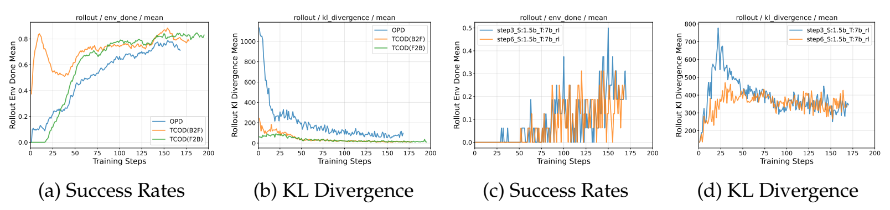

Jiaqi Wang et al., TCOD, arXiv:2604.24005v3, Fig. 4. CC BY 4.0. 从原页裁切；图形与数据未改。

Performance and KL share a training axis, placing the outcome beside its diagnostic. Co-movement alone does not establish causation.

同一模型配一对面板；不同量各用自己的纵轴。

原图图例用了训练日志简写，自己的论文应换成可直接识别的模型和条件。

来源：[TCOD: Exploring Temporal Curriculum in On-Policy Distillation for Multi-turn Autonomous Agents · arXiv:2604.24005v3, Fig. 4, PDF p. 8](https://arxiv.org/abs/2604.24005v3)

[图片许可](https://creativecommons.org/licenses/by/4.0/)

<a id="visual-tcod-fig-5"></a>
#### 辅助指标分开画

轮数、优势、长度、损失各占一格；共用训练步数，不同单位不挤在一根纵轴上。

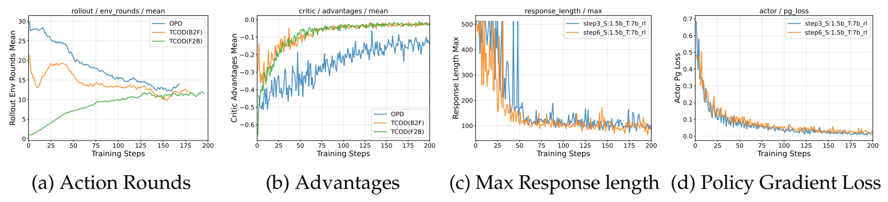

Jiaqi Wang et al., TCOD, arXiv:2604.24005v3, Fig. 5. CC BY 4.0. 从原页裁切；图形与数据未改。

Turns, advantage, length, and loss use separate panels with a shared training axis. Different units do not compete on one y-axis.

按同一时间点横向核对过程指标。

这是训练诊断；损失下降本身不能替代最终任务实验。

来源：[TCOD: Exploring Temporal Curriculum in On-Policy Distillation for Multi-turn Autonomous Agents · arXiv:2604.24005v3, Fig. 5, PDF p. 9](https://arxiv.org/abs/2604.24005v3)

[图片许可](https://creativecommons.org/licenses/by/4.0/)

<a id="visual-tcod-fig-2"></a>
#### TCOD：四幅图围着一个诊断

每个师生组合紧挨着放 Initial／final 两根柱子，颜色区分阶段，柱顶数字省掉来回读轴。


Jiaqi Wang et al., arXiv:2604.24005v3, Fig. 2. CC BY 4.0. 从原 PDF 裁切；图形与数据未改。

Initial and final bars sit together for each student–teacher pair; colors identify stages and value labels reduce axis lookup.

横

轴

箭

头

写

出

配

对

方

向

。

纵

轴

从

5

0

起

而

非

0

，

能

读

标

注

数

值

，

但

不

能

直

接

以

柱

高

判

断

初

始

值

是

最

终

值

的

多

少

倍

。

原

件

含

水

印

。

来源：[Jiaqi Wang et al. · arXiv:2604.24005v3 · Fig. 2](https://arxiv.org/abs/2604.24005v3)

[图片许可](https://creativecommons.org/licenses/by/4.0/)

<a id="visual-interactcs-fig-3"></a>
#### 训练动态：控制量和实际行为并排

左边画成本，右边画使用率，红蓝固定对应两种目标；共用训练步数，把两条动态放到一起读。


Ning Gao et al., arXiv:2602.22697v1, Fig. 3. CC BY 4.0. 从原 PDF 裁切；图形与数据未改。

Cost and usage rate appear side by side, with red and blue consistently identifying two targets along the same training-step axis.

图

中

带

半

透

明

色

带

，

但

此

图

面

未

说

明

它

是

方

差

、

标

准

误

还

是

置

信

区

间

，

不

能

自

行

补

名

。

原

件

跨

两

页

并

含

水

印

，

公

开

应

回

到

已

核

对

的

单

独

原

图

。

来源：[Ning Gao et al. · arXiv:2602.22697v1 · Fig. 3](https://arxiv.org/abs/2602.22697v1)

[图片许可](https://creativecommons.org/licenses/by/4.0/)

</details>


<details><summary>消融与资源成本 · 2 张图</summary>


<a id="visual-tcod-fig-6"></a>
#### 少量方法，用柱图直接比

两个任务各一幅图，方法顺序一致，柱顶给小时数。想讲省算力，就把时间写出来。

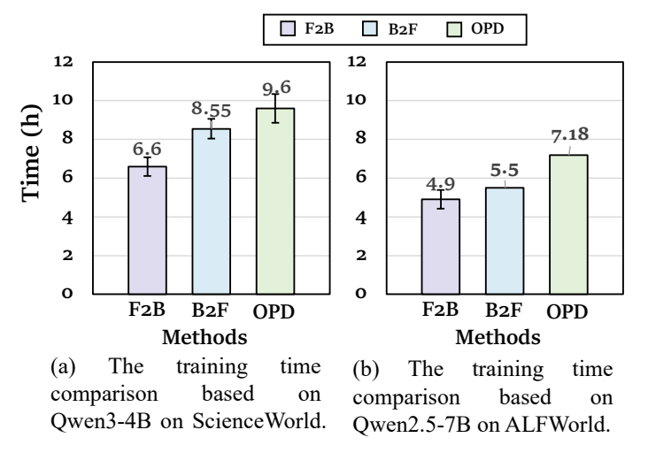

Jiaqi Wang et al., TCOD, arXiv:2604.24005v3, Fig. 6. CC BY 4.0. 从原页裁切；图形与数据未改。

Use one panel per task, a consistent method order, and measured hours above the bars. An efficiency claim needs a resource measurement.

单位是训练小时，不是在线推理延迟。比较时另交代硬件和训练条件。

原图误差线的含义没有给全，不替作者猜重复次数或置信水平。

来源：[TCOD: Exploring Temporal Curriculum in On-Policy Distillation for Multi-turn Autonomous Agents · arXiv:2604.24005v3, Fig. 6, PDF p. 10](https://arxiv.org/abs/2604.24005v3)

[图片许可](https://creativecommons.org/licenses/by/4.0/)

<a id="visual-interactcs-fig-2"></a>
#### 消融：颜色分组，纹理分方法

颜色分方法族，实色、斜线和点纹再分组内方案，四个面板共用图例，误差棒也留在柱顶。


Ning Gao et al., arXiv:2602.22697v1, Fig. 2. CC BY 4.0. 从原 PDF 裁切；图形与数据未改。

Colors identify method families, solid fills and patterns distinguish variants, and four panels share a legend while retaining error bars.

实

际

图

面

为

 

I

n

t

e

r

a

c

t

C

S

-

R

L

 

F

i

g

u

r

e

 

2

。

指

标

标

题

的

↑

／

↓

提

醒

比

较

方

向

；

图

面

未

定

义

误

差

棒

具

体

含

义

，

不

能

自

行

称

为

标

准

差

或

置

信

区

间

。

前

三

面

板

非

零

起

点

，

不

能

以

柱

高

读

倍

数

。

原

件

含

水

印

。

来源：[Ning Gao et al. · arXiv:2602.22697v1 · Fig. 2](https://arxiv.org/abs/2602.22697v1)

[图片许可](https://creativecommons.org/licenses/by/4.0/)

</details>


<details><summary>KDE 密度分布 · 1 张图</summary>


<a id="teaching-kde"></a>
#### KDE：看哪里密集，不是已经累计了多少

同一坐标对照两组模拟分数，曲线越高说明该处更密集；浅色填充只是曲线下面积。


PaperBank 原创教学图 · 模拟数据，非论文结果 · CC BY 4.0

The two synthetic groups share axes; taller curves indicate greater local density, and shading marks area under the curve.

每组100个模拟样本，使用高斯核和0.4的固定带宽；纵轴是密度。

曲线面积约为1，曲线高度不是累计比例；阴影不代表置信区间。

来源：[可复现教学绘图代码](../assets/generate-statistical-examples.py)

</details>


<details><summary>ECDF 累计分布 · 1 张图</summary>


<a id="teaching-ecdf"></a>
#### ECDF：直接读有多少样本不超过这个值

阶梯线在每个样本处上升，纵轴是已累计的样本比例；不用把平滑密度误认成覆盖率。


PaperBank 原创教学图 · 模拟数据，非论文结果 · CC BY 4.0

Each observed score raises the step curve, and the vertical axis shows the cumulative sample fraction.

与KDE使用同一批模拟样本，累计比例按样本计数直接计算。

在某个阈值比较两条线，读的是不超过阈值的比例，不是该处密度。

来源：[可复现教学绘图代码](../assets/generate-statistical-examples.py)

</details>


<details><summary>PCA / 空间嵌入 · 1 张图</summary>


<a id="teaching-pca"></a>
#### PCA：先定义输入，再看二维投影

两组模拟样本的三个标准化特征投到前两主成分，轴上直接给真实计算的解释方差。


PaperBank 原创教学图 · 模拟数据，非论文结果 · CC BY 4.0

Three standardized features from two synthetic groups are projected onto the first two principal components, with computed explained variance on the axes.

80个样本，三维特征先中心化，再除以样本标准差；主成分由协方差矩阵求得。

颜色是原分组，PCA没有使用分组训练；分得开不等于分类准确或泛化成立。

来源：[可复现教学绘图代码](../assets/generate-statistical-examples.py)

</details>


<details><summary>雷达与多指标 · 1 张图</summary>


<a id="teaching-radar"></a>
#### 雷达：看各项轮廓，别拿面积当总分

每根轴都是越高越好的0到1模拟分数，颜色贯穿点和线；逐项比较，比比较整块面积更有意义。


PaperBank 原创教学图 · 模拟数据，非论文结果 · CC BY 4.0

Every axis is a synthetic 0–1 score with higher values preferred; consistent point and line colors support axis-by-axis comparisons.

各轴同尺度、同方向，中心是0，外圈是1；真实图必须先说明如何归一化。

这张图没有定义综合分数，不能把多边形面积当作经过验证的总能力。

来源：[可复现教学绘图代码](../assets/generate-statistical-examples.py)

</details>


<details><summary>置信带 · 1 张图</summary>


<a id="teaching-confidence"></a>
#### 置信带：先认统计单位，再认内外两层

深线是模拟样本均值，内层是68%、外层是95%的逐点bootstrap区间；宽度有计算依据，不是调个透明度。


PaperBank 原创教学图 · 模拟数据，非论文结果 · CC BY 4.0

The line shows synthetic sample means; the inner and outer bands are computed 68% and 95% pointwise bootstrap percentile intervals.

每个设置有40个独立模拟观测，按观测有放回重采样1000次，再取均值分位数。

区间针对各个均值，不是覆盖整个函数的同时置信带，也不表示样本本身落在带内。

来源：[可复现教学绘图代码](../assets/generate-statistical-examples.py)

</details>


<details><summary>配对增益 · 1 张图</summary>


<a id="teaching-paired-gain"></a>
#### 配对增益：同一任务，直接看差了多少

每点是一项模拟任务的干预减基线，零线右侧提高、左侧下降；既显示收益，也留下失败。


PaperBank 原创教学图 · 模拟数据，非论文结果 · CC BY 4.0

Each point is the intervention-minus-baseline difference for a synthetic matched task; points right of zero improve, while points left of zero decline.

差值单位是百分点，不能写成相对百分比；每个任务保留自己的配对关系。

散点显示任务差异，没有检验显著性，也没有替代总体汇总。

来源：[可复现教学绘图代码](../assets/generate-statistical-examples.py)

</details>


<details><summary>热图 · 1 张图</summary>


<a id="teaching-heatmap"></a>
#### 热图：一个色标，缺测直接空出来

模型与任务交叉排，颜色和格内数值用同一尺度；缺测格单独写Missing，别伪装成零分。


PaperBank 原创教学图 · 模拟数据，非论文结果 · CC BY 4.0

Models and tasks share one color scale with values printed in each cell; the missing observation is labeled separately rather than replaced by zero.

全图同一60%到80%色标，不能每行各自归一化后继续比较颜色。

格内标数值，帮助读者在不辨色时仍能比较；灰色只表示缺测。

来源：[可复现教学绘图代码](../assets/generate-statistical-examples.py)

</details>


<details><summary>成本性能图 · 1 张图</summary>


<a id="teaching-cost"></a>
#### 成本性能：每个点对应一项明确配置

横轴是模拟在线成本，纵轴是准确率，每个字母是一项配置；虚线只连接已画出的有效取舍点。


PaperBank 原创教学图 · 模拟数据，非论文结果 · CC BY 4.0

Online cost and accuracy form the axes, and each letter identifies one synthetic configuration; dashed segments only connect the displayed non-dominated points.

成本按每1000次查询计，不混入一次性训练成本；真实图要另外报告后者。

连接点是阅读辅助，不证明中间配置存在，也不代表连续最优函数。

来源：[可复现教学绘图代码](../assets/generate-statistical-examples.py)

</details>


<details><summary>饼图与环图 · 1 张图</summary>


<a id="teaching-donut"></a>
#### 环图：组成比例，先说总数

中心写100个模拟对象，旁边同时列数量和比例；四类互斥，所有扇区合起来才是一个整体。


PaperBank 原创教学图 · 模拟数据，非论文结果 · CC BY 4.0

The center states 100 synthetic items and the legend lists counts and percentages; four mutually exclusive categories form the whole.

先给统计单位和分母，数量40、30、20、10真实相加为100。

环图适合看构成；精确比较相近比例，数值或横向条图更直接。

来源：[可复现教学绘图代码](../assets/generate-statistical-examples.py)

</details>


<details><summary>二维增益 · 1 张图</summary>


<a id="teaching-two-gain"></a>
#### 二维增益：右上都改善，其他象限看取舍

准确率增益向右更好，延迟减少向上更好；零线分四区，右上是两项同时改善。


PaperBank 原创教学图 · 模拟数据，非论文结果 · CC BY 4.0

Accuracy gains improve to the right and latency reduction improves upward; zero lines separate the quadrants, with joint improvements in the upper right.

横轴是百分点，纵轴是相对延迟减少百分比，两种单位明确分开。

每个点是构造的配置，不是论文结果；落在哪个象限只说明这两项指标的关系。

来源：[可复现教学绘图代码](../assets/generate-statistical-examples.py)

</details>


### 私藏图：好在哪里，怎么借鉴

先看原图，再看点评。借信息组织，不照搬别人的结果。

<a id="fig-interactcs-case"></a>
像 UI 一样分组；相同信息同框，避免每个字段都开气泡。

**案例摘要框：先分信息，再排字**

**公开论文图例 · 点评为本指南整理**

这是原论文案例摘要，不是完整对话，也不是新收集的真实用户记录。


The header names the case; two columns separate evaluation scores from the simulated user profile. The dialogue continues on later pages.
深色标题交代案例，浅底分栏列出评价和用户设定；完整对话接在后页。

**逐句拆解**

1. 作者笔记强调像UI一样整洁：相同信息放一起，同类信息用同样的框，颜色只强调重点。
2. 左栏是三个评价结果，右栏是用户设定；标题、字段和值分层，不必把每个字段塞进独立气泡。
3. 字多时先分组、删重复、留白。放回双栏PDF后仍须检查字号；网页放大看清不等于论文里看清。

**摘录出处：**[Ning Gao et al. · Reinforcing Real-world Service Agents (arXiv v1)](https://arxiv.org/abs/2602.22697v1)；Appendix B.1，PDF 第13页；仅截取案例摘要框；公开 arXiv 版本；图与原 PDF 核对；公开预印本；不以项目笔记中的会议标记认定录用

**原文／图片许可：**Ning Gao et al., Reinforcing Real-world Service Agents, arXiv:2602.22697v1. CC BY 4.0（https://creativecommons.org/licenses/by/4.0/）。从原 PDF 裁切；图形、标签和数据未改。

### 更多参考图，带着问题看

#### [15-minute cities 图 1：地图、分布、多维散点](https://arxiv.org/html/2408.03794v1#S2.F1)

地图定位差异，累计分布看人口覆盖，散点把城市放到同一坐标系。横轴是人口加权平均邻近时间，纵轴是 15 分钟覆盖人口比例；颜色是 Gini，圆大小是人口密度。位置、颜色、大小各讲一件事。灰区是受概率约束的不可达组合，不是“平均不到 15 分钟就人人可达”。

The map locates local gaps; the cumulative distribution measures population coverage. In the scatter plot, position encodes mean proximity time and 15-minute coverage, color encodes the Gini index, and size encodes population density.

适合“总体分布加个体差异”的多维呈现。四种编码有四种明确含义，再多就该拆图。

Bruno et al., A universal framework for inclusive 15-minute cities, Nature Cities (2024), DOI 10.1038/s44284-024-00119-4; arXiv:2408.03794v1

只链接原图，不重托管。arXiv 非独占分发许可。

#### [15-minute cities 图 2：算法、排名、前后变化](https://arxiv.org/html/2408.03794v1#S2.F2)

先画人口导向的 POI 重分配，再给城市迁移比例排名，最后用罗马的地图和直方图看前后变化。POI 是服务设施点；(b) 排的是现有 POI 的迁移比例，不是新增设施数。

The panels progress from the redistribution rule to relocation rates and then to before–after spatial and distributional changes. Panel (b) ranks relocated existing POIs, not newly built facilities.

三个层次回答“怎么做、改动多大、改到了哪里”。排名负责总体差异，地图负责空间位置，直方图负责分布，谁也不用兼职。

Bruno et al., A universal framework for inclusive 15-minute cities, Nature Cities (2024), DOI 10.1038/s44284-024-00119-4; arXiv:2408.03794v1

只链接原图，不重托管。arXiv 非独占分发许可。

#### [OneReason 图 12：对照策略的改动位置](https://arxiv.org/pdf/2606.06260v1#page=34)

相同结构对齐；改动位置突出，符号在图注解释。保留链接读图，不复制整图。

Align the strategies and highlight where their optimization rules differ.

#### [KDE：OneReason 图 6](https://arxiv.org/pdf/2606.06260v1#page=13)

四个领域并排，两个方法保持同色；淡填充保留重叠，虚线与均值标注把位置变化说清，曲线不用自己兼职字幕。

Four domains use the same method colors. Transparent fills preserve overlap, while dashed mean lines and labels make location shifts explicit.

四个领域沿用同色方法与均值线。横轴是 Margin，纵轴是密度；不是累计概率。是否表示任务收益，另看原文对 Margin 的定义。

OneRec Team, OneReason Technical Report, arXiv:2606.06260v1, Fig. 6

只链接原图，不重托管。该版本采用 arXiv 非独占分发许可。

#### [投影：life2vec 图 4，PaCMAP 与局部放大](https://www.nature.com/articles/s43588-023-00573-5/figures/4)

中间给完整嵌入空间，两侧放大选定区域，同一批点分别按性别、年龄、真实标签着色；位置保持，颜色换问题。

The central embedding provides the full view, while selected regions are enlarged and recolored by sex, age, and true labels. Fixed positions make attribute comparisons traceable.

原图明确使用 PaCMAP；保持点的位置、分别换属性颜色，才能追踪同一批点。投影和 TCAV 是不同证据，不能合成因果结论。

Savcisens et al., Nature Computational Science 4, 43–56 (2024), Fig. 4, DOI 10.1038/s43588-023-00573-5

只链接出版社图页；期刊版本未标明可转载的 CC 许可。

#### [OneReason 图 1：把模型身份和结果放一起](https://arxiv.org/pdf/2606.06260v1#page=1)

左侧雷达看多任务表现，右侧成对柱图看推理和训练数据的作用；颜色、纹理、数值分工，提升与下降都直接标出。

The radar summarizes performance across tasks, while paired bars compare thinking and training-data conditions; colors, hatching, and printed values distinguish the comparisons and expose both gains and declines.

雷达各轴的量纲与归一化必须定义，不能仅凭面积判断综合能力。 柱顶相对增幅与原分数同时保留；百分比不是百分点，下降项不能藏起来。

OneRec Team, OneReason Technical Report, arXiv:2606.06260v1, PDF p. 1

只链接原图，不重托管。该版本采用 arXiv 非独占分发许可。

#### [OneReason 图 7：颜色跟着流程职责走](https://arxiv.org/pdf/2606.06260v1#page=19)

两边保持相同网络层次，只换雪花与火焰标记；第一阶段和后续阶段分别更新哪些参数，一眼能对上。

The two stages keep the same network-layer layout and change snowflake and flame markers to show which parameters are frozen or trained.

图标要有明确图例；颜色是辅助，不能只让读者猜蓝色是冻结。 同一层在两边位置一致，适合解释训练范围变化，不说明阶段间性能差异。

OneRec Team, OneReason Technical Report, arXiv:2606.06260v1, PDF p. 19

只链接原图，不重托管。该版本采用 arXiv 非独占分发许可。

#### [OneReason 图 9：分布与多维特征分开读](https://arxiv.org/pdf/2606.06260v1#page=29)

左边堆叠条保留五档评分比例，右边雷达概括五项均分；先看分布，再看轮廓。

Stacked bars retain the five rating proportions, and the radar chart summarizes the five mean scores: distribution first, profile second.

两 面 板 用 同 一 组 维 度 对 应 。 雷 达 上 的 数 值 标 签 减 少 估 读 ， 堆 叠 条 避 免 均 值 掩 盖 不 同 评 分 构 成 ； 不 要 用 雷 达 面 积 代 替 具 体 分 数 。

OneRec Team, OneReason Technical Report, arXiv:2606.06260v1, PDF p. 29

只链接原图，不重托管。该版本采用 arXiv 非独占分发许可。

#### [ShoppingBench 图 1、2：任务概览与案例层级](https://ojs.aaai.org/index.php/AAAI/article/view/40640)

左边按请求、工具调用、观察和结果走流程，右边拆产品、优惠券和预算；高亮颜色贯穿两边，读者能把需求对到检查。 上面分产品采样和字段采样，下面把提示模板与生成指令逐行对齐；同一类任务同色，读者看得出结果从哪来。

The left side follows the request, tool calls, observations, and result; the right side decomposes product, voucher, and budget constraints, with matching highlights connecting requirements to checks. Product sampling and field sampling occupy the top row; prompt templates align with generated instructions below, and consistent task colors make the construction path traceable.

背景、需求、动作、反馈分层；颜色和高亮有角色，不靠密集箭头补逻辑。

ShoppingBench: A Real-World Intent-Grounded Shopping Benchmark for LLM-based Agents, AAAI 2026, Fig. 1–2

只链接正式论文页，不重托管原图。

<a id="refine"></a>
## 3. 古法精修

先查全文，再逐节改。模板中的【】填自己的材料，段落按内容调整。


<a id="general-rules"></a>
### 全文先守这些要求

“解释清楚为什么我们的工作应该被接收（贡献）” 先让贡献看得见，再磨英语。读者不负责替你把线索拼起来。

#### 逻辑：每句话接住一个具体对象

##### 先说为什么值得做

每项设计都要回答：原来卡在哪，我们改了什么，为什么有用，哪项证据支持。

教学改写：假设已有对应设计或比较，非论文原文与实测结果。

通用表达要求

**改前**

We combine retrieval, verification, and revision.

我们组合检索、验证和修改。

**改后**

To check whether retrieved evidence actually supports an answer, we verify each claim before revision.

为检查检索证据是否真正支持回答，我们在修改前逐条验证断言。

**第 1 句：**相同几个模块，现在说出了具体困难、设计目的和改动位置。实际效果另给对照证据。

##### 句子前后接上

后句处理前句的问题或产物，Then 和 Therefore 不能补逻辑。

教学改写：假设已有对应设计或比较，非论文原文与实测结果。

通用表达要求

**改前**

Retrieved passages are relevant. Therefore, we use evidence notes.

检索片段具有相关性。因此，我们使用证据笔记。

**改后**

Relevant passages may conflict with constraints stated in earlier turns.

相关片段仍可能与前文提出的约束冲突。

**第 1 句：**前一句产生实际未解决的问题。

We therefore link each evidence note to the relevant active constraints.

因此，我们将每条证据笔记与相关的有效约束关联。

**第 2 句：**方案真正接住约束冲突，Therefore 才有前提。

##### 连接词用对

转折用 However，有因果依据才用 Therefore；并列直接写。

教学改写：假设已有对应设计或比较，非论文原文与实测结果。

通用表达要求

**改前**

Both systems use the same model. However, both systems use the same evidence-context budget.

两套系统使用同一模型。然而，它们使用同一证据上下文预算。

**改后**

Both systems use the same model and evidence-context budget.

两套系统使用相同的模型与证据上下文预算。

**第 1 句：**两个共同条件可以直接并列，However 在这里没有转折。

##### 章节按流程衔接

开头接输入，结尾交代输出如何进入下一步。

教学改写：假设已有对应设计或比较，非论文原文与实测结果。

通用表达要求

**改前**

Next, we introduce the next module.

接下来，我们介绍下一个模块。

**改后**

We next organize the selected source quotes into evidence notes.

接下来，我们将已筛选的来源摘句组织成证据笔记。

**第 1 句：**读者知道下一步针对什么、将产生什么。

##### 问题、设计、实验对应

引言提出的问题，方法处理，实验检验。

教学改写：假设已有对应设计或比较，非论文原文与实测结果。

通用表达要求

**改前**

The problem is missing evidence. The method reformats answers. The experiment reports runtime.

问题是缺少证据。方法调整回答格式。实验只报告运行时间。

**改后**

The problem is incomplete coverage of supporting evidence.

问题是支持证据覆盖不完整。

**第 1 句：**困难落到可检验的性质。

The method expands the set of relevant evidence segments.

方法扩大相关证据片段的覆盖。

**第 2 句：**设计直接处理该困难。

The experiment evaluates evidence recall and citation support, together with inference cost.

实验评价证据召回与引用支持，同时报告推理成本。

**第 3 句：**效果与代价共同回应贡献。

#### 语言：短句也得有内容

##### 少夸，写做法

用具体操作替换 powerful、comprehensive 等空评价。

教学改写：假设已有对应设计或比较，非论文原文与实测结果。

通用表达要求

**改前**

Our method is powerful, comprehensive, and highly innovative.

我们的方法强大、全面，而且高度创新。

**改后**

The method links source quotes to constraints from earlier dialogue turns.

该方法将来源摘句与前文对话约束关联。

**第 1 句：**具体操作直接告诉读者改了什么。

##### 短句，完整动作

长句按步骤拆，后句接前句产物；主语、动作和条件写全。

教学改写：假设已有对应设计或比较，非论文原文与实测结果。

PaperBank 短句偏好；实际行长按最终 PDF 检查

**改前**

The retriever selects relevant passages, which are organized into notes that are subsequently supplied to the generator so that the generator can produce cited answers.

检索器选出相关片段，片段被组织成笔记，随后提供给生成器，以便生成器产生带引用的回答。

**改后**

The retriever selects relevant passages.

检索器选出相关片段。

**第 1 句：**第一步：对象和动作明确。

We organize these passages into evidence notes.

我们将这些片段组织成证据笔记。

**第 2 句：**these passages 接住上一句的具体产物。

The generator uses the notes to produce an answer with citations.

生成器使用这些笔记，产生带引用的回答。

**第 3 句：**继续接住笔记，落到最终输出。

##### 正文写完整句子

加号、箭头不能代替文字关系；公式、代码和图中照常使用。

教学改写：假设已有对应设计或比较，非论文原文与实测结果。

通用表达要求

**改前**

Notes + constraints → better answers.

笔记＋约束→更好的回答。

**改后**

The notes retain earlier constraints.

笔记保留前文约束。

**第 1 句：**先写实际处理。

We test whether retaining these constraints improves citation support.

我们检验保留这些约束是否提高引用支持率。

**第 2 句：**把想验证的作用写成问题，不能让箭头替你证明因果。

##### 同级小节篇幅相称

任务相近，篇幅尽量接近；太长先查重复，复杂内容分段。

教学句式，非论文原文或实测记录。

PaperBank 篇幅与排版要求；各节内容需要优先

We separate evidence selection from answer generation because the two stages use different inputs.

证据筛选与回答生成使用不同输入，因此分别解释两个阶段。

**第 1 句：**按真实职责分段，复杂才多写；不用统一字数删除必要解释。

#### 术语：第一次见，就让人看懂

##### 术语首次解释

写清对象和用途，不让读者到后文找定义。

教学改写：假设已有对应设计或比较，非论文原文与实测结果。

通用表达要求

**改前**

We construct evidence notes.

我们构建证据笔记。

**改后**

We construct evidence notes that link source quotes to active dialogue constraints.

我们构建证据笔记，用于将来源摘句与仍需满足的对话约束关联。

**第 1 句：**读完这一句就知道笔记里面是什么、为什么要构建。

##### 符号首次定义

写对象、来源、算法、用途和下标；不用的符号删掉。

教学改写：假设已有对应设计或比较，非论文原文与实测结果。

通用表达要求

**改前**

We use r to update the model.

我们用 r 更新模型。

**改后**

For question q, r_q is the citation-support score of the generated answer.

对问题 q，r_q 是生成回答的引用支持得分。

**第 1 句：**交代哪个样本、哪个产物、什么指标。

We use this score as the terminal reward for the sampled answer.

我们将该得分用作这条采样回答的终端奖励。

**第 2 句：**说明信号在哪个阶段作用于哪个对象；真实算法另有条件时补上。

##### 同一对象同一称呼

代词指代不清时换成对象名，清楚时保留。

教学改写：假设已有对应设计或比较，非论文原文与实测结果。

通用要求：指代清楚时保留代词，歧义时换成具体对象。

**改前**

The retriever returns passages and notes. The generator uses them.

检索器返回片段和笔记。生成器使用它们。

**改后**

The retriever returns passages and evidence notes.

检索器返回片段和证据笔记。

**第 1 句：**先列清两种不同产物。

The generator uses the evidence notes.

生成器使用证据笔记。

**第 2 句：**读者不必猜到底是片段、笔记还是两者。

##### 好词有事实支撑

tailored、expert-confirmed、de-identified 能突出真实贡献。有依据就用，一词换一词，不堆形容词。

教学改写：假设已有对应设计或比较，非论文原文与实测结果。

PaperBank 贡献措辞偏好；示例词不是跨论文固定词库

**改前**

We use personalized prompts for each role.

我们为每个角色使用个性化提示词。

**改后**

We use tailored prompts for each role.

我们为每个角色使用专门设计的提示词。

**第 1 句：**如果提示词确实针对角色设计，tailored 简短而直接；没有更好词时保留原词。

##### 发现可取短名

短名后立即解释具体发现；优先四个英文词以内。

教学改写：假设已有对应设计或比较，非论文原文与实测结果。

PaperBank 命名与粗斜体偏好；不为了凑贡献创造标签

**改前**

We identify a Citation Support Gap.

我们发现引用支持差距。

**改后**

We identify a Citation Support Gap.

我们发现引用支持差距。

**第 1 句：**教学名称；确实有该比较才可作为发现，首次可用粗斜体强调。

Answers cite sources, but some answer claims are unsupported by those sources.

回答虽然列出来源，部分断言却得不到这些来源支持。

**第 2 句：**立即说明差距的两端，不把缺乏支持误写成真实断言必然为假。

#### 主张：说到证据支持的地方

##### 保留结论条件

任务、模型、范围和分母写清；有限测试不推广所有场景。

教学改写：假设已有对应设计或比较，非论文原文与实测结果。

通用表达要求

**改前**

The method improves answers in all languages.

该方法改善所有语言的回答。

**改后**

On the tested English-manual questions, the method improves citation support.

在已测试的英语手册问题上，该方法提高引用支持率。

**第 1 句：**只描述实际测过的对象和指标，不能替未测语言盖章。

##### 观察与原因分开

先报告现象，再讲可能原因；匹配对照支持后才归因。

教学改写：假设已有对应设计或比较，非论文原文与实测结果。

通用表达要求

**改前**

Evidence notes prove that better organization causes the improvement.

证据笔记证明，更好的组织造成了提升。

**改后**

Citation support is higher with evidence notes in the matched comparison.

在匹配比较中，使用证据笔记的引用支持率更高。

**第 1 句：**第一句只报告观察。

This comparison does not isolate quote organization from retained constraint information.

该比较尚未区分摘句组织与保留约束信息的各自作用。

**第 2 句：**机制归因服从控制范围，不用 prove 放大解释。

##### 首句写发现

随后给图表、关键比较和意义，不复述表头。

教学改写：假设已有对应设计或比较，非论文原文与实测结果。

通用表达要求

**改前**

Table 1 shows the scores of all methods.

表1展示了所有方法的分数。

**改后**

Retaining earlier constraints improves citation support in this comparison.

保留前文约束在该比较中提高了引用支持率。

**第 1 句：**第一句就是可判断的主要发现，前提是实际对照支持。

Table 1 reports the matched comparison with and without those constraints.

表1报告保留与移除这些约束的匹配对照。

**第 2 句：**给出证据入口与比较对象，不逐行念分。

### 按论文顺序精修

摘要概括全文，引言提问题，方法给做法，实验查效果，讨论讲范围，结论收尾。

- 标题：先把最值得记住的发现放进标题。
- 摘要：让人用一段话看懂为什么这项工作值得做。
- 引言：让读者认同问题，并记住你的解法为什么有用。
- 相关工作：把前人的路线和本文的区别讲清，给同一条贡献主线铺路。
- 方法：铁律：告诉读者为什么你的方法好，比解释清楚方法更重要。
- 实验：用对照证明贡献，把数字变成读者带得走的发现。
- 讨论与局限：解释发现，写清适用范围和局限。
- 结论：回答开头的问题，概括贡献和发现。
- 参考文献：引用回查原文，信息和版本对齐。
- 附录：让想核查的人找得到、看得懂。

逐句示范有论文原文短引，也有明确标注的模拟段落。原文例子来自不同论文，不拼接成同一篇完整论文；模拟部分用同一个假设任务串联。

### 本章目录

- [标题](#title)
- [摘要](#abstract)
- [引言](#intro)
- [相关工作](#related)
- [方法](#method)
- [实验](#experiments)
- [讨论与局限](#discussion)
- [结论](#conclusion)
- [参考文献](#references)
- [附录](#appendix)

<a id="title"></a>
### 3.1 标题

先把最值得记住的发现放进标题。

“一个亮点（标题，摘要，关键词），附赠一堆为了实现亮点而产生的贡献。” 标题围着这个亮点写，不把所有模块挤上去。

#### 标题：对象、任务、改动

“多使用实验性的结论，让人一目了然” 有实测发现就用发现组织标题；问号只留给正文真正回答的问题。

教学模板；【】填真实材料。

- 标题围着最重要的一项贡献写；专业词是为了准确，不是为了吓人。
- 发现型、问题型、方法型都可用。名称新不等于方法新。

推荐骨架

[Method Name]: [Key Design] for [Task under the Specific Difficulty]

[方法名]：用[关键设计]解决[具体困难下的任务]。

**第 1 句：**冒号前是名字，后半句给出研究对象和实际改动。

[Specific Finding] in [Research Setting]

[研究场景]中的[具体发现]。

**第 2 句：**发现或 benchmark 论文也能用结果组织标题，不必伪装成方法论文。

<details><summary>更多例子：论文原句与拆解</summary>


#### 标题示范

用研究对象和关键改动让读者判断相关性。

WebFilter 教 RAG 模型使用高级网页搜索工具，下面摘录论文标题。

论文原文短引 · 中文为本指南翻译

Careful Queries, Credible Results: Teaching RAG Models Advanced Web Search Tools with Reinforcement Learning

谨慎查询，可信结果：通过强化学习教会 RAG 模型使用高级网页搜索工具。

**第 1 句：**冒号前给出记忆点，冒号后交代研究对象、搜索工具和强化学习；标题能让读者判断主题。

[Yuqin Dai et al. (AAAI 2026) · Careful Queries, Credible Results: Teaching RAG Models Advanced Web Search Tools with Reinforcement Learning](https://ojs.aaai.org/index.php/AAAI/article/view/40299) · Title，PDF第1页（刊页30458）；AAAI 2026 camera-ready；2026-03-14正式发表

</details>


<a id="abstract"></a>
### 3.2 摘要

让人用一段话看懂为什么这项工作值得做。

“弱化实现细节，强调的是你要突出的方面。” 写问题、改动和发现；API 名称、参数先让路。

#### 摘要：问题到结果

“不要用太多专业词汇！不要拉高理解门槛，用平铺直叙，高中生都看得懂的词汇去写” 先突出为什么值得做和新增了什么，再给最关键的结果。

教学模板；【】填真实材料。

- 首次出现的术语就近解释；摘要主张必须有正文支持。
- 保留关键发现、比较对象和必要数字，不逐项报分。

推荐骨架；长度按投稿要求

[Task] requires [specific capability] in [setting].

[任务]在[场景]下需要[具体能力]。

**第 1 句：**开门见山写任务需求，不先夸领域前景。

Existing approaches [established capability], but [specific limitation].

现有方法已能[已有能力]，但仍有[具体不足]。

**第 2 句：**先承认已有能力，再限定本研究的缺口。

To address this limitation, we propose [method] that [key operation].

为解决这个问题，我们提出[方法]，通过[关键操作]实现改进。

**第 3 句：**方法对应上一句的不足，不突然转向另一件事。

Experiments on [tested scope] show [main finding] compared with [comparison].

在[实测范围]上的实验表明，相比[对照]，[主要发现]。

**第 4 句：**说明比较条件和主要发现，不能只写 achieves superior performance。

This finding supports [specific value] under [necessary condition].

这个发现说明，在[必要条件]下，[具体价值]成立。

**第 5 句：**收束意义及范围；若与上一句重复就合并，不机械凑五句。

<details><summary>更多例子：论文原句与拆解</summary>


#### 摘要·示范自然段1

一段给出问题、缺口、设计、结果和必要范围。

PlanCraft 从不完整草图生成住宅场景，下面摘录摘要里的两句方法说明，不是完整摘要。

论文原文短引 · 中文为本指南翻译

PlanCraft-Diff progressively sharpens an incomplete sketch into a geometrically precise, vectorizable floor plan through a coarse-to-fine strategy.

PlanCraft-Diff 通过由粗到细的策略，将不完整草图逐步细化为几何精确、可转为矢量的平面图。

**第 1 句：**先给输入、操作和产物：不完整草图经由粗到细处理，得到可矢量化的平面图。

With the spatial contract established, PlanCraft-Agent then furnishes the scene within well-defined room boundaries.

有了这份空间约束，PlanCraft-Agent 随后在明确的房间边界内为场景布置家具。

**第 2 句：**随后接住上一句的房间边界，再说家具装配；两个模块由产物连起来。

[Zeng, Dai et al. (2026 预印本) · PlanCraft: Sketch, Refine, and Furnish for Architect-Inspired Progressive 3D Residential Scene Generation](https://arxiv.org/abs/2607.23491v3) · Abstract，PlanCraft-Diff 与 PlanCraft-Agent 两句；PDF 第 1 页；arXiv:2607.23491v3，2026-09-05；短引对照作者源稿及公开 v3 正文

</details>


<a id="intro"></a>
### 3.3 引言

让读者认同问题，并记住你的解法为什么有用。

“最体现作者水平的章节。” 先讲出有启发的困难，再让设计逐点回应；不是把摘要拉长。

#### 先选主线：价值，还是发现

“现象→质疑→诊断→方法→验证” 方法创新不突出、发现亮眼时，先把现象讲透。冷门领域有多个困难，就逐点展开。

教学模板；【】填真实发现，不是论文原句或实测。

- “大领域回顾- limitation1-limitation2-method 点对点我们的方法 solve - contribution” 按真实困难分段，不强迫所有论文四段写完。
- “使用比喻能够降低理解难度” 用熟悉动作解释核心思想，随后落到真实输入、操作与证据；比喻不能凭空加能力。

[Established expectation] suggests [expected behavior], yet we observe [verified contrary phenomenon] under [conditions].

按[已有认识]，应当出现[预期行为]，但我们在[条件]下观察到[已验证的相反现象]。

**第 1 句：**反直觉要有明确预期与真实观察；不要给普通结果硬加 surprisingly。

To test whether [candidate explanation] accounts for this pattern, we [controlled comparison].

为检验[候选解释]是否造成该现象，我们进行[控制比较]。

**第 2 句：**现象产生疑问，再用诊断排除解释；先给结果、后找理由容易带偏。

Motivated by [supported diagnosis], we [matching design] and evaluate [targeted outcome].

根据[有证据的诊断]，我们采用[对应设计]，检验[针对性结果]。

**第 3 句：**诊断接方法，验证接贡献；不把相关现象直接写成原因。

#### 引言第一段：方向与任务

“由大到小。” 从方向落到任务，背景只留理解后文问题所需的部分。

按论证顺序选用，段落可合并或拆分。

教学模板；【】填真实材料。

- 背景只留理解问题所需的信息；接下面的已有方法句式，共同组织首段。

PaperBank 推荐骨架

[Research direction] aims to [clear task objective] [citations].

[研究方向]旨在[清楚的任务目标][引用]。

**第 1 句：**先立研究对象，引用就近支持这个判断。

In [application], this capability matters because [evidence-supported value].

在[应用]中，这种能力影响[有依据的实际价值]。

**第 2 句：**用一句说明值得做，未经评估别写提高商业收益。

In this setting, [input] must be converted into [output] while satisfying [constraint].

在这一场景下，需要将[输入]转为[输出]，同时满足[约束]。

**第 3 句：**把大方向落到具体任务，接着概括已有解法做到哪一步。

#### 引言首段后半：已有方法

“为下一个自然段-局限性-埋下伏笔” 讲清已有路线靠什么工作，后面的困难才有来处。

教学模板；【】填真实材料。

- 按任务、机制或评价目标分组，不逐篇点名。
- 引言与 Related Work 的分类、对象和关键词一致；机制细节放后者。

PaperBank 规范化写法；段数按内容调整

Existing [research line] uses [shared mechanism] to [established capability] [citations].

现有[研究路线]通过[共同机制]实现[已建立的能力][引用]。

**第 1 句：**先承认已经解决的部分，再让读者理解下一段为何还提出困难。

Another line uses [different mechanism] to support [additional capability] [citations].

另一条路线通过[不同机制]支持[另一项能力][引用]。

**第 2 句：**只保留有实质差别的第二类方法；没有这类研究就删掉此句。

#### 引言第二段：局限

“讲清楚现有方法存在的问题 + 为什么存在这些问题” 困难要具体、有启发，不能只写 expensive、limited、inefficient。

按论证顺序选用，段落可合并或拆分。

教学模板；【】填真实材料。

- 用 However 承接上一段真实能力；先讲问题，不提前塞方案。
- 给 2～3 个词的自明短名，首次就解释；困难数量按真实贡献，不硬凑。
- 每个困难都能指向后文设计与实验；命名新不等于发现新。

PaperBank 规范化写法

However, [existing capability] does not establish [missing property] when [condition].

然而，在[条件]下，[已有能力]仍不能说明[尚缺性质]成立。

**第 1 句：**说清评价或能力的证明边界，不把未证明改写成完全失败。

We call this difficulty [short name]. It occurs when [plain-language condition and consequence].

我们将这个困难称为[短名]。它发生在[普通语言说明的条件与后果]下。

**第 2 句：**名称帮助记住困难，紧接解释帮人理解。没有对应观察就不能仅凭名字制造新问题。

For example, [concrete input or situation] requires [specific behavior], which [existing comparison] does not assess.

例如，[具体输入或场景]需要[具体行为]，而[对照评价]尚未检验这一点。

**第 3 句：**例子显示缺口怎样发生，是否未检验仍需核对实际来源。

#### 引言第三段：设计

“针对这些问题，本方法做出了哪些改进，为什么这些改进能解决这些问题” 按局限的顺序写。不是报完三个模块名，就把推理交给读者。

按论证顺序选用，段落可合并或拆分。

教学模板；【】填真实材料。

- 用 To address / To solve 接回具体困难；逐项说明设计为什么针对它。
- Intro 讲巧思和作用，公式、冷门模型、实现参数留到 Method。
- 关键词与 Related Work、Method、图、实验一致。预期作用与实测效果分开。

PaperBank 规范化写法

To address [challenge A], we [design A] using [actual input or signal].

为解决[困难 A]，我们利用[实际输入或信号]设计[A 方案]。

**第 1 句：**一对一接回上一段的困难。

This design [specific operation], allowing [specific intended capability].

该设计通过[具体操作]，支持[明确的目标能力]。

**第 2 句：**解释如何发生，不只把方案换个词再说一遍。

To address [challenge B], we [design B].

为解决[困难 B]，我们采用[B 方案]。

**第 3 句：**第二项方案处理另一项真实问题；没有就删除，不凑模块。

#### 引言第四段：主要发现

“谁会不希望读完一篇论文就有新的灵感/排除一个大方向呢” 把最有启发的发现写出来；不必每次都把“又涨了几点”当唯一卖点。

按论证顺序选用，段落可合并或拆分。

教学模板；【】填真实材料。

- 发现可取短名，随后解释含义；不添加未测能力。
- 只讲关键关系，不复述结果表；引言图用来讲动机。

PaperBank 规范化写法

Experiments on [tested tasks] reveal [specific finding] under [comparison conditions].

在[比较条件]下，[实测任务]的实验揭示[具体发现]。

**第 1 句：**先说结果，限定实测范围。

This finding indicates [what is supported], while [remaining limitation] remains unresolved.

该发现支持[已证实的认识]，但[剩余局限]仍未解决。

**第 2 句：**解释贡献及边界，不顺手扩大主张。

#### 引言最后：贡献列表

“一般第一句话是宏观贡献（解决了什么核心问题）” 随后写关键设计和亮眼发现。一条一个贡献，别把自己的流程复制三遍。

按论证顺序选用，段落可合并或拆分。

教学模板；【】填真实材料。

- 核心工作 → 关键设计 → 实验发现，是常用组织；独立评价创新可另列。按真实贡献增删，不固定四项。
- 每项说新增了什么、解决什么或发现什么；长度接近，不重复前文段落。

PaperBank 规范化写法；不强凑条数

In summary, our contributions are:

概括而言，我们的贡献如下：

**第 1 句：**用清楚的引导句收尾，不再另起论文目录预告。

We propose [core contribution] to [research objective].

我们提出[核心贡献]，用于[研究目标]。

**第 2 句：**第一项说新增研究对象或核心方法。

We design [mechanism] that [specific operation].

我们设计[机制]，通过[具体操作]实现[作用]。

**第 3 句：**第二项解释关键设计，不重复第一项。

We introduce [evaluation or verification] for [what it checks].

我们引入[评价或验证方式]，检验[具体性质]。

**第 4 句：**只有它本身构成实际贡献时单独列项。

Experiments across [scope] reveal [specific finding].

跨[实测范围]的实验揭示[具体发现]。

**第 5 句：**发现用真实结果写，不用 extensive experiments demonstrate effectiveness 糊弄。

**完整 LaTeX 骨架**

```latex
In summary, our contributions are:
\begin{itemize}
    \item We propose [core contribution] to [research objective].
    \item We design [mechanism] that [specific operation].
    \item We introduce [evaluation] for [what it checks].
    \item Experiments across [scope] reveal [specific finding].
\end{itemize}
```

<details><summary>更多例子：论文原句与拆解</summary>


#### 引言·示范自然段1：任务与需求

从读者能理解的具体任务说明为什么值得研究。

教学例句，非论文原文或实测结果。

A support assistant often answers follow-up questions about a technical manual.

技术支持助手常要根据手册回答追问。

**第 1 句：**用一个实际任务建立语境，背景到够用就停。

A useful answer must satisfy earlier constraints and identify its supporting passages.

有用的回答既要满足前文约束，也要指出支持它的片段。

**第 2 句：**交代任务要求，后面的评价才有依据。

#### 引言·示范自然段2：领域回顾

按路线概括已有进展，为下一段具体局限埋下伏笔。

EviNoteRAG 研究检索后的证据使用，下面摘录引言里回顾已有 RAG 路线的一句。

论文原文短引 · 中文为本指南翻译

To address this limitation, Retrieval-Augmented Generation (RAG) has emerged by incorporating a search tool that supplies up-to-date external evidence at inference time, enabling models to ground their responses in timely information and improve factual consistency.

为应对这一局限，检索增强生成（RAG）引入搜索工具，在推理时提供最新外部证据，让模型依据及时信息作答，并改善事实一致性。

**第 1 句：**先承接模型知识的局限，再概括既有路线：在推理时引入外部搜索证据；下一段才展开检索后仍有什么困难。

[Yuqin Dai et al. · EviNoteRAG: Enhancing RAG Models via Quality-Augmented Evidence Notes](https://arxiv.org/abs/2509.00877) · § 1 Introduction，第一段最后一句，PDF 第 1 页；作者终稿 content/01_introduction.tex；EMNLP 2026 revised 作者终稿；公开链接为 arXiv v3

#### 引言第3段：现有方法的局限

接着上一段的做法，说清它在哪里不够用。下一段逐点解决。

假设前文介绍了按当前问题检索片段的问答方法。

教学例句，非论文原文。

However, passage relevance does not tell the generator which earlier constraints still apply.

但片段相关性不能告诉生成器，哪些前文约束仍然适用。

**第 1 句：**However接上一段的相关性检索；局限从它的做法里引出。

For example, a passage may recommend an online service even when the user previously requested offline operation.

例如，片段可能推荐在线服务，而用户之前要求离线操作。

**第 2 句：**一个具体例子解释约束遗漏，不让读者靠新名词猜意思。

#### 引言·示范自然段4：方法逐点回应

每项设计都接回上一段的具体困难。

TCDiff 生成多舞者群舞，下面用摘要里的设计句示范如何回应引言困难，不是整段引言。

论文原文短引 · 中文为本指南翻译

To mitigate collisions, we introduce a Dance-Trajectory Navigator that generates collision-free trajectories for multiple dancers, utilizing a distance-consistency loss to maintain optimal spacing.

为减少碰撞，我们引入舞蹈轨迹导航器，为多名舞者生成无碰撞轨迹，并利用距离一致性损失维持合适间距。

**第 1 句：**To mitigate collisions 接住碰撞问题；轨迹导航器给出操作，距离一致性损失说明怎样维持舞者间距。

[Yuqin Dai et al. (AAAI 2025) · Harmonious Music-driven Group Choreography with Trajectory-Controllable Diffusion](https://ojs.aaai.org/index.php/AAAI/article/view/32268) · Abstract, PDF p.1 / p.2645；Table1, PDF p.6 / p.2650；正式发表论文

#### 引言：设计之后，紧接主要结果

说完怎么解决，马上交代实验发现；最后再列贡献。

接着 TCDiff 的设计句，看同一论文如何概括结果；原句位于实验分析。

论文原文短引 · 中文为本指南翻译

TCDiff effectively captures inter-dancer correlations (high GMC) with a slight trade-off in individual fidelity (FID).

TCDiff 能较好捕捉舞者间相关性（GMC 较高），同时在个体保真度（FID）上存在一定代价。

**第 1 句：**报告整体协同性收益与个体保真度代价。这不是轨迹导航器单独作用的证据，模块作用另看消融。

[Yuqin Dai et al. (AAAI 2025) · Harmonious Music-driven Group Choreography with Trajectory-Controllable Diffusion](https://ojs.aaai.org/index.php/AAAI/article/view/32268) · §Quantitative Results，第3句；PDF p.6，proceedings p.2650；Table 1；正式发表版本；作者原文短引

#### 引言·贡献列表

把贡献写成新增内容和验证方式，而非任务清单。

PlanCraft 连接草图补全与场景装配，下面摘录引言贡献列表的第一项。

论文原文短引 · 中文为本指南翻译

We identify two overlooked structural insights, design is progressive and the floor plan is a spatial prior, and propose PlanCraft, the first unified system that bridges incomplete design sketches to fully furnished 3D residential scenes.

我们指出两项此前未被充分注意的结构性认识：设计是渐进的，平面图是空间先验；并提出 PlanCraft 这一首个将不完整设计草图连接到完整带家具三维住宅场景的统一系统。

**第 1 句：**先写两条认识，再落到同一个输入输出任务：不完整草图到带家具住宅场景；贡献不只是罗列组件。

[Zeng, Dai et al. (2026 预印本) · PlanCraft: Sketch, Refine, and Furnish for Architect-Inspired Progressive 3D Residential Scene Generation](https://arxiv.org/abs/2607.23491v3) · Introduction，贡献列表第 1 项；PDF 第 2 页；arXiv:2607.23491v3，2026-09-05；短引对照作者源稿及公开 v3 正文

#### 贡献措辞：给读者几个记得住的词

有事实依据就直接写。换掉没信息的修饰词，别给每个名词戴三顶帽子。

教学例句，非论文原文。

We release de-identified conversations for evaluating recommendation agents.

我们公开去标识化的对话，用于评估推荐智能体。

**第 1 句：**de-identified 点出隐私处理；比笼统的 processed 更有信息。

The agent requests additional help when a plan fails.

计划失败时，智能体会请求额外帮助。

**第 2 句：**additional help 把辅助能力写成动作，读者容易记住。

We evaluate citation accuracy using expert-confirmed labels.

我们使用专家确认的标签评估引用准确率。

**第 3 句：**expert-confirmed 点出标签质量，也带出人工投入。

A tailored prompt guides each role in checking the evidence.

各角色使用定制提示词核查证据。

**第 4 句：**tailored 点出针对性；无需在贡献句里展开提示词细节。

</details>


<a id="related"></a>
### 3.4 相关工作

把前人的路线和本文的区别讲清，给同一条贡献主线铺路。

“Related Work However 部分的挑战要和intro完全对齐啊” 后面的解决方式也对齐；不要在这里突然发明一个新问题。

#### Related Work：完整模板

“所有可以比的论文，都要同步出现在 baseline” 按共同机制归类；能直接比较就准备对应实验，不能直接比较就解释真实设置差异。

教学模板；【】填真实材料。

- 每个主题：路线概括 → 机制分组 → 已有扩展 → 缺口 → 本文方案。引用跟着类别走。
- 每个小节都收尾：However 讲不足，To address / To solve 讲对应方案。
- 结尾的对象、范围、关键词与 Intro 一致；各小节讲不同缺口。
- 小节标题简短。短主题一段写完，复杂主题按问题分段。
- 相近工作的差异提前讲清。引用准确完整，不因图相似或结果不利而漏引。
- 引用数量是经验建议，不是会议配额；删重复配文，不拿无关论文占两页。

PaperBank 规范化写法；主题数量按论文内容

[Research line] addresses [shared task] by [shared mechanism] [citations].

[研究路线]通过[共同机制]处理[共同任务][引用]。

**第 1 句：**第一句定义本小节主题，把真正相近的工作归成一类。

One group [mechanism A], whereas another group [mechanism B] [citations].

一类方法采用[机制 A]，另一类采用[机制 B][引用]。

**第 2 句：**分组必须有实质机制差别，不是换作者名字。

More recent extensions [additional established capability] [citations].

后续扩展进一步实现了[已有额外能力][引用]。

**第 3 句：**承接基本路线的扩展，不能为了显得新随便插文献。

However, these approaches do not establish [Intro challenge] under [specific scope].

然而，在[具体范围]内，这些方法尚未说明[引言中的问题]得到解决。

**第 4 句：**不足直接复用引言关键词，并限定到原文支持的边界。

To address this limitation, we [matching design] to [specific purpose].

为解决这个不足，我们通过[对应设计]实现[具体目的]。

**第 5 句：**方案与引言一致；这句写完就结束本小节，不再空泛 Next。

**完整 LaTeX 骨架**

```latex
\section{Related Work}
\subsection{[Short Topic A]}
[Research line] addresses [shared task] by [shared mechanism]~\cite{...}.
One group [mechanism A], whereas another group [mechanism B]~\cite{...}.
More recent extensions [additional established capability]~\cite{...}.
However, these approaches do not establish [Intro challenge A] under [scope A].
To address this limitation, we [matching design A] to [purpose A].

\subsection{[Short Topic B]}
[Research line B] evaluates [property] using [evaluation basis]~\cite{...}.
Other evaluations [substantive extension]~\cite{...}.
However, [Intro challenge B] remains unresolved under [scope B].
To address this limitation, we [matching design B] to [purpose B].
```

<details><summary>更多例子：论文原句与拆解</summary>


#### 相关工作·局部句式1：方法归类

按解决的问题概括代表路线，避免逐篇点名。 下面只拆分类与比较句；完整主题段还要按上面的模板补齐不足和本文方案。

教学例句，非论文原文或实测结果。

Retrieval methods differ in how they select and organize supporting text.

检索方法在支持文本的筛选与组织方式上有所不同。

**第 1 句：**先给分类维度，之后才能看出各路线的关系。

Dense retrieval selects passages, while evidence organization links selected text to answer claims.

稠密检索筛选片段，证据组织则将选中内容与答案主张关联。

**第 2 句：**概括有实质区别的路线；真实论文应为每类主张配准确引用。

#### 相关工作·局部句式2：近邻与差别

写准近邻研究已经覆盖什么，再限定本文差别。 下面只拆分类与比较句；完整主题段还要按上面的模板补齐不足和本文方案。

教学例句，非论文原文或实测结果。

The closest comparison organizes evidence for individual questions.

最相近的比较对象针对单个问题组织证据。

**第 1 句：**先说近邻已能处理单问证据，下一句才引出本文增加的跨轮条件。

Our study examines whether keeping earlier constraints helps across dialogue turns.

本文检验跨轮保留前文约束是否有用。

**第 2 句：**差别落到研究条件，不凭方法名字宣称新颖。

</details>


<a id="method"></a>
### 3.5 方法

铁律：告诉读者为什么你的方法好，比解释清楚方法更重要。

“不要误解成 Preliminary. 写自己的内容！不要一眼看过去全是别人的公式/方法” 让自己的设计占主导；每个选择都接回 Intro 的具体困难。

#### Method Overview：完整模板

“overview 中的设计意图也要和 intro 对应。” 第一句说清核心改动为什么针对这个困难，再按真实依赖串起各节。

教学模板；【】填真实材料。

- 先写核心设计相对已有做法的最有用区别，再介绍各节如何实现它；只列目录没有贡献。
- Overview、章节标题、framework 中的模块名称对应；章节名是阅读位置，不是执行动作的主体。
- 每步说目的、输入、操作与输出，用准确章节引用定位一次；后句接前句产物，并行关系照实写。
- 末句引用框架图；已有章首总览不再单开重复 Overview。纯格式转换不硬凑创新模块。

PaperBank 规范化写法；按真实依赖替换或删除阶段

To address [Intro challenge], we [key design] rather than [verified prior approach], so that [specific intended capability].

为解决[引言困难]，我们用[关键设计]替代[已核验的已有做法]，以实现[具体目标能力]。

**第 1 句：**第一句先交代为什么这个做法值得采用。区别有来源，收益是目标还是实测要分清。

In [Problem Formulation] (Section [ref]), we define [input] and [required output].

我们在[问题定义]（[真实节号]）中定义[输入]与[要求的输出]。

**第 2 句：**承接目的，定义真实任务；没有这个章节就删除导航，不凭空补一节。

Following this definition, in [Input Construction] (Section [ref]), we construct [inputs] from [verified source].

按照这一任务定义，我们在[输入构造]（[真实节号]）中从[已核验来源]构造[输入]。

**第 3 句：**承接任务定义，不凭空把定义写成数据产物。

Using [constructed inputs], in [Processing] (Section [ref]), we [operation] to obtain [intermediate output].

利用[已构造输入]，我们在[处理章节]（[真实节号]）中执行[操作]，得到[中间产物]。

**第 4 句：**上一句输出成为本句输入，目的和结果都有落点。

Given [intermediate output], in [Output Generation] (Section [ref]), we [operation] and produce [final output].

给定[中间产物]，我们在[输出生成]（[真实节号]）中执行[操作]，产生[最终输出]。

**第 5 句：**交代产物怎样进入下一步；实际并行则改成真实并行关系。

Figure [ref] summarizes this workflow.

图[真实编号]概括了这一流程。

**第 6 句：**收束到框架图，读者此时能把每个节点与正文对应。

**完整 LaTeX 骨架**

```latex
To address [Intro challenge], we [key design] rather than [verified prior approach]
to [specific intended capability].
In \textbf{[Problem Formulation]}
(\S\ref{sec:problem}), we define [input] and [required output].
Following this definition, in \textbf{[Input Construction]}
(\S\ref{sec:inputs}), we construct [inputs] from [verified source].
Using [constructed inputs], in \textbf{[Processing]}
(\S\ref{sec:processing}), we [operation] to obtain [intermediate output].
Given [intermediate output], in \textbf{[Output Generation]}
(\S\ref{sec:output}), we [operation] and produce [final output].
Figure~\ref{fig:framework} summarizes this workflow.
```

#### Problem Formulation：任务定义

“学会抽象你的建模” 用最少对象、输入、输出和约束定义任务；别先摆一桌符号再找用途。

教学模板；【】填真实材料。

- 训练、推理、评价可见的信息分清；参考答案不能混入推理输入。
- 符号写对象、单位和下标；后文不用的定义删掉。

通用要求；有需要才设独立小节

Given [input], the task is to produce [output] that satisfies [requirements].

给定[输入]，任务是产生满足[要求]的[输出]。

**第 1 句：**先把任务讲通，读者随后才知道符号代表什么。

We denote [concrete object] by [symbol], where [indices and units].

我们用[符号]表示[具体对象]，其中[说明下标与单位]。

**第 2 句：**符号不能只给英文名，要与真实对象连接。

At inference time, [executor] receives [visible information]; [reference information] is used only for evaluation.

推理时，[执行者]接收[可见信息]；[参考信息]仅用于评价。

**第 3 句：**明确信息边界。实际方法确实使用额外信息时如实写，不照抄示例。

#### Method 小节：为什么这样做，再写怎么做

“围绕创新点来封装模块” 小节按要解决的困难组织。先讲为何这样设计，再给必要实现和产物。

教学模板；【】填真实材料。

- 关键计算用编号公式，符号就近定义；长算法、完整 prompt 和参数表放附录。
- 粗体段首对应真实模块或步骤，名称与框架图一致。
- 并行、循环、反馈单独说明；训练信号注明样本、阶段、指标和更新对象。
- 自己的创新占主要篇幅，标准编码、调用与格式转换简写；不能把已有方法改名当创新。
- 每节结尾交给下一步，下一节从这个产物开头。重点是为什么值得做，复现所需细节仍要给全。

通用要求；PaperBank 推荐句式

To [specific purpose], [module] uses [previous output] to [key design].

为实现[具体目的]，[模块]利用[上一步产物]进行[关键设计]。

**第 1 句：**目的顶在第一句，承接真实输入。句子短也要把设计说出来。

This design addresses [Intro limitation] by [reason the design targets it].

该设计通过[它为何针对这个问题]来处理[引言局限]。

**第 2 句：**不能只说“为了解决”；要解释做法与问题之间的关系，效果由后文对照验证。

For each [unit], we compute [quantity] from [signal source] under [condition].

对每个[计算单位]，我们在[条件]下从[信号来源]计算[量]。

**第 3 句：**操作落实到单位与来源，公式才有实际含义。

Here, [symbol] denotes [object], and [subscript] indexes [unit].

其中，[符号]表示[对象]，[下标]索引[单位]。

**第 4 句：**按公式实际需要逐一说明，不复制没用到的定义。

The resulting [output] is passed to [next step] for [purpose].

生成的[产物]交给[下一步]，用于[目的]。

**第 5 句：**末句启下；不存在这项依赖就如实改写。

<details><summary>更多例子：论文原句与拆解</summary>


#### 方法·示范自然段1：任务定义

用具体对象定义输入、输出和不可见信息。

教学例句，非论文原文或实测结果。

The input contains the current question, dialogue history, and a searchable document collection.

输入包括当前问题、对话历史和可检索的文档集合。

**第 1 句：**先说明模型实际能看到什么。

The output is an answer with citations; reference answers are used only for evaluation.

输出是带引用的回答；参考答案只用于评价。

**第 2 句：**把生成输入与评估参照分开，避免图与文字造成答案泄漏。

#### 输入输出接力：局部句式

只拆输入、处理、输出的衔接。完整 Method Overview 还要按上面的模板补章节定位、目的和框架图引用。

教学例句，非论文原文。

Given a question and dialogue history, the retriever selects relevant passages from the manuals.

检索器根据问题和对话历史，从手册中筛选相关片段。

**第 1 句：**先给输入与第一步操作，不让读者猜模型读了什么。

The note builder then links source quotes to the constraints from earlier turns.

笔记构建器随后将来源摘句与前文约束关联。

**第 2 句：**then 接住检索产物；来源与约束怎样组合，就是这一模块的作用。

The generator uses these notes to produce an answer with source citations.

生成器使用这些笔记，给出带来源引用的回答。

**第 3 句：**these notes 承接上一句；回答与引用落到最终输出。

#### 方法总览：最后一句收束流程

前面讲清组件怎样接力，最后再概括整条流程。

GreenPlanner 生成满足约束的规划，下面摘录框架图图注里的流程收束句，不是完整方法总览。

论文原文短引 · 中文为本指南翻译

Together, these components form an end-to-end pipeline from data construction to constraint-driven generative design.

这些组成部分共同形成一条从数据构建到约束驱动生成设计的端到端流程。

**第 1 句：**Together 回指前文组件，随后用“数据构建到约束驱动设计”概括整条流程的起点和终点。

[Pengyu Zeng et al. (CVPR Findings 2026) · GreenPlanner: Practical Floorplan Layout Generation via an Energy-Aware and Function-Feasible Generative Framework](https://openaccess.thecvf.com/content/CVPR2026F/html/Zeng_GreenPlanner_Practical_Floorplan_Layout_Generation_via_an_Energy-Aware_and_Function-Feasible_CVPRF_2026_paper.html) · Figure 2 caption，最后一句；PDF p.3，proceedings p.8598；对应§3 Method；CVF Open Access 作者接受版；正式发表元数据已由 CVF 条目核对

#### 方法·示范自然段3：表示与操作

每个关键步骤说清目的、操作与输出。

SAGE 将服务对话流程建成图，下面摘录方法中定义流程表示的一句。

论文原文短引 · 中文为本指南翻译

We formalize each SOP as a directed graph G = (V, E) with three node types: Start/End, Decision (branching on conditions), and Action nodes.

我们将每个标准操作流程（SOP）形式化为有向图 G = (V, E)，图中有三类节点：开始／结束节点、按条件分支的决策节点，以及动作节点。

**第 1 句：**输入对象是标准操作流程，输出表示是有向图；三类节点把图实际包含的内容立即说清。

[Ling Shi, Yuqin Dai et al. · SAGE: An Extensible Benchmark for Service Agent Graph-guided Evaluation](https://arxiv.org/abs/2604.09285) · § Universal Dialogue Graph Modeling，有向图定义段（作者源稿第 471 行）；作者终稿 2026-10-04 只读快照；公开链接为 arXiv v1

#### 方法·示范自然段4：答案生成

说明生成器如何使用前面的产物。

教学例句，非论文原文或实测结果。

The generator receives the question and the evidence notes.

生成器接收问题和证据笔记。

**第 1 句：**明确下一模块的输入。

The generator returns an answer with links to the quoted sources.

生成器返回回答，并附上指向摘句来源的引用。

**第 2 句：**回答附上笔记中的来源，读者能回查证据。

</details>


<a id="experiments"></a>
### 3.6 实验

用对照证明贡献，把数字变成读者带得走的发现。

“还原 Introduction 中的结论怎么来的.” 每个核心观点都要有证据，实验分析讲它为何成立。

#### Experiments：先列要验证的问题

“Intro 提到的所有点都要有实验验证” 先列观点和判据，再安排主结果、消融与补充分析。不是先跑一堆表，再替它们找故事。

教学模板；【】填真实材料。

- RQ 可用于组织，不必每表一个编号；标题写 Main Results、Ablation Studies 或具体目的。
- 按论文贡献选实验，不照搬另一类研究的实验清单。

通用要求；推荐骨架

After constructing [method or benchmark], we evaluate [actual target] on [scope].

构建[方法或基准]后，我们在[范围]内评价[实际对象]。

**第 1 句：**承接前章产物，先给比较范围。

We first test whether [design] improves [goal] under [fixed conditions].

我们先检验，在[固定条件]下，[设计]能否改善[目标]。

**第 2 句：**主结果回应 Intro 的问题，而不是临时找个漂亮指标。

We then isolate [component] and examine [robustness, efficiency, or transfer question].

随后，我们单独检验[组件]，并检查[稳健性、效率或迁移问题]。

**第 3 句：**只预告实际存在的分析，不能为了补齐模板虚构实验。

#### Experimental Setup：比较设置

“这里的作用是给审稿人的“所有metric相关的解释”的字典” 指标定义、方向、分母和简称都在这里找得到；新指标单独说明贡献。

教学模板；【】填真实材料。

- Metrics：定义、方向、分母、汇总方式和无效输出处理。指标多时编号，名称与简称便于查找；新指标单独起段。
- Baselines：按路线分类，给引用和可影响结果的共享条件。简介讲它做什么，结果差异留给分析。
- Implementation Details：Method 出现的参数给实际值与选择依据；完整参数表可放附录。训练、推理、硬件、重复次数和成本口径说全。
- 人工或模型 judge：谁判什么、按什么判、核验多少。设置是为了让人判断比较是否成立，不是报设备清单。

通用要求；Metrics/Baselines 为推荐组织

We evaluate [unit] from [dataset version], using [split or selection rule].

我们从[数据版本]中按[划分或选择规则]评价[样本单位]。

**第 1 句：**先定义谁进入比较，不能结果出来后悄悄换分母。

Metrics. We measure [property] using [metric definition]; [direction] is better.

指标。我们用[指标定义]测量[性质]；[方向]表示更好。

**第 2 句：**不是只列缩写；定义、单位和方向决定读法。

We compute [per-unit statistic] and aggregate by [rule]. [Invalid-output policy].

先计算[单位统计量]，再按[规则]汇总；[无效输出处理规则]。

**第 3 句：**宏平均、微平均与条件子集不能混用。

Baselines. We compare [method] with [routes and citations] using [shared conditions].

基线。我们在[共享条件]下，将[方法]与[基线路线及引用]比较。

**第 4 句：**把可影响结果的条件说明白，不只报模型名字。

Implementation Details. We select [parameters] on [development data] and fix them before [final evaluation].

实现细节。我们在[开发数据]上选择[参数]，并在[最终评价]前固定这些选择。

**第 5 句：**明确选择边界；具体值与来源按真实记录填。

#### Main Results：先写发现

“不要读数字，这些都是看表格就能知道的信息，写在正文是信息冗余。” 解释数字说明什么、现象为何出现、支持哪项设计。正文不是表格播报员。

教学模板；【】填真实材料。

- 把有依据的结论写在段首或小标题。一段优先围着一个实验、一个图表、一个结论讲，不混三件事。
- 先说明关键关系，再给决定判断的数字与范围；全面胜出、显著、稳定需要对应证据。
- 观察之后解释原因，消融才能帮助归因；有利、不利指标与代价都照实解释。

通用要求；加粗发现为 PaperBank 偏好

[Design] improves [specific ability] under [tested condition].

在[实测条件]下，[设计]改善了[具体能力]。

**第 1 句：**作为加粗结论；无提升就写真实差异或未支持的主张。

Table [ref] shows [qualitative contrast] relative to [comparison].

表[真实编号]显示，相比[对照]，[关键关系]。

**第 2 句：**只讲决定结论的对照，不逐行复述数字。

This contrast supports [Intro contribution], while [observed trade-off] limits [scope].

这一对照支持[引言贡献]，但[已观察代价]限制了[适用范围]。

**第 3 句：**解释结果意味着什么，同时保留真实取舍。

#### Ablation：改一项，查一个作用

“围绕 Introduction 提出的观点进行论证，形成闭环” 每次去掉或替换一项，固定其他条件，检查对应问题是否回来。

教学模板；【】填真实材料。

- 同时改多项时补匹配对照，或只评价整套改动。
- 写清目的、改动和发现，不只贴 w/o A、w/o B。

通用要求；按机制归因需求选用

To examine [component purpose], we replace [component] with [control].

为检验[组件作用]，我们用[对照]替换[组件]。

**第 1 句：**消融对准方法声称的作用。

We keep [other settings] fixed.

其余[设置]保持不变。

**第 2 句：**告诉读者哪些替代解释受到控制。

Figure [ref] shows [observed change], supporting [limited component role] in [tested setting].

图[真实编号]显示[观察变化]，支持该组件在[实测设置]中具有[有限作用]。

**第 3 句：**作用不超过实际控制的因素与范围。

#### 扩展实验：稳定性、效率、迁移

“重点就是保存自己的实验结果，失败的也可以，然后呈现有意义的结论在论文中就行” 失败尝试可能排除一种解释。先保留记录，再筛对贡献有启发的结论。

教学模板；【】填真实材料。

- 效率比较给端到端成本、资源和质量取舍；计入生成与审核。
- 每组先说为什么测、改什么、固定什么，再说发现和范围。
- 哪些条件有效、哪条路走不通，都是有信息的结果；不能只挑最好一次，或把失败全藏起来。

按贡献选用，不是必做套餐

To test [stability or transfer claim], we vary [factor] while holding [controls] fixed.

为检验[稳定或迁移主张]，我们改变[因素]，保持[控制项]不变。

**第 1 句：**问题与实际变化必须匹配。

We report [variation or outcome] across [repeat unit or new setting].

我们报告跨[重复单位或新设置]的[变化或结果]。

**第 2 句：**说清独立运行、样本和重复层级，不靠最好一次说明稳定。

These comparisons support [scope-limited finding], but do not establish [broader claim].

这些比较支持[有限范围的发现]，尚不能说明[更广主张]成立。

**第 3 句：**范围边界具体写；不是在每段末尾机械加免责声明。

#### 进阶：性能与成本一起比

“帕累托前沿” 适合多个目标互相牵制的实验。某个配置更省但更弱，就讲取舍，不硬说全面胜出。

教学例子；假设质量越高越好、成本越低越好。

- 非支配：没有另一可比配置在所有目标上都不差、至少一个更好。只测有限配置，就称已测配置的非支配集，不宣称全局最优。

Configuration A is cheaper, whereas configuration B achieves higher quality. Neither dominates the other.

配置 A 更便宜，配置 B 质量更高，二者互不支配。

**第 1 句：**两个指标方向先说明，读者能看清换来了什么。

We report the non-dominated configurations among the tested settings.

我们报告已测试设置中的非支配配置。

**第 2 句：**写清搜索范围；散点连线不能证明所有中间配置都实测过。

[pymoo · Pareto dominance](https://pymoo.org/getting_started/preface.html) · Pareto dominance 定义；本文例句为独立教学改写

#### 进阶：同时做两个差

“直接比较上线前后不行，因为可能同期发生了别的事” 同期对照也有变化时，比较两组各自的前后变化。别把普通算法消融改名叫 DID。

假设教学例子；分数为虚构，不对应任何论文实验。

- 需要真实处理组、可比对照组和前后观测；因果解释还需平行趋势等识别条件。复杂的错时处理不能照搬简单均值相减。

The treated group improves from 60 to 75, while the comparison group improves from 60 to 65.

处理组从 60 升到 75，对照组同期从 60 升到 65。

**第 1 句：**先说同一指标和观察窗口，两组都有前后值。

The difference between these changes is 10 points, rather than the treated group’s 15-point increase.

两组变化相差 10 分，而不是把处理组的 15 分增长全算作处理效果。

**第 2 句：**(75−60)−(65−60)=10。算出差值只是一步，是否能因果解释还要核对识别条件。

[Callaway & Sant’Anna · Difference-in-Differences with Multiple Time Periods](https://arxiv.org/abs/1803.09015) · 比较设计与识别条件；数值为独立教学示例

#### Case Study：走一遍流程

“需要放上自己的生成结果，以一个 case 来展示流程图是怎么运行的” NLP 看真实输入和回复，CV 看图与中间产物；案例解释机制，整体效果仍靠统计。

教学模板；【】填真实材料。

- 保留原始文本、实测回复和标签；自构例子标清。案例不能代替总体结果。
- 位置按叙述需要安排；帮助理解评价时，也可放在总体结果之前。

通用要求；教学案例须明示

In [a recorded case or a stated constructed example], [input] requires [specific behavior].

在[有来源的真实案例或明示构造案例]中，[输入]要求[具体行为]。

**第 1 句：**先给来源类型与任务，不能让虚构案例穿上实测外套。

[Stage] uses [evidence] to produce [intermediate output].

[阶段]利用[证据]生成[中间产物]。

**第 2 句：**把可见处理与 framework 对上。

The final output [meets or violates requirement] because [observable evidence].

最终输出[满足或违反要求]，依据是[可见证据]。

**第 3 句：**判定与证据直接连接，不只写一个勾叉。

<details><summary>更多例子：论文原句与拆解</summary>


#### 实验·示范自然段1：研究问题

先确定要回答的问题，再决定比较和图表。

教学例句，非论文原文或实测结果。

We ask whether evidence notes improve citation support under a fixed language model and evidence-context token budget.

我们检验在语言模型和证据上下文词元预算固定时，证据笔记能否提高引用支持率。

**第 1 句：**问题、后面的公平比较和结果使用同一模型与实际生成输入预算，不把检索长度当全部输入成本。

We also test whether retaining earlier constraints contributes to this change.

我们还检验保留前文约束是否对这一变化有贡献。

**第 2 句：**第二个问题对应机制消融；RQ编号可用，也可以不用。

#### 实验·示范自然段2：数据与指标

把样本范围、指标分母和评分方式说明白。

教学例句，非论文原文或实测结果。

The illustrative test set contains 200 multi-turn questions about static English manuals.

这份模拟测试集包含200个针对静态英语手册的多轮问题。

**第 1 句：**对象、范围和样本单位先写清；200是教学设定，不是实际采集量。

Under the illustrative protocol, human raters check each factual answer sentence against its cited evidence using the same rule.

在假设评分协议中，人工按同一规则核验每句事实能否由所引证据支持。

**第 2 句：**说明谁检查什么、按什么规则检查。真实实验还需报告评分说明与质量核验。

A factual sentence without a citation counts as unsupported.

没有引用的事实句按不支持计。

**第 3 句：**缺引用的句子也计入事实句分母，不能靠少给引用提高支持率。

For each question, citation support is the fraction of factual answer sentences supported by their cited evidence.

每个问题的引用支持率是其回答中获所引证据支持的事实句比例。

**第 4 句：**先以单个问题的事实句数作分母，而非把200个问题当事实句分母。

We then average the per-question rates, rather than pooling sentences across questions.

再对各问题的支持率取平均，不把所有问题的事实句混在一起计算。

**第 5 句：**先按问题计算，再汇总；回答较长的问题不会仅因事实句多而获得更大权重。

Answers with no factual sentences are reported separately as not applicable, with their count.

无事实句的回答单列不适用，并报告数量。

**第 6 句：**明确不能计算句子比例的情形，不填零、不静默删除；比较时核对两组的适用范围。

#### 实验·示范自然段3：公平比较

按任务介绍基线，并对齐会影响结果的条件。

教学例句，非论文原文或实测结果。

We compare evidence notes with direct passage retrieval using the same language model.

我们在同一语言模型上比较证据笔记和直接片段检索。

**第 1 句：**基线按处理证据的方式介绍，而不是只列名字。

Both systems use the same evidence-context token budget and decoding settings.

两套系统使用相同的证据上下文词元预算与解码设置。

**第 2 句：**预算计入实际输入生成器的证据与笔记，避免只对齐检索长度却增加额外输入。

#### 实验·示范自然段4：主要发现

先回答研究问题，再解释主要比较和取舍。

TCDiff 评价群舞与个体动作，下面摘录结果分析里的收益与代价句。

论文原文短引 · 中文为本指南翻译

TCDiff effectively captures inter-dancer correlations (high GMC) with a slight trade-off in individual fidelity (FID).

TCDiff 能较好捕捉舞者间相关性（GMC 较高），同时在个体保真度（FID）上存在一定代价。

**第 1 句：**一句同时报告舞者间协调性收益与个体保真度代价；结果分析要解释取舍，不能只说整体更好。

[Yuqin Dai et al. (AAAI 2025) · Harmonious Music-driven Group Choreography with Trajectory-Controllable Diffusion](https://ojs.aaai.org/index.php/AAAI/article/view/32268) · §Quantitative Results，第3句；PDF p.6，proceedings p.2650；Table 1；正式发表版本；作者原文短引

#### 实验·示范自然段5：消融与解释

一次改变待检验因素，说明结果支持什么。

教学例句，非论文原文或实测结果。

We remove prior constraints from the notes while keeping source quotes unchanged.

我们从笔记中移除前文约束，保留来源摘句。

**第 1 句：**只改变一个因素，对应第二个研究问题。

If support decreases, this comparison indicates the value of retained constraints in the tested setting.

若支持率下降，这个比较说明在该设置下保留约束有用。

**第 2 句：**若唯一改动后表现下降，就支持该因素在当前设置下有用。

#### 实验·示范自然段6：稳健性与复测

按主张补重复或分组检验，别只保留最好一次。

教学例句，非论文原文或实测结果。

We repeat generation with several seeds and report variation across runs.

我们用多个随机种子重复生成，并报告运行间变化。

**第 1 句：**说明重复单位和差异来源；真实稿件还需给具体次数与统计方式。

We also compare short and long dialogue histories using the same scoring rule.

我们还用同一评分规则比较短对话和长对话。

**第 2 句：**分组检验直接围绕跨轮约束，不为凑实验随意增加维度。

#### 实验·示范自然段7：案例分析

用一个明确来源的案例解释流程与失败，别以案例代替总体证据。

教学例句，非论文原文或实测结果。

In a constructed example, the user requires offline operation in an earlier turn.

在一个构造案例中，用户在上一轮要求离线操作。

**第 1 句：**用技术手册问答中的具体约束说明跨轮过程，并先标明构造案例。

The case shows where the constraint enters the note, but it does not establish overall success.

案例展示约束在哪里进入笔记，但不能证明总体成功率。

**第 2 句：**案例服务于流程理解，整体效果仍看正式实验。

</details>


<a id="discussion"></a>
### 3.7 讨论与局限

解释发现，写清适用范围和局限。

#### Discussion / Limitations：意义与局限

“传达自己实验过程中发现的心得体会，和知识，和发现” 解释发现改变了什么认识，哪些情况仍然失效。经验归经验，机制证据另说。

教学模板；【】填真实材料。

- 局限写具体数据、语言、条件和预算，说明没测什么、没解决什么。
- 未测条件不能直接写成失败；关键限制不能藏起来。

通用要求；标题位置按领域

The results suggest [specific interpretation] within [tested scope].

在[实测范围]内，结果提示[具体认识]。

**第 1 句：**解释发现的意义。

The present comparison does not isolate [alternative explanation].

当前比较尚未单独排除[替代解释]。

**第 2 句：**没做归因对照时直说仍不能区分什么。

Our evaluation covers [range], while [different condition] remains untested.

当前评价覆盖[范围]，[不同条件]尚未检验。

**第 3 句：**边界具体，能自然指导下一步研究。

<details><summary>更多例子：论文原句与拆解</summary>


#### 讨论·示范自然段1：发现的意义

回到研究问题解释发现，机制判断服从对照证据。

教学例句，非论文原文或实测结果。

The illustrative comparison suggests that organizing quotes and constraints can improve citation support.

模拟比较提示，组织摘句与约束可能提高引用支持率。

**第 1 句：**意义仍限于测过的引用支持率，不将其扩大成约束满足或整体答案质量。

The current comparison does not isolate source organization from added constraint information.

当前比较尚未区分来源组织与额外约束信息的各自作用。

**第 2 句：**把未区分原因写清，不把整体提高归因于全部设计。

#### 局限·示范自然段1：尚未覆盖条件

把外推范围写具体，区分未知与失败。

教学例句，非论文原文或实测结果。

The evaluation concerns static English manuals.

评价针对静态英语手册。

**第 1 句：**把当前证据范围明确保留。

Cross-language questions and frequently updated documents remain untested.

跨语言问题和频繁更新的文档尚未检验。

**第 2 句：**未测设置不能写成已适用，也不能写成已失败。

</details>


<a id="conclusion"></a>
### 3.8 结论

回答开头的问题，概括贡献和发现。

#### Conclusion：回答开头的问题

“一个亮点（标题，摘要，关键词），附赠一堆为了实现亮点而产生的贡献。” 回到这个亮点，收束做了什么、发现了什么；别把整个流程再背一遍。

教学模板；【】填真实材料。

- 未来工作接已说明的局限；计划不能写成能力。

通用要求；推荐骨架

We studied [research problem] by [core design].

我们通过[核心设计]研究了[问题]。

**第 1 句：**回到起点，不重新铺领域背景。

The evaluation establishes [supported finding] under [conditions].

评价表明，在[条件]下，[有证据的发现]成立。

**第 2 句：**收束真正得到的认识。

[Specific limitation] motivates future evaluation in [relevant setting].

[具体局限]说明，后续需要在[相关设置]继续检验。

**第 3 句：**实际需要未来工作才写，不能机械凑末句。

<details><summary>更多例子：论文原句与拆解</summary>


#### 结论·示范自然段1

用已有发现收束开头的问题，不在结尾新增结果。

教学例句，非论文原文或实测结果。

This study uses evidence notes to connect document quotes with dialogue constraints.

本研究用证据笔记关联文档摘句与对话约束。

**第 1 句：**回到具体设计和问题。

The illustrative evaluation shows higher citation support with extra latency; broader document settings require further tests.

模拟评价显示引用支持率提高但延迟增加；更广泛的文档设置还需检验。

**第 2 句：**把主要发现、取舍和外推范围一起收束，不再宣传一遍。

</details>


<a id="references"></a>
### 3.9 参考文献

引用回查原文，信息和版本对齐。

#### References：回查原文

“不要引用错误的论文” 逐条回查原文、版本与支持关系。参考文献数量不替你证明读过。

教学模板；【】填真实材料。

- 同一论文不同版本去重；模型和工具引原始报告或官方文档。
- 按相关性选引用，不为年份或数量凑文献。

通用要求

[Grouped claim] [citations that actually support the claim].

[归类判断][真正支持该判断的引用]。

**第 1 句：**每条引用都服务近旁判断，不能只把出处堆在段尾。

We use [model or tool version] [original report or official documentation].

我们使用[模型或工具版本][原始报告或官方文档]。

**第 2 句：**记录实际使用版本，不能用后发布的模型文档装饰早期实验。

<details><summary>更多例子：论文原句与拆解</summary>


#### 参考文献核对示范

让正文判断、引用键和实际文献版本对应。

教学例句，非论文原文或实测结果。

Each citation key resolves to one bibliography entry for the version actually used.

每个引用键对应一个条目，条目记录实际使用的版本。

**第 1 句：**这是引用整理说明，不是假造文献条目。

A source evaluated only on single-turn retrieval cannot support a claim about multi-turn retrieval.

只评估单轮检索的来源，不能支撑多轮检索结论。

**第 2 句：**核对支持关系比排版整齐更重要。

</details>


<a id="appendix"></a>
### 3.10 附录

让想核查的人找得到、看得懂。

“确保在正文中被有效引用” 详细设置、补充实验和完整案例各有入口，不把附录当杂物间。

#### Appendix：实现与补充实验

“千万不要为了节省篇幅去缩减实验结论。先缩 related work, 然后缩方法” 先删重复，次要细节移附录；支撑核心贡献的比较和分析留在正文。

教学模板；【】填真实材料。

- 核心设计与关键限制留在正文；每个附录节说明补充什么，正文给入口。
- 术语、符号、版本和分母统一；补充结果改变结论时，正文一起改。

通用要求；分组名按内容

Appendix [ref] provides [details] needed to reproduce [method or comparison].

附录[编号]给出复现[方法或比较]所需的[具体细节]。

**第 1 句：**正文指向实际有用的入口，不笼统“更多见附录”。

This section tests [main-text claim] while controlling [alternative explanation].

本节在控制[替代解释]的条件下检验[正文主张]。

**第 2 句：**附录开头重建本节作用，读者不必回翻数页猜。

<details><summary>更多例子：论文原句与拆解</summary>


#### 附录·示范自然段1：复核细节

用明确入口提供正文未展开的设置和补充结果。

教学例句，非论文原文或实测结果。

Appendix A lists the frozen prompts, retrieval settings, and scoring instructions.

附录A列出冻结提示词、检索设置和评分说明。

**第 1 句：**让正文读者能定位复核细节；真实稿件只列实际提供的内容。

Appendix B reports per-run results, including failures, with configuration identifiers.

附录B按配置标识报告每次运行的结果，包括失败记录。

**第 2 句：**结果与配置对应，不能只放最好的一次或把故障当成方法发现。

#### 附录·示范自然段2：参数选择

交代选参数据和规则，区分选择过程与最终测试。

教学例句，非论文原文或实测结果。

We choose the maximum note length using development questions.

我们用开发集问题选择笔记最大长度。

**第 1 句：**说明参数怎样得到，而非只报最终值。

We freeze this choice before evaluating the test questions.

我们在评价测试问题前冻结这个选择。

**第 2 句：**把开发与测试边界写清，不能根据最终涨分倒选参数。

</details>


<a id="rebuttal"></a>
### 4. Rebuttal

让审稿人愿意看，并用证据回答真正的疑问。

“尊重你的审稿人，让他感到快乐的基础上回复他” 感谢一句就够。先答题，再给证据；礼貌不替你证明结论。

#### 4.1 拆审稿意见

“不要只看 weakness 栏目！” Summary 查是否理解准确，Strengths 查已认可的亮点，Weaknesses 查真正缺什么证据。

教学模板；【】填真实材料。

- 保留原问题与顺序，一句话有多问就拆开。不要把“为何有效”偷换成“有没有做”。
- 区分描述不清、缺对照和机制未证实；分别给案例、比较和针对性检验。
- 从原意见判断阅读关注点，不凭 confidence 猜身份或保证提分；查当轮回复规则。

The reviewer asks whether the gain comes from retrieval quality or answer generation.

审稿人问的是：收益来自检索质量，还是答案生成。

**第 1 句：**先说清真正的问题；这里要区分两种解释。

We compare the two generators using the same retrieved passages.

我们使用相同的检索段落比较两个生成器。

**第 2 句：**对照必须扣住问题：固定检索，改变生成器。

#### 4.2 逐题回复

“第一句话就要回复他的问题！” Yes/No 直接答，参数直接给，流程用 case。再给证据、解释和具体位置。

教学模板；【】填真实材料。

- 标题沿用原问题；首句给结论或具体值。
- 给设置、对照、绝对值和指标方向；数据适合表格就用表格。
- 说明证据如何回答问题，附表号、节号或行号。
- 已有实验能回答就整理出来；缺关键证据时做能隔离争议的最小对照，不盲目把全部基线重跑。
- 感谢具体、简短。说明已经补出的内容，不用一句“我们将补充”代替答案。
- 一个段落回一个小点。表格写结果与必要设置差异，分析接回贡献；没有标准条件支持时不能把落后全归咎于不公平。

The gain persists when retrieval is held fixed.

固定检索后，收益仍然存在。

**第 1 句：**首句直接回答；只有相应对照支持时才能用。

With identical passages and decoding settings, 【method】 scores 【A】 versus 【B】 for 【baseline】 on 【metric】 (higher is better; Table 【R1】).

使用相同段落和解码设置时，【方法】在【指标】上为【A】，而【基线】为【B】（越高越好；表【R1】）。

**第 2 句：**给协议、对照、绝对值和位置，别只报“提升显著”。

This comparison isolates the generator change under the tested retrieval setting.

这一比较在所测试的检索设置下隔离了生成器改动。

**第 3 句：**收束到已检验的范围，不顺手扩大到所有场景。

#### 4.3 区分两种解释

“然后拆解他的第一步逻辑链，证明错误，进而结论错误” 先复述对方的推理，再用针对性对照检验关键前提。不是先给人扣“误解”的帽子。

教学模板；【】填真实材料。

- 两种解释各预测什么？用什么实验分开？
- 无法区分就缩小机制主张；设计动机不能代替结果。

A plausible alternative is that the improvement comes from longer outputs.

一种合理的替代解释是：收益来自更长的输出。

**第 1 句：**准确点出竞争解释，不评价审稿人的水平。

We therefore match the output-token budget and compare 【A】 with 【B】 under the same evaluation protocol.

因此，我们匹配输出 token 预算，并在相同评测协议下比较【A】和【B】。

**第 2 句：**控制对方指出的混淆因素。

The difference is 【result】; this supports 【bounded conclusion】 but does not establish 【untested mechanism】.

差异为【结果】；它支持【限定结论】，但尚不能确立【未经检验的机制】。

**第 3 句：**结果支持到哪里，就写到哪里。

#### 4.4 澄清：定义、流程、例子

“流程都用case来展示。” 拿一个真实输入走完步骤，指出被问到的那一步。公式多不等于澄清得好。

教学模板；【】填真实材料。

- 术语不清给定义，流程不清给案例，效果不清给对照。
- 确有错误就改；不同意就给依据。别写“你误读了”。

Here, 【term】 denotes 【concrete definition】.

这里，【术语】指【具体定义】。

**第 1 句：**定义先落到对象，不绕回抽象名词。

For input 【x】, the module performs 【operation】 and returns 【y】 to 【next module】.

输入【x】后，该模块执行【操作】，将【y】交给【下一模块】。

**第 2 句：**一条样例走完整条路径。

Section 【N】 specifies this interface; we clarify 【ambiguous phrase】 in 【permitted revision location】.

第【N】节说明了这一接口；我们在【允许的修订位置】澄清【歧义表述】。

**第 3 句：**位置要真实存在；会议不允许改稿时，只在回复中澄清。

#### 4.5 Revise loop

“审稿人真的在问这个问题吗？还是我在回答我自己想回答的问题？” 每轮按原问题查漏答和证据，只改没过的回复；再压长度和语气。

教学模板；【】填真实材料。

- 给 Codex 论文、原始 review、证据和回复。
- 逐题输出：原问题、回复位置、剩余缺口、改法、所需证据。
- 先查漏答、证据和逻辑，再缩文字、调语气。改完重查同一张问题清单。
- 每问有答、证据对应、逻辑通顺、篇幅合规就停；缺实验交给人决定。
- 模拟用于查漏洞，不预测涨分或录用。

Concern: 【verbatim concern】. Response location: 【paragraph/table】. Remaining gap: 【specific gap】.

原问题：【审稿原话】。回复位置：【段落/表】。剩余缺口：【具体缺口】。

**第 1 句：**每条批评必须定位，不接受“还不够有说服力”这种空话。

Minimal fix: 【edit】. Required evidence: 【existing result or experiment needed】.

最小修改：【改法】。所需证据：【已有结果或需要的实验】。

**第 2 句：**把改文字和补证据分开，便于作者判断。

#### 4.6 第二轮与 AC 总结

“回复完所有审稿人写。” 先逐题回应，再给 AC 压缩总结。准确引用已确认的评价，保留仍有争议的边界。

教学模板；【】填真实材料。

- 追问接回原问题和证据，不重贴整份回复。
- 写清剩余限制，不猜未回复审稿人的态度。
- 不请求提分或接收，把判断留给审稿方。

Regarding the follow-up on 【issue】, 【direct answer】; the supporting comparison is in 【location】.

针对【问题】的追问，【直接答案】；支持这一答案的比较见【位置】。

**第 1 句：**只写新增信息。

The main concern was 【issue】. Our response provides 【evidence】, supporting 【bounded conclusion】.

主要关切是【问题】。回复提供了【证据】，支持【限定结论】。

**第 2 句：**AC 扫一眼能知道问题怎么被回答。

```text
阅读论文【文件】、审稿原文【文件】、已验证结果【文件】和当轮会议规则【链接或文本】。先逐条拆出原问题，列出问题、回复位置、证据和缺口，再写英文回复并逐段附中文。每问第一句直接回答，随后给证据、解释和位置。完成后按原始问题逐条模拟追问，输出：原问题 → 回复位置 → 未解决疑问 → 最小改法 → 缺哪项证据。只修改不通过项，再查同一张问题清单；证据不足交给我判断，不编数字，不预测涨分。满足问题覆盖、证据对应和字数限制后停止，由我定稿。允许修改【文件范围】，不提交回复，不改其他项目。
```

<a id="tools"></a>
## 5. 我推荐的 AI 工具

按用途选。以下整理自公开文档，未逐项安装；版本和许可见原项目。

核对日期：2026-10-07。

### 找文献与读原文

- **[AI-Powered Literature Review Skills](https://github.com/stephenlzc/AI-Powered-Literature-Review-Skills)：**检索、去重、逐篇分析，再组织综述。

  <details><summary>中英例子与使用边界</summary>

  **例子：**限定研究问题、年份和纳入标准，先导出候选文献清单，再人工核对纳入与排除理由。

  **Example:** Specify the research question, date range, and inclusion criteria; export candidate papers and manually check inclusion and exclusion decisions.

  **注意：**README 的验证阶段包含基础元数据检查，不能替代全文核验；检索还取决于数据库访问权限和浏览器环境。

  </details>

- **[沉浸式翻译](https://immersivetranslate.com/zh-Hans/)：**网页和 PDF 双语对照。

  <details><summary>中英例子与使用边界</summary>

  **例子：**读英文工具文档时打开双语；复制代码和引用时仍使用原始内容。

  **Example:** Use bilingual views to read English documentation; copy code and quotations from the original.

  **注意：**术语、否定和统计结论可能误译，关键内容回原文核对。安装和账户要求看官方文档。

  [官方文档](https://immersivetranslate.com/docs/)

  </details>

- **[Zotero 中文社区插件目录](https://zotero-chinese.com/plugins/)：**按任务和 Zotero 版本找插件。

  <details><summary>中英例子与使用边界</summary>

  **例子：**只想把批注汇成笔记，先挑笔记插件；需要双语 PDF，再看翻译插件。

  **Example:** Choose a note plugin for annotation summaries, and a translation plugin for bilingual PDFs.

  **注意：**社区目录与 Zotero 官方无从属关系；排行榜不是兼容性或安全审计。

  [插件排行榜](https://zotero-chinese.com/plugins/charts)

  </details>

- **[Better Notes](https://github.com/windingwind/zotero-better-notes)：**整理批注、连接笔记、导出 Markdown。

  <details><summary>中英例子与使用边界</summary>

  **例子：**建一页“跨被试迁移”笔记，把三篇论文的方法、数据和局限分别链接进去。

  **Example:** Create a cross-subject transfer note and link the methods, data, and limitations of three papers.

  **注意：**Markdown 自动同步是双向的；启用前确认需要同步的文件，保留原始批注。

  </details>

- **[Zotero PDF2zh](https://github.com/guaguastandup/zotero-pdf2zh)：**在 Zotero 内翻译 PDF，原文与译文对照。

  <details><summary>中英例子与使用边界</summary>

  **例子：**先译方法节帮助定位，再对照英文核对变量定义、否定句和实验条件。

  **Example:** Translate the method section for navigation, then check definitions, negation, and experimental conditions against the original.

  **注意：**需要插件与翻译服务配合；译文只辅助阅读，关键结论仍回原文核对。

  </details>

- **[Zotero MCP](https://github.com/cookjohn/zotero-mcp)：**让 AI 搜索 Zotero 文献、全文和笔记。

  <details><summary>中英例子与使用边界</summary>

  **例子：**提示词：“只读检索我的跨被试论文，列出题名、年份和带出处的关键批注；不要改文献库。”

  **Example:** Read-only: search my cross-subject papers and list titles, years, and key annotations with sources. Do not modify the library.

  **注意：**插件也有写入笔记、标签和元数据的功能；需要只读时明确限制操作。连接云端 AI 后，读取内容可能发给模型服务商。

  </details>


### 写作、排版与汇报

- **[ChineseResearchLaTeX](https://github.com/huangwb8/ChineseResearchLaTeX)：**中文科研 LaTeX 模板：标书、论文、学位论文、简历。

  <details><summary>中英例子与使用边界</summary>

  **例子：**选与你的文档类型相符的模板，先用示例内容编译，再迁移自己的正文。

  **Example:** Choose a template for your document type, compile the sample first, then migrate your own text.

  **注意：**模板先与当年的学校、基金或期刊官方要求对照；项目说明要求使用 XeLaTeX。

  </details>

- **[THU-PPT-Theme](https://github.com/atomiechen/THU-PPT-Theme)：**PPTX 模板，统一答辩或组会排版。

  <details><summary>中英例子与使用边界</summary>

  **例子：**选 16:9 白底模板，先统一标题和图注，再放一页问题、一页方法、一页主结果。

  **Example:** Start with a 16:9 white template, then align headings and captions across the problem, method, and main-result slides.

  **注意：**采用 CC BY-NC-SA 4.0，保留署名、遵守非商业与相同方式共享条件；校徽等标识另按其规则使用。

  </details>


### 统计图与框架图

- **[Paper Plot Skills](https://github.com/Trae1ounG/paper-plot-skills)：**用自己的数据画统计图，参考图布局转 matplotlib。

  <details><summary>中英例子与使用边界</summary>

  **例子：**给出方法名和准确率，用分组柱状图比较方法；保留数据来源和真实数值。

  **Example:** Provide method names and accuracy values, then compare them in a grouped bar chart with the original data preserved.

  **注意：**参考图用于借鉴表达；不要把复现图当成自己的实验结果。仓库首页未明确展示许可证，复制代码或原图前另查授权。

  </details>

- **[Paper Framework Figure Studio Pro](https://github.com/c-narcissus/paper-framework-figure-studio-pro)：**核对模块与箭头，分轮生成框架图。

  <details><summary>中英例子与使用边界</summary>

  **例子：**给出方法段落，先列出输入、三个模块和输出，确认数据流后再画图。

  **Example:** Provide the method section, verify its inputs, three modules, and outputs, then draw the confirmed data flow.

  **注意：**当前主线主要面向 ChatGPT 网页端；默认交付候选参考图，可编辑 SVG 或 PPT 通常还需另行重绘。

  </details>

- **[Lieflat Charts](https://github.com/larashero3-dotcom/lieflat-charts)：**数据转交互 HTML 图表或一页报告。

  <details><summary>中英例子与使用边界</summary>

  **例子：**用公开实验汇总表生成按方法排序的交互柱状图，旁边写清指标、单位和数据出处。

  **Example:** Turn a public experiment table into an interactive bar chart sorted by method, with the metric, unit, and source stated alongside it.

  **注意：**项目采用非商业许可；商业使用需另行取得许可。图表工具不会替你验证输入数据。

  [项目 LICENSE](https://github.com/larashero3-dotcom/lieflat-charts/blob/main/LICENSE)

  </details>


### 引用存在吗，支持这句话吗

- **[Scholar Ref Cleaner](https://github.com/libo-huang/scholar-ref-cleaner)：**BibTeX、Word、文本引用与数据库元数据比对。

  <details><summary>中英例子与使用边界</summary>

  **例子：**对公开论文的 refs.bib 做首轮检查，再逐条复核题名、作者、年份、DOI 和出版社页面。

  **Example:** Screen refs.bib from a public paper, then verify titles, authors, years, DOIs, and publisher pages manually.

  **注意：**查无结果可能来自数据库覆盖或网络问题，不能直接判为伪造；元数据匹配也不证明引用支持正文论断。

  </details>

- **[TrueCite](https://www.wispaper.ai/agents/true-cite)：**上传 BibTeX，筛出需复核的引用。

  <details><summary>中英例子与使用边界</summary>

  **例子：**先拿公开论文的小份 .bib 试用，检查每条异常的数据库来源和原始出版页面。

  **Example:** Try a small .bib from a public paper and inspect the database evidence and publication page for each flagged entry.

  **注意：**页面当前说明只支持 .bib，最大 1 MB；自动标记不是学术不端判定，核查正文论断仍需读原文。

  </details>

- **[ValiRef](https://github.com/Gianthard-cyh/ValiRef)：**从 PDF 提取引用，检索来源，生成核验报告。

  <details><summary>中英例子与使用边界</summary>

  **例子：**用公开 PDF 生成报告，把“论文是否存在”和“是否支持正文这句话”分开复核。

  **Example:** Generate a report for a public PDF, then separately verify paper existence and whether it supports the cited claim.

  **注意：**ruanyf/weekly 的链接是开发者自荐，不是独立评测；LLM 报告可能误判，项目的准确率主张未在这里复测。

  [开发者自荐讨论](https://github.com/ruanyf/weekly/issues/9505)

  </details>

- **[DrClaw · Check Review Alignment](https://github.com/InternScience/DrClaw/blob/main/drclaw/agent_hub/templates/proposal-writing/skills/check-review-alignment/SKILL.md)：**核对引用是否支持正文，记录原句、证据和位置。

  <details><summary>中英例子与使用边界</summary>

  **例子：**正文写“方法 A 在低资源任务更好”，逐条找原文的任务、比较方法和结果；证据不足就记为待人工核验。

  **Example:** For a claim that method A performs better in low-resource tasks, locate the original task, comparison, and result; flag insufficient evidence for manual review.

  **注意：**核对已有引用与正文论断的对应关系；不能保证自动核验无误。排版导出另依赖项目里的综述 skill。

  </details>


### 读代码

- **[DeepWiki](https://deepwiki.com/)：**看 GitHub 仓库架构，查函数和数据流。

  <details><summary>中英例子与使用边界</summary>

  **例子：**提示词：“reward 在哪个函数定义？输入是什么？哪些调用会使用它？给出源文件位置。”

  **Example:** Where is the reward defined, what are its inputs, and which calls use it? Include source-file locations.

  **注意：**先核对索引版本与正在阅读的代码版本；生成文档不能替代源代码或运行结果。未索引的公开仓库可提交仓库 URL。

  [官方说明](https://docs.devin.ai/work-with-devin/deepwiki)

  </details>


### 论文公开与维护

- **[Hugging Face Daily Papers 投稿](https://huggingface.co/papers/submit)：**将公开 arXiv 论文提交到 Daily Papers。

  <details><summary>中英例子与使用边界</summary>

  **例子：**准备 arXiv ID、公开项目页和 GitHub 仓库，再按投稿页面当前资格要求提交。

  **Example:** Prepare the arXiv ID, public project page, and GitHub repository, then follow the current submission requirements.

  **注意：**论文被索引、作者认领、进入 Daily Papers 是不同状态；当前资格与时间窗口以投稿页面为准。

  [官方 Paper Pages 说明](https://huggingface.co/docs/hub/paper-pages) · [官方 papers skill](https://github.com/huggingface/skills/blob/main/skills/huggingface-papers/SKILL.md)

  </details>

- **[Hugging Face 作者认领](https://huggingface.co/docs/hub/paper-pages#claiming-authorship-to-a-paper)：**在 Paper Page 点击自己的名字，认领署名并等待验证。

  <details><summary>中英例子与使用边界</summary>

  **例子：**认领通过后，在 Papers 设置里选择是否展示在个人主页；公开链接只放论文页。

  **Example:** After verification, choose whether to show the paper on your profile; share the public paper page.

  **注意：**只认领自己署名的论文；把公开论文页用于分享，个人认领流程留在账号内。

  [Papers 设置](https://huggingface.co/settings/papers)

  </details>

- **[Hugging Face Daily Papers 历史页面](https://huggingface.co/papers)：**按日期看论文，检查自己的公开论文页。

  <details><summary>中英例子与使用边界</summary>

  **例子：**打开指定日期页查论文是否出现，再进入论文页核对作者、摘要和项目链接。

  **Example:** Open a dated feed to check whether a paper appears, then verify its authors, abstract, and project links.

  **注意：**出现在日期页不代表会议接收、同行评审或结果复现；该链接是历史示例。

  [2026-02-06 示例页面](https://huggingface.co/papers/date/2026-02-06)

  </details>


### 待探索与社区补充

- **[Edit Banana](https://github.com/BIT-DataLab/Edit-Banana)：**静态图转可编辑 DrawIO 元素。

  <details><summary>中英例子与使用边界</summary>

  **例子：**用自己有权处理的流程图测试转换，逐一核对箭头、文字和公式，再调整布局。

  **Example:** Test a flowchart you are authorized to process, check each arrow, label, and formula, then adjust the layout.

  **注意：**项目说明线上服务与仓库功能可能不同。README 写 Apache 2.0，LICENSE 文件实际为 AGPL-3.0；复用或部署前先确认许可。

  [项目 LICENSE](https://github.com/BIT-DataLab/Edit-Banana/blob/main/LICENSE)

  </details>

- **[PDF Cut White](https://github.com/FFengIll/pdf-cut-white)：**裁剪 PDF 图表白边，另存新文件。

  <details><summary>中英例子与使用边界</summary>

  **例子：**把单页图表 input.pdf 裁成 output.pdf，随后检查轴标签、图例和误差线是否完整。

  **Example:** Crop a single-page figure from input.pdf into output.pdf, then check that axis labels, legends, and error bars remain intact.

  **注意：**README 说明默认只处理 PDF 第一页；保留原件，并为输出使用不同文件或目录。仓库首页未明确展示许可证，复制代码前另查授权。

  </details>

- **[科研 Skills 社区介绍 · 卡尔的AI沃茨](https://zhuanlan.zhihu.com/p/2063654777473569661)：**科研 skill 社区介绍；找候选后回项目原文。

  <details><summary>中英例子与使用边界</summary>

  **例子：**先按“读文献”或“画图”选候选，再用一篇公开论文或一份样例数据试用。

  **Example:** Choose a candidate for reading or plotting, then try it with a public paper or sample dataset.

  **注意：**作者的体验与排名是社区观点，不是统一条件下的基准测试，也不替项目做许可或安全保证。

  </details>


<a id="code-release-prompt"></a>
### 开源整理：翻译注释，清掉私货，保留行为

先写清允许处理的文件。中文界面、接口字符串、业务路径也可能影响运行，不能一键全换。

**中文提示词**

```text
只处理我指定的文件：<文件或目录>。
把中文注释、文档字符串和使用说明译成英文，保留解释代码所需的注释，删除版本更改流水账。把注释和文档中的个人信息、内部地址、机器绝对路径改成通用说明、相对路径和可运行的例子。保留必要的作者署名、引用与许可证信息。
保持算法、控制流程、变量名、接口、参数和数据不变。不要自行翻译程序输出、异常消息、协议字段或其他可执行字符串；若文档字符串被程序读取，也先报告影响。
疑似密钥、私有数据或运行时配置不要贴出原值。列出文件位置和处理建议；若替换会影响行为，先停在该处，说明需要什么决定。去秘检查也覆盖计划发布的样例、配置、日志和压缩包；若还发布 Git 历史，另查历史内容。
示例：文档中的机器路径改为 data/example.json，并说明从项目入口定位；只改说明，不改程序的路径解析逻辑。密钥示例使用 YOUR_API_KEY，不写真实值。
交付修改差异、处理过的内容类型、未解决项和实际验证结果。没有跑过的检查不要说通过；发现真实秘密时不要发布，先报告位置和处置需求。
```

**English prompt**

```text
Work only on the files I specify: <files or directory>.
Translate Chinese comments, docstrings, and usage documentation into English. Keep comments needed to understand the code and remove version-change notes. Replace personal information, internal addresses, and machine-specific absolute paths in comments and documentation with general instructions, relative paths, and runnable examples. Preserve required attribution, citations, and license notices.
Preserve algorithms, control flow, variable names, interfaces, parameters, and data. Do not automatically translate program output, error messages, protocol fields, or other executable strings. Report the impact first if a docstring is read by the program.
Do not quote the original values of suspected credentials, private data, or runtime configuration. Report their file locations and proposed treatment. If substitution would affect behavior, stop at that location and explain the decision needed. Check examples, configurations, logs, and archives intended for release; check Git history separately if it will also be published.
Example: replace a machine-specific path in documentation with data/example.json and explain that it is resolved from the project entry point. Change the explanation, not the program's path-resolution logic. Use YOUR_API_KEY in credential examples, never a real value.
Deliver the diff, the types of content handled, unresolved items, and the checks actually performed. Do not claim an unperformed check passed. If real secrets are found, do not publish them; report their locations and the required treatment.
```

## 参考阅读

- [Mensh & Kording (2017) · Ten simple rules for structuring papers](https://doi.org/10.1371/journal.pcbi.1005619)：中心贡献、读者视角与文章/段落结构；写法需要按研究取舍。
- [Rougier et al. (2014) · Ten Simple Rules for Better Figures](https://doi.org/10.1371/journal.pcbi.1003833)：根据读者与主要信息选择图型，检查布局、颜色及说明。
- [Henderson & Chambers (2022) · Ten simple rules for writing a Registered Report](https://doi.org/10.1371/journal.pcbi.1010571)：研究问题、适用时的假设与预先规划；不要求所有论文写 RQ1/H1。
- [NeurIPS · Paper Checklist](https://neurips.cc/public/guides/PaperChecklist)：主张、限制、设置、统计不确定性与复现；提交时以当年指南为准。
- [ACL Rolling Review · Responsible NLP Research](https://aclrollingreview.org/responsibleNLPresearch/)：NLP 研究责任与披露要求；其他领域检查自己的投稿政策。
- [Liu et al. (2024) · Lost in the Middle, Figure 1 / §2](https://aclanthology.org/2024.tacl-1.9/)：证据位置与问答表现的控制实验，适合学习“现象—诊断”的论证。
- [TCOD (2026 预印本) · Figure 1](https://arxiv.org/pdf/2604.24005v3)：多轮监督案例与课程设计并排呈现；概念图本身不证明效果。
- [Reinforcing Real-world Service Agents (2026 预印本) · Figure 1](https://arxiv.org/html/2602.22697v1#S4.F1)：交互环境、轨迹、学习信号与更新对象的框架图；模拟表现不等于真实部署收益。
- [NeurIPS 2026 · Main Track Handbook V2026.3，Author Responses](https://neurips.cc/Conferences/2026/MainTrackHandbook)：2026 主会回复流程、匿名、篇幅与新结果要求；其他年份和赛道另查指南。核查日期：2026-10-07。
- [ICLR 2026 · Author Guide，Discussion Stages](https://iclr.cc/Conferences/2026/AuthorGuide)：2026 讨论期修订与变更说明；审稿人和 AC 不必阅读每一版。实际投稿遵循当轮最新通知。核查日期：2026-10-07。
- [ACL Rolling Review · Authors Guidelines，Author response](https://aclrollingreview.org/authors#author-response)：截至 2026-10-07 可见的作者回复指南；页面注明此版适用至 2026 年 8 月轮次，后续轮次需重查。用于了解 ARR 与直接投会议的区别，不作后续轮次规则保证。
- [Yuqin Dai et al. (AAAI 2025) · Harmonious Music-driven Group Choreography with Trajectory-Controllable Diffusion](https://ojs.aaai.org/index.php/AAAI/article/view/32268)：论文作者在本指南中用少量原文短引讲解贡献、动机、方法与实验，逐项标明节名、页码和中文翻译；英文引句保持原貌，教学改写单独标注。TCDiff 的数据、性能与结论仅限论文报告的任务与比较条件。
- [Yuqin Dai et al. (AAAI 2026) · Careful Queries, Credible Results: Teaching RAG Models Advanced Web Search Tools with Reinforcement Learning](https://ojs.aaai.org/index.php/AAAI/article/view/40299)：AAAI 2026 正式发表；作者终稿短引，讲解问题、搜索操作、奖励、指标与消融。保留 AAAI 原版权。
- [Pengyu Zeng et al. (EMNLP 2025) · CARD: Cross-modal Agent Framework for Generative and Editable Residential Design](https://aclanthology.org/2025.emnlp-main.473/)：EMNLP 2025 正式发表；模块输入输出、公平比较、人评重复与表示转换。原文 CC BY 4.0，中文为本指南翻译。
- [Zeng, Dai et al. (2026 预印本) · PlanCraft: Sketch, Refine, and Furnish for Architect-Inspired Progressive 3D Residential Scene Generation](https://arxiv.org/abs/2607.23491v3)：摘录公开预印本中的短句与标题，分析渐进设计、方法总览、模块机制、结果段及 Fig.2 流程。英文、翻译和教学改写分开标注；结论限原文比较设置。
- [Chaoyang Shi, Yuqin Dai et al. · UrbanZero（公开项目介绍）](https://github.com/Da1yuqin/Da1yuqin.github.io/blob/main/_pages/includes/pub.md#L193-L202)：依据公开项目介绍编写双语教学示例，讲解任务编译、逐块规划与程序反馈；教学实验和模拟回复不代表论文原文或实测结果。
- [Ling Shi, Yuqin Dai et al. · SAGE: An Extensible Benchmark for Service Agent Graph-guided Evaluation](https://arxiv.org/abs/2604.09285)：用不同短引讲解术语、指标、比较对象、相关工作、全文论证、案例版式及事实澄清；不复制私有评审材料。模拟回复明确不属于实际 rebuttal。
- [Yuqin Dai et al. · EviNoteRAG: Enhancing RAG Models via Quality-Augmented Evidence Notes](https://arxiv.org/abs/2509.00877)：用八处不同短引讲解摘要核对、背景取舍、近邻比较、引文用途、给 AI 的真实材料、润色边界和逐点回复。数值只对应终稿表中实际比较；模拟回复并非真实评审记录。
- [Pengyu Zeng et al. (CVPR Findings 2026) · GreenPlanner: Practical Floorplan Layout Generation via an Energy-Aware and Function-Feasible Generative Framework](https://openaccess.thecvf.com/content/CVPR2026F/html/Zeng_GreenPlanner_Practical_Floorplan_Layout_Generation_via_an_Energy-Aware_and_Function-Feasible_CVPRF_2026_paper.html)：署名原文短引、中文翻译与写作拆解。数据合规、生成结果与不同输入设置分开；不将论文中的法规设置推广为一般建筑指导。
- [Yuqin Dai et al. (IJCV 2026；引文为 arXiv v4) · TCDiff++: An End-to-end Trajectory-Controllable Diffusion Model for Harmonious Music-Driven Group Choreography](https://link.springer.com/article/10.1007/s11263-025-02611-3)：说明模块命名、实验设置、问题与对应设计、收益与代价、未实现能力的边界；仅使用署名短引，不复制期刊原图或全文。
- [Jiaqi Wang et al. · TCOD (arXiv v3)](https://arxiv.org/abs/2604.24005v3)：多轮智能体蒸馏；图2说明如何把训练诊断组织成一条论证。公开预印本，CC BY 4.0。
- [Ning Gao et al. · Reinforcing Real-world Service Agents (arXiv v1)](https://arxiv.org/abs/2602.22697v1)：服务智能体的质量与成本；图2/3和附录案例用于讲解编码、动态和排版。公开预印本，CC BY 4.0。
- [OneReason Technical Report · Figure 12](https://arxiv.org/pdf/2606.06260v1#page=34)：训练策略对照图；仅链接分析，不转载原图。arXiv 分发许可不等于图片复用许可。
- [Bruno et al. (2024) · A universal framework for inclusive 15-minute cities](https://arxiv.org/html/2408.03794v1)：地图、累计分布、多维气泡与设施迁移排名。原图只链接，点评为本指南整理；颜色和大小按原图注解释。
- [pymoo · Pareto dominance](https://pymoo.org/getting_started/preface.html)：多目标比较与非支配解的定义
- [Callaway & Sant’Anna · Difference-in-Differences with Multiple Time Periods](https://arxiv.org/abs/1803.09015)：DID 的比较设计与平行趋势识别条件
